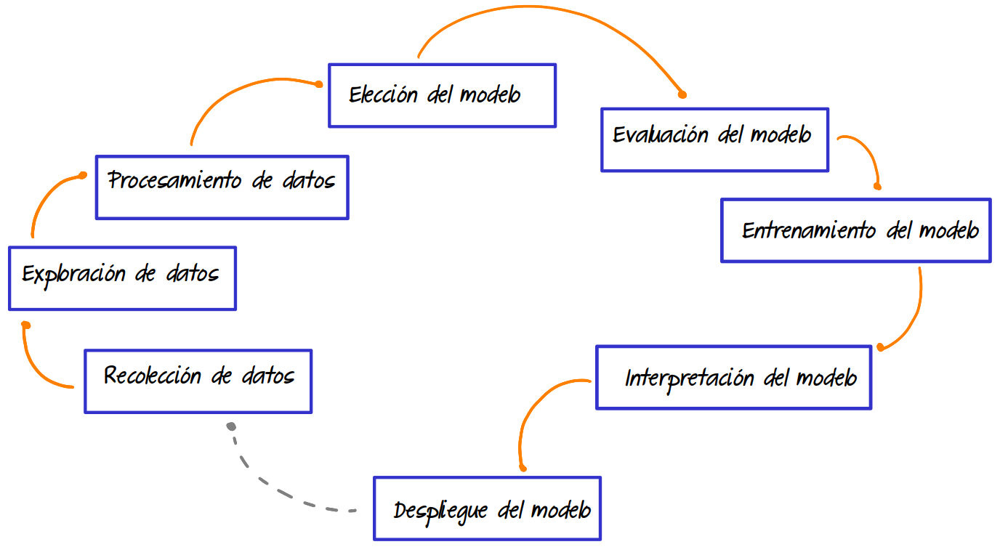

```{r setup, include=FALSE}
knitr::opts_chunk$set(echo = TRUE, comment = NA)

# library(summarytools)

```


</br></br>

```{r, echo=FALSE, out.width="100%", fig.align = "center"}
knitr::include_graphics("img/banner2.png")
```


<div class="caja-nota">
> *"En esta unidad, el análisis se centrará en la **regresión lineal simple**, donde se modelará una única variable respuesta en función de una sola variable predictora. No se abordarán relaciones más complejas ni modelos con múltiples predictores."*  
</div>

<div class="caja-nota">
> *"En el siguiente curso de **Estadística de la Maestría en Ciencia de Datos**, se estudiará el **modelo de regresión múltiple**, el cual permite modelar una variable respuesta en términos de varias variables predictoras. Este modelo amplía las capacidades de análisis al considerar múltiples factores que pueden influir simultáneamente en la variable de interés."*
</div>


<br/><br/>
<h2>Contenido</h2>

</br>

- **Correlación**

  - Análisis de correlación.
  
  - Coeficiente de correlación de Pearson.
  
  - Coeficiente de correlación de Spearman.
  
  - Coeficiente de correlación de Kendall.


</br>

- **Modelo**

  - Definición y formulación del modelo.
  
  - **Estimación de parámetros** mediante:
  
    - Método de mínimos cuadrados ordinarios.
    
    - Método de máxima verosimilitud.
    
  - **Supuestos del modelo** y su importancia en la validez de las inferencias.
  
  - **Transformaciones** para mejorar el ajuste y cumplir los supuestos del modelo.
  

</br>

- **Predicción**

  - **Inferencia sobre el modelo**, evaluando su validez y ajuste.
  
  - **Inferencia sobre los parámetros**, incluyendo la estimación y prueba de hipótesis.
  
  - **Inferencia sobre la variable respuesta**, analizando intervalos de predicción y confianza.
  


<br/><br/>
<h3>Pasos para construir un modelo de Regresión Lineal Simple</h3>


```{r, echo=FALSE, out.width="80%", fig.align = "center"}

```


