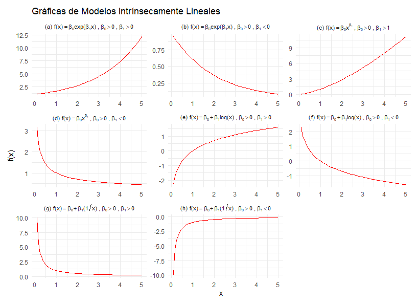
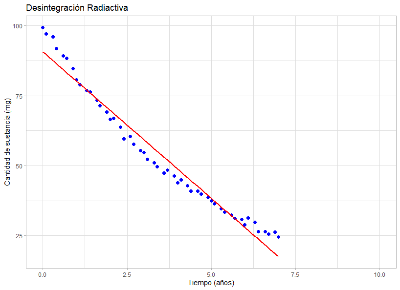
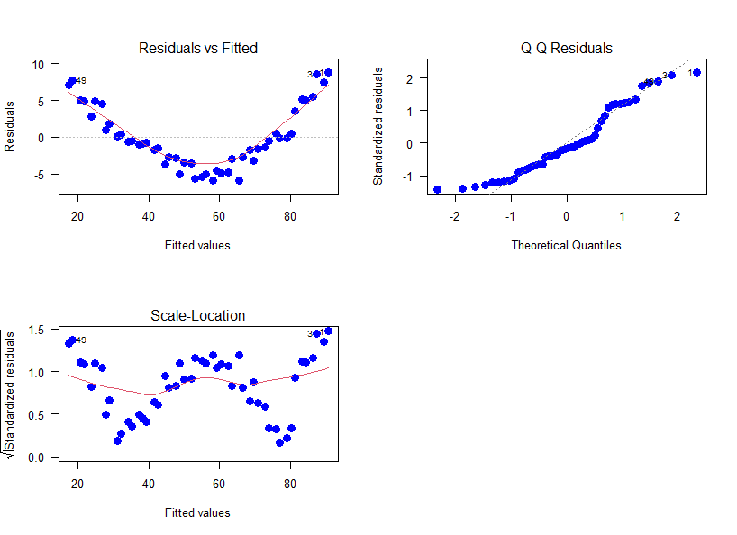
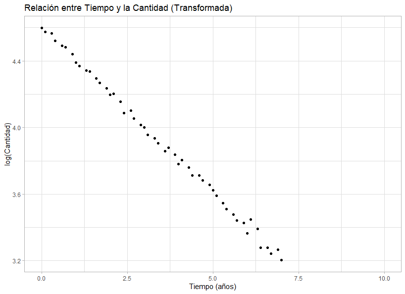
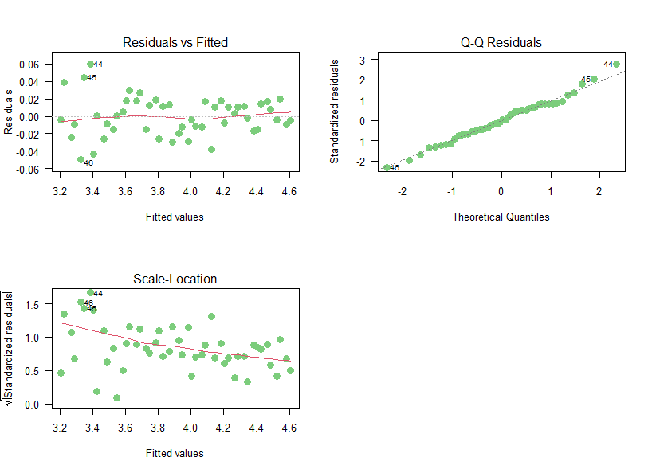
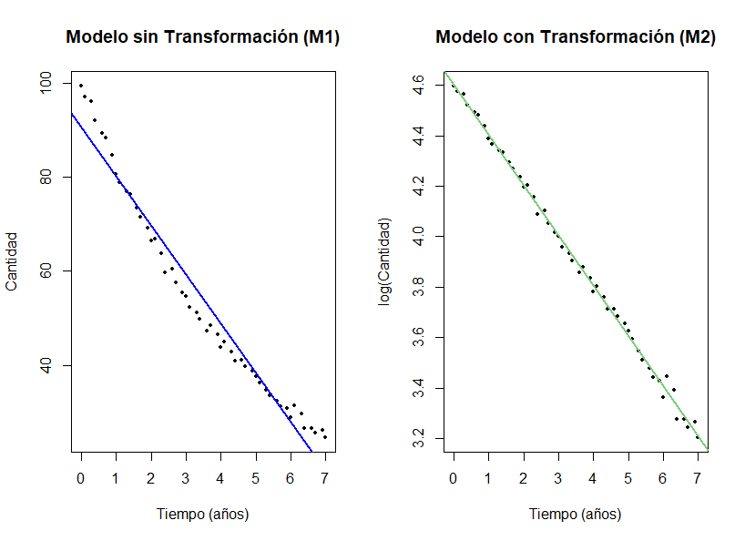
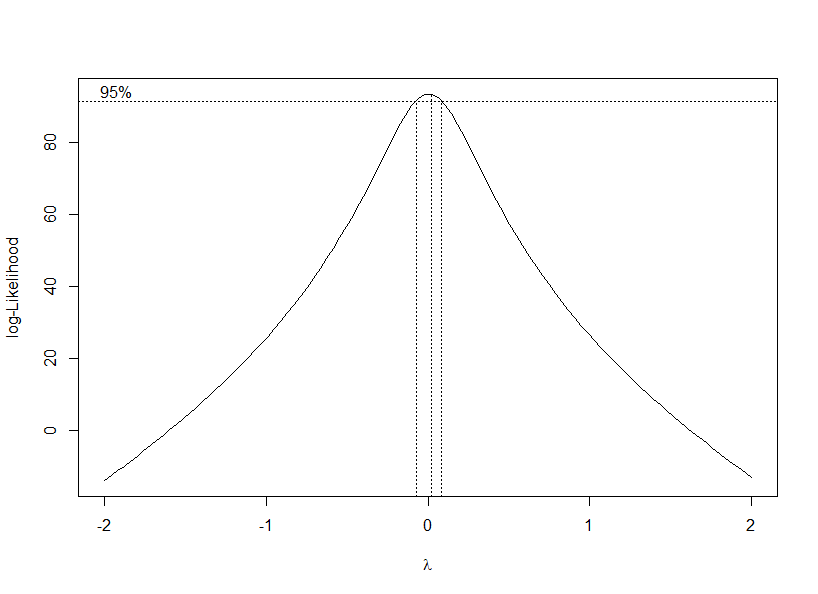
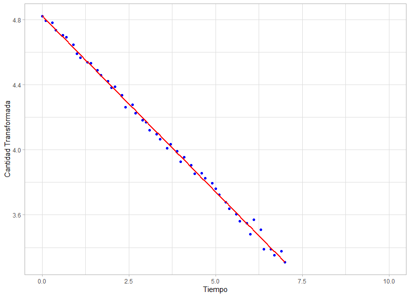
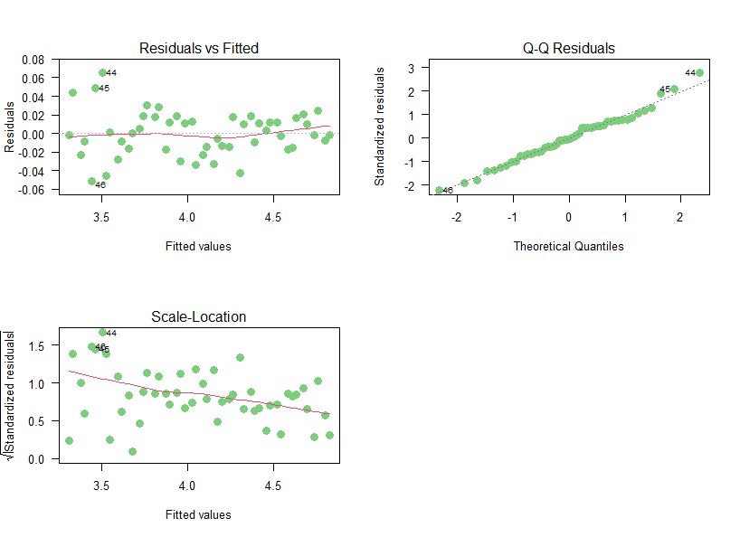
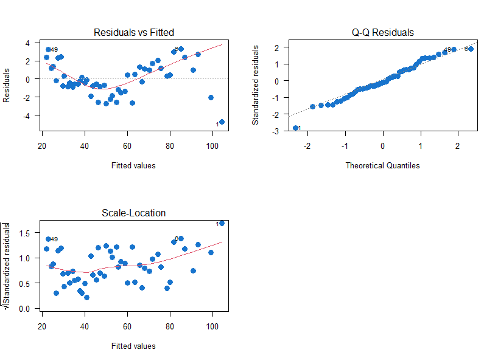

```{r setup, include=FALSE}
knitr::opts_chunk$set(echo = TRUE, comment = NA)

c1="#FF7F00"
c2="#=EB0C6"
c3="#034A94"
c4="#686868"

library(ggplot2)
library(paqueteMETODOS)
data(biomasa)
modelo=lm(log(bio_total) ~ diametro, data=biomasa)
```

</br></br>


</br></br>
<h2>Introducción</h2>

En regresión lineal, la transformación de la variable respuesta $Y$ o la predictora $X$ es una estrategia útil para mejorar el cumplimiento de los supuestos del modelo, como la normalidad de los errores y la homocedasticidad. Además, puede contribuir a mejorar el ajuste del modelo cuando la relación entre las variables no es estrictamente lineal.


</br></br>
<h2>Transformaciones para linealizar el modelo</h2>

En ciertos casos, el modelo teórico que describe los datos presenta una **estructura matemática no lineal en sus parámetros**. Sin embargo, mediante **transformaciones adecuadas** de $Y$ o $X$, es posible reformularlo en una **forma lineal**, permitiendo así la aplicación de métodos de regresión lineal estándar.

La **Tabla 3.9** muestra algunos ejemplos de modelos que pueden ser **linealizados** mediante transformaciones específicas.


<br/><br/>
<center>
**Tabla 3.9** Ejemplos de transformaciones.
</center>

| **Modelo** | **Denominación** | **Transformación** | **Forma Lineal** |
|------------|-----------------|---------------------|------------------|
| \( Y = \beta_0 e^{\beta_1 X} \varepsilon \) | Modelo exponencial multiplicativo | \( Y^* = \ln(Y) \) | \( Y^* = \beta_0^* + \beta_1 X + \varepsilon^* \) con \( \beta_0^* = \ln(\beta_0) \) y \( \varepsilon^* = \ln(\varepsilon) \) |
| \( Y = \beta_0 X^{\beta_1} \varepsilon \) | Modelo potencial multiplicativo | \( Y^* = \ln(Y) \), \( X^* = \ln(X) \) | \( Y^* = \beta_0^* + \beta_1 X^* + \varepsilon^* \) con \( \beta_0^* = \ln(\beta_0) \) y \( \varepsilon^* = \ln(\varepsilon) \) |
| \( Y = \beta_0 + \beta_1 \ln(X) + \varepsilon \) | Modelo logarítmico | \( X^* = \ln(X) \) | \( Y = \beta_0 + \beta_1 X^* + \varepsilon \) |
| \( Y = \beta_0 + \beta_1(1/X) + \varepsilon \) | Modelo recíproco | \( X^* = 1/X \) | \( Y = \beta_0 + \beta_1 X^* + \varepsilon \) |


```{r, include=FALSE}
#Sys.setlocale("LC_ALL", "es_ES.UTF-8")

library(ggplot2)
library(gridExtra)

# Definir el rango de valores de x
x <- seq(0.1, 5, length.out = 100)

# Definir las funciones de los modelos
exp_pos <- data.frame(x, y = 1 * exp(0.5 * x), modelo = "(a)~f(x) == beta[0]*exp(beta[1]*x)~','~beta[0] > 0~','~beta[1] > 0")
exp_neg <- data.frame(x, y = 1 * exp(-0.5 * x), modelo = "(b)~f(x) == beta[0]*exp(beta[1]*x)~','~beta[0] > 0~','~beta[1] < 0")
pot_pos <- data.frame(x, y = x^1.5, modelo = "(c)~f(x) == beta[0]*x^{beta[1]}~','~beta[0] > 0~','~beta[1] > 1")
pot_neg <- data.frame(x, y = x^(-0.5), modelo = "(d)~f(x) == beta[0]*x^{beta[1]}~','~beta[0] > 0~','~beta[1] < 0")
log_pos <- data.frame(x, y = log(x), modelo = "(e)~f(x) == beta[0] + beta[1]*log(x)~','~beta[0] > 0~','~beta[1] > 0")
log_neg <- data.frame(x, y = -log(x), modelo = "(f)~f(x) == beta[0] + beta[1]*log(x)~','~beta[0] > 0~','~beta[1] < 0")
rec_pos <- data.frame(x, y = 1/x, modelo = "(g)~f(x) == beta[0] + beta[1]*(1/x)~','~beta[0] > 0~','~beta[1] > 0")
rec_neg <- data.frame(x, y = -1/x, modelo = "(h)~f(x) == beta[0] + beta[1]*(1/x)~','~beta[0] > 0~','~beta[1] < 0")

# Unir todas las funciones en un solo data frame
data <- rbind(exp_pos, exp_neg, pot_pos, pot_neg, log_pos, log_neg, rec_pos, rec_neg)

# Crear la gráfica con facet_wrap y títulos en notación matemática
p <- ggplot(data, aes(x = x, y = y)) +
  geom_line(color = "red") +
  facet_wrap(~modelo, scales = "free", labeller = label_parsed) +  # Renderiza las expresiones matemáticas
  theme_minimal() +
  labs(x = "x", y = "f(x)",
       title = "Gráficas de Modelos Intrínsecamente Lineales") +
  theme(strip.text = element_text(size = 8, face = "bold"),
        plot.margin = margin(10, 10, 10, 10))

# Mostrar la gráfica
print(p)

```


En la **Figura 3.31** se muestran los patrones de los modelos que se pueden linealizar.


<br/><br/>
<center>
```{r, echo=FALSE, out.width="100%", fig.align = "center"}

```
**Figura 3.31** Patrones de los modelos que se pueden linealizar.
</center>
<br/><br/>


</br></br>
<div class="caja-ejemplo">
<h3>Ejemplo:</h3>
<p>

Se busca modelar la **cantidad de una sustancia radiactiva** (en miligramos) en función del **tiempo** (en años), considerando su proceso de desintegración. Este fenómeno sigue un comportamiento exponencial decreciente, por lo que el ajuste de un modelo adecuado permitirá describir la relación entre ambas variables.

Para este análisis, se dispone de un conjunto de **50 observaciones** que contienen mediciones de la cantidad de la sustancia en diferentes momentos del tiempo. Los datos están disponibles en el siguiente enlace:

[Datos de desintegración radiactiva](https://raw.githubusercontent.com/smramirezb/datos_ejemplos/refs/heads/main/dat_tiempo.txt)


---

```{r,include=FALSE}

# Sys.setlocale("LC_ALL", "es_ES.UTF-8")


# # Fijar la semilla para reproducibilidad
# set.seed(123)
# 
# # Parámetros para la simulación
# a <- 100  # Cantidad inicial de sustancia (100%)
# b <- 0.2  # Tasa de desintegración radiactiva
# 
# # Generar datos sintéticos
# tiempo <- seq(0, 7, length.out = 50)  # 50 valores de tiempo entre 0 y 10 años
# sustancia <- a * exp(-b * tiempo) + rnorm(length(tiempo), mean = 0, sd = 1)  # Agregar ruido
# 
# # Crear data frame
# datos_radiactivos <- round(data.frame(Tiempo = tiempo, Cantidad= sustancia),1)

# # Mostrar los primeros valores
# head(datos_radiactivos)
# datos<-datos_radiactivos

```

A continuación, se presentan los códigos en **R** para cargar la base de datos, generar el gráfico de dispersión y ajustar un modelo de regresión lineal, donde la variable de respuesta es la **Cantidad**  y la variable predictora es el **Tiempo**.

El modelo 1 ($M_1$) que se va a ajustar se expresa de la siguiente manera:


\[
\text{Cantidad}_i = \beta_0 + \beta_1 \times \text{Tiempo}_i + \varepsilon_i \\
\varepsilon_i \sim N(0, \sigma^2)
\]


<pre>
# Configurar el entorno para el uso del idioma español
Sys.setlocale("LC_ALL", "es_ES.UTF-8")

# Lectura de datos
file <- "https://raw.githubusercontent.com/smramirezb/datos_ejemplos/refs/heads/main/dat_tiempo.txt"
datos <- read.table(file = file, header = TRUE)

# Cargar librerías necesarias
library(ggplot2)

# Generar gráfico de dispersión para visualizar la relación entre tiempo y cantidad
ggplot(datos, aes(x = Tiempo, y = Cantidad)) + 
  geom_point(color = "blue", size = 2) + 
  geom_smooth(method = "lm", color = "red", se = FALSE) +  # Agregar línea de tendencia
  theme_light() +
  xlim(0, 10) + 
  labs(title = "Desintegración Radiactiva",
       x = "Tiempo (años)", 
       y = "Cantidad de sustancia (mg)")

# Ajuste del modelo de regresión lineal
m1 <- lm(Cantidad ~ Tiempo, data = datos)
summary(m1)  # Resumen del modelo

# Diagnóstico del modelo: Evaluación de residuos y ajuste
par(mfrow = c(2, 2))  # Configurar la disposición de los gráficos
plot(m1, las = 1, col = 'blue', which = 1:3, cex = 1.5, pch = 19)  # Gráficos de diagnóstico

# Prueba de normalidad de los residuos con Shapiro-Wilk
res_m1 <- residuals(m1)
shapiro.test(res_m1)
</pre>

```{r,eval=FALSE,message=FALSE}
# Configurar el entorno para el uso del idioma español
Sys.setlocale("LC_ALL", "es_ES.UTF-8")

# Lectura de datos
file <- "https://raw.githubusercontent.com/smramirezb/datos_ejemplos/refs/heads/main/dat_tiempo.txt"
datos <- read.table(file = file, header = TRUE)

# Cargar librerías necesarias
library(ggplot2)

# Generar gráfico de dispersión para visualizar la relación entre tiempo y cantidad
ggplot(datos, aes(x = Tiempo, y = Cantidad)) + 
  geom_point(color = "blue", size = 2) + 
  geom_smooth(method = "lm", color = "red", se = FALSE) +  # Agregar línea de tendencia
  theme_light() +
  xlim(0, 10) + 
  labs(title = "Desintegración Radiactiva",
       x = "Tiempo (años)", 
       y = "Cantidad de sustancia (mg)")

# Ajuste del modelo de regresión lineal
m1 <- lm(Cantidad ~ Tiempo, data = datos)
summary(m1)  # Resumen del modelo

# Diagnóstico del modelo: Evaluación de residuos y ajuste
par(mfrow = c(2, 2))  # Configurar la disposición de los gráficos
plot(m1, las = 1, col = 'blue', which = 1:3, cex = 1.5, pch = 19)  # Gráficos de diagnóstico

# Prueba de normalidad de los residuos con Shapiro-Wilk
res_m1 <- residuals(m1)
shapiro.test(res_m1)
```


<br/><br/>
<center>
```{r, echo=FALSE, out.width="80%", fig.align = "center"}

```
**Figura 3.32** Relación cantidad (mg) y tiempo (años).
</center>
<br/><br/>


La **Figura 3.32** muestra  que la cantidad de sustancia (mg) **decrece** a medida que transcurre el tiempo (años). Este comportamiento es consistente con el esperado en un proceso de desintegración radiactiva.


La **Figura 3.33** muestra los gráficos de diagnóstico de los residuos del modelo de regresión lineal $M_1$. Vamos a analizar cada uno:

- **Residuals vs Fitted (Residuos vs Valores Ajustados)**:  La forma de "U" en el gráfico indica que hay una relación no lineal entre las variables. Esto sugiere que el modelo lineal no es adecuado, ya que los residuos deberían estar distribuidos aleatoriamente alrededor de la línea horizontal (cero).

- **Q-Q Residuals (Gráfico de Cuantiles-Cuantiles)**: Se observa una desviación de los puntos con respecto a la línea diagonal en los extremos.Esto indica que los residuos no siguen completamente una distribución normal, lo cual puede afectar la validez de los resultados asociados al modelo debido al no cumplimiento de la normalidad de los errores.

- **Scale-Location (Residuos Estandarizados vs Valores Ajustados)**: La tendencia en forma de "U" muestra que la varianza de los residuos no es constante (presencia de heterocedasticidad). Esto significa que el modelo puede no ser el más adecuado debido a la falta de homocedasticidad de los errores.


<br/><br/>
<center>
```{r, echo=FALSE, out.width="80%", fig.align = "center"}

```
**Figura 3.33** Residuales del modelo 1.
</center>
<br/><br/>


Dado que los supuestos de **homocedasticidad** y **normalidad** de los errores **no se cumplen**, es necesario aplicar una transformación a la variable respuesta. En este caso, se emplea la transformación logarítmica, lo que implica trabajar con la nueva variable transformada:

$$ Cantidad^* = \log(Cantidad) $$

Si se supone que el modelo exponencial multiplicativo es el original por la forma de la curva en el gráfico donde **Cantidad de la sustancia** es la variable respuesta y **Tiempo**  es la variable explicativa:

$$
Cantidad = \beta_0 e^{\beta_1 Tiempo} \varepsilon
$$

Al aplicar el logaritmo a ambos lados de la ecuación, se obtiene la forma lineal en términos de $Cantidad^*$ y $Tiempo$:

$$
Cantidad^* = \beta_0^* + \beta_1 Tiempo + \varepsilon^* \\
\varepsilon^*_i \sim N(0, \sigma^2)
$$

donde:

- $\beta_0^* = \log(\beta_0)$ representa el nuevo intercepto del modelo transformado.

- $\varepsilon^* = \log(\varepsilon)$ corresponde al nuevo término de error.

- El coeficiente $\beta_1$ se mantiene inalterado en ambos modelos, lo que permite interpretar su efecto de manera consistente.

Esta transformación facilita el ajuste del modelo en **R**, asegurando una relación lineal entre la variable explicativa y la respuesta, además de mejorar la interpretación de los coeficientes en términos logarítmicos. Los códigos del nuevo modelo ($M_2$) son los siguientes:


<pre>
# Configurar el entorno para el uso del idioma español
Sys.setlocale("LC_ALL", "es_ES.UTF-8")

# Carga de librerías necesarias
library(car)        # Para análisis de residuos
library(ggplot2)    # Para visualización de datos
library(lmtest)     # Para pruebas de supuestos en modelos de regresión

# Lectura de datos desde un archivo en línea
file <- "https://raw.githubusercontent.com/smramirezb/datos_ejemplos/refs/heads/main/dat_tiempo.txt"
datos <- read.table(file = file, header = TRUE)

# Transformación de la variable respuesta (aplicación de logaritmo)
datos$log_cantidad <- log(datos$Cantidad)

# Creación del gráfico de dispersión con la variable transformada
plot.reg <- ggplot(datos, aes(x = Tiempo, y = log_cantidad)) + 
  geom_point(color = "black") + 
  theme_light() + 
  xlim(0, 10) + 
  labs(x = "Tiempo (años)", y = "log(Cantidad)", 
       title = "Relación entre Tiempo y la Cantidad (Transformada)")

# Ajuste del modelo de regresión lineal sobre la variable transformada
m2 <- lm(log_cantidad ~ Tiempo, data = datos)

# Resumen del modelo ajustado
summary(m2)

# Diagnóstico gráfico de residuos
par(mfrow = c(2, 2))  # Configurar la disposición de los gráficos en formato 2x2
plot(m2, las = 1, col = "palegreen3", which = 1:3, cex = 1.5, pch = 19)

# Evaluación de los supuestos del modelo

# Prueba de normalidad de los residuos (Shapiro-Wilk)
shapiro.test(residuals(m2))

# Prueba de homocedasticidad (Breusch-Pagan)
bptest(m2)

# Prueba de independencia de los errores (Durbin-Watson)
dwtest(m2)

# Comparación de los modelos antes y después de la transformación

# Configurar gráficos en una fila de dos columnas
par(mfrow = c(1, 2))

# Gráfico del modelo sin transformación (M1)
plot(x = datos$Tiempo, y = datos$Cantidad, pch = 20, cex = 0.8,
     xlab = "Tiempo (años)", ylab = "Cantidad", main = "Modelo sin Transformación (M1)")
abline(lm(Cantidad ~ Tiempo, data = datos), col = "blue", lwd = 2)

# Gráfico del modelo con transformación logarítmica (M2)
plot(x = datos$Tiempo, y = log(datos$Cantidad), pch = 20, cex = 0.8,
     xlab = "Tiempo (años)", ylab = "log(Cantidad)", main = "Modelo con Transformación (M2)")
abline(m2, col = "palegreen3", lwd = 2)
</pre>


```{r,echo=TRUE,eval=FALSE}
# Configurar el entorno para el uso del idioma español
Sys.setlocale("LC_ALL", "es_ES.UTF-8")

# Carga de librerías necesarias
library(car)        # Para análisis de residuos
library(ggplot2)    # Para visualización de datos
library(lmtest)     # Para pruebas de supuestos en modelos de regresión

# Lectura de datos desde un archivo en línea
file <- "https://raw.githubusercontent.com/smramirezb/datos_ejemplos/refs/heads/main/dat_tiempo.txt"
datos <- read.table(file = file, header = TRUE)

# Transformación de la variable respuesta (aplicación de logaritmo)
datos$log_cantidad <- log(datos$Cantidad)

# Creación del gráfico de dispersión con la variable transformada
plot.reg <- ggplot(datos, aes(x = Tiempo, y = log_cantidad)) + 
  geom_point(color = "black") + 
  theme_light() + 
  xlim(0, 10) + 
  labs(x = "Tiempo (años)", y = "log(Cantidad)", 
       title = "Relación entre Tiempo y la Cantidad (Transformada)")

# Ajuste del modelo de regresión lineal sobre la variable transformada
m2 <- lm(log_cantidad ~ Tiempo, data = datos)

# Resumen del modelo ajustado
summary(m2)

# Diagnóstico gráfico de residuos
par(mfrow = c(2, 2))  # Configurar la disposición de los gráficos en formato 2x2
plot(m2, las = 1, col = "palegreen3", which = 1:3, cex = 1.5, pch = 19)

# Evaluación de los supuestos del modelo

# Prueba de normalidad de los residuos (Shapiro-Wilk)
shapiro.test(residuals(m2))

# Prueba de homocedasticidad (Breusch-Pagan)
bptest(m2)

# Prueba de independencia de los errores (Durbin-Watson)
dwtest(m2)

# Comparación de los modelos antes y después de la transformación

# Configurar gráficos en una fila de dos columnas
par(mfrow = c(1, 2))

# Gráfico del modelo sin transformación (M1)
plot(x = datos$Tiempo, y = datos$Cantidad, pch = 20, cex = 0.8,
     xlab = "Tiempo (años)", ylab = "Cantidad", main = "Modelo sin Transformación (M1)")
abline(lm(Cantidad ~ Tiempo, data = datos), col = "blue", lwd = 2)

# Gráfico del modelo con transformación logarítmica (M2)
plot(x = datos$Tiempo, y = log(datos$Cantidad), pch = 20, cex = 0.8,
     xlab = "Tiempo (años)", ylab = "log(Cantidad)", main = "Modelo con Transformación (M2)")
abline(m2, col = "palegreen3", lwd = 2)
```


<br/><br/>
<center>
```{r, echo=FALSE, out.width="80%", fig.align = "center"}

```
**Figura 3.34** Relación log-cantidad y tiempo.
</center>
<br/><br/>


La **Figura 3.34** evidencia una relación lineal negativa entre el logaritmo de la cantidad de sustancia y el tiempo.


<br/><br/>
<center>
```{r, echo=FALSE, out.width="80%", fig.align = "center"}

```
**Figura 3.35** Residuales del modelo 2.
</center>
<br/><br/>


La **Figura 3.35** muestra los gráficos de diagnóstico de los residuos del modelo de regresión lineal $M_2$. A continuación se analiza cada uno:

- **Residuals vs Fitted (Residuos vs Valores Ajustados)**: Los residuos están distribuidos aleatoriamente alrededor de la línea horizontal, sin una tendencia clara, lo que indica que la relación entre las variables es adecuadamente modelada por una regresión lineal. Algunos valores atípicos (puntos 44, 45 y 48) podrían indicar observaciones con mayor influencia en el modelo.

- **Q-Q Residuals (Gráfico de Cuantiles-Cuantiles)**: Los residuos siguen aproximadamente la línea diagonal, lo que sugiere que la normalidad de los errores se cumple en gran medida. Sin embargo, en los extremos hay algunas desviaciones, lo que indica la presencia de valores atípicos que podrían afectar la normalidad de los errores.

- **Scale-Location (Residuos Estandarizados vs Valores Ajustados)**: No se observa una tendencia clara en los residuos estandarizados, sin embargo los puntos a la izquiera de 3.6 en el eje $X$ parecen mostrar mayor variabilidad. Los valores en los extremos (puntos 44, 45 y 48) podrían generar cierta variabilidad, en general la transformación logarítmica parece haber estabilizado la varianza.

Los resultados de las pruebas estadísticas indican que los errores cumplen con los supuestos de **normalidad** e **independencia**, ya que los valores-p obtenidos en las pruebas de **Shapiro-Wilk** y **Durbin-Watson** son mayores a 0.10, lo que significa que no hay suficiente evidencia para rechazar la hipótesis nula en cada caso.

Sin embargo, la prueba de **Breusch-Pagan** detecta la presencia de **heterocedasticidad** en los residuos, con un \(valor-p \) de **0.0019**, lo que indica que la varianza de los errores no es constante con un nivel de significancia del **1%**.

<pre>
Shapiro-Wilk normality test

data:  residuals(m2)
W = 0.98745, p-value = 0.8696


studentized Breusch-Pagan test

data:  m2
BP = 9.6197, df = 1, p-value = 0.001925

Durbin-Watson test

data:  m2
DW = 2.122, p-value = 0.6121
alternative hypothesis: true autocorrelation is greater than 0

</pre>


Los resultados del **modelo 2** sugieren que existe una relación lineal significativa entre estas variables, respaldada por la **estadística de prueba F** de $1.714 \times 10^4$ y un \(valor-p < 2.2 \times e^{-16} \)  .

Adicionalmente:

- **La variable tiempo es altamente significativa**, ya que su \(valor-p \) es menor a $2 \times e^{-16}$.

- **El coeficiente de determinación ($R^2$) ajustado es de 0.9971**. En este caso, el valor de \( R^2 = 0.9971 \) indica que el **99.71% de la variabilidad en la cantidad de la sustancia radiactiva** puede explicarse por el tiempo transcurrido. Un **\( R^2 \) alto** sugiere que el modelo tiene un **buen ajuste a los datos**, lo que significa que la relación entre la cantidad de la sustancia y el tiempo es fuerte y bien representada por la regresión lineal. Sin embargo, es importante complementar esta evaluación con **análisis de los residuos** para verificar el cumplimiento de los supuestos del modelo y evitar conclusiones erróneas.


<pre>
Call:
lm(formula = log(Cantidad) ~ Tiempo, data = datos)

Residuals:
      Min        1Q    Median        3Q       Max 
-0.049859 -0.014259 -0.001082  0.014219  0.059930 

Coefficients:
             Estimate Std. Error t value Pr(>|t|)    
(Intercept)  4.604322   0.006194   743.4   <2e-16 ***
Tiempo      -0.199581   0.001524  -130.9   <2e-16 ***
---
Signif. codes:  0 ‘***’ 0.001 ‘**’ 0.01 ‘*’ 0.05 ‘.’ 0.1 ‘ ’ 1

Residual standard error: 0.02224 on 48 degrees of freedom
Multiple R-squared:  0.9972,	Adjusted R-squared:  0.9971 
F-statistic: 1.714e+04 on 1 and 48 DF,  p-value: < 2.2e-16
</pre>

La **Figura 3.36** compara los modelos ajustados $M_1$ y $M_2$ mediante un diagrama de dispersión.

- **El modelo $M_1$**, ajustado en términos de **Cantidad** y **Tiempo**, no representa adecuadamente la relación entre la cantidad de sustancia  y el tiempo. El gráfico de dispersión sugiere una relación de tipo exponencial, lo que indica que un modelo lineal en su forma original no es apropiado.

- **El modelo $M_2$**, **basado en la regresión lineal de $\log(Cantidad)$ en función del Tiempo, proporciona un mejor ajuste aunque todavía no satisface todas las condiciones para confiar en el modelo**.


<br/><br/>
<center>
```{r, echo=FALSE, out.width="80%", fig.align = "center"}

```
**Figura 3.36** Comparación de las rectas de los dos modelos ajustados $M_1$ y $M_2$.
</center>
<br/><br/>


</p>
</div>


</br></br>
<h2>Transformación de Box-Cox</h2>


En modelos de regresión, la transformación de la variable respuesta **\( Y \)** puede ser necesaria cuando se presentan problemas como:

- **No normalidad de los errores**.

- **Heterocedasticidad** (varianza no constante en los errores).

- **Relación no lineal entre \( Y \) y \( X \)**.

Para abordar estos problemas, se emplea la **transformación de Box-Cox**, que busca encontrar una transformación óptima para **\( Y \)** de la siguiente forma:

\[
g_{\lambda}(Y) =
\begin{cases}
\dfrac{Y^\lambda - 1}{\lambda}, & \text{si } \lambda \neq 0, \\
\ln(Y), & \text{si } \lambda = 0.
\end{cases}
\]

Donde:

- **\( g_{\lambda}(Y) \)** es la variable respuesta transformada.

- **\( \lambda \)** es un parámetro que define la transformación óptima.

- Si **\( \lambda = 0 \)**, se utiliza la transformación logarítmica \( \ln(Y) \).


La **función `boxcox()`** en el paquete `MASS` ayuda a estimar el valor óptimo de \( \lambda \).


</br></br>
<div class="caja-ejemplo">
<h3>Ejemplo:</h3>
<p>

En el ejemplo anterior, se determinó que la relación entre la **Cantidad de sustancia** y el **Tiempo** sigue un **modelo exponencial multiplicativo**, lo cual se identificó a partir de la forma curva observada en el gráfico de dispersión. El modelo se expresa como:

\[
\text{Cantidad} = \beta_0 e^{\beta_1 \cdot \text{Tiempo}} \varepsilon
\]

Debido a esta estructura exponencial, se aplicó una **transformación logarítmica** a la variable respuesta **Cantidad**, con el objetivo de linealizar el modelo y permitir su ajuste mediante regresión lineal.

A continuación, se analizará esta transformación utilizando el **método de Box-Cox**, que permite determinar el valor óptimo del parámetro \( \lambda \) para encontrar la transformación más adecuada de la variable respuesta.

El código en **R** para implementar la transformación es el siguiente:


<pre>
# Cargar librerías necesarias
library(MASS)

# Lectura de datos
file <- "https://raw.githubusercontent.com/smramirezb/datos_ejemplos/refs/heads/main/dat_tiempo.txt"
datos <- read.table(file = file, header = TRUE)

# Ajustar un modelo de regresión lineal
mod1 <- lm(Cantidad~ Tiempo, data = datos)

# Aplicar transformación Box-Cox para encontrar el mejor lambda
boxcox(mod1, lambda = seq(-2, 2, by = 0.1))

# Obtener el valor óptimo de lambda
bc <- boxcox(mod1, lambda = seq(-2, 2, by = 0.1))
lambda_optimo <- bc$x[which.max(bc$y)]
lambda_optimo
</pre>


```{r, message=FALSE, warning=FALSE,eval=FALSE}
# Cargar librerías necesarias
library(MASS)

# Lectura de datos
file <- "https://raw.githubusercontent.com/smramirezb/datos_ejemplos/refs/heads/main/dat_tiempo.txt"
datos <- read.table(file = file, header = TRUE)

# Ajustar un modelo de regresión lineal
mod1 <- lm(Cantidad~ Tiempo, data = datos)

# Aplicar transformación Box-Cox para encontrar el mejor lambda
boxcox(mod1, lambda = seq(-2, 2, by = 0.1))

# Obtener el valor óptimo de lambda
bc <- boxcox(mod1, lambda = seq(-2, 2, by = 0.1))
lambda_optimo <- bc$x[which.max(bc$y)]
lambda_optimo
```

<br/><br/>
<center>
```{r, echo=FALSE, out.width="80%", fig.align = "center"}

```
**Figura 3.37** La **log-verosimilitud** en función del parámetro \( \lambda \).
</center>
<br/><br/>


El gráfico de la **Figura 3.37** muestra la **log-verosimilitud** en función del parámetro \( \lambda \). La curva alcanza su valor máximo en \( \lambda \approx 0.02 \), lo que indica que la transformación óptima de la variable **Cantidad** está **cercana a una transformación logarítmica**, pero con una leve desviación hacia una transformación de potencia.

En este caso, dado que \( \lambda \approx 0.02 \), la transformación sugerida es **casi logarítmica**, pero podría probarse también con otros valores cercanos dentro del intervalo de confianza para evaluar su efecto en el cumplimiento de los supuestos del modelo.


Al aplicar la transformación de **Box-Cox** con \(\lambda \approx 0.02\), el modelo de regresión lineal se expresa como:

\[
\frac{\text{Cantidad}_i^{0.02} - 1}{0.02} = \beta_0 + \beta_1 \cdot \text{Tiempo}_i + \varepsilon_i
\]

donde:

- \(\beta_0\) es el intercepto del modelo.

- \(\beta_1\) es el coeficiente que mide el efecto del **Tiempo** sobre la **Cantidad** transformada.

- \(\varepsilon_i\) representa el error aleatorio del modelo.


Si el valor óptimo de \(\lambda\) es **cercano a 0**, la transformación se asemeja a la transformación logarítmica:

  \[
  g(Y) = \ln(Y) \quad \text{cuando } \lambda = 0
  \]

En este caso, al obtener un valor de \(\lambda \approx 0.02\), la transformación aplicada se encuentra muy cerca de la logarítmica, lo que sugiere que los datos pueden comportarse de manera similar a un modelo exponencial en su forma original.

A continuación, se analiza el ajuste del modelo de regresión lineal obtenido tras aplicar la transformación de Box-Cox con \(\lambda \approx 0.02\).


<pre>
# Configurar el entorno para el uso del idioma español
Sys.setlocale("LC_ALL", "es_ES.UTF-8")

# Cargar librerías necesarias
library(MASS)       # Para la transformación Box-Cox
library(ggplot2)    # Para visualización de datos
library(car)        # Para análisis de residuos y validación de supuestos
library(lmtest)     # Para pruebas estadísticas como Breusch-Pagan y Durbin-Watson

# Lectura de datos

# Definir la URL del archivo con los datos
file <- "https://raw.githubusercontent.com/smramirezb/datos_ejemplos/refs/heads/main/dat_tiempo.txt"

# Cargar el conjunto de datos desde la URL en un dataframe
datos <- read.table(file = file, header = TRUE)

# Mostrar las primeras filas del conjunto de datos para inspección rápida
head(datos)


# Definir el valor óptimo de lambda encontrado previamente con Box-Cox
lambda_optimo <- 0.02020202

# Aplicar la transformación de Box-Cox a la variable respuesta Cantidad
if (lambda_optimo == 0) {
  datos$Cantidad_trans <- log(datos$Cantidad)  # Si lambda es 0, se aplica logaritmo
} else {
  datos$Cantidad_trans <- (datos$Cantidad^lambda_optimo - 1) / lambda_optimo  # Transformación general
}

# Mostrar las primeras filas con la variable transformada
head(datos)


# Ajustar el modelo de regresión lineal con la cantidad transformada como variable respuesta
mod_bc <- lm(Cantidad_trans ~ Tiempo, data = datos)

# Mostrar el resumen del modelo ajustado
summary(mod_bc)


# Crear un gráfico de dispersión con la variable transformada y la recta de regresión ajustada
ggplot(datos, aes(x = Tiempo, y = Cantidad_trans)) + 
  geom_point(color = "blue") +  # Puntos en azul
  theme_light() +  # Aplicar un tema claro para mejor visualización
  xlim(0, 10) +  # Limitar el eje X a 10 unidades
  labs(x = "Tiempo", y = "Cantidad Transformada") +  # Etiquetas de ejes
  geom_smooth(method = "lm", color = "red", se = FALSE)  # Agregar la recta de regresión en rojo


# Diagnóstico gráfico de residuos para evaluar la validez del modelo
par(mfrow = c(2, 2))  # Configurar los gráficos en una cuadrícula de 2x2
plot(mod_bc, las = 1, col = "palegreen3", which = 1:3, cex = 1.5, pch = 19)


# Prueba de normalidad de los residuos usando Shapiro-Wilk
shapiro.test(residuals(mod_bc))

# Prueba de homocedasticidad de los residuos usando Breusch-Pagan
bptest(mod_bc)

# Prueba de independencia de los errores usando Durbin-Watson
dwtest(mod_bc)
</pre>


```{r, eval=FALSE, message=FALSE, warning=FALSE}
# Configurar el entorno para el uso del idioma español
Sys.setlocale("LC_ALL", "es_ES.UTF-8")

# Cargar librerías necesarias
library(MASS)       # Para la transformación Box-Cox
library(ggplot2)    # Para visualización de datos
library(car)        # Para análisis de residuos y validación de supuestos
library(lmtest)     # Para pruebas estadísticas como Breusch-Pagan y Durbin-Watson

# Lectura de datos

# Definir la URL del archivo con los datos
file <- "https://raw.githubusercontent.com/smramirezb/datos_ejemplos/refs/heads/main/dat_tiempo.txt"

# Cargar el conjunto de datos desde la URL en un dataframe
datos <- read.table(file = file, header = TRUE)

# Mostrar las primeras filas del conjunto de datos para inspección rápida
head(datos)


# Definir el valor óptimo de lambda encontrado previamente con Box-Cox
lambda_optimo <- 0.02020202

# Aplicar la transformación de Box-Cox a la variable respuesta Cantidad
if (lambda_optimo == 0) {
  datos$Cantidad_trans <- log(datos$Cantidad)  # Si lambda es 0, se aplica logaritmo
} else {
  datos$Cantidad_trans <- (datos$Cantidad^lambda_optimo - 1) / lambda_optimo  # Transformación general
}

# Mostrar las primeras filas con la variable transformada
head(datos)


# Ajustar el modelo de regresión lineal con la cantidad transformada como variable respuesta
mod_bc <- lm(Cantidad_trans ~ Tiempo, data = datos)

# Mostrar el resumen del modelo ajustado
summary(mod_bc)


# Crear un gráfico de dispersión con la variable transformada y la recta de regresión ajustada
ggplot(datos, aes(x = Tiempo, y = Cantidad_trans)) + 
  geom_point(color = "blue") +  # Puntos en azul
  theme_light() +  # Aplicar un tema claro para mejor visualización
  xlim(0, 10) +  # Limitar el eje X a 10 unidades
  labs(x = "Tiempo", y = "Cantidad Transformada") +  # Etiquetas de ejes
  geom_smooth(method = "lm", color = "red", se = FALSE)  # Agregar la recta de regresión en rojo


# Diagnóstico gráfico de residuos para evaluar la validez del modelo
par(mfrow = c(2, 2))  # Configurar los gráficos en una cuadrícula de 2x2
plot(mod_bc, las = 1, col = "palegreen3", which = 1:3, cex = 1.5, pch = 19)


# Prueba de normalidad de los residuos usando Shapiro-Wilk
shapiro.test(residuals(mod_bc))

# Prueba de homocedasticidad de los residuos usando Breusch-Pagan
bptest(mod_bc)

# Prueba de independencia de los errores usando Durbin-Watson
dwtest(mod_bc)
```


<br/><br/>
<center>
```{r, echo=FALSE, out.width="80%", fig.align = "center"}

```
**Figura 3.38**. Relación entre la Cantidad transformada y el Tiempo.
</center>
<br/><br/>


<br/><br/>
<center>
```{r, echo=FALSE, out.width="80%", fig.align = "center"}

```
**Figura 3.39**. Residuales de modelo con variable respuesta transformada.
</center>
<br/><br/>


La **Figura 3.38** muestra que la relación entre la variable explicativa y la variable respuesta transformada con el **\(\lambda\)** óptimo obtenido mediante **Box-Cox** es aproximadamente **lineal**, lo que sugiere que la transformación mejora el ajuste del modelo. 

Por otro lado, la **Figura 3.39** evidencia un posible problema de **heterocedasticidad** en los errores. Esta observación es consistente con los resultados de los **tests estadísticos**, que indican que los errores cumplen los supuestos de **normalidad** e **independencia**, pero rechazan la hipótesis de **homocedasticidad** con un nivel de significancia del **1%**.

A continuación, se presentan los resultados detallados de las pruebas aplicadas:


<pre>
Shapiro-Wilk normality test

data:  residuals(mod_bc)
W = 0.98612, p-value = 0.8186


studentized Breusch-Pagan test

data:  mod_bc
BP = 8.7553, df = 1, p-value = 0.003087


Durbin-Watson test

data:  mod_bc
DW = 2.0919, p-value = 0.5705
alternative hypothesis: true autocorrelation is greater than 0

</pre>


</p>
</div>


</br></br>
<h2>Transformación de Box-Tidwell</h2>

La **transformación de Box-Tidwell** permite encontrar la mejor forma funcional de la variable explicativa \( X \) en un **modelo de regresión lineal**, cuando la relación entre \( X \) y \( Y \) no es estrictamente lineal.

El modelo de regresión con la transformación se expresa como:

\[
Y = \beta_0 + \beta_1 X^\lambda + \varepsilon
\]

donde:

- \( Y \) es la **variable respuesta**.

- \( X \) es la **variable explicativa** que se va a transformar.

- \( \lambda \) es un **parámetro desconocido** que determina la mejor transformación de \( X \).

- \( \varepsilon \) es el **término de error**, con media cero y varianza constante.

La transformación de Box-Tidwell busca encontrar una transformación óptima de la variable explicativa $X$, cuando la relación entre $X$ y $Y$ no es estrictamente lineal. La transformación se define como:


\[
X^* = \left\{ 
\begin{array}{ll}
X^\lambda, & \text{si } \lambda \neq 0 \\[10pt]
\ln(X), & \text{si } \lambda = 0
\end{array}
\right.
\]


La transformación de Box-Tidwell se aplica mediante la función `boxTidwell()` del paquete **car** en **R**.


</br></br>
<div class="caja-ejemplo">
<h3>Ejemplo:</h3>
<p>

Continuando con el ejemplo anterior, ahora se analiza la transformación de la variable Tiempo de forma individual y posteriormente en conjunto con la variable Cantidad. A continuación, se presenta el código en **R** para aplicar la transformación a la variable Tiempo:

<pre>
# Configurar el entorno para el uso del idioma español
Sys.setlocale("LC_ALL", "es_ES.UTF-8")

# Cargar librerías necesarias
library(MASS)       # Para la transformación Box-Cox
library(ggplot2)    # Para visualización de datos
library(car)        # Para análisis de residuos y validación de supuestos
library(lmtest)     # Para pruebas estadísticas como Breusch-Pagan y Durbin-Watson


# Definir la URL del archivo con los datos
file <- "https://raw.githubusercontent.com/smramirezb/datos_ejemplos/refs/heads/main/dat_tiempo.txt"

# Cargar el conjunto de datos desde la URL en un dataframe
datos <- read.table(file = file, header = TRUE)

# Agregar un pequeño desplazamiento a la variable Tiempo para evitar valores de 0 
# (ya que log(0) no está definido y boxTidwell() requiere valores positivos)
datos$Tiempo_ajustado <- datos$Tiempo + 0.01


# Aplicar la transformación de Box-Tidwell para encontrar el lambda óptimo
mod_bt <- boxTidwell(Cantidad ~ Tiempo_ajustado, other.x = ~1, data = datos)

# Verificar la estructura del objeto mod_bt para asegurarnos de que contiene los resultados esperados
print(mod_bt)

# Extraer el valor óptimo de lambda correctamente
lambda_x_optimo <- mod_bt$result[1]  # Extrae el primer elemento de la matriz resultante

# Verificar el valor de lambda obtenido
print(lambda_x_optimo)

# Aplicar la transformación de Box-Tidwell a la variable explicativa (Tiempo)
if (lambda_x_optimo == 0) {
  datos$Tiempo_trans <- log(datos$Tiempo_ajustado)  # Transformación logarítmica si lambda = 0
} else {
  datos$Tiempo_trans <- datos$Tiempo_ajustado^lambda_x_optimo  # Transformación con el lambda óptimo
}

# Gráfico para revisar la relación entre la respuesta y al predictora
ggplot(datos, aes(x = Tiempo_trans, y = Cantidad)) + 
  geom_point(color = "blue") + 
  theme_light() + 
  labs(x = "Tiempo Transformado", y = "Cantidad") + 
  geom_smooth(method = "lm", color = "red", se = FALSE)  # Agrega la línea de regresión ajustada


# Ajustar un modelo de regresión lineal con la variable Tiempo transformada
mod <- lm(Cantidad ~ Tiempo_trans, data = datos)

# Mostrar el resumen del modelo ajustado
summary(mod)

# Configurar la visualización de los gráficos de diagnóstico en un formato 2x2
par(mfrow = c(2, 2))

# Generar los gráficos de diagnóstico del modelo
plot(mod, las = 1, col = "dodgerblue3", which = 1:3, cex = 1.5, pch = 19)


# Prueba de normalidad de los residuos (Shapiro-Wilk)
shapiro.test(residuals(mod))  

# Prueba de homocedasticidad (Breusch-Pagan)
bptest(mod)                   

# Prueba de independencia de los errores (Durbin-Watson)
dwtest(mod)       
</pre>


```{r, eval=FALSE, message=FALSE, warning=FALSE}
# Configurar el entorno para el uso del idioma español
Sys.setlocale("LC_ALL", "es_ES.UTF-8")

# Cargar librerías necesarias
library(MASS)       # Para la transformación Box-Cox
library(ggplot2)    # Para visualización de datos
library(car)        # Para análisis de residuos y validación de supuestos
library(lmtest)     # Para pruebas estadísticas como Breusch-Pagan y Durbin-Watson


# Definir la URL del archivo con los datos
file <- "https://raw.githubusercontent.com/smramirezb/datos_ejemplos/refs/heads/main/dat_tiempo.txt"

# Cargar el conjunto de datos desde la URL en un dataframe
datos <- read.table(file = file, header = TRUE)

# Agregar un pequeño desplazamiento a la variable Tiempo para evitar valores de 0 
# (ya que log(0) no está definido y boxTidwell() requiere valores positivos)
datos$Tiempo_ajustado <- datos$Tiempo + 0.01


# Aplicar la transformación de Box-Tidwell para encontrar el lambda óptimo
mod_bt <- boxTidwell(Cantidad ~ Tiempo_ajustado, other.x = ~1, data = datos)

# Verificar la estructura del objeto mod_bt para asegurarnos de que contiene los resultados esperados
print(mod_bt)

# Extraer el valor óptimo de lambda correctamente
lambda_x_optimo <- mod_bt$result[1]  # Extrae el primer elemento de la matriz resultante

# Verificar el valor de lambda obtenido
print(lambda_x_optimo)

# Aplicar la transformación de Box-Tidwell a la variable explicativa (Tiempo)
if (lambda_x_optimo == 0) {
  datos$Tiempo_trans <- log(datos$Tiempo_ajustado)  # Transformación logarítmica si lambda = 0
} else {
  datos$Tiempo_trans <- datos$Tiempo_ajustado^lambda_x_optimo  # Transformación con el lambda óptimo
}

# Gráfico para revisar la relación entre la respuesta y al predictora
ggplot(datos, aes(x = Tiempo_trans, y = Cantidad)) + 
  geom_point(color = "blue") + 
  theme_light() + 
  labs(x = "Tiempo Transformado", y = "Cantidad") + 
  geom_smooth(method = "lm", color = "red", se = FALSE)  # Agrega la línea de regresión ajustada


# Ajustar un modelo de regresión lineal con la variable Tiempo transformada
mod <- lm(Cantidad ~ Tiempo_trans, data = datos)

# Mostrar el resumen del modelo ajustado
summary(mod)

# Configurar la visualización de los gráficos de diagnóstico en un formato 2x2
par(mfrow = c(2, 2))

# Generar los gráficos de diagnóstico del modelo
plot(mod, las = 1, col = "dodgerblue3", which = 1:3, cex = 1.5, pch = 19)


# Prueba de normalidad de los residuos (Shapiro-Wilk)
shapiro.test(residuals(mod))  

# Prueba de homocedasticidad (Breusch-Pagan)
bptest(mod)                   

# Prueba de independencia de los errores (Durbin-Watson)
dwtest(mod)       

```


La transformación de **Box-Tidwell** se aplicó a la variable explicativa \( X = \text{Tiempo} \) utilizando el valor óptimo de \( \lambda \), determinado previamente como:

\[
\lambda = 0.6116531
\]

El modelo de regresión lineal con la variable transformada se expresa de la siguiente manera:

\[
Y = \beta_0 + \beta_1 \cdot X^* + \varepsilon
\]

donde la transformación de \( X \) se define como:

\[
X^* = X^{0.6116531}
\]

Por lo tanto, el modelo ajustado queda formulado como:

\[
\text{Cantidad} = \beta_0 + \beta_1 \cdot \text{Tiempo}^{0.6116531} + \varepsilon \\
\varepsilon \sim N(0, \sigma^2) 
\]


<br/><br/>
<center>
```{r, echo=FALSE, out.width="80%", fig.align = "center"}

```
**Figura 3.40**. Residuales de modelo con variable predictora transformada.
</center>
<br/><br/>


La **Figura 3.40** muestra que los **supuestos distribucionales de los errores** no se cumplen adecuadamente. En particular, los **tests estadísticos** indican que los errores del modelo presentan problemas de independencia y homocedasticidad. Los resultados de las pruebas son los siguientes:

<pre>
Shapiro-Wilk normality test

data:  residuals(mod)
W = 0.98165, p-value = 0.6232


studentized Breusch-Pagan test

data:  mod
BP = 6.4894, df = 1, p-value = 0.01085


Durbin-Watson test

data:  mod
DW = 0.76703, p-value = 1.837e-07
alternative hypothesis: true autocorrelation is greater than 0
</pre>


A continuación, se presenta el código en **R** para aplicar la transformación a ambas variables:

<pre>
# Configurar el entorno para el uso del idioma español
Sys.setlocale("LC_ALL", "es_ES.UTF-8")

# Cargar librerías necesarias
library(MASS)       # Para la transformación Box-Cox
library(car)        # Para la transformación Box-Tidwell
library(ggplot2)    # Para visualización de datos
library(lmtest)     # Para pruebas de supuestos de regresión

#  Lectura de datos
file <- "https://raw.githubusercontent.com/smramirezb/datos_ejemplos/refs/heads/main/dat_tiempo.txt"
datos <- read.table(file = file, header = TRUE)

# Ajustar un modelo de regresión inicial
mod_inicial <- lm(Cantidad ~ Tiempo, data = datos)


# Encontrar el lambda óptimo para la transformación Box-Cox
bc <- boxcox(mod_inicial, lambda = seq(-2, 2, by = 0.1))
lambda_y_optimo <- bc$x[which.max(bc$y)]  # Obtener el mejor lambda

# Aplicar la transformación a la variable respuesta
if (lambda_y_optimo == 0) {
  datos$Cantidad_trans <- log(datos$Cantidad)  # Si lambda = 0, aplicar logaritmo
} else {
  datos$Cantidad_trans <- (datos$Cantidad^lambda_y_optimo - 1) / lambda_y_optimo  # Transformación Box-Cox
}


# Ajustar valores de Tiempo para evitar problemas con valores de 0
datos$Tiempo_ajustado <- datos$Tiempo + 0.01  

# Aplicar la transformación Box-Tidwell para encontrar el mejor lambda para Tiempo
mod_bt <- boxTidwell(Cantidad_trans ~ Tiempo_ajustado, other.x = ~1, data = datos)

# Extraer el lambda óptimo de Tiempo
lambda_x_optimo <- mod_bt$result[1]

# Aplicar la transformación correcta de Box-Tidwell a la variable explicativa
if (lambda_x_optimo == 0) {
  datos$Tiempo_trans <- log(datos$Tiempo_ajustado)  # Si lambda = 0, aplicar logaritmo
} else {
  datos$Tiempo_trans <- datos$Tiempo_ajustado^lambda_x_optimo  # Box-Tidwell es solo X^lambda
}

# Ajustar el modelo con las variables transformadas 
mod_final <- lm(Cantidad_trans ~ Tiempo_trans, data = datos)

# Resumen del modelo transformado
summary(mod_final)

# Visualización de la relación transformada 
ggplot(datos, aes(x = Tiempo_trans, y = Cantidad_trans)) +
  geom_point(color = "blue") +
  theme_light() +
  labs(title = "Relación entre la Cantidad Transformada y el Tiempo Transformado",
       x = "Tiempo Transformado",
       y = "Cantidad Transformada") +
  geom_smooth(method = "lm", color = "red", se = FALSE)

# Diagnóstico gráfico de residuos 
par(mfrow = c(2, 2))
plot(mod_final, las = 1, col = "dodgerblue3", which = 1:3, cex = 1.5, pch = 19)

# Pruebas de supuestos 
shapiro.test(residuals(mod_final)) # Normalidad de residuos
bptest(mod_final)                  # Homocedasticidad de residuos
dwtest(mod_final)  
</pre>

```{r, eval=FALSE, message=FALSE, warning=FALSE}
# Configurar el entorno para el uso del idioma español
Sys.setlocale("LC_ALL", "es_ES.UTF-8")

# Cargar librerías necesarias
library(MASS)       # Para la transformación Box-Cox
library(car)        # Para la transformación Box-Tidwell
library(ggplot2)    # Para visualización de datos
library(lmtest)     # Para pruebas de supuestos de regresión

#  Lectura de datos
file <- "https://raw.githubusercontent.com/smramirezb/datos_ejemplos/refs/heads/main/dat_tiempo.txt"
datos <- read.table(file = file, header = TRUE)

# Ajustar un modelo de regresión inicial
mod_inicial <- lm(Cantidad ~ Tiempo, data = datos)


# Encontrar el lambda óptimo para la transformación Box-Cox
bc <- boxcox(mod_inicial, lambda = seq(-2, 2, by = 0.1))
lambda_y_optimo <- bc$x[which.max(bc$y)]  # Obtener el mejor lambda

# Aplicar la transformación a la variable respuesta
if (lambda_y_optimo == 0) {
  datos$Cantidad_trans <- log(datos$Cantidad)  # Si lambda = 0, aplicar logaritmo
} else {
  datos$Cantidad_trans <- (datos$Cantidad^lambda_y_optimo - 1) / lambda_y_optimo  # Transformación Box-Cox
}


# Ajustar valores de Tiempo para evitar problemas con valores de 0
datos$Tiempo_ajustado <- datos$Tiempo + 0.01  

# Aplicar la transformación Box-Tidwell para encontrar el mejor lambda para Tiempo
mod_bt <- boxTidwell(Cantidad_trans ~ Tiempo_ajustado, other.x = ~1, data = datos)

# Extraer el lambda óptimo de Tiempo
lambda_x_optimo <- mod_bt$result[1]

# Aplicar la transformación correcta de Box-Tidwell a la variable explicativa
if (lambda_x_optimo == 0) {
  datos$Tiempo_trans <- log(datos$Tiempo_ajustado)  # Si lambda = 0, aplicar logaritmo
} else {
  datos$Tiempo_trans <- datos$Tiempo_ajustado^lambda_x_optimo  # Box-Tidwell es solo X^lambda
}

# Ajustar el modelo con las variables transformadas 
mod_final <- lm(Cantidad_trans ~ Tiempo_trans, data = datos)

# Resumen del modelo transformado
summary(mod_final)

# Visualización de la relación transformada 
ggplot(datos, aes(x = Tiempo_trans, y = Cantidad_trans)) +
  geom_point(color = "blue") +
  theme_light() +
  labs(title = "Relación entre la Cantidad Transformada y el Tiempo Transformado",
       x = "Tiempo Transformado",
       y = "Cantidad Transformada") +
  geom_smooth(method = "lm", color = "red", se = FALSE)

# Diagnóstico gráfico de residuos 
par(mfrow = c(2, 2))
plot(mod_final, las = 1, col = "dodgerblue3", which = 1:3, cex = 1.5, pch = 19)

# Pruebas de supuestos 
shapiro.test(residuals(mod_final)) # Normalidad de residuos
bptest(mod_final)                  # Homocedasticidad de residuos
dwtest(mod_final)            # Independencia de residuos

```

Los valores óptimos de **\( \lambda \)** obtenidos para la transformación de las variables son:

- **Cantidad** (\( Y \)): \( \lambda_Y = 0.02020202 \)

- **Tiempo** (\( X \)): \( \lambda_X = 0.9816236 \)

Dado que:

- \( \lambda_Y \) es **muy cercano a 0**, la transformación aplicada a la variable respuesta es prácticamente equivalente a la transformación logarítmica.

- \( \lambda_X \) es **muy cercano a 1**, lo que significa que la variable **Tiempo** se mantiene casi sin cambios después de la transformación.

Esto implica que el modelo ajustado con estas transformaciones **es prácticamente idéntico** al modelo en el que se transformó la **Cantidad** con el logaritmo y **Tiempo** se dejó sin transformar.


$$
log(Cantidad)= \beta_0 + \beta_1 Tiempo + \varepsilon \\
\varepsilon_i \sim N(0, \sigma^2)
$$

El uso de las transformaciones de Box-Cox y Box-Tidwell confirmaron el modelo inicial propuesto.


</p>
</div>


