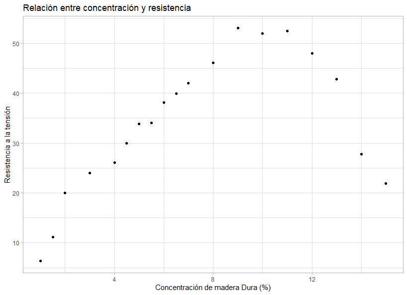
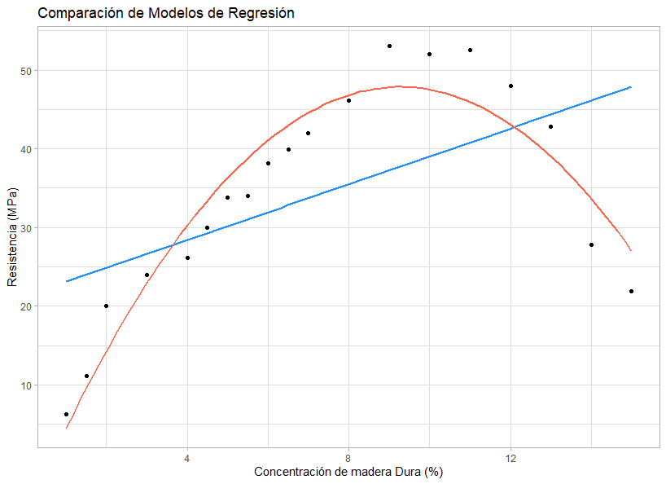

</br></br>
<h3>Modelos polinomiales</h3>

Cuando se construyen modelos para explicar la media de una variable respuesta \( Y \), en ocasiones **no es suficiente incluir las covariables** \( X_1, \dots, X_k \) de manera lineal. En estos casos, puede ser necesario **incluir potencias de estas variables** para mejorar la capacidad del modelo de capturar relaciones no lineales en los datos.

La inclusión de términos polinomiales permite modelar **efectos curvilíneos**, donde la relación entre la variable respuesta y las covariables no sigue una tendencia estrictamente lineal. 


Las funciones `I()` y `poly()` en **R** son utilizadas para incluir términos polinomiales en un modelo de regresión, permitiendo modelar relaciones no lineales entre las covariables y la variable respuesta.


La función `I()` permite incluir **términos polinomiales específicos** en un modelo de regresión. Por ejemplo, si se desea agregar únicamente el término cúbico de una variable \( x \), se puede hacer de la siguiente manera:


`mod1 <- lm(y ~ x + I(x^3), data = datos)`


Por otro lado, la función `poly()` genera términos polinomiales ortogonales hasta un cierto grado, lo que es útil para evitar problemas de colinealidad entre los términos polinomiales. Por ejemplo:


`mod2 <- lm(y ~ poly(x, degree = 3), data = datos)`


</br></br>
<div class="caja-ejemplo">
<h3>Ejemplo:</h3>
<p>

En este ejemplo, se busca desarrollar un **modelo de regresión** que explique la **resistencia a la tensión** de una bolsa en función del **porcentaje de madera dura** en su composición. El objetivo es analizar si existe una relación significativa entre estas dos variables y evaluar la calidad del ajuste del modelo.

Los datos utilizados en este análisis están disponibles en el siguiente enlace:

[Base de datos - Resistencia y Madera Dura](https://raw.githubusercontent.com/smramirezb/datos_ejemplos/refs/heads/main/dat_conc_resis.txt)


---

A continuación, se presentan los códigos para la lectura de datos, la exploración inicial y el ajuste de un modelo de regresión lineal simple.


<pre>

# Configurar el entorno para el uso del idioma español
Sys.setlocale("LC_ALL", "es_ES.UTF-8")


# Carga de Datos y Visualización Inicial

## Lectura de datos
# Se define la URL del archivo que contiene los datos
file <- "https://raw.githubusercontent.com/smramirezb/datos_ejemplos/refs/heads/main/dat_conc_resis.txt"

# Se carga el conjunto de datos en un dataframe
datos <- read.table(file = file, header = TRUE)

# Carga de la librería ggplot2 para la visualización
library(ggplot2)

## Gráfico de dispersión inicial
# Se genera un gráfico de dispersión para visualizar la relación entre la concentración de madera dura y la resistencia a la tensión
ggplot(datos, aes(x = concentracion, y = resistencia)) + 
  geom_point(color = "black") +  # Se representan los puntos en negro
  theme_light() +  # Se aplica un tema claro para mejorar la visualización
  labs(title = "Relación entre concentración y resistencia",
       x = "Concentración de madera Dura (%)",
       y = "Resistencia a la tensión")
</pre>


```{r,eval=FALSE,message=FALSE}
# Configurar el entorno para el uso del idioma español
Sys.setlocale("LC_ALL", "es_ES.UTF-8")


# Carga de Datos y Visualización Inicial

## Lectura de datos
# Se define la URL del archivo que contiene los datos
file <- "https://raw.githubusercontent.com/smramirezb/datos_ejemplos/refs/heads/main/dat_conc_resis.txt"

# Se carga el conjunto de datos en un dataframe
datos <- read.table(file = file, header = TRUE)

# Carga de la librería ggplot2 para la visualización
library(ggplot2)

## Gráfico de dispersión inicial
# Se genera un gráfico de dispersión para visualizar la relación entre la concentración de madera dura y la resistencia a la tensión
ggplot(datos, aes(x = concentracion, y = resistencia)) + 
  geom_point(color = "black") +  # Se representan los puntos en negro
  theme_light() +  # Se aplica un tema claro para mejorar la visualización
  labs(title = "Relación entre concentración y resistencia",
       x = "Concentración de madera Dura (%)",
       y = "Resistencia a la tensión")
```


La **Figura 3.41** muestra un gráfico de dispersión entre la concentración de madera dura y la resistencia a la tensión. A partir de la visualización, se puede identificar una **relación no lineal** entre ambas variables. 

Este comportamiento sugiere que un modelo de regresión **lineal simple** no es adecuado para capturar la relación entre las variables, por lo que será necesario explorar la inclusión de términos polinomiales para mejorar el ajuste del modelo.


<br/><br/>
<center>
```{r, echo=FALSE, out.width="80%", fig.align = "center"}

```
**Figura 3.41** Gráfico de dispersión de Resistencia versus Concentración.
</center>
<br/><br/>


A continuación, se ajustan y comparan dos modelos de regresión: un modelo lineal y un modelo cuadrático. El término cuadrático se incorpora utilizando la función `I()`. Para visualizar la diferencia entre ambos enfoques, se superponen al gráfico de dispersión original la recta ajustada del modelo lineal y la curva correspondiente al modelo cuadrático.

<pre>
# Configurar el entorno para el uso del idioma español
Sys.setlocale("LC_ALL", "es_ES.UTF-8")


# Carga de Datos y Visualización Inicial

## Lectura de datos
# Se define la URL del archivo que contiene los datos
file <- "https://raw.githubusercontent.com/smramirezb/datos_ejemplos/refs/heads/main/dat_conc_resis.txt"

# Se carga el conjunto de datos en un dataframe
datos <- read.table(file = file, header = TRUE)

## Ajuste de Modelos
# Se ajusta un modelo de regresión lineal simple (mod1)
mod1 <- lm(resistencia ~ concentracion, data = datos)

# Se ajusta un modelo de regresión cuadrático (mod2)
mod2 <- lm(resistencia ~ concentracion + I(concentracion^2), data = datos)

## Visualización de los Datos y los Modelos Ajustados
ggplot(datos, aes(x = concentracion, y = resistencia)) + 
  geom_point() +  # Gráfico de dispersión de los datos
  geom_smooth(method = 'lm', formula = y ~ x, se = FALSE, col = 'dodgerblue1') +  # Ajuste lineal (mod1)
  geom_smooth(method = 'lm', formula = y ~ x + I(x^2), se = FALSE, col = 'tomato') +  # Ajuste cuadrático (mod2)
  theme_light() +  # Aplicación de un tema ligero para mejorar la presentación
  labs(title = "Comparación de Modelos de Regresión",
       x = "Concentración de madera Dura (%)",
       y = "Resistencia (MPa)")
</pre>


```{r,eval=FALSE,message=FALSE}
# Configurar el entorno para el uso del idioma español
Sys.setlocale("LC_ALL", "es_ES.UTF-8")


# Carga de Datos y Visualización Inicial

## Lectura de datos
# Se define la URL del archivo que contiene los datos
file <- "https://raw.githubusercontent.com/smramirezb/datos_ejemplos/refs/heads/main/dat_conc_resis.txt"

# Se carga el conjunto de datos en un dataframe
datos <- read.table(file = file, header = TRUE)

## Ajuste de Modelos
# Se ajusta un modelo de regresión lineal simple (mod1)
mod1 <- lm(resistencia ~ concentracion, data = datos)

# Se ajusta un modelo de regresión cuadrático (mod2)
mod2 <- lm(resistencia ~ concentracion + I(concentracion^2), data = datos)

## Visualización de los Datos y los Modelos Ajustados
ggplot(datos, aes(x = concentracion, y = resistencia)) + 
  geom_point() +  # Gráfico de dispersión de los datos
  geom_smooth(method = 'lm', formula = y ~ x, se = FALSE, col = 'dodgerblue1') +  # Ajuste lineal (mod1)
  geom_smooth(method = 'lm', formula = y ~ x + I(x^2), se = FALSE, col = 'tomato') +  # Ajuste cuadrático (mod2)
  theme_light() +  # Aplicación de un tema ligero para mejorar la presentación
  labs(title = "Comparación de Modelos de Regresión",
       x = "Concentración de madera Dura (%)",
       y = "Resistencia (MPa)")

```


<br/><br/>
<center>
```{r, echo=FALSE, out.width="80%", fig.align = "center"}

```
**Figura 3.42** Comparación de las rectas de los dos modelos.
</center>
<br/><br/>


En la **Figura 3.42** se evidencia que el modelo lineal no logra capturar adecuadamente la relación entre las variables. Se pueden identificar regiones en las que el modelo subestima sistemáticamente los valores observados y otras en las que sobrestima de manera consistente. Esto sugiere que un modelo más flexible, como el cuadrático, podría proporcionar un mejor ajuste a los datos.


</p>
</div>

