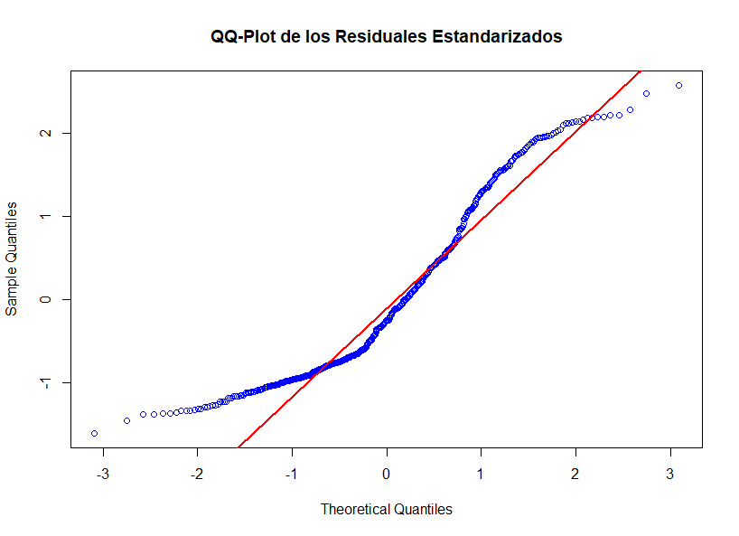
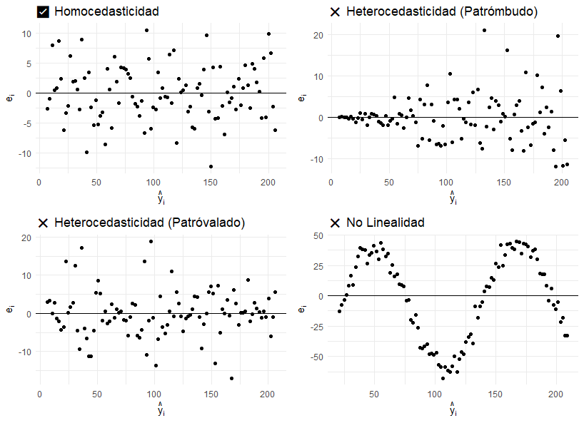

```{r setup, include=FALSE}
knitr::opts_chunk$set(echo = TRUE, comment = NA)

c1="#FF7F00"
c2="#=EB0C6"
c3="#034A94"
c4="#686868"

library(ggplot2)
library(paqueteMETODOS)
data(biomasa)
modelo=lm(log(bio_total) ~ diametro, data=biomasa)
```

</br></br>


</br></br>
<h3>Transformaciones para linealizar el modelo</h3>

En ciertos casos, el modelo teórico que describe los datos presenta una **estructura matemática no lineal en sus parámetros**. Sin embargo, mediante **transformaciones adecuadas** de $Y$ y/o $X$, es posible reformularlo en una **forma lineal**, permitiendo así la aplicación de métodos de regresión lineal estándar.

La **Tabla 3.6** muestra algunos ejemplos de modelos que pueden ser **linealizados** mediante transformaciones específicas.


<br/><br/>
<center>
**Tabla 3.6** Ejemplos de transformaciones.
</center>

| **Modelo** | **Denominación** | **Transformación** |
|------------|-----------------|---------------------|
| \( Y = \beta_0 e^{\beta_1 X} \varepsilon \) | Modelo exponencial multiplicativo | Se ajusta \( Y^* = \beta_0^* + \beta_1 X + \varepsilon^* \) con \( Y^* = \ln(Y) \) |
| \( Y = \beta_0 X^{\beta_1} \varepsilon \) | Modelo potencial multiplicativo | Se ajusta \( Y^* = \beta_0^* + \beta_1 X^* + \varepsilon^* \) con \( Y^* = \ln(Y) \) y \( X^* = \ln(X) \) |
| \( Y = \beta_0 + \beta_1 \ln(X) + \varepsilon \) | Modelo logarítmico | Se ajusta \( Y = \beta_0 + \beta_1 X^* + \varepsilon \) con \( X^* = \ln(X) \) |
| \( Y = \beta_0 + \beta_1(1/X) + \varepsilon \) | Modelo recíproco | Se ajusta \( Y = \beta_0 + \beta_1 X^* + \varepsilon \) con \( X^* = 1/X \) |


```{r, include=FALSE}
#Sys.setlocale("LC_ALL", "es_ES.UTF-8")

library(ggplot2)
library(gridExtra)

# Definir el rango de valores de x
x <- seq(0.1, 5, length.out = 100)

# Definir las funciones de los modelos
exp_pos <- data.frame(x, y = 1 * exp(0.5 * x), modelo = "(a)~f(x) == beta[0]*exp(beta[1]*x)~','~beta[0] > 0~','~beta[1] > 0")
exp_neg <- data.frame(x, y = 1 * exp(-0.5 * x), modelo = "(b)~f(x) == beta[0]*exp(beta[1]*x)~','~beta[0] > 0~','~beta[1] < 0")
pot_pos <- data.frame(x, y = x^1.5, modelo = "(c)~f(x) == beta[0]*x^{beta[1]}~','~beta[0] > 0~','~beta[1] > 1")
pot_neg <- data.frame(x, y = x^(-0.5), modelo = "(d)~f(x) == beta[0]*x^{beta[1]}~','~beta[0] > 0~','~beta[1] < 0")
log_pos <- data.frame(x, y = log(x), modelo = "(e)~f(x) == beta[0] + beta[1]*log(x)~','~beta[0] > 0~','~beta[1] > 0")
log_neg <- data.frame(x, y = -log(x), modelo = "(f)~f(x) == beta[0] + beta[1]*log(x)~','~beta[0] > 0~','~beta[1] < 0")
rec_pos <- data.frame(x, y = 1/x, modelo = "(g)~f(x) == beta[0] + beta[1]*(1/x)~','~beta[0] > 0~','~beta[1] > 0")
rec_neg <- data.frame(x, y = -1/x, modelo = "(h)~f(x) == beta[0] + beta[1]*(1/x)~','~beta[0] > 0~','~beta[1] < 0")

# Unir todas las funciones en un solo data frame
data <- rbind(exp_pos, exp_neg, pot_pos, pot_neg, log_pos, log_neg, rec_pos, rec_neg)

# Crear la gráfica con facet_wrap y títulos en notación matemática
p <- ggplot(data, aes(x = x, y = y)) +
  geom_line(color = "red") +
  facet_wrap(~modelo, scales = "free", labeller = label_parsed) +  # Renderiza las expresiones matemáticas
  theme_minimal() +
  labs(x = "x", y = "f(x)",
       title = "Gráficas de Modelos Intrínsecamente Lineales") +
  theme(strip.text = element_text(size = 8, face = "bold"),
        plot.margin = margin(10, 10, 10, 10))

# Mostrar la gráfica
print(p)

```


En la **Figura 3.16** se muestran los patrones de los modelos que se pueden linealizar.


<br/><br/>
<center>
```{r, echo=FALSE, out.width="100%", fig.align = "center"}
knitr::include_graphics("img/fig316.png")
```
**Figura 3.16** Patrones de los modelos que se pueden linealizar.
</center>
<br/><br/>


</br></br>
<div class="caja-ejemplo">
<h3>Ejemplo:</h3>
<p>

Se busca modelar la cantidad de una sustancia radiactiva (en miligramos) en función del tiempo (en años) debido a su proceso de desintegración. Para ello, se dispone de un conjunto de 50 observaciones: 

<pre>
   Tiempo Cantidad
1     0.0     99.4
2     0.1     97.0
3     0.3     96.0
4     0.4     91.9
5     0.6     89.3
6     0.7     88.4
7     0.9     84.7
8     1.0     80.6
9     1.1     78.9
10    1.3     76.9
11    1.4     76.4
12    1.6     73.4
13    1.7     71.4
14    1.9     69.1
15    2.0     66.5
16    2.1     66.9
17    2.3     63.8
18    2.4     59.6
19    2.6     60.5
20    2.7     57.6
21    2.9     55.4
22    3.0     54.7
23    3.1     52.3
24    3.3     51.1
25    3.4     49.7
26    3.6     47.3
27    3.7     48.4
28    3.9     46.4
29    4.0     43.8
30    4.1     44.9
31    4.3     42.9
32    4.4     40.9
33    4.6     41.0
34    4.7     39.8
35    4.9     38.7
36    5.0     37.5
37    5.1     36.3
38    5.3     34.7
39    5.4     33.5
40    5.6     32.4
41    5.7     31.2
42    5.9     30.8
43    6.0     28.9
44    6.1     31.4
45    6.3     29.7
46    6.4     26.5
47    6.6     26.5
48    6.7     25.6
49    6.9     26.2
50    7.0     24.6
</pre>

```{r,include=FALSE}

# Sys.setlocale("LC_ALL", "es_ES.UTF-8")


# # Fijar la semilla para reproducibilidad
# set.seed(123)
# 
# # Parámetros para la simulación
# a <- 100  # Cantidad inicial de sustancia (100%)
# b <- 0.2  # Tasa de desintegración radiactiva
# 
# # Generar datos sintéticos
# tiempo <- seq(0, 7, length.out = 50)  # 50 valores de tiempo entre 0 y 10 años
# sustancia <- a * exp(-b * tiempo) + rnorm(length(tiempo), mean = 0, sd = 1)  # Agregar ruido
# 
# # Crear data frame
# datos_radiactivos <- round(data.frame(Tiempo = tiempo, Cantidad= sustancia),1)

# # Mostrar los primeros valores
# head(datos_radiactivos)
# datos<-datos_radiactivos

```

A continuación, se presentan los códigos en **R** para cargar la base de datos, generar el gráfico de dispersión y ajustar un modelo de regresión lineal, donde la variable de respuesta es la **Cantidad** y la variable predictora es el **Tiempo**.

<pre>
# Configurar el entorno para el uso del idioma español
Sys.setlocale("LC_ALL", "es_ES.UTF-8")

# Crear el data.frame con los datos de desintegración radiactiva
datos <- data.frame(
  Tiempo = c(0.0, 0.1, 0.3, 0.4, 0.6, 0.7, 0.9, 1.0, 1.1, 1.3,
             1.4, 1.6, 1.7, 1.9, 2.0, 2.1, 2.3, 2.4, 2.6, 2.7,
             2.9, 3.0, 3.1, 3.3, 3.4, 3.6, 3.7, 3.9, 4.0, 4.1,
             4.3, 4.4, 4.6, 4.7, 4.9, 5.0, 5.1, 5.3, 5.4, 5.6,
             5.7, 5.9, 6.0, 6.1, 6.3, 6.4, 6.6, 6.7, 6.9, 7.0),
  Cantidad = c(99.4, 97.0, 96.0, 91.9, 89.3, 88.4, 84.7, 80.6, 78.9, 76.9,
               76.4, 73.4, 71.4, 69.1, 66.5, 66.9, 63.8, 59.6, 60.5, 57.6,
               55.4, 54.7, 52.3, 51.1, 49.7, 47.3, 48.4, 46.4, 43.8, 44.9,
               42.9, 40.9, 41.0, 39.8, 38.7, 37.5, 36.3, 34.7, 33.5, 32.4,
               31.2, 30.8, 28.9, 31.4, 29.7, 26.5, 26.5, 25.6, 26.2, 24.6)
)

# Cargar librerías necesarias
library(ggplot2)

# Generar gráfico de dispersión para visualizar la relación entre tiempo y cantidad
ggplot(datos, aes(x = Tiempo, y = Cantidad)) + 
  geom_point(color = "blue", size = 2) + 
  geom_smooth(method = "lm", color = "red", se = FALSE) +  # Agregar línea de tendencia
  theme_light() +
  xlim(0, 10) + 
  labs(title = "Desintegración Radiactiva",
       x = "Tiempo (años)", 
       y = "Cantidad de sustancia (mg)")

# Ajuste del modelo de regresión lineal
m1 <- lm(Cantidad ~ Tiempo, data = datos)
summary(m1)  # Resumen del modelo

# Diagnóstico del modelo: Evaluación de residuos y ajuste
par(mfrow = c(2, 2))  # Configurar la disposición de los gráficos
plot(m1, las = 1, col = 'blue', which = 1:3, cex = 1.5, pch = 19)  # Gráficos de diagnóstico

# Prueba de normalidad de los residuos con Shapiro-Wilk
res_m1 <- residuals(m1)
shapiro.test(res_m1)
</pre>

```{r,echo=TRUE,message=FALSE,include=FALSE}
# Configurar el entorno para el uso del idioma español
#Sys.setlocale("LC_ALL", "es_ES.UTF-8")

# Crear el data.frame con los datos de desintegración radiactiva
datos <- data.frame(
  Tiempo = c(0.0, 0.1, 0.3, 0.4, 0.6, 0.7, 0.9, 1.0, 1.1, 1.3,
             1.4, 1.6, 1.7, 1.9, 2.0, 2.1, 2.3, 2.4, 2.6, 2.7,
             2.9, 3.0, 3.1, 3.3, 3.4, 3.6, 3.7, 3.9, 4.0, 4.1,
             4.3, 4.4, 4.6, 4.7, 4.9, 5.0, 5.1, 5.3, 5.4, 5.6,
             5.7, 5.9, 6.0, 6.1, 6.3, 6.4, 6.6, 6.7, 6.9, 7.0),
  Cantidad = c(99.4, 97.0, 96.0, 91.9, 89.3, 88.4, 84.7, 80.6, 78.9, 76.9,
               76.4, 73.4, 71.4, 69.1, 66.5, 66.9, 63.8, 59.6, 60.5, 57.6,
               55.4, 54.7, 52.3, 51.1, 49.7, 47.3, 48.4, 46.4, 43.8, 44.9,
               42.9, 40.9, 41.0, 39.8, 38.7, 37.5, 36.3, 34.7, 33.5, 32.4,
               31.2, 30.8, 28.9, 31.4, 29.7, 26.5, 26.5, 25.6, 26.2, 24.6)
)

# Cargar librerías necesarias
library(ggplot2)

# Generar gráfico de dispersión para visualizar la relación entre tiempo y cantidad
ggplot(datos, aes(x = Tiempo, y = Cantidad)) + 
  geom_point(color = "blue", size = 2) + 
  geom_smooth(method = "lm", color = "red", se = FALSE) +  # Agregar línea de tendencia
  theme_light() +
  xlim(0, 10) + 
  labs(title = "Desintegración Radiactiva",
       x = "Tiempo (años)", 
       y = "Cantidad de sustancia (mg)")

# Ajuste del modelo de regresión lineal
m1 <- lm(Cantidad ~ Tiempo, data = datos)
summary(m1)  # Resumen del modelo

# Diagnóstico del modelo: Evaluación de residuos y ajuste
par(mfrow = c(2, 2))  # Configurar la disposición de los gráficos
#plot(m1, las = 1, col = 'blue', which = 1:3, cex = 1.5, pch = 19)  # Gráficos de diagnóstico

# Prueba de normalidad de los residuos con Shapiro-Wilk
res_m1 <- residuals(m1)
#shapiro.test(res_m1)
```


<br/><br/>
<center>
```{r, echo=FALSE, out.width="80%", fig.align = "center"}
knitr::include_graphics("img/fig317.png")
```
**Figura 3.17** Relación cantidad (mg) y tiempo (años).
</center>
<br/><br/>


La **Figura 3.17** muestra claramente que la cantidad de sustancia (mg) **decrece de forma exponencial** a medida que transcurre el tiempo (años). Este comportamiento es consistente con el esperado en un proceso de desintegración radiactiva.

A partir de la siguiente salida computacional se observa lo siguiente:

- **El tiempo es una variable significativa**, ya que el valor-p es menor a $2e^{-16}$.

- **Por cada año transcurrido, la cantidad de sustancia radiactiva disminuye en 10.4448 mg**, según el coeficiente estimado del modelo.

- **El coeficiente de determinación ($R^2$) es alto**, con un valor de 0.9642, lo que indica que el modelo explica una un 96.42% de la variabilidad en los datos.

- **El modelo $m_1$ es significativo**, dado que el valor-p del modelo completo es menor a $2.2e^{-16}$, lo que confirma la relación entre el tiempo y la cantidad de sustancia radiactiva.


<pre>
Call:
lm(formula = Cantidad ~ Tiempo, data = datos)

Residuals:
    Min      1Q  Median      3Q     Max 
-5.9173 -3.1284 -0.6941  3.3272  8.8153 

Coefficients:
            Estimate Std. Error t value Pr(>|t|)    
(Intercept)  90.5847     1.1795   76.80   <2e-16 ***
Tiempo      -10.4448     0.2903  -35.98   <2e-16 ***
---
Signif. codes:  0 ‘***’ 0.001 ‘**’ 0.01 ‘*’ 0.05 ‘.’ 0.1 ‘ ’ 1

Residual standard error: 4.236 on 48 degrees of freedom
Multiple R-squared:  0.9642,	Adjusted R-squared:  0.9635 
F-statistic:  1295 on 1 and 48 DF,  p-value: < 2.2e-16
</pre>


La **Figura 3.18** muestra los gráficos de diagnóstico de los residuos del modelo de regresión lineal $m_1$. Vamos a analizar cada uno:

- **Residuals vs Fitted (Residuos vs Valores Ajustados)**:  La forma de "U" en el gráfico indica que hay una relación no lineal entre las variables. Esto sugiere que el modelo lineal no es adecuado, ya que los residuos deberían estar distribuidos aleatoriamente alrededor de la línea horizontal (cero).

- **Q-Q Residuals (Gráfico de Cuantiles-Cuantiles)**: Se observa una desviación de los puntos con respecto a la línea diagonal en los extremos.Esto indica que los residuos no siguen completamente una distribución normal, lo cual puede afectar la validez de los resultados asociados al modelo.

- **Scale-Location (Residuos Estandarizados vs Valores Ajustados)**: La tendencia en forma de "U" sugiere que la varianza de los residuos no es constante (presencia de heterocedasticidad). Esto significa que el modelo puede no ser el más adecuado y se recomienda considerar una transformación logaritmo a la variable respuesta.

- Adicionalmente el valor-p= 0.008344 del test Shapiro-Wilk rechaza la normalidad de los errores del modelo.

<br/><br/>
<center>
```{r, echo=FALSE, out.width="80%", fig.align = "center"}

```
**Figura 3.18** Residuales del modelo 1.
</center>
<br/><br/>


<pre>
Shapiro-Wilk normality test

data:  res_m1
W = 0.93468, p-value = 0.008344
</pre>


Dado que los supuestos de **homocedasticidad** y **normalidad** de los residuos **no se cumplen**, es necesario aplicar una transformación a la variable respuesta. En este caso, se emplea la transformación logarítmica, lo que implica trabajar con la nueva variable transformada:

$$ Y^* = \log(Y) $$

Esta transformación permite estabilizar la varianza y mejorar el cumplimiento de los supuestos de la regresión lineal.

Esto implica reescribir el modelo exponencial multiplicativo original, donde **Cantidad de la sustancia** ($Y$) es la variable respuesta y **Tiempo** ($X$) es la variable explicativa:

$$
Y = \beta_0 e^{\beta_1 X} \varepsilon
$$

de manera que, al aplicar el logaritmo a ambos lados de la ecuación, se obtiene la forma lineal en términos de $Y^*$ y $X$:

$$
Y^* = \beta_0^* + \beta_1 X + \varepsilon^*
$$

donde:

- $\beta_0^* = \log(\beta_0)$ representa el nuevo intercepto del modelo transformado.

- $\varepsilon^* = \log(\varepsilon)$ corresponde al nuevo término de error.

- El coeficiente $\beta_1$ se mantiene inalterado en ambos modelos, lo que permite interpretar su efecto de manera consistente.

Esta transformación facilita el ajuste del modelo en **R**, asegurando una relación lineal entre la variable explicativa y la respuesta, además de mejorar la interpretación de los coeficientes en términos logarítmicos. Los códigos del nuevo modelo ($m_2$) son los siguientes:


<pre>
#Sys.setlocale("LC_ALL", "es_ES.UTF-8")

# Crear el data.frame en R
datos <- data.frame(
  Tiempo = c(0.0, 0.1, 0.3, 0.4, 0.6, 0.7, 0.9, 1.0, 1.1, 1.3,
             1.4, 1.6, 1.7, 1.9, 2.0, 2.1, 2.3, 2.4, 2.6, 2.7,
             2.9, 3.0, 3.1, 3.3, 3.4, 3.6, 3.7, 3.9, 4.0, 4.1,
             4.3, 4.4, 4.6, 4.7, 4.9, 5.0, 5.1, 5.3, 5.4, 5.6,
             5.7, 5.9, 6.0, 6.1, 6.3, 6.4, 6.6, 6.7, 6.9, 7.0),
  Cantidad = c(99.4, 97.0, 96.0, 91.9, 89.3, 88.4, 84.7, 80.6, 78.9, 76.9,
               76.4, 73.4, 71.4, 69.1, 66.5, 66.9, 63.8, 59.6, 60.5, 57.6,
               55.4, 54.7, 52.3, 51.1, 49.7, 47.3, 48.4, 46.4, 43.8, 44.9,
               42.9, 40.9, 41.0, 39.8, 38.7, 37.5, 36.3, 34.7, 33.5, 32.4,
               31.2, 30.8, 28.9, 31.4, 29.7, 26.5, 26.5, 25.6, 26.2, 24.6)
)


library(ggplot2)
#Ajuste de modelo m2

log_cantidad<-log(datos$Cantidad)
datos$log_cantidad<-log_cantidad

ggplot(datos, aes(x=Tiempo, y=log_cantidad)) + 
  geom_point() + theme_light() +
  xlim(0, 10) + 
  labs(x="Tiempo", y="log-cantidad")


m2 <- lm(log(Cantidad) ~ Tiempo, data=datos)
summary(m2)

#Residuales
par(mfrow=c(2, 2))
plot(m2, las=1, col='palegreen3', which=1:3, cex=1.5, pch=19)

res_m2 <- residuals(m2)
shapiro.test(res_m2)

#Comparando las lineas

par(mfrow=c(1, 2))

plot(x=datos$Tiempo, y=datos$Canti, pch=20, cex=0.8,
     xlab="Tiempo (años)", ylab="Cantidad", main="M1")
abline(m1, col="blue", lwd=2)

plot(x=datos$Tiempo, y=log(datos$Cantidad), pch=20, cex=0.8,
     xlab="Tiempo (años)", ylab="log(Cantidad)", main="M2")
abline(m2, col="palegreen3", lwd=2)
</pre>


```{r,echo=TRUE,include=FALSE}

#Sys.setlocale("LC_ALL", "es_ES.UTF-8")

# Crear el data.frame en R
datos <- data.frame(
  Tiempo = c(0.0, 0.1, 0.3, 0.4, 0.6, 0.7, 0.9, 1.0, 1.1, 1.3,
             1.4, 1.6, 1.7, 1.9, 2.0, 2.1, 2.3, 2.4, 2.6, 2.7,
             2.9, 3.0, 3.1, 3.3, 3.4, 3.6, 3.7, 3.9, 4.0, 4.1,
             4.3, 4.4, 4.6, 4.7, 4.9, 5.0, 5.1, 5.3, 5.4, 5.6,
             5.7, 5.9, 6.0, 6.1, 6.3, 6.4, 6.6, 6.7, 6.9, 7.0),
  Cantidad = c(99.4, 97.0, 96.0, 91.9, 89.3, 88.4, 84.7, 80.6, 78.9, 76.9,
               76.4, 73.4, 71.4, 69.1, 66.5, 66.9, 63.8, 59.6, 60.5, 57.6,
               55.4, 54.7, 52.3, 51.1, 49.7, 47.3, 48.4, 46.4, 43.8, 44.9,
               42.9, 40.9, 41.0, 39.8, 38.7, 37.5, 36.3, 34.7, 33.5, 32.4,
               31.2, 30.8, 28.9, 31.4, 29.7, 26.5, 26.5, 25.6, 26.2, 24.6)
)


library(ggplot2)
#Ajuste de modelo m2

log_cantidad<-log(datos$Cantidad)
datos$log_cantidad<-log_cantidad

plot2<-ggplot(datos, aes(x=Tiempo, y=log_cantidad)) + 
  geom_point() + theme_light() +
  xlim(0, 10) + 
  labs(x="Tiempo", y="log-cantidad")


m2 <- lm(log(Cantidad) ~ Tiempo, data=datos)
#summary(m2)

#Residuales
par(mfrow=c(2, 2))
#plot(m2, las=1, col='palegreen3', which=1:3, cex=1.5, pch=19)

res_m2 <- residuals(m2)
#shapiro.test(res_m2)

#Comparando las lineas

par(mfrow=c(1, 2))

plot2b<-plot(x=datos$Tiempo, y=datos$Canti, pch=20, cex=0.8,
     xlab="Tiempo (años)", ylab="Cantidad", main="M1")
abline(m1, col="blue", lwd=2)

plot(x=datos$Tiempo, y=log(datos$Cantidad), pch=20, cex=0.8,
     xlab="Tiempo (años)", ylab="log(Cantidad)", main="M2")
abline(m2, col="palegreen3", lwd=2)


```


<br/><br/>
<center>
```{r, echo=FALSE, out.width="80%", fig.align = "center"}

```
**Figura 3.19** Relación log-cantidad y tiempo.
</center>
<br/><br/>


La **Figura 3.19** evidencia una relación lineal negativa entre el logaritmo de la cantidad de sustancia y el tiempo. Los resultados del **modelo 2** confirman que existe una relación lineal significativa entre estas variables, respaldada por la **estadística F de $1.714 \times 10^4$** y un **valor-p < $2.2e^{-16}$**.

Adicionalmente:

- **La variable Tiempo es altamente significativa**, ya que su valor-p es menor a $2e^{-16}$.

- **El coeficiente de determinación ($R^2$) es de 0.9972**, lo que indica que el modelo explica el **99.72%** de la variabilidad en los datos.


A continuación, se muestra la salida computacional del modelo $m_2$:

<pre>
Call:
lm(formula = log(Cantidad) ~ Tiempo, data = datos)

Residuals:
      Min        1Q    Median        3Q       Max 
-0.049859 -0.014259 -0.001082  0.014219  0.059930 

Coefficients:
             Estimate Std. Error t value Pr(>|t|)    
(Intercept)  4.604322   0.006194   743.4   <2e-16 ***
Tiempo      -0.199581   0.001524  -130.9   <2e-16 ***
---
Signif. codes:  0 ‘***’ 0.001 ‘**’ 0.01 ‘*’ 0.05 ‘.’ 0.1 ‘ ’ 1

Residual standard error: 0.02224 on 48 degrees of freedom
Multiple R-squared:  0.9972,	Adjusted R-squared:  0.9971 
F-statistic: 1.714e+04 on 1 and 48 DF,  p-value: < 2.2e-16
</pre>


La **Figura 3.20** muestra los gráficos de diagnóstico de los residuos del modelo de regresión lineal $m_2$. Vamos a analizar cada uno:

- **Residuals vs Fitted (Residuos vs Valores Ajustados)**: Los residuos están distribuidos aleatoriamente alrededor de la línea horizontal, sin una tendencia clara, lo que indica que la relación entre las variables es adecuadamente modelada por una regresión lineal. Algunos valores atípicos (puntos 44, 45 y 48) podrían indicar observaciones con mayor influencia en el modelo.

- **Q-Q Residuals (Gráfico de Cuantiles-Cuantiles)**: Los residuos siguen aproximadamente la línea diagonal, lo que sugiere que la normalidad de los errores se cumple en gran medida. Sin embargo, en los extremos hay algunas desviaciones, lo que indica la presencia de valores atípicos que podrían afectar la normalidad de los errores.

- **Scale-Location (Residuos Estandarizados vs Valores Ajustados)**: No se observa una tendencia clara en los residuos estandarizados, lo que sugiere que la homocedasticidad (varianza constante de los errores) se cumple adecuadamente. Aunque los valores en los extremos (puntos 44, 45 y 48) podrían generar cierta variabilidad, en general la transformación logarítmica parece haber estabilizado la varianza.

El test de normalidad Shapiro-Wilk no rechaza normalidad de los errores del modelo con un valor-p= 0.8696.


<br/><br/>
<center>
```{r, echo=FALSE, out.width="80%", fig.align = "center"}
knitr::include_graphics("img/fig320.png")
```
**Figura 3.20** Residuales del modelo 2.
</center>
<br/><br/>


<pre>
	Shapiro-Wilk normality test

data:  res_m2
W = 0.98745, p-value = 0.8696
</pre>

</p>
</div>


La **Figura 3.21** compara los modelos ajustados $m_1$ y $m_2$ mediante un diagrama de dispersión.

- **El modelo $m_1$**, ajustado en términos de $Y$ y $X$, no representa adecuadamente la relación entre la cantidad de sustancia ($Y$) y el tiempo ($X$). El gráfico de dispersión sugiere una relación de tipo exponencial, lo que indica que un modelo lineal en su forma original no es apropiado.

- **El modelo $m_2$**, basado en la regresión lineal de $\log(Y)$ en función de $X$, proporciona un mejor ajuste.


<br/><br/>
<center>
```{r, echo=FALSE, out.width="80%", fig.align = "center"}

```
**Figura 3.21** Comparación de las rectas de los dos modelos.
</center>
<br/><br/>
