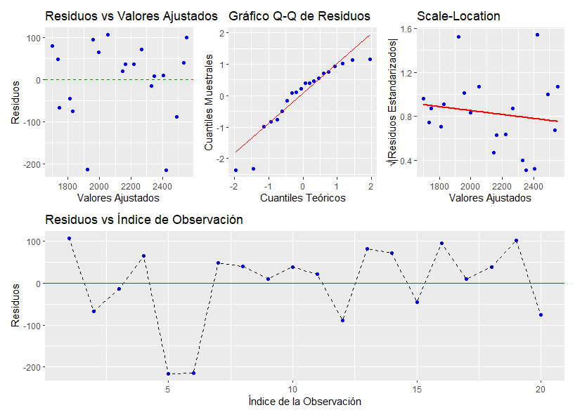

</br></br>
<h2>Pruebas sobre los coeficientes \( \beta \)</h2>

La prueba explicada a continuación se conoce como la **prueba de Wald**, en honor a **Abraham Wald (1902-1950)**. Se utiliza para evaluar hipótesis sobre los coeficientes del modelo de regresión.

En un modelo de regresión con \( k \) variables en la matriz de diseño \( X \), donde la primera columna de \( X \) representa el intercepto y no se cuenta como variable, se requiere evaluar   hipótesis como las siguientes para cada coeficiente de cada una de las \( k \) variables:

\[
H_0: \beta_j = 0
\]

frente a la hipótesis alternativas:

\[
  H_1: \beta_j \neq 0
\]


para algún \( j = 1, 2, \dots, k \).


El **estadístico de prueba** utilizado en la **prueba de Wald** está dado por:

\[
t_0 = \frac{\hat{\beta}_j - \beta_{j0}}{s.e.(\hat{\beta}_j)}
\]

donde:

- \( \hat{\beta}_j \) es el estimador del coeficiente \( \beta_j \).

- \( s.e.(\hat{\beta}_j) \) representa el error estándar del estimador.

Bajo la hipótesis nula, el estadístico de prueba sigue una distribución \( t \) de **Student** con \( n - k - 1 \) grados de libertad:

\[
t_0 \sim t_{n - k - 1}
\]

Esta prueba es fundamental en la inferencia de modelos de regresión, ya que permite evaluar si una variable predictora tiene un **efecto significativo** sobre la variable respuesta.


<div class="caja-actividad">
<h3>Nota:</h3>
>
<p>
Cuando se desea realizar pruebas de hipótesis sobre los coeficientes del modelo de regresión y el valor de referencia es **\( \beta_{j0} = 0 \)**, se puede utilizar la función `summary()` en **R**.
</p>
>
</div>


</br></br>
<h2>Prueba sobre todos los coeficientes</h2>


En un modelo de **regresión múltiple**, la variable respuesta \( y_i \) se modela como sigue:

\[
y_i \sim N(\mu_i, \sigma^2)
\]

\[
\mu_i = \beta_0 + \beta_1 x_{1i} + \beta_2 x_{2i} + \dots + \beta_k x_{ki}
\]

donde \( \sigma^2 \) es constante, lo que implica la suposición de homocedasticidad.

En este contexto, una pregunta clave en el análisis del modelo es determinar si alguna de las variables explicativas \( x_j \) aporta información significativa a la predicción de \( y \) o si, por el contrario, ninguna contribuye de manera relevante. Esto se traduce en la siguiente prueba de hipótesis:

- **Hipótesis nula (\( H_0 \))**: Ninguna de las variables explicativas tiene un efecto significativo en la variable respuesta. Es decir,

\[
H_0: \beta_1 = \beta_2 = \dots = \beta_k = 0
\]

- **Hipótesis alternativa (\( H_1 \))**: Al menos una de las variables explicativas tiene un efecto significativo en la variable respuesta. Es decir,

\[
H_1: \text{al menos uno de los } \beta_j \neq 0, \quad \text{para algún } j = 1,2, \dots, k.
\]

Para evaluar estas hipótesis, se emplea la **prueba de significancia de la regresión**, la cual se basa en la descomposición de la variabilidad total en tres componentes fundamentales:

1. **Variabilidad total (\( SST \))**: Representa la variabilidad total observada en los datos de \( y \).

2. **Variabilidad explicada por el modelo (\( SSR \))**: Corresponde a la parte de la variabilidad total que el modelo de regresión logra explicar.

3. **Variabilidad residual (\( SSRes \))**: Es la parte de la variabilidad total que no puede ser explicada por el modelo, es decir, los residuos.


En esta prueba, el objetivo es determinar si la variabilidad explicada por el modelo de **Regresión** (\(SSR\)) representa una parte significativa de la **Variabilidad total** (\(SST\)), o si, por el contrario, la variabilidad residual (\(SSRes\)) es tan grande que el modelo no explica adecuadamente la variable respuesta.

Para evaluar esta relación, se construye la **tabla ANOVA (Analysis of Variance)**, la cual descompone la variabilidad total en sus componentes: **Regresión**, **Residual** y **Total**. La **Tabla 3.9** resume la estructura de este análisis:


<br/><br/>
<center>
**Tabla 3.9** Tabla ANOVA.
</center> 


| **Fuente de variación**  |          **Suma de cuadrados**        |   **Grados de libertad**   |        **Cuadrado medio**        |   **Estadístico \( F_0 \)**   |   **Valor-P**   |
|-------------------------|--------------------------------|----------------------|---------------------------------|-------------------------|-------------|
| **Regresión**    | \(SS_R\)                  | \(k\)                | \(MS_R = \frac{SS_R}{k}\)        | \(F_0 = \frac{MS_R}{MS_{Res}}\)   | Valor-p     |
| **Residual**     | \(SS_{Res}\)              | \(n - k - 1\)        | \(MS_{Res} = \frac{SS_{Res}}{n-k-1}\)  | -                         | -           |
| **Total**        | \(SS_T\)                  | \(n - 1\)            | -                               | -                         | -           |


La relación entre las sumas de cuadrados en un modelo de regresión se define de la siguiente manera:

- **Suma de cuadrados total (\(SS_T\))**:  

  \[
  SS_T = \sum_{i=1}^{n} y_i^2 - \frac{\left(\sum_{i=1}^{n} y_i\right)^2}{n}
  \]
  
  Esta cantidad representa la variabilidad total en los datos de la variable respuesta \(Y\).

- **Suma de cuadrados de la regresión (\(SS_R\))**: 

  \[
  SS_R = \sum_{i=1}^{n} \hat{y}_i y_i - \frac{\left(\sum_{i=1}^{n} y_i\right)^2}{n}
  \]
  
  Donde \(\hat{y}_i\) representa los valores ajustados por el modelo. Esta expresión mide la variabilidad explicada por el modelo de regresión.

- **Suma de cuadrados de los residuos (\(SS_{Res}\))**:  

  \[
  SS_{Res} = SS_T - SS_R = \sum_{i=1}^{n} (y_i - \hat{y}_i)^2
  \]
  
  Esto indica la variabilidad que no logra ser explicada por el modelo, es decir, la variabilidad atribuida a los errores del modelo.
  
  
El estadístico de prueba se calcula como:

\[
F_0 = \frac{MS_R}{MS_{Res}}
\]

Bajo la hipótesis nula \( H_0 \), el estadístico \( F_0 \) sigue una distribución \( F \) con **\( k \) y \( n - k - 1 \) grados de libertad**, es decir:

\[
F_0 \sim F_{k, n-k-1}
\]

Si el valor \( F_0 \) es suficientemente grande y su correspondiente \(valor-p \) es menor que un umbral de significancia (\(\alpha\)), se **rechaza \( H_0 \)** y se concluye que **al menos una de las variables predictoras es significativa**.


</br></br>
<div class="caja-ejemplo">
<h3>Ejemplo:</h3>
<p>

En este ejemplo, se ajusta un **modelo de regresión lineal simple** para analizar la relación entre la **Resistencia de una soldadura (psi)** y la **Edad de la soldadura (semanas)**. En total, se cuenta con **20 observaciones**. 


El modelo que se va a ajustar se expresa de la siguiente manera:


\[
\text{Resistencia}_i = \beta_0 + \beta_1 \times \text{Edad}_i + \varepsilon_i \\
\varepsilon_i \sim N(0, \sigma^2)
\]

 Para el modelo:
 
 - **\(\beta_0\)**: Intercepto del modelo, que representa la resistencia esperada cuando la edad de la soldadura es **cero**.

- **\(\beta_1\)**: Coeficiente de regresión, que indica el **cambio esperado** en la resistencia por **cada unidad** de aumento en la edad de la soldadura.

- **\(\sigma^2\)**: Varianza del **error**, que se asume **constante** en todo el rango de los datos.

Para que la regresión lineal proporcione resultados válidos, es necesario que el término de error \(\varepsilon\) cumpla con los siguientes supuestos:

1. **Normalidad del error**: Se asume que los errores siguen una distribución normal con media cero y varianza constante:

   \[
   \varepsilon_i \sim N(0, \sigma^2)
   \]

2. **Homocedasticidad (varianza constante del error)**: La varianza de los errores debe ser **constante** para todos los valores de la variable explicativa:

   \[
   \text{Var}(\varepsilon_i) = \sigma^2, \quad \forall i
   \]

3. **Independencia de los errores**: Los errores del modelo no deben estar correlacionados.

El cumplimiento de estos supuestos es fundamental para la validez de las inferencias estadísticas realizadas a partir del modelo. 


---

En un análisis previo, se estudió la relación entre la variable **Edad** (semanas) y la **Resistencia** (psi). La **Figura 3.28** ilustra esta relación, donde se observa una tendencia **lineal negativa**. 


<br/><br/>
<center>
```{r, echo=FALSE, out.width="80%", fig.align = "center"}
knitr::include_graphics("img/fig328.png")
```
**Figura 3.28** Relación Resistencia (psi) versus Edad (semanas).
</center>
<br/><br/>


El código para generar el gráfico de dispersión, ajustar el modelo de regresión lineal simple y calcular la tabla ANOVA
es el siguiente:


<pre>
# Configurar el entorno para el uso del idioma español
Sys.setlocale("LC_ALL", "es_ES.UTF-8")

# Cargar paquetes necesarios
library(ggplot2)   # Para visualización de datos
library(lmtest)    # Para pruebas de independencia y homocedasticidad
library(car)       # Para pruebas de normalidad y homocedasticidad
library(nortest)   # Para pruebas adicionales de normalidad
library(patchwork) # Para combinar gráficos en una sola figura

# Definir la URL del archivo con los datos
file <- "https://raw.githubusercontent.com/smramirezb/datos_ejemplos/refs/heads/main/dat_reg1.txt"

# Cargar el conjunto de datos desde la URL
datos <- read.table(file = file, header = TRUE)

# Crear un gráfico de dispersión para visualizar la relación entre Edad y Resistencia
plot_reg <- ggplot(datos, aes(x = Edad, y = Resistencia)) + 
  geom_point(color = "blue", size = 2) +  # Agregar puntos con color azul y tamaño adecuado
  theme_light() +                         # Aplicar un tema ligero para mejorar la presentación
  labs(title = "Relación entre Edad y Resistencia",
       x = "Edad de la Soldadura (meses)",
       y = "Resistencia de la Soldadura")

# Ajustar un modelo de regresión lineal simple
mod1 <- lm(Resistencia ~ Edad, data = datos)  # Se ajusta el modelo con la variable predictora "Edad"

# Instalar el paquete "remotes" si no está instalado (para instalar paquetes desde GitHub)
if (!require("remotes")) install.packages("remotes")

# Instalar el paquete "model" desde GitHub (este paquete permite generar tablas ANOVA de manera simplificada)
remotes::install_github("fhernanb/model")

# Cargar el paquete "model"
library(model)

# Generar la tabla ANOVA para evaluar la significancia de la regresión
anova_table_lm(mod1)  # Función del paquete "model" para mostrar la tabla ANOVA del modelo
</pre>


```{r,eval=FALSE,warning=FALSE,message=FALSE}
# Configurar el entorno para el uso del idioma español
Sys.setlocale("LC_ALL", "es_ES.UTF-8")

# Cargar paquetes necesarios
library(ggplot2)   # Para visualización de datos
library(lmtest)    # Para pruebas de independencia y homocedasticidad
library(car)       # Para pruebas de normalidad y homocedasticidad
library(nortest)   # Para pruebas adicionales de normalidad
library(patchwork) # Para combinar gráficos en una sola figura

# Definir la URL del archivo con los datos
file <- "https://raw.githubusercontent.com/smramirezb/datos_ejemplos/refs/heads/main/dat_reg1.txt"

# Cargar el conjunto de datos desde la URL
datos <- read.table(file = file, header = TRUE)

# Crear un gráfico de dispersión para visualizar la relación entre Edad y Resistencia
plot_reg <- ggplot(datos, aes(x = Edad, y = Resistencia)) + 
  geom_point(color = "blue", size = 2) +  # Agregar puntos con color azul y tamaño adecuado
  theme_light() +                         # Aplicar un tema ligero para mejorar la presentación
  labs(title = "Relación entre Edad y Resistencia",
       x = "Edad de la Soldadura (meses)",
       y = "Resistencia de la Soldadura")

# Ajustar un modelo de regresión lineal simple
mod1 <- lm(Resistencia ~ Edad, data = datos)  # Se ajusta el modelo con la variable predictora "Edad"

# Instalar el paquete "remotes" si no está instalado (para instalar paquetes desde GitHub)
if (!require("remotes")) install.packages("remotes")

# Instalar el paquete "model" desde GitHub (este paquete permite generar tablas ANOVA de manera simplificada)
remotes::install_github("fhernanb/model")

# Cargar el paquete "model"
library(model)

# Generar la tabla ANOVA para evaluar la significancia de la regresión
anova_table_lm(mod1)  # Función del paquete "model" para mostrar la tabla ANOVA del modelo

```

La tabla ANOVA resultante del modelo de regresión lineal simple es la siguiente:


<pre>
Anova Table
            Sum Sq Df Mean Sq F value    Pr(>F)    
Regression 1527483  1 1527483  165.38 1.643e-10 ***
Residuals   166255 18    9236                      
Total      1693738 19                              
---
Signif. codes:  0 ‘***’ 0.001 ‘**’ 0.01 ‘*’ 0.05 ‘.’ 0.1 ‘ ’ 1
</pre>


De la tabla ANOVA presentada anteriormente, se observa que el \(valor-p \)  es \(1.64 \times 10^{-10}\), lo que  es extremadamente pequeño. Esto proporciona **evidencia suficiente** para rechazar la hipótesis nula con un nivel de significancia del 1%:

\[
H_0: \beta_{\text{Edad}} = 0
\]

Esto significa que la variable **Edad** tiene un efecto estadísticamente significativo en la explicación de la media de la variable respuesta **Resistencia**.


---

Otra forma de aplicar la prueba de significancia de la regresión es utilizando la función `summary()`, la cual proporciona una parte de la tabla ANOVA, pero no la tabla completa.

<pre>
# Definir la URL del archivo con los datos
file <- "https://raw.githubusercontent.com/smramirezb/datos_ejemplos/refs/heads/main/dat_reg1.txt"

# Cargar el conjunto de datos desde la URL
datos <- read.table(file = file, header = TRUE)

# Ajustar un modelo de regresión lineal simple
mod1 <- lm(Resistencia ~ Edad, data = datos)

# Mostrar un resumen del modelo ajustado
summary(mod1)
</pre>


```{r,eval=FALSE,warning=FALSE,message=FALSE}

# Definir la URL del archivo con los datos
file <- "https://raw.githubusercontent.com/smramirezb/datos_ejemplos/refs/heads/main/dat_reg1.txt"

# Cargar el conjunto de datos desde la URL
datos <- read.table(file = file, header = TRUE)

# Ajustar un modelo de regresión lineal simple
mod1 <- lm(Resistencia ~ Edad, data = datos)

# Mostrar un resumen del modelo ajustado
summary(mod1)
```


En la última línea de la salida siguiente, se encuentra la información sobre la  **prueba de hipótesis de significancia de la regresión**. Se observa el **estadístico de prueba \( F \)** con un valor de 165.4 y  el \(valor-p \) obtenido es \(1.643 \times 10^{-10}\), lo que indica que se rechaza la hipótesis nula de que todos los coeficientes son ceros con un nivel de significancia del 1%.

<pre>
Call:
lm(formula = Resistencia ~ Edad, data = datos)

Residuals:
    Min      1Q  Median      3Q     Max 
-215.98  -50.68   28.74   66.61  106.76 

Coefficients:
            Estimate Std. Error t value Pr(>|t|)    
(Intercept) 2627.822     44.184   59.48  < 2e-16 ***
Edad         -37.154      2.889  -12.86 1.64e-10 ***
---
Signif. codes:  0 ‘***’ 0.001 ‘**’ 0.01 ‘*’ 0.05 ‘.’ 0.1 ‘ ’ 1

Residual standard error: 96.11 on 18 degrees of freedom
Multiple R-squared:  0.9018,	Adjusted R-squared:  0.8964 
F-statistic: 165.4 on 1 and 18 DF,  p-value: 1.643e-10
</pre>


La función `summary()` también proporciona los resultados de las **pruebas de hipótesis para cada coeficiente del modelo**. En este caso, se evalúa la significancia del coeficiente de la variable **Edad**. Las hipótesis a evaluar son:

\[
H_0: \beta_{\text{Edad}} = 0
\]

\[
H_1: \beta_{\text{Edad}} \neq 0
\]

La hipótesis nula establece que la variable **Edad** no tiene un efecto significativo en la variable respuesta **Resistencia**. Por otro lado, la hipótesis alternativa indica que **Edad** sí influye en la variabilidad de **Resistencia**.  

El **estadístico de prueba \( t \)** toma el valor -12.86 con un \(valor-p \) de  \(1.64 \times 10^{-10}\). Por lo tanto, se rechaza la hipótesis nula y se concluye, con una significancia del 1%, que el coeficiente \( \beta_1 \) es **distinto de cero**. Esto implica que la variable **Edad** tiene un efecto significativo en la explicación de la variable respuesta **Resistencia**.


---

A continuación, se presentan los códigos para la implementación del **modelo de regresión lineal simple**, la **revisión de sus supuestos** y la **realización de pruebas de hipótesis** sobre sus coeficientes.


<pre>
# Configurar el entorno para el uso del idioma español
Sys.setlocale("LC_ALL", "es_ES.UTF-8")

# Cargar paquetes necesarios
library(ggplot2)   # Para visualización de datos
library(lmtest)    # Para pruebas de independencia y homocedasticidad
library(car)       # Para pruebas de normalidad y homocedasticidad
library(nortest)   # Para pruebas adicionales de normalidad
library(patchwork) # Para combinar gráficos en una sola figura

# Definir la URL del archivo con los datos
file <- "https://raw.githubusercontent.com/smramirezb/datos_ejemplos/refs/heads/main/dat_reg1.txt"

# Cargar el conjunto de datos desde la URL
datos <- read.table(file = file, header = TRUE)

# Crear un gráfico de dispersión para visualizar la relación entre Edad y Resistencia
plot_reg <- ggplot(datos, aes(x = Edad, y = Resistencia)) + 
  geom_point(color = "blue", size = 2) +  # Agregar puntos con color azul y tamaño adecuado
  theme_light() +                         # Aplicar un tema ligero para mejorar la presentación
  labs(title = "Relación entre Edad y Resistencia",
       x = "Edad de la Soldadura (meses)",
       y = "Resistencia de la Soldadura")

# Ajustar un modelo de regresión lineal simple
mod1 <- lm(Resistencia ~ Edad, data = datos)

# Mostrar un resumen del modelo ajustado
summary(mod1)

# Evaluación de los supuestos del modelo 

## Verificación de homocedasticidad
# Se generan gráficos de diagnóstico para evaluar la homocedasticidad y la normalidad
par(mfrow=c(2, 2))  # Organiza los gráficos en una cuadrícula de 2x2
plot(mod1, las=1, col='blue', which=1:3) 

# Evaluación de normalidad de los errores
ei <- residuals(mod1)  # Se extraen los residuos del modelo

# Prueba de Shapiro-Wilk
shapiro.test(ei)  # Prueba de normalidad para muestras pequeñas

# Prueba de Anderson-Darling (más robusta para normalidad)
ad.test(ei)

# Prueba de Kolmogorov-Smirnov (para verificar normalidad)
ks.test(ei, "pnorm", mean(ei), sd(ei))

# Evaluación de independencia de los errores
# Test de Durbin-Watson para detectar autocorrelación de primer orden
dwtest(mod1)

# Test de Breusch-Godfrey para correlación serial de orden superior
bgtest(mod1)


# Evaluación de homocedasticidad
# Test de Breusch-Pagan (detecta heterocedasticidad)
bptest(mod1)

# Test de White (heterocedasticidad con términos no lineales)
bptest(mod1, varformula = ~ poly(Edad, 2), data=datos)

# Test de Goldfeld-Quandt (para heterocedasticidad en la mitad de los datos)
gqtest(mod1)


# Visualización adicional de los residuos 

# Obtener residuos, valores ajustados e índice de observación
residuos <- residuals(mod1)
valores_ajustados <- fitted(mod1)
residuos_estandarizados <- rstandard(mod1)
indice_observacion <- 1:length(residuos)

# Gráfico de Residuos vs Valores Ajustados
grafico_residuos <- ggplot(data = data.frame(valores_ajustados, residuos), aes(x = valores_ajustados, y = residuos)) +
  geom_point(color = "blue") +
  geom_hline(yintercept = 0, linetype = "dashed", color = "red") +
  labs(title = "Residuos vs Valores Ajustados", x = "Valores Ajustados", y = "Residuos")

# Gráfico Q-Q de Residuos
grafico_qq <- ggplot(data = data.frame(residuos_estandarizados), aes(sample = residuos_estandarizados)) +
  stat_qq(color = "blue") +
  stat_qq_line(color = "red") +
  labs(title = "Gráfico Q-Q de Residuos", x = "Cuantiles Teóricos", y = "Cuantiles Muestrales")

# Gráfico Scale-Location (Raíz cuadrada de |Residuos Estandarizados| vs Valores Ajustados)
grafico_scale <- ggplot(data = data.frame(valores_ajustados, residuos_estandarizados), 
                        aes(x = valores_ajustados, y = sqrt(abs(residuos_estandarizados)))) +
  geom_point(color = "blue") +
  geom_smooth(method = "lm", se = FALSE, color = "red") +
  labs(title = "Scale-Location", x = "Valores Ajustados", y = "√|Residuos Estandarizados|")

# Gráfico de Residuos vs Índice de Observación (para independencia de los errores)
grafico_residuos_index <- ggplot(data = data.frame(indice_observacion, residuos), aes(x = indice_observacion, y = residuos)) +
  geom_point(color = "blue") +
  geom_line(linetype = "dashed", color = "black") +
  geom_hline(yintercept = 0, linetype = "solid", color = "red") +
  labs(title = "Residuos vs Índice de Observación", x = "Índice de la Observación", y = "Residuos")

# Visualización combinada
(grafico_residuos + grafico_qq + grafico_scale) / grafico_residuos_index  # Organiza los gráficos en filas

# Imprimir el gráfico de dispersión
print(plot_reg)

# Imprimir el objeto del modelo para visualizar los coeficientes estimados
print(mod1)
</pre>


```{r,eval=FALSE,warning=FALSE,message=FALSE}
# Configurar el entorno para el uso del idioma español
Sys.setlocale("LC_ALL", "es_ES.UTF-8")

# Cargar paquetes necesarios
library(ggplot2)   # Para visualización de datos
library(lmtest)    # Para pruebas de independencia y homocedasticidad
library(car)       # Para pruebas de normalidad y homocedasticidad
library(nortest)   # Para pruebas adicionales de normalidad
library(patchwork) # Para combinar gráficos en una sola figura

# Definir la URL del archivo con los datos
file <- "https://raw.githubusercontent.com/smramirezb/datos_ejemplos/refs/heads/main/dat_reg1.txt"

# Cargar el conjunto de datos desde la URL
datos <- read.table(file = file, header = TRUE)

# Crear un gráfico de dispersión para visualizar la relación entre Edad y Resistencia
plot_reg <- ggplot(datos, aes(x = Edad, y = Resistencia)) + 
  geom_point(color = "blue", size = 2) +  # Agregar puntos con color azul y tamaño adecuado
  theme_light() +                         # Aplicar un tema ligero para mejorar la presentación
  labs(title = "Relación entre Edad y Resistencia",
       x = "Edad de la Soldadura (meses)",
       y = "Resistencia de la Soldadura")

# Ajustar un modelo de regresión lineal simple
mod1 <- lm(Resistencia ~ Edad, data = datos)

# Mostrar un resumen del modelo ajustado
summary(mod1)

# Evaluación de los supuestos del modelo 

## Verificación de homocedasticidad
# Se generan gráficos de diagnóstico para evaluar la homocedasticidad y la normalidad
par(mfrow=c(2, 2))  # Organiza los gráficos en una cuadrícula de 2x2
plot(mod1, las=1, col='blue', which=1:3) 

# Evaluación de normalidad de los errores
ei <- residuals(mod1)  # Se extraen los residuos del modelo

# Prueba de Shapiro-Wilk
shapiro.test(ei)  # Prueba de normalidad para muestras pequeñas

# Prueba de Anderson-Darling (más robusta para normalidad)
ad.test(ei)

# Prueba de Kolmogorov-Smirnov (para verificar normalidad)
ks.test(ei, "pnorm", mean(ei), sd(ei))

# Evaluación de independencia de los errores
# Test de Durbin-Watson para detectar autocorrelación de primer orden
dwtest(mod1)

# Test de Breusch-Godfrey para correlación serial de orden superior
bgtest(mod1)


# Evaluación de homocedasticidad
# Test de Breusch-Pagan (detecta heterocedasticidad)
bptest(mod1)

# Test de White (heterocedasticidad con términos no lineales)
bptest(mod1, varformula = ~ poly(Edad, 2), data=datos)

# Test de Goldfeld-Quandt (para heterocedasticidad en la mitad de los datos)
gqtest(mod1)


# Visualización adicional de los residuos 

# Obtener residuos, valores ajustados e índice de observación
residuos <- residuals(mod1)
valores_ajustados <- fitted(mod1)
residuos_estandarizados <- rstandard(mod1)
indice_observacion <- 1:length(residuos)

# Gráfico de Residuos vs Valores Ajustados
grafico_residuos <- ggplot(data = data.frame(valores_ajustados, residuos), aes(x = valores_ajustados, y = residuos)) +
  geom_point(color = "blue") +
  geom_hline(yintercept = 0, linetype = "dashed", color = "red") +
  labs(title = "Residuos vs Valores Ajustados", x = "Valores Ajustados", y = "Residuos")

# Gráfico Q-Q de Residuos
grafico_qq <- ggplot(data = data.frame(residuos_estandarizados), aes(sample = residuos_estandarizados)) +
  stat_qq(color = "blue") +
  stat_qq_line(color = "red") +
  labs(title = "Gráfico Q-Q de Residuos", x = "Cuantiles Teóricos", y = "Cuantiles Muestrales")

# Gráfico Scale-Location (Raíz cuadrada de |Residuos Estandarizados| vs Valores Ajustados)
grafico_scale <- ggplot(data = data.frame(valores_ajustados, residuos_estandarizados), 
                        aes(x = valores_ajustados, y = sqrt(abs(residuos_estandarizados)))) +
  geom_point(color = "blue") +
  geom_smooth(method = "lm", se = FALSE, color = "red") +
  labs(title = "Scale-Location", x = "Valores Ajustados", y = "√|Residuos Estandarizados|")

# Gráfico de Residuos vs Índice de Observación (para independencia de los errores)
grafico_residuos_index <- ggplot(data = data.frame(indice_observacion, residuos), aes(x = indice_observacion, y = residuos)) +
  geom_point(color = "blue") +
  geom_line(linetype = "dashed", color = "black") +
  geom_hline(yintercept = 0, linetype = "solid", color = "red") +
  labs(title = "Residuos vs Índice de Observación", x = "Índice de la Observación", y = "Residuos")

# Visualización combinada
(grafico_residuos + grafico_qq + grafico_scale) / grafico_residuos_index  # Organiza los gráficos en filas

# Imprimir el gráfico de dispersión
print(plot_reg)

# Imprimir el objeto del modelo para visualizar los coeficientes estimados
print(mod1)
```


De acuerdo con los valores-p obtenidos en los **tests de normalidad**, los resultados indican lo siguiente:

- Los valores-p de las pruebas **Shapiro-Wilk** y **Anderson-Darling** son menores a 0.05, lo que proporciona **evidencia suficiente** para rechazar la hipótesis nula de normalidad en los errores.

- Aunque la prueba de **Kolmogorov-Smirnov** no rechaza la normalidad de los errores, en la **Figura 3.29**, el **QQ-plot de los residuos** muestra que los valores extremos **se desvían de la recta de referencia**, lo que sugiere que la distribución de los errores podría no seguir una distribución normal.

A continuación, se presentan los resultados detallados de cada prueba de normalidad:

<pre>
Shapiro-Wilk normality test

data:  ei
W = 0.87514, p-value = 0.01449
</pre>


<pre>
Anderson-Darling normality test

data:  ei
A = 0.81579, p-value = 0.0287
</pre>


<pre>
Exact one-sample Kolmogorov-Smirnov test

data:  ei
D = 0.18718, p-value = 0.4325
alternative hypothesis: two-sided
</pre>


Los resultados de los **tests de independencia** muestran que **no hay suficiente evidencia para rechazar la hipótesis nula de independencia de los errores** con un nivel de significancia del **5%**. 

- El \(valor-p \) obtenido en el **test de Durbin-Watson** es **0.3874**, lo que indica que no se detecta autocorrelación significativa en los errores.

- El **test de Breusch-Godfrey** para autocorrelación de orden 1 arroja un \(valor-p \) de 0.8921, sugiriendo la independencia de los errores.

Además, en la **Figura 3.29**, el gráfico de **Residuos vs Índice de Observación** no muestra ningún patrón sistemático, lo que también sugiere que los errores se comportan de manera independiente.


<pre>
Durbin-Watson test

data:  mod1
DW = 1.8418, p-value = 0.3874
alternative hypothesis: true autocorrelation is greater than 0
</pre>


<pre>
Breusch-Godfrey test for serial correlation of order up to 1

data:  mod1
LM test = 0.018392, df = 1, p-value = 0.8921
</pre>


Los resultados de los **tests de homocedasticidad** indican que **no hay suficiente evidencia para rechazar la hipótesis nula de varianza constante de los errores** con un nivel de significancia del **5%**. 


<pre>
studentized Breusch-Pagan test

data:  mod1
BP = 0.013963, df = 2, p-value = 0.993
</pre>


<pre>
studentized Breusch-Pagan test

data:  mod1
BP = 0.013963, df = 2, p-value = 0.993
</pre>


<pre>
Goldfeld-Quandt test

data:  mod1
GQ = 0.38538, df1 = 8, df2 = 8, p-value = 0.9005
alternative hypothesis: variance increases from segment 1 to 2
</pre>


Sin embargo, al observar la **Figura 3.29**, se pueden notar algunos aspectos importantes:

- El gráfico de **Residuos Estandarizados vs Valores Ajustados** sugiere un **leve aumento en la varianza de los residuos** a medida que los valores ajustados crecen.

- Además, en los gráficos de residuos, se identifican por lo menos **dos posibles valores atípicos**, los cuales podrían influir en la varianza de los errores y en la estabilidad del modelo.


<br/><br/>
<center>
```{r, echo=FALSE, out.width="80%", fig.align = "center"}

```
**Figura 3.29** Gráficos de residuos del modelo de regresión lineal con variable respuesta la Resistencia y como predictora la Edad.
</center>
<br/><br/>


<br/><br/>
<center>
```{r, echo=FALSE, out.width="80%", fig.align = "center"}

```
**Figura 3.30** Gráficos de residuos del modelo de regresión lineal con variable respuesta la Resistencia y como predictora la Edad.
</center>
<br/><br/>


Estos hallazgos sugieren que **se cumplen los supuestos de independencia, homocedasticidad y normalidad**, ya que los **tests estadísticos no detectan problemas significativos** en los errores del modelo. 

Sin embargo, al observar la **Figura 3.30**, se identifican **tres posibles valores atípicos o influyentes en el modelo** en los gráficos de residuos, estos son de las observaciones 5, 6 y 19, lo que **podría afectar la estabilidad del modelo** y la precisión de las estimaciones. 

---

El modelo de regresión lineal simple resultante se puede expresar como:

\[
\widehat{\text{Resistencia}}_i \sim N(\hat{\mu}_i, \hat{\sigma}^2)
\]
\[
\hat{\mu}_i = \hat{\beta}_0 + \hat{\beta}_1 \times \text{Edad}_i
\]
\[
\hat{\mu}_i = 2627.82 - 37.15 \times \text{Edad}_i\\
\hat{\sigma} = 96.11
\]


</p>
</div>


