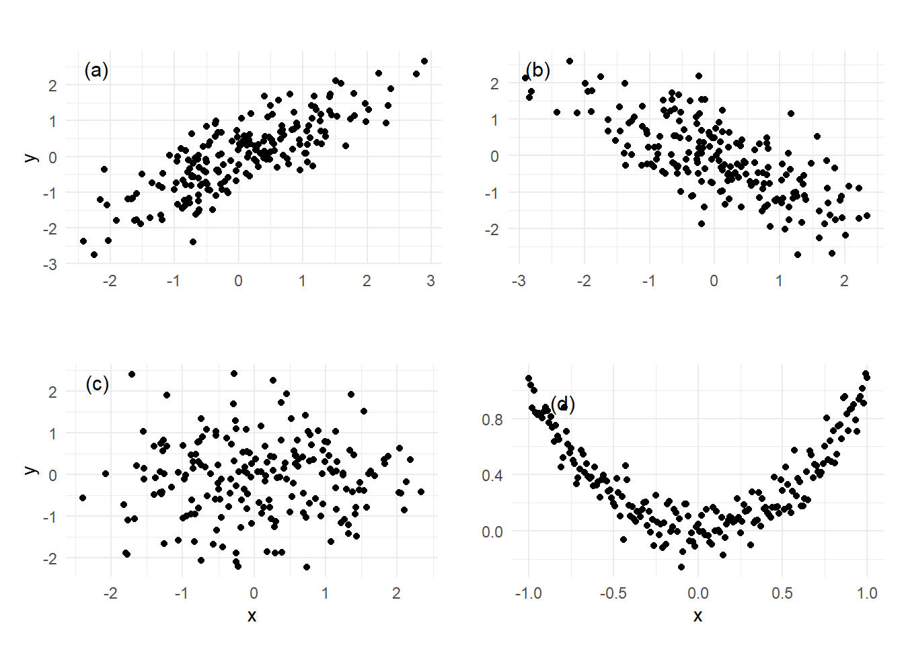

```{r setup, include=FALSE}
knitr::opts_chunk$set(echo = TRUE, comment = NA)

c1="#FF7F00"
c2="#FEB0C6"
c3="#034A94"
c4="#686868"
#-------------------------------------------------------------------------
library(tidyverse)
# install.packages("PerformanceAnalytics")
library(PerformanceAnalytics)


#install.packages("devtools") # Solo una vez
devtools::install_github("dgonxalex80/paqueteMETODOS") # descarga paqueteDEG
library(paqueteMETODOS) # Activa paqueteMET
data("biomasa") # Carga la base biomasa

gen.corr.data<- function(rho,n){
x <- rnorm(n)
z <- rnorm(n)
y<- rho*x + sqrt(1-rho^2)*z
result <-cbind(y,x)
return(result)
}
#-------------------------------------------------------------------------
library(ggplot2)
library(patchwork)
Theme1= theme(axis.text.x = element_blank(),
        axis.text.y = element_blank(),
        axis.ticks = element_blank(),
        axis.title.x = element_text(size = 12),
        axis.title.y = element_text(size = 12))
#------------------------------------------------------------------------
Theme2= theme(
        #axis.text.x = element_blank(),
        #axis.text.y = element_blank(),
        #axis.ticks = element_blank(),
        axis.title.x = element_text(size = 11),
        axis.title.y = element_text(size = 11))

data(biomasa)
biomasa38=biomasa[,3:8]
#------------------------------------------------------------------------
# Fijamos semilla
set.seed(20)
# Generamos datos aleatorios para la variable X
X <- sample(c("Si", "No"), 100, replace = TRUE)
# "No" "Si" "Si" "No"  "No" "Si" "No" "Si" "No" "No"

# Generamos datos aleatorios para la variable Y
Y <- sample(c("Europa", "America", "Africa"), 100, replace = TRUE)
# "Europa" "Africa"  "Africa"  "Europa"  "Africa" 
# "Europa" "Europa"  "Europa"  "America" "America"

tabla <- table(X, Y)


```


<br/><br/>
<h2>Análisis de correlación</h2>

El **análisis de correlación** es una técnica estadística utilizada para cuantificar la relación entre dos variables cuantitativas. Su objetivo principal es medir el grado de asociación entre estas variables sin implicar una relación causal.

En este análisis, se considera una variable respuesta \( Y \), cuya relación con otra variable explicativa \( X \) se investiga a partir de una muestra de \( n \) pares de observaciones, es decir:

\[
(X_1, Y_1), (X_2, Y_2), \dots, (X_n, Y_n)
\]

Este análisis permite responder preguntas como:

- ¿Existe una asociación entre \( X \) y \( Y \)?

- ¿Qué tan fuerte es la relación entre ambas variables?

- ¿Es la relación positiva o negativa?

Dependiendo de la naturaleza de la relación, se pueden utilizar diferentes medidas de correlación, siendo el **coeficiente de correlación de Pearson** una de las más utilizadas cuando la relación es lineal. Sin embargo, en caso de relaciones no lineales o con datos atípicos, existen otras medidas más robustas, como la correlación de **Spearman** o **Kendall**.

El análisis de correlación es un primer paso fundamental antes de la construcción de modelos de regresión, ya que permite evaluar la pertinencia de incluir una variable explicativa en el modelo y detectar posibles patrones en los datos.


</br></br>
<div class="caja-ejemplo">
<h3>Ejemplo:</h3>
<p>

El análisis de correlación permite responder preguntas sobre la relación entre dos variables cuantitativas. Algunos ejemplos comunes incluyen:

- **Relación entre inversión en publicidad y ventas:**  
  ¿Existe una asociación entre el presupuesto destinado a publicidad y el volumen de ventas mensuales de una empresa? ¿Un mayor gasto en publicidad se traduce en un aumento en las ventas?

- **Relación entre tamaño y precio de una vivienda:**  
  ¿El número de metros cuadrados de una casa influye en su valor de venta? ¿A mayor tamaño, mayor precio?

- **Relación entre eficiencia de combustible y peso del vehículo:**  
  ¿Existe un patrón entre los kilómetros por galón consumidos y el peso de un automóvil? ¿Los autos más pesados tienden a consumir más combustible?

- **Relación entre tiempo de estudio y rendimiento académico:**  
  ¿El número de horas que un estudiante dedica a estudiar está relacionado con la calificación obtenida en un examen?

- **Relación entre peso y estatura:**  
  ¿Existe una correlación entre el peso y la altura de los estudiantes? ¿Es una relación proporcional?

- **Relación entre desempleo y criminalidad:**  
  ¿Existe una conexión entre la tasa de desempleo y la tasa de homicidios en una región? ¿Un mayor desempleo está asociado con un aumento en la criminalidad?

- **Relación entre medidas de tránsito y accidentes viales:**  
  ¿La implementación de más medidas preventivas de tránsito contribuye a la reducción de accidentes?  

</p>
</div>

Además de evaluar la existencia de una relación entre las variables, el análisis de correlación también permite determinar:

- **La intensidad de la relación:** ¿Es una asociación fuerte o débil?

- **La dirección de la relación:** ¿Es una correlación positiva (directa) o negativa (inversa)?  

Estos aspectos son fundamentales para interpretar adecuadamente los resultados y tomar decisiones basadas en datos.


<br/><br/>
<h2>Herramientas estadísticas para el análisis de correlación</h2>


El análisis de correlación se apoya en diversas herramientas estadísticas que permiten visualizar y cuantificar la relación entre dos variables. Entre las principales se encuentran:

- **Gráficos de dispersión:** 

  Representación visual que permite observar la relación entre dos variables cuantitativas. A través de este gráfico, es posible identificar patrones de asociación, tendencias lineales o no lineales, y detectar posibles valores atípicos.

- **Coeficiente de correlación:**

  Medida cuantitativa que evalúa la **fuerza** y **dirección** de la relación entre dos variables. Existen diferentes tipos de coeficientes, entre ellos:
  
  - **Coeficiente de correlación de Pearson:** Indica el grado de relación lineal entre dos variables. Su valor oscila entre -1 y 1.
  
  - **Coeficiente de correlación de Spearman:** Se emplea cuando la relación entre las variables no es estrictamente lineal, sino monótona. Es útil en datos con distribuciones no normales o con valores atípicos.
  
  - **Coeficiente de correlación de Kendall:** Similar a Spearman, mide la concordancia entre dos variables y es más robusto en muestras pequeñas o con empates en los datos.

El uso combinado de estas herramientas permite obtener un análisis más completo sobre la existencia y naturaleza de la asociación entre las variables estudiadas.


<br/><br/>
<h3>Gráfico de dispersión</h3>

Un **gráfico de dispersión** es una representación visual de los pares de valores \((X, Y)\) observados para dos variables cuantitativas. La distribución de los puntos en el gráfico proporciona información sobre la posible asociación entre las variables. 


```{r, eval=FALSE,  fig.align = "center",include=FALSE}
library(ggplot2)
library(patchwork)
library(MASS)  # Para generar datos correlacionados

# Función para generar datos con correlación dada
gen_corr_data <- function(rho, n) {
  mu <- c(0, 0)  # Media en (0,0)
  sigma <- matrix(c(1, rho, rho, 1), 2, 2)  # Matriz de covarianza
  datos <- mvrnorm(n, mu, sigma)
  return(data.frame(x = datos[, 1], y = datos[, 2]))
}

# Función para generar gráficos de dispersión con anotaciones
crear_grafico <- function(datos, etiqueta, eje_x = " ", eje_y = " ") {
  ggplot(datos, aes(x, y)) +
    geom_point() +
    theme_minimal() +
    labs(title = "", x = eje_x, y = eje_y) +
    annotate("text", x = min(datos$x) + 0.2, y = max(datos$y) - 0.2, size = 4, label = etiqueta)
}

# Generación de muestras con diferentes correlaciones
muestra1 <- gen_corr_data(0.8, 200)
muestra2 <- gen_corr_data(-0.7, 200)
muestra3 <- gen_corr_data(0, 200)

# Datos para relación cuadrática
x_vals <- seq(-1, 1, 0.01)
y_vals <- x_vals^2 + rnorm(length(x_vals), 0, 0.1)
muestra4 <- data.frame(x = x_vals, y = y_vals)

# Creación de gráficos
p1 <- crear_grafico(muestra1, "(a)", eje_y = "y")
p2 <- crear_grafico(muestra2, "(b)")
p3 <- crear_grafico(muestra3, "(c)", eje_x = "x", eje_y = "y")
p4 <- crear_grafico(muestra4, "(d)", eje_x = "x")

# Organización de los gráficos
(p1 + p2) / (p3 + p4)
```


<br/><br/>
<center>
```{r, echo=FALSE, out.width="80%", fig.align = "center"}

```
**Figura 3.1** Gráficos de dispersión.
</center>
<br/><br/>


La **Figura 3.1** ilustra que los gráficos (a) y (b)  muestran ejemplos de correlación lineal positiva y negativa.  El gráfio (c) muestra asociación nula entre las variables. El gráfico (d) muestra otro tipo de asociación diferente a la lineal, esta es parabólica.

**Gráfico (a): Correlación positiva fuerte**

- Los puntos siguen una tendencia lineal ascendente clara, indicando que a medida que \( x \) aumenta, \( y \) también lo hace linealmente.

- Representa una correlación positiva fuerte.

**Gráfico (b): Correlación negativa fuerte**

- Los puntos muestran una tendencia descendente lineal clara, lo que indica que cuando \( x \) aumenta, \( y \) disminuye linealmente.

- Representa una correlación negativa moderada.

**Gráfico (c): Sin correlación**

- Los puntos están dispersos sin un patrón claro, indicando que no hay relación lineal entre \( x \) y \( y \).

- Representa un caso con correlación cercana a 0.

**Gráfico (d): Relación no lineal**

- Los datos siguen una tendencia en forma de parábola, lo que indica que hay una relación cuadrática entre \( x \) y \( y \).

- La correlación lineal sería cercana a 0, pero hay una relación no lineal clara.


</br></br>
<div class="caja-ejemplo">
<h3>Ejemplo:</h3>
<p>

En un entorno industrial, comprender la relación entre el **tiempo de trabajo** y la **producción** es fundamental para optimizar la eficiencia operativa y facilitar la toma de decisiones estratégicas. En este análisis, se examina la posible relación lineal entre dos variables clave:

- **\( X \)**: Cantidad de horas trabajadas en la empresa.  

- **\( Y \)**: Cantidad de unidades producidas en la empresa.  

Para explorar esta relación, se construirá un **gráfico de dispersión**, el cual permite identificar posibles patrones de asociación entre las variables. 

Los datos utilizados en este estudio están disponibles en el siguiente enlace:

[Datos de producción y tiempo de trabajo](https://raw.githubusercontent.com/smramirezb/datos_ejemplos/refs/heads/main/dat_product.txt)


A continuación, se presenta el código en **R** para generar dicho gráfico:


<pre>
# Cargar la librería necesaria para la visualización de datos
library(ggplot2)

# Crear un data frame con las observaciones de la muestra
# 1. Lectura de datos
file <- "https://raw.githubusercontent.com/smramirezb/datos_ejemplos/refs/heads/main/dat_product.txt"
datos <- read.table(file = file, header = TRUE)

data_produccion <- datos

# Crear el gráfico de dispersión
grafico_dispersion <- ggplot(data_produccion, aes(x = x, y = y)) + 
  geom_point(size = 3, colour = "blue") +  # Puntos en color azul y tamaño ajustado
  theme_minimal() +  # Estilo limpio y minimalista
  labs(
    title = "Relación entre Horas Trabajadas y Producción", 
    x = "Cantidad de horas trabajadas", 
    y = "Cantidad de unidades producidas"
  ) +
  theme(
    plot.title = element_text(hjust = 0.5, face = "bold", size = 14), # Centrar y resaltar título
    axis.title = element_text(size = 12)  # Ajustar tamaño de etiquetas de ejes
  )

# Mostrar el gráfico
print(grafico_dispersion)
</pre>


```{r, eval=FALSE, fig.align='center'}
# Cargar la librería necesaria para la visualización de datos
library(ggplot2)

# Crear un data frame con las observaciones de la muestra
# 1. Lectura de datos
file <- "https://raw.githubusercontent.com/smramirezb/datos_ejemplos/refs/heads/main/dat_product.txt"
datos <- read.table(file = file, header = TRUE)

data_produccion <- datos

# Crear el gráfico de dispersión
grafico_dispersion <- ggplot(data_produccion, aes(x = x, y = y)) + 
  geom_point(size = 3, colour = "blue") +  # Puntos en color azul y tamaño ajustado
  theme_minimal() +  # Estilo limpio y minimalista
  labs(
    title = "Relación entre Horas Trabajadas y Producción", 
    x = "Cantidad de horas trabajadas", 
    y = "Cantidad de unidades producidas"
  ) +
  theme(
    plot.title = element_text(hjust = 0.5, face = "bold", size = 14), # Centrar y resaltar título
    axis.title = element_text(size = 12)  # Ajustar tamaño de etiquetas de ejes
  )

# Mostrar el gráfico
print(grafico_dispersion)

```

<br/><br/>
<center>
```{r, echo=FALSE, out.width="80%", fig.align = "center"}
knitr::include_graphics("img/fig32.png")
```
**Figura 3.2** Relación entre  la cantidad de horas trabajadas y la cantidad de unidades producidas en una empresa.
</center>
<br/><br/>

La **Figura 3.2** muestra una **relación lineal positiva** entre el **número de horas trabajadas** y la **cantidad de unidades producidas**. Esto sugiere que, en general, un mayor tiempo de trabajo está asociado con una mayor producción.

Sin embargo, para evaluar con precisión el grado de asociación entre estas variables, es necesario calcular una medida estadística que **cuantifique la relación**. Algunas de las herramientas más utilizadas para este propósito es el **coeficiente de correlación de Pearson, Spearman y Kendall**.

</p>
</div>


</br></br>
<h3>Matriz de covarianza</h3>

La matriz de covarianza \(\Sigma\) se define como:

\[
\Sigma =
\begin{bmatrix}
  \sigma_{1}^2 & \sigma_{12} & \sigma_{13} & \ldots & \sigma_{1n} \\
  \sigma_{21} & \sigma_{2}^2 & \sigma_{23} & \ldots & \sigma_{2n} \\
  \sigma_{31} & \sigma_{32} & \sigma_{3}^2 & \ldots & \sigma_{3n} \\
  \vdots & \vdots & \vdots & \ddots & \vdots \\
  \sigma_{n1} & \sigma_{n2} & \sigma_{n3} & \ldots & \sigma_{n}^2 \\
\end{bmatrix}
\]

Esta matriz es **simétrica**, lo que significa que \(\sigma_{ij} = \sigma_{ji}\), y contiene en su **diagonal principal** las **varianzas** de cada variable, mientras que los elementos fuera de la diagonal corresponden a las **covarianzas** entre pares de variables.

**Definiciones y propiedades:**

- \(\sigma_{i}^2\) representa la **varianza** de la variable \( X_i \), ubicada en la diagonal principal.

- \(\sigma_{ij}\) representa la **covarianza** entre las variables \( X_i \) y \( X_j \), ubicada fuera de la diagonal.

- La relación \(\sigma_{i,i} = \sigma^2_{i}\) indica que la **covarianza de una variable consigo misma** es su propia varianza.

- La propiedad \(\sigma_{i,j} = \sigma_{j,i}\) para todo \( i \neq j \) confirma que la **matriz es simétrica**, reflejando la igualdad de la covarianza en ambas direcciones.


</br></br>
<h3>Matriz de correlación</h3>

A partir de la matriz de covarianza, se puede calcular la **matriz de correlación** \(\mathbf{P}\), normalizando cada elemento por la desviación estándar de las variables involucradas:

\[
\mathbf{P} =
\begin{bmatrix}
  1 & \rho_{12} & \rho_{13} & \ldots & \rho_{1n} \\
  \rho_{21} & 1 & \rho_{23} & \ldots & \rho_{2n} \\
  \rho_{31} & \rho_{32} & 1 & \ldots & \rho_{3n} \\
  \vdots & \vdots & \vdots & \ddots & \vdots \\
  \rho_{n1} & \rho_{n2} & \rho_{n3} & \ldots & 1 \\
\end{bmatrix}
\]

Donde:

- \(\rho_{ij}\) representa el **coeficiente de correlación de Pearson** entre las variables \( X_i \) y \( X_j \), calculado como:

  \[
  \rho_{ij} = \frac{\sigma_{ij}}{\sigma_{i} \sigma_{j}}
  \]


- La diagonal principal contiene **unos (1)**, ya que cada variable está perfectamente correlacionada consigo misma, asi para cualquier \( X_i \), el coeficiente de correlación está dado por  \( \rho_{i,i} = 1 \).

- Los elementos fuera de la diagonal muestran la **correlación entre pares de variables**, con valores entre \(-1\) y \(1\), donde:

  - \(\rho_{ij} > 0\) indica una **correlación positiva**.
  
  - \(\rho_{ij} < 0\) indica una **correlación negativa**.
  
  - \(\rho_{ij} = 0\) indica **ausencia de correlación lineal**.


</br>
**Relación entre ambas matrices:**

- La **matriz de covarianza** mide la **variabilidad conjunta absoluta** entre variables. No tiene un rango de valores fijo, ya que depende de las escalas de las variables. No mide correlación lineal directamente, sino que indica cómo varían juntas dos variables en términos de unidades de medida.

- La **matriz de correlación** es una versión **normalizada** de la matriz de covarianza, permitiendo comparar la fuerza de la relación entre variables en una escala estándar de \(-1\) a \(1\). Mide la fuerza y dirección de la relación lineal entre dos variables, proporcionando una interpretación estandarizada de la relación entre variables.


</br></br>
<div class="caja-ejemplo">
<h3>Ejemplo:</h3>
<p>

En la Unidad 2 se analizó el contexto de una **fábrica de mecanizado de precisión** que produce **ejes metálicos** utilizados en **motores eléctricos de maquinaria industrial**. En este proceso de fabricación, dos variables clave determinan la calidad del eje:  

- **\( X \) : Diámetro del eje (en milímetros, mm)**  

- **\( Y \) : Rugosidad superficial del eje (en micrómetros, \(\mu m\))**  

El **diámetro y la rugosidad**, se pueden modelar mediante una **distribución normal bivariada**, expresada como:

\[
(X, Y) \sim N_2 \left( 
\boldsymbol{\mu},  
\Sigma
\right)
\]

donde:

- \( \boldsymbol{\mu} \) representa el **vector de medias** del proceso.  

- \( \Sigma \) es la **matriz de covarianza**, que describe la dispersión conjunta de ambas variables.  

Los valores de los **parámetros** de la **normal bivariada** están dados a continuación:


<br/>
**Medias**  

\[
\boldsymbol{\mu}=\begin{bmatrix} 
\mu_X \\ \mu_Y 
\end{bmatrix} =
\begin{bmatrix} 
50.00 \\ 1.0
\end{bmatrix}
\]

- **\( \mu_X = 50.00 \) mm** → **Media del diámetro  del eje**. 

- **\( \mu_Y = 1.0 \) \(\mu m\)** → **Media de la rugosidad superficial**.  


<br/>
**Matriz de covarianza**  

En la normal bivariada se cumple que $\text{Cov}(X, Y)=\sigma_{XY} = \rho \sigma_X \sigma_Y$, por tanto:

$$
\begin{align}
\Sigma &= 
\begin{bmatrix} 
\sigma_X^2 & \text{Cov}(X, Y) \\ 
\text{Cov}(X, Y) & \sigma_Y^2 
\end{bmatrix}  \\
&= 
\begin{bmatrix} 
\sigma_X^2 & \rho \sigma_X \sigma_Y \\ 
\rho \sigma_X \sigma_Y & \sigma_Y^2 
\end{bmatrix}  \\
&=
\begin{bmatrix} 
0.015^2 & -0.6 \times (0.015) \times (0.2) \\ 
-0.6 \times (0.015) \times (0.2) & 0.2^2 
\end{bmatrix}  \\
&=
\begin{bmatrix} 
0.000225 & -0.0018 \\ 
-0.0018 & 0.04
\end{bmatrix}  
\end{align}
$$

Donde:

- **$\sigma_X = 0.015$ mm** → **Desviación estándar del diámetro**.
- **$\sigma_Y = 0.2$ $\mu m$** → **Desviación estándar de la rugosidad**.
- **$\rho = -0.6$** → **Correlación de Pearson entre diámetro y rugosidad**.


Esta matriz describe la **dispersión conjunta de ambas variables**, donde la **covarianza negativa indica que un mayor diámetro tiende a estar asociado con una menor rugosidad**. 


</br>
**Relación entre covarianza y correlación**

Una forma alternativa de medir la relación entre \( X \) e \( Y \) es la **correlación de Pearson** \( \rho \), que se define como:

$$
\rho = \frac{\text{Cov}(X, Y)}{\sigma_X \sigma_Y}
$$

Esta es una medida **normalizada** de la covarianza que se encuentra en el intervalo \( [-1,1] \) y permite comparar relaciones sin depender de las unidades de las variables.

Despejando la covarianza de esta ecuación:

$$
\text{Cov}(X, Y) = \rho \sigma_X \sigma_Y
$$

Esto significa que la covarianza está determinada por la fuerza de la relación lineal (\(\rho\)) y las dispersiones individuales de cada variable (\(\sigma_X\) y \(\sigma_Y\)).

En una distribución normal bivariada:

$$
(X, Y) \sim N_2 \left( 
\boldsymbol{\mu},  
\Sigma
\right)
$$

donde:

$$
\boldsymbol{\mu} =
\begin{bmatrix} 
\mu_X \\ \mu_Y
\end{bmatrix},
\quad
\Sigma =
\begin{bmatrix} 
\sigma_X^2 & \sigma_{XY} \\ 
\sigma_{XY} & \sigma_Y^2
\end{bmatrix}
$$

Por construcción, en la normal bivariada, se expresa en términos de la correlación:

$$
\text{Cov}(X, Y) =\sigma_{XY} = \rho \sigma_X \sigma_Y
$$
Esta definición tiene varias consecuencias importantes:

1. **Si \( X \) e \( Y \) son independientes, entonces \( \rho = 0 \) y \( \text{Cov}(X, Y) = 0 \)**. La independencia implica ausencia de correlación.

2. **Si \( \rho = 1 \) o \( \rho = -1 \), entonces \( X \) e \( Y \) están perfectamente correlacionados**, es decir, \( Y \) es una combinación lineal exacta de \( X \).

3. **La covarianza tiene las mismas unidades que el producto de \( X \) e \( Y \)**, mientras que la correlación es adimensional.


</p>
</div>


</br>
**Relación entre la matriz teórica y las matrices calculadas en la práctica con `cor()` en R**:

En la práctica, estas matrices se pueden obtener con la función `cor()` en **R**, dependiendo del método seleccionado: 

 - `cor(mis_datos, method = "pearson")`:  La matriz de correlación de **Pearson** obtenida con `method = "pearson"`  es la equivalente a la matriz teórica de correlación \(\mathbf{P}\).
 
 - `cor(mis_datos, method = "spearman")`
 
 - `cor(mis_datos, method = "kendall")`


Las matrices obtenidas con **Spearman** y **Kendall** no se derivan de la matriz de covarianza, sino que usan transformaciones distintas (rangos en Spearman y pares ordenados en Kendall).

