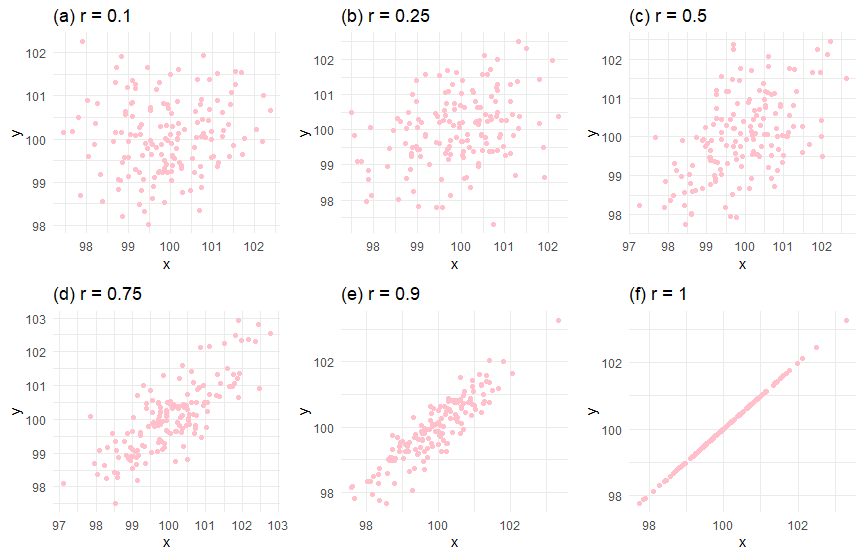
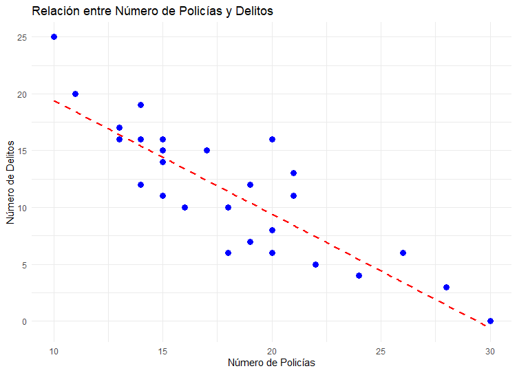
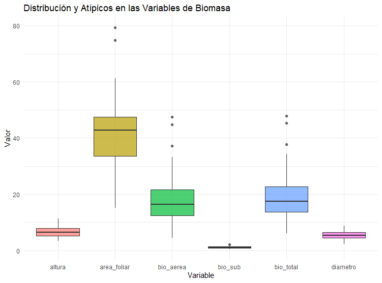

```{r setup, include=FALSE}
knitr::opts_chunk$set(echo = TRUE, comment = NA)

c1="#FF7F00"
c2="#FEB0C6"
c3="#034A94"
c4="#686868"
#-------------------------------------------------------------------------
library(tidyverse)
# install.packages("PerformanceAnalytics")
library(PerformanceAnalytics)


#install.packages("devtools") # Solo una vez
# devtools::install_github("dgonxalex80/paqueteMET") # descarga paqueteDEG
library(paqueteMETODOS) # Activa paqueteMET
data("biomasa") # Carga la base biomasa

gen.corr.data<- function(rho,n){
x <- rnorm(n)
z <- rnorm(n)
y<- rho*x + sqrt(1-rho^2)*z
result <-cbind(y,x)
return(result)
}
#-------------------------------------------------------------------------
library(ggplot2)
library(patchwork)
Theme1= theme(axis.text.x = element_blank(),
        axis.text.y = element_blank(),
        axis.ticks = element_blank(),
        axis.title.x = element_text(size = 12),
        axis.title.y = element_text(size = 12))
#------------------------------------------------------------------------
Theme2= theme(
        #axis.text.x = element_blank(),
        #axis.text.y = element_blank(),
        #axis.ticks = element_blank(),
        axis.title.x = element_text(size = 11),
        axis.title.y = element_text(size = 11))

data(biomasa)
biomasa38=biomasa[,3:8]
#------------------------------------------------------------------------
# Fijamos semilla
set.seed(20)
# Generamos datos aleatorios para la variable X
X <- sample(c("Si", "No"), 100, replace = TRUE)
# "No" "Si" "Si" "No"  "No" "Si" "No" "Si" "No" "No"

# Generamos datos aleatorios para la variable Y
Y <- sample(c("Europa", "America", "Africa"), 100, replace = TRUE)
# "Europa" "Africa"  "Africa"  "Europa"  "Africa" 
# "Europa" "Europa"  "Europa"  "America" "America"

tabla <- table(X, Y)


```


</br></br>
<h2>Coeficiente de correlación de Pearson</h2>

El **coeficiente de correlación de Pearson** (\( r = \hat{\rho} \)) es una medida estadística que cuantifica el grado y la dirección de la relación lineal entre dos variables cuantitativas \( X \) y \( Y \). Su valor oscila entre \(-1\) y \(1\), y se interpreta de la siguiente manera:


- **\( r \approx 1 \):** Indica una **asociación positiva fuerte**, es decir, a medida que \( X \) aumenta, \( Y \) también tiende a aumentar linealmente.

- **\( r \approx -1 \):** Indica una **asociación negativa fuerte**, lo que significa que a medida que \( X \) aumenta, \( Y \) tiende a disminuir linealmente.

- **\( r \approx 0 \):** Sugiere que no hay una asociación lineal entre las variables.


```{r, echo=FALSE, out.width="100%", fig.align = "center"}
knitr::include_graphics("img/correlacion2.png")
```

</br></br>
<h3>Fórmula de cálculo</h3>

El **coeficiente de correlación de Pearson muestral** para las variables $X$ y $Y$, dadas las $n$ observaciones $(x_1, y_1), (x_2, y_2), \dots, (x_n, y_n)$, se denota con la letra $r$ y se calcula mediante la siguiente expresión:


\[
r = \dfrac{n \Bigg(\displaystyle\sum_{i=1}^{n} x_{i}y_{i} \Bigg) - \Bigg(\displaystyle\sum_{i=1}^{n} x_{i} \Bigg) \Bigg(\displaystyle\sum_{i=1}^{n} y_{i}\Bigg)}
{\sqrt{n \Bigg(\displaystyle\sum_{i=1}^{n} x_{i}^{2} \Bigg) - \Bigg(\displaystyle\sum_{i=1}^{n} x_{i} \Bigg)^{2}}
\quad \cdot \quad
\sqrt{n \Bigg(\displaystyle\sum_{i=1}^{n} y_{i}^{2} \Bigg) - \Bigg(\displaystyle\sum_{i=1}^{n} y_{i} \Bigg)^{2}}}
\]

Alternativamente, se puede expresar en términos de la **covarianza** y las **desviaciones estándar** de las variables:

\[
r = \dfrac{cov(X, Y)}{s_X s_Y}
\]

donde:

- \( cov(X, Y) \) representa la **covarianza muestral** entre \( X \) y \( Y \).

- \( s_X \) y \( s_Y \) son las **desviaciones estándar muestrales** de \( X \) y \( Y \), respectivamente.

- \( n \) es el número total de observaciones.


</br></br>
<h3>Consideraciones y supuestos</h3>

Este coeficiente fue desarrollado por **Karl Pearson**, y para su correcta aplicación se deben cumplir los siguientes supuestos:

- **Las variables \( X \) y \( Y \) deben ser cuantitativas**, medidas en una escala de intervalo o de razón.

- **Se asume normalidad en las variables**, especialmente para realizar inferencias estadísticas.

- La correlación de Pearson no captura relaciones no lineales.

El coeficiente de correlación de Pearson es ampliamente utilizado en análisis exploratorios y en la validación de modelos estadísticos, proporcionando una primera aproximación sobre la relación entre dos variables antes de aplicar modelos de regresión lineal.


</br></br>
<h3>Interpretación</h3>


La **Tabla 3.1** presenta una clasificación comúnmente utilizada para el coeficiente de correlación de Pearson:

</br></br>
<center>
**Tabla 3.1** Clasificación de la relación lineal entre variables según el coeficiente de correlación.
</center>
<br/>

| **Rango de $r$**              | **Grado de asociación lineal**         |
|-------------------------------------|-------------------------------|
| $-1.00 \leq r < -0.90$         | Negativa muy fuerte          |
| $-0.90 \leq r < -0.75$         | Negativa considerable        |
| $-0.75 \leq r < -0.50$         | Negativa media              |
| $-0.50 \leq r < -0.25$         | Negativa débil              |
| $-0.25 \leq r < -0.10$         | Negativa muy débil          |
| $-0.10 \leq r < 0.10$         | No existe correlación       |
| $0.10  \leq r < 0.25$           | Positiva muy débil          |
| $0.25  \leq r < 0.50$           | Positiva débil              |
| $0.50  \leq r < 0.75$           | Positiva media              |
| $0.75  \leq r < 0.90$           | Positiva considerable       |
| $0.90  \leq r \leq 1.00$        | Positiva muy fuerte         |


Las **Figura 3.3** y **3.4** muestra seis gráficos de dispersión, cada uno representando diferentes niveles de correlación entre dos variables \( X \) y \( Y \).

La **Figura 3.3** presenta:

- **Correlación \( r = -1 \) (a):** Existe una **relación negativa perfecta** entre \( X \) y \( Y \). Todos los puntos se alinean exactamente sobre una línea recta descendente.   Esto indica que un aumento en \( X \) siempre se asocia con una disminución proporcional en \( Y \).  

- **Correlación \( r = -0.9 \) (b):**  Se observa una **fuerte relación negativa**, aunque no es perfecta.  A medida que \( X \) aumenta, \( Y \) tiende a disminuir de manera consistente, pero con cierta dispersión en los datos. 

- **Correlación \( r = -0.75 \) (c):**  Existe una **relación negativa moderada**, con mayor dispersión en comparación con \( r = -0.9 \).  Aunque la tendencia descendente es clara, la variabilidad en los datos es mayor.   

- **Correlación \( r = -0.5 \) (d):**   Relación **negativa débil** entre las variables.  La tendencia descendente aún es visible, pero los puntos están más dispersos, lo que sugiere una menor asociación lineal.  

- **Correlación \( r = -0.25 \) (e):**  Relación **muy débil o casi inexistente**.  Aunque hay una ligera tendencia negativa, la dispersión es alta y no se puede concluir una relación lineal clara.  

- **Correlación \( r = 0 \) (f):**  **No existe relación lineal** entre las variables.   Los puntos están dispersos de manera aleatoria, sin un patrón discernible.  


```{r,eval=FALSE,warning=FALSE,message=FALSE,include=FALSE}
# Configurar el entorno para el uso del idioma español
Sys.setlocale("LC_ALL", "es_ES.UTF-8")

# Cargar paquetes necesarios
library(ggplot2)
library(gridExtra)

# Generar datos con distintas correlaciones
set.seed(123)
n <- 200

gen_cor_data <- function(r) {
  x <- rnorm(n, mean = 100, sd = 2)
  y <- r * x + sqrt(1 - r^2) * rnorm(n, mean = 100, sd = 2)
  data.frame(x, y)
}

cor_values <- c(-1.0, -0.9, -0.75, -0.5, -0.25, 0.0)
labels <- c("(a)", "(b)", "(c)", "(d)", "(e)", "(f)")

# Crear gráficos individuales con puntos azules
graficos <- lapply(1:length(cor_values), function(i) {
  ggplot(gen_cor_data(cor_values[i]), aes(x = x, y = y)) +
    geom_point(color = "blue") +  # Puntos en azul
    labs(title = paste(labels[i], " Correlación ", cor_values[i])) +
    theme_minimal() +
    theme(plot.title = element_text(hjust = 0.5))
})

# Mostrar gráficos en una cuadrícula de 3x2
grid.arrange(grobs = graficos, ncol = 3)

```

```{r, echo=FALSE, out.width="100%", fig.align = "center"}
knitr::include_graphics("img/Rho1.png")
```
<center>
**Figura 3.3**  Correlaciones lineales negativas y nula (a) $r = -1.0$. $\hspace{.5cm}$ (b) $r = -0.90$. <br/> (c) $r = -0.75$.  $\hspace{.5cm}$(d) $r = -0.50$. $\hspace{.5cm}$ (e) $r = -0.25$. $\hspace{.5cm}$ (f) $r= 0.0$.
</center>
</br>


La **Figura 3.4** presenta:

- **Correlación \( r = 0.1 \) (a):**  La relación entre \( X \) y \( Y \) es prácticamente nula.  Los puntos están distribuidos de manera aleatoria, sin una tendencia clara.  No se puede concluir que exista una asociación lineal significativa.  

- **Correlación \( r = 0.25 \) (b):**  Se observa una ligera tendencia ascendente, pero la dispersión de los puntos sigue siendo alta.  

- **Correlación \( r = 0.5 \) (c):**  Existe una **relación positiva moderada**. Aunque los puntos están dispersos, se empieza a notar una tendencia creciente en la relación entre \( X \) y \( Y \).  

- **Correlación \( r = 0.75 \) (d):**  La relación entre \( X \) y \( Y \) es **positiva fuerte**. Los puntos siguen una tendencia ascendente más clara, aunque aún hay cierta variabilidad.   

- **Correlación \( r = 0.9 \) (e):**  La relación es **muy fuerte y positiva**.  Los puntos están mucho más alineados en una dirección creciente, indicando una fuerte asociación lineal.  

- **Correlación \( r = 1 \) (f):**  Existe una **relación lineal perfecta positiva**. Todos los puntos se alinean exactamente sobre una línea recta ascendente.  Esto indica que un aumento en \( X \) se asocia **siempre** con un aumento proporcional en \( Y \).  


```{r,eval=FALSE,warning=FALSE,message=FALSE,include=FALSE}
# Configurar el entorno para el uso del idioma español
Sys.setlocale("LC_ALL", "es_ES.UTF-8")

library(ggplot2)
library(gridExtra)
library(MASS) # Para mvrnorm

set.seed(123)

# Función para generar datos con una correlación dada
generate_data <- function(n, rho) {
  mu <- c(100, 100)
  Sigma <- matrix(c(1, rho, rho, 1), 2, 2)
  data <- MASS::mvrnorm(n, mu, Sigma)
  data.frame(x = data[,1], y = data[,2])
}

# Valores de correlación y etiquetas
correlations <- c(0.10, 0.25, 0.50, 0.75, 0.90, 1.0)
labels <- c("(a)", "(b)", "(c)", "(d)", "(e)", "(f)")
plots <- list()

# Generar gráficos
for (i in 1:length(correlations)) {
  data <- generate_data(150, correlations[i])
  p <- ggplot(data, aes(x = x, y = y)) +
    geom_point(color = "pink") +
    ggtitle(paste(labels[i], "Correlación ", correlations[i])) +
    theme_minimal()
  plots[[i]] <- p
}

# Mostrar los gráficos en una cuadrícula
grid.arrange(grobs = plots, ncol = 3)


```


```{r, echo=FALSE, out.width="100%", fig.align = "center"}

```
<center>
**Figura 3.4**  Correlaciones positivas  (a) $r= 0.10$.$\hspace{.5cm}$ (b) $r = 0.25$.  <br/> (c) $r = 0.50$.$\hspace{.5cm}$  (d) $r = 0.75$. $\hspace{.5cm}$ (e) $r= 0.90$. $\hspace{.5cm}$ (f) $r = 1.0$.
</center>
</br></br>


Estos gráficos ilustran cómo varía la fuerza de la relación lineal entre dos variables en función del coeficiente de correlación de Pearson:  

- Valores **cercanos a 0** indican **ausencia de relación lineal**.  

- Valores **cercanos a 1 o -1** representan **asociaciones lineales cada vez más fuertes**. 

- Un coeficiente de **1 o -1** indica una relación **perfectamente lineal**.  


</br></br>
<div class="caja-ejemplo">
<h3>Ejemplo:</h3>
<p>

En este análisis, se busca evaluar si existe una relación entre el **número de policías asignados a cada pueblo** y el **número de delitos registrados**. Para ello, se cuenta con una muestra aleatoria en la que se han registrado ambas variables:

- **\( X \)**: Número de policías asignados a un pueblo.
- **\( Y \)**: Número de delitos registrados en un mes.

El objetivo es determinar si existe una asociación lineal entre el número de policías en un pueblo y la cantidad de delitos reportados mensualmente.

Los datos observados se encuentran disponibles en el siguiente enlace:

[Datos de delitos y policías por pueblo](https://raw.githubusercontent.com/Centromagis/metodosySIM3_V2/refs/heads/main/datos_MetySim/dat_pueblos.txt)


---

El gráfico de dispersión para revisar linealidad y la variabilidad de $Y$ respecto a $X$ asi como para calcular el coeficiente de correlación de Pearson se calcula en **R** de la siguiente manera:

<pre>
# Configurar la codificación de caracteres a UTF-8 (Opcional, depende del sistema operativo)
# Sys.setlocale("LC_ALL", "es_ES.UTF-8")  # Asegura el uso de UTF-8 en español en sistemas compatibles

# Cargar librerías necesarias
library(ggplot2)

# Definición de los datos de la muestra
# x: Número de policías en diferentes pueblos
# y: Número de delitos registrados en esos pueblos

# Lectura de datos
file <- "https://raw.githubusercontent.com/Centromagis/metodosySIM3_V2/refs/heads/main/datos_MetySim/dat_pueblos.txt"
datos <- read.table(file = file, header = TRUE)


# Cálculo del coeficiente de correlación de Pearson
correlacion <- cor(datos$Policias, datos$Delitos, method = "pearson")

# Mostrar el coeficiente de correlación con un mensaje descriptivo
print(paste("Coeficiente de correlación de Pearson:", round(correlacion, 4)))

# Generación del gráfico de dispersión con línea de tendencia
ggplot(datos, aes(x = Policias, y = Delitos)) +
  geom_point(size = 3, color = "blue") +  # Puntos de los datos en color azul
  geom_smooth(method = "lm", se = FALSE, color = "red", linetype = "dashed") +  # Línea de regresión lineal en rojo punteado
  labs(title = "Relación entre Número de Policías y Delitos",
       x = "Número de Policías",
       y = "Número de Delitos") +
  theme_minimal()  # Aplicar un diseño limpio al gráfico
</pre>


```{r,eval=FALSE}
# Configurar la codificación de caracteres a UTF-8 (Opcional, depende del sistema operativo)
# Sys.setlocale("LC_ALL", "es_ES.UTF-8")  # Asegura el uso de UTF-8 en español en sistemas compatibles

# Cargar librerías necesarias
library(ggplot2)

# Definición de los datos de la muestra
# x: Número de policías en diferentes pueblos
# y: Número de delitos registrados en esos pueblos

# Lectura de datos
file <- "https://raw.githubusercontent.com/Centromagis/metodosySIM3_V2/refs/heads/main/datos_MetySim/dat_pueblos.txt"
datos <- read.table(file = file, header = TRUE)


# Cálculo del coeficiente de correlación de Pearson
correlacion <- cor(datos$Policias, datos$Delitos, method = "pearson")

# Mostrar el coeficiente de correlación con un mensaje descriptivo
print(paste("Coeficiente de correlación de Pearson:", round(correlacion, 4)))

# Generación del gráfico de dispersión con línea de tendencia
ggplot(datos, aes(x = Policias, y = Delitos)) +
  geom_point(size = 3, color = "blue") +  # Puntos de los datos en color azul
  geom_smooth(method = "lm", se = FALSE, color = "red", linetype = "dashed") +  # Línea de regresión lineal en rojo punteado
  labs(title = "Relación entre Número de Policías y Delitos",
       x = "Número de Policías",
       y = "Número de Delitos") +
  theme_minimal()  # Aplicar un diseño limpio al gráfico
```

La **Figura 3.5** muestra una **asociación lineal negativa** entre ambas variables a través de un **gráfico de dispersión**.  Se observa que, a medida que aumenta el número de policías, el número de delitos tiende a disminuir de manera lineal. Además, la varianza de los valores de \( Y \) parece mantenerse aproximadamente constante a lo largo de los valores de \( X \), lo que sugiere **homocedasticidad** en la relación entre ambas variables.


<br/><br/>
<center>
```{r, echo=FALSE, out.width="80%", fig.align = "center"}

```
**Figura 3.5** **Número de policías** versus el **número de delitos**.
</center>
<br/><br/>


El coeficiente de **correlación de Pearson** obtenido es **\(-0.8469\)**, lo que indica una **relación lineal negativa fuerte** entre el número de policías y el número de delitos registrados en los pueblos. Esto sugiere que, a medida que aumenta el número de policías, el número de delitos tiende a **disminuir de manera lineal**.


</p>
</div>


</br></br>
<h3>Pruebas de hipótesis</h3>

En el análisis de correlación de Pearson, es fundamental determinar si la **correlación en la población** (\(\rho\)) es **significativamente diferente de cero** o si la asociación observada en la muestra es producto del azar. Para ello, se realiza una prueba de hipótesis utilizando el **estadístico t de Student**, con \( v = n - 2 \) grados de libertad.

La prueba de hipótesis se plantea de la siguiente manera:

- Hipótesis nula  \(\left(H_0\right)\): \(\rho = 0 \)  
  *(Las variables no están linealmente asociadas)*.  

- Hipótesis alternativa \(\left(H_1\right)\): \( \rho \neq 0 \)  
  *(Las variables están linealmente asociadas)*.  

El estadístico de prueba utilizado sigue una distribución t-Student con \( v = n-2 \) grados de libertad y se calcula con la siguiente fórmula:

\[
U = \dfrac{r \sqrt{n-2}}{\sqrt{1 - r^{2}}} \sim t_{v=n-2}
\]

donde:

- \( r \) es el **coeficiente de correlación muestral**.

- \( n \) es el número de observaciones en la muestra.

- \( v = n - 2 \) es el número de grados de libertad de la distribución t-Student.

Para que la prueba de correlación de **Pearson** proporcione resultados válidos, es necesario que se cumplan los siguientes **supuestos estadísticos**:

1. **Linealidad de la relación entre las variables**: Si la relación entre las variables es no lineal, el coeficiente de correlación puede subestimar o no reflejar la verdadera asociación.  Es recomendable inspeccionar un **gráfico de dispersión** antes de aplicar la prueba para verificar la presencia de una tendencia lineal.

2. **Normalidad de las variables**: Se asume que ambas variables, \( X \) y \( Y \), siguen una **distribución normal** en la población. 

3. **Homocedasticidad (Varianza constante de \( Y \) en función de \( X \))**: La dispersión de los valores de \( Y \) debe ser aproximadamente constante para todos los valores de \( X \). Se recomienda inspeccionar un **gráfico de dispersión** para evaluar si la dispersión de \( Y \) cambia a lo largo de los valores de \( X \).

4. **Independencia de las observaciones**: Cada par de observaciones \((X_i, Y_i)\) debe ser **independiente** de las demás.  Las observaciones deben ser independientes entre sí, es decir, que la medición de una variable no dependa de la otra en términos de estructura de datos (por ejemplo, mediciones repetidas en el mismo individuo, como medir antes o después de una dieta).

5. **Ausencia de valores atípicos extremos**: Los valores atípicos pueden distorsionar la correlación. Se recomienda identificarlos con boxplots.


**¿Qué hacer si los supuestos no se cumplen?**

Si los datos **no cumplen los supuestos de normalidad o linealidad**, se pueden considerar alternativas como:

- **Usar la correlación de Spearman o Kendall**, que no requieren normalidad y son más robustas a relaciones no lineales.

- **Transformar los datos** (por ejemplo, con logaritmos o Box-Cox) para mejorar el cumplimiento de los supuestos.

Cumplir estos supuestos es clave para garantizar la validez de la prueba de Pearson y la correcta interpretación de sus resultados.


</br></br>
<div class="caja-ejemplo">
<h3>Ejemplo:</h3>
<p>

Continuando con el análisis de las variables:

- **\( X \)**: Número de policías en el pueblo.

- **\( Y \)**: Número de delitos registrados en el último mes.

---

En el análisis previo, se verificó el **supuesto de linealidad** y la **homocedasticidad** mediante el **gráfico de dispersión**, donde se observó una tendencia lineal negativa entre el número de policías y el número de delitos registrados.


Como siguiente paso, es necesario evaluar el **supuesto de normalidad** de ambas variables, lo cual es fundamental para garantizar la validez de la prueba de correlación de Pearson.

A continuación, se implementan los **tests de normalidad** para ambas variables utilizando la prueba de **Shapiro-Wilk** en **R**.

<pre>
# Configuración opcional de la codificación UTF-8 (Dependiendo del sistema operativo)
# Sys.setlocale("LC_ALL", "es_ES.UTF-8")  # Asegura el uso de UTF-8 en español

# Cargar la librería necesaria para la visualización de datos
library(ggplot2)


# Definición de los datos de la muestra
# x: Número de policías en diferentes pueblos
# y: Número de delitos registrados en esos pueblos

# Lectura de datos
file <- "https://raw.githubusercontent.com/Centromagis/metodosySIM3_V2/refs/heads/main/datos_MetySim/dat_pueblos.txt"
datos <- read.table(file = file, header = TRUE)

x<-datos$Policias
y<-datos$Delitos

# Prueba de normalidad de Shapiro-Wilk
# Se usa para evaluar si los datos de cada variable siguen una distribución normal
shapiro_x <- shapiro.test(x)  # Prueba para la variable X (Número de policías)
shapiro_y <- shapiro.test(y)  # Prueba para la variable Y (Número de delitos)

# Imprimir los resultados de la prueba de normalidad
print("Resultados de la prueba de normalidad de Shapiro-Wilk:")
print(shapiro_x)
print(shapiro_y)

# Prueba de hipótesis de correlación de Pearson
# Evalúa la relación lineal entre el número de policías y el número de delitos
cor_pearson <- cor.test(x, y, method = "pearson")

# Imprimir el resultado de la correlación de Pearson
print("Resultados de la prueba de correlación de Pearson:")
print(cor_pearson)
</pre>


```{r,eval=FALSE}
# Configuración opcional de la codificación UTF-8 (Dependiendo del sistema operativo)
# Sys.setlocale("LC_ALL", "es_ES.UTF-8")  # Asegura el uso de UTF-8 en español

# Cargar la librería necesaria para la visualización de datos
library(ggplot2)


# Definición de los datos de la muestra
# x: Número de policías en diferentes pueblos
# y: Número de delitos registrados en esos pueblos

# Lectura de datos
file <- "https://raw.githubusercontent.com/Centromagis/metodosySIM3_V2/refs/heads/main/datos_MetySim/dat_pueblos.txt"
datos <- read.table(file = file, header = TRUE)

x<-datos$Policias
y<-datos$Delitos

# Prueba de normalidad de Shapiro-Wilk
# Se usa para evaluar si los datos de cada variable siguen una distribución normal
shapiro_x <- shapiro.test(x)  # Prueba para la variable X (Número de policías)
shapiro_y <- shapiro.test(y)  # Prueba para la variable Y (Número de delitos)

# Imprimir los resultados de la prueba de normalidad
print("Resultados de la prueba de normalidad de Shapiro-Wilk:")
print(shapiro_x)
print(shapiro_y)

# Prueba de hipótesis de correlación de Pearson
# Evalúa la relación lineal entre el número de policías y el número de delitos
cor_pearson <- cor.test(x, y, method = "pearson")

# Imprimir el resultado de la correlación de Pearson
print("Resultados de la prueba de correlación de Pearson:")
print(cor_pearson)
```

Los resultados del test de normalidad de Shapiro-Wilk para ambas variables no rechazan la hipotesis de normalidad con una significancia del 5%, \( valor-p = 0.264 \) y   \( valor-p = 0.9178 \)  son mayores a \( 0.05 \).


<pre>
Shapiro-Wilk normality test

data:  x
W = 0.95938, p-value = 0.264
</pre>


<pre>
Shapiro-Wilk normality test

data:  y
W = 0.98466, p-value = 0.9178
</pre>

Dado que los **supuestos requeridos para la prueba de correlación de Pearson se cumplen** —**linealidad**, **normalidad** y **homocedasticidad**—, se procede con la ejecución del test para evaluar la existencia de una relación lineal entre las variables:

- Hipótesis nula \(\left(H_0\right)\): No existe asociación lineal entre el número de policías y el número de delitos en los pueblos, es decir, \( \rho = 0 \).  

- Hipótesis alternativa \(\left(H_1\right)\): Existe una asociación lineal significativa entre el número de policías y el número de delitos en los pueblos, es decir, \( \rho \neq 0 \).

Si el \( valor-p = 9.985 \times 10^{-10} \) obtenido en la prueba es menor que el nivel de significancia (\(\alpha = 0.05\)), se rechazará la hipótesis nula, lo que indicaría que existe evidencia estadística suficiente para afirmar la existencia de una correlación lineal significativa entre ambas variables con una significancia del 5%.

<pre>
Pearson's product-moment correlation

data:  x and y
t = -8.7221, df = 30, p-value = 9.985e-10
alternative hypothesis: true correlation is not equal to 0
95 percent confidence interval:
 -0.9230007 -0.7069253
sample estimates:
       cor 
-0.8468662 
</pre>

Dado que el coeficiente de correlación obtenido es **negativo** (\( r = -0.8468662  \)), se concluye que la relación es **negativa fuerte**, es decir, **a mayor número de policías, el número de delitos registrados decrece linealmente**.

</p>
</div>


</br></br>
<div class="caja-ejemplo">
<h3>Ejemplo:</h3>
<p>

En este análisis, se calcula la **matriz de correlación** para las variables del conjunto de datos `biomasa`, utilizando la función `cor()` en **R**. Todas las variables son cuantitativas continuas. 

Por defecto, `cor()` calcula la **correlación de Pearson**, que mide la **fuerza y dirección de la relación lineal** entre dos variables cuantitativas.

El código en **R** para el cálculo de la matriz de correlación y los gráficos de dispersión para cada par de variables en la base de datos es el siguiente:

<pre>
# Cargar las librerías necesarias
library(paqueteMETODOS)  # Paquete que contiene el conjunto de datos "biomasa"
library(GGally)          # Para matriz de gráficos de dispersión y correlación
library(dplyr)           # Para manipulación de datos
library(tidyr)           # Para transformación de datos en formato long
library(ggplot2)         # Para visualización de datos

# Cargar la base de datos "biomasa" contenida en el paquete
data(biomasa)

# Mostrar los primeros registros del conjunto de datos
print("Primeros registros del dataset:")
head(biomasa)

# Calcular la matriz de correlación para las variables de la columna 3 a la 8,
# redondeando los valores a tres decimales para facilitar la lectura
correlacion <- biomasa[, 3:8] %>% cor() %>% round(3)
print("Matriz de correlación:")
print(correlacion)

# Pruebas de normalidad de Shapiro-Wilk para cada variable numérica en las columnas 3 a 8
print("Resultados de la prueba de normalidad de Shapiro-Wilk:")
shapiro_results <- lapply(biomasa[, 3:8], shapiro.test)

# Mostrar los resultados de cada variable
for (nombre in names(shapiro_results)) {
  cat("\nVariable:", nombre, "\n")
  print(shapiro_results[[nombre]])
}

# Transformar los datos a formato "long" para generar un único gráfico de cajas
biomasa_long <- biomasa %>%
  pivot_longer(cols = 3:8, names_to = "Variable", values_to = "Valor")

# Gráfico de cajas para revisar la presencia de valores atípicos en todas las variables
ggplot(biomasa_long, aes(x = Variable, y = Valor, fill = Variable)) +
  geom_boxplot(alpha = 0.7) +  # Boxplot con transparencia
  labs(title = "Distribución y Atípicos en las Variables de Biomasa",
       x = "Variable",
       y = "Valor") +
  theme_minimal() +
  theme(legend.position = "none")  # Ocultar la leyenda ya que cada caja representa una variable

# Matriz de gráficos de dispersión mejorada para 6 variables
ggpairs(
  biomasa[, 3:8],  # Seleccionamos las 6 variables
  title = "Matriz de Dispersión y Correlación - Biomasa",
  upper = list(continuous = wrap("cor", size = 4)),  # Muestra correlaciones en la parte superior
  lower = list(continuous = wrap("points", alpha = 0.5, size = 1.5)),  # Dispersión en la parte inferior
  diag = list(continuous = wrap("densityDiag", alpha = 0.6))  # Densidades en la diagonal
)
</pre>

```{r,eval=FALSE,warning=FALSE}
# Cargar las librerías necesarias
library(paqueteMETODOS)  # Paquete que contiene el conjunto de datos "biomasa"
library(GGally)          # Para matriz de gráficos de dispersión y correlación
library(dplyr)           # Para manipulación de datos
library(tidyr)           # Para transformación de datos en formato long
library(ggplot2)         # Para visualización de datos

# Cargar la base de datos "biomasa" contenida en el paquete
data(biomasa)

# Mostrar los primeros registros del conjunto de datos
print("Primeros registros del dataset:")
head(biomasa)

# Calcular la matriz de correlación para las variables de la columna 3 a la 8,
# redondeando los valores a tres decimales para facilitar la lectura
correlacion <- biomasa[, 3:8] %>% cor() %>% round(3)
print("Matriz de correlación:")
print(correlacion)

# Pruebas de normalidad de Shapiro-Wilk para cada variable numérica en las columnas 3 a 8
print("Resultados de la prueba de normalidad de Shapiro-Wilk:")
shapiro_results <- lapply(biomasa[, 3:8], shapiro.test)

# Mostrar los resultados de cada variable
for (nombre in names(shapiro_results)) {
  cat("\nVariable:", nombre, "\n")
  print(shapiro_results[[nombre]])
}

# Transformar los datos a formato "long" para generar un único gráfico de cajas
biomasa_long <- biomasa %>%
  pivot_longer(cols = 3:8, names_to = "Variable", values_to = "Valor")

# Gráfico de cajas para revisar la presencia de valores atípicos en todas las variables
ggplot(biomasa_long, aes(x = Variable, y = Valor, fill = Variable)) +
  geom_boxplot(alpha = 0.7) +  # Boxplot con transparencia
  labs(title = "Distribución y Atípicos en las Variables de Biomasa",
       x = "Variable",
       y = "Valor") +
  theme_minimal() +
  theme(legend.position = "none")  # Ocultar la leyenda ya que cada caja representa una variable

# Matriz de gráficos de dispersión mejorada para 6 variables
ggpairs(
  biomasa[, 3:8],  # Seleccionamos las 6 variables
  title = "Matriz de Dispersión y Correlación - Biomasa",
  upper = list(continuous = wrap("cor", size = 4)),  # Muestra correlaciones en la parte superior
  lower = list(continuous = wrap("points", alpha = 0.5, size = 1.5)),  # Dispersión en la parte inferior
  diag = list(continuous = wrap("densityDiag", alpha = 0.6))  # Densidades en la diagonal
)
```

La **Tabla 3.2** muestra la **matriz de correlación de Pearson** entre  cada par de variables en el conjunto de datos `biomasa`. Cada celda contiene el coeficiente de correlación (\( r \)) entre un par de variables, indicando la fuerza y dirección de la relación lineal entre ellas.


<br/><br/>
<center>
**Tabla 3.2** Matriz de correlación de Pearson.
</center> 

<pre>
           bio_aerea bio_sub bio_total area_foliar diametro altura
bio_aerea       1.000  -0.561     0.999       0.865    0.914  0.861
bio_sub        -0.561   1.000    -0.534      -0.590   -0.652 -0.550
bio_total       0.999  -0.534     1.000       0.860    0.908  0.858
area_foliar     0.865  -0.590     0.860       1.000    0.736  0.572
diametro        0.914  -0.652     0.908       0.736    1.000  0.936
altura          0.861  -0.550     0.858       0.572    0.936  1.000
</pre>

De acuerdo con los resultados de la matriz de correlación se puede interpretar lo siguiente:

- Existe una **correlación casi perfecta** entre **biomasa aérea** y **biomasa total** (\( r = 0.999 \)), lo que sugiere que la biomasa aérea contribuye de manera casi total a la biomasa total.

- **Diámetro y altura** tienen una **correlación fuerte y positiva** (\( r = 0.936 \)), indicando que a mayor diámetro, mayor altura.

- **Diámetro y biomasa aérea** están altamente correlacionados (\( r = 0.914 \)), lo que implica que el diámetro es un fuerte indicador de la biomasa aérea.

- **Área foliar y biomasa aérea** presentan una correlación positiva considerable (\( r = 0.865 \)), lo que indica que un mayor área foliar está asociada con mayor biomasa aérea.

- **Área foliar y biomasa total** (\( r = 0.860 \)) también presentan una relación positiva similar.

- **Biomasa subterránea tiene correlaciones negativas con todas las demás variables**. En particular, su relación con biomasa aérea (\( r = -0.561 \)) y biomasa total (\( r = -0.534 \)) indica que cuando aumenta la biomasa aérea o total, la biomasa subterránea tiende a disminuir. 

- **Área foliar y biomasa subterránea** también muestran una correlación negativa (\( r = -0.590 \)), sugiriendo que un mayor desarrollo foliar podría estar asociado con menor biomasa subterránea.


<br/><br/>
<center>
```{r, echo=FALSE, out.width="80%", fig.align = "center"}
knitr::include_graphics("img/fig36.png")
```
**Figura 3.6**. Gráfico de dispersión por cada par de variables de la base de datos biomasa. 
</center>
<br/><br/>

La **Figura 3.6** muestra una **matriz de correlaciones y dispersión** entre cada par de variables. La información se presenta de la siguiente manera:

- **Diagonal principal**: Las curvas de densidad de cada variable, lo que permite visualizar su distribución.

- **Triángulo inferior**: Contiene los **gráficos de dispersión** entre cada par de variables, lo que ayuda a identificar tendencias y patrones de relación.

- **Triángulo superior**: Presenta los **coeficientes de correlación de Pearson** entre las variables, indicando la fuerza y dirección de la relación lineal.


Los **asteriscos (**\***, **\*\***, **\*\*\***)** indican el **nivel de significancia estadística** del test  de correlación:


-  **\( *** \) (tres asteriscos)**: Correlación **altamente significativa** puesto que
el \( valor-p < 0.001 \), lo que significa que la probabilidad de obtener esta correlación por azar es menor al \( 0.01 \).

- **\( ** \) (dos asteriscos)**: Correlación **significativa** ya que 
el \( valor-0 < 0.01 \), menos estricta pero aún con una probabilidad baja de ocurrencia por azar.

- **\( * \) (un asterisco)**: Correlación **moderadamente significativa**  debido a que
el \( valor-p < 0.05 \), lo que implica que hay evidencia moderada para rechazar la hipótesis nula de independencia.


A continuación se presentan las interpretaciones de la **Figura 3.6**:

- **Biomasa total vs. diámetro** (\( r = 0.908 \)***): Relación lineal positiva fuerte, lo que indica que a mayor diámetro, mayor biomasa total.

- **Diámetro vs. altura** (\( r = 0.936 \)***): Relación muy fuerte y positiva, lo que sugiere que a medida que aumenta el diámetro, también lo hace la altura del individuo.

- **Área foliar vs. biomasa total** (\( r = 0.860 \)***): Indica que un mayor desarrollo del área foliar está relacionado con un mayor peso de la biomasa total.

- **Altura vs. biomasa total** (\( r = 0.858 \)***): Sugiere que el crecimiento en altura también está asociado con un aumento en la biomasa total.

- **Área foliar vs. diámetro** (\( r = 0.736 \)***): Relación positiva moderada, indicando que el diámetro del tronco también tiende a aumentar con el desarrollo del área foliar.

- **Área foliar vs. altura** (\( r = 0.572 \)***): Relación positiva más débil, lo que sugiere que el crecimiento en altura tiene menor dependencia directa del área foliar.

En este gráfico, todas las correlaciones presentan **tres asteriscos**, lo que indica que son altamente significativas (\( valor-p < 0.001 \)). Esto sugiere que las relaciones lineales observadas entre las variables no ocurren al azar.


Para determinar la validez del **test de correlación de Pearson**, es necesario evaluar si se cumplen los supuestos requeridos: 

- Todas las variables analizadas son numéricas, por lo que este supuesto se cumple.

- Los gráficos de dispersión muestran una **relación lineal** entre la mayoría de las variables. Existen algunas excepciones en las combinaciones **área foliar vs. altura** y **área foliar vs. diámetro**, donde la relación parece más débil.

- En la mayoría de los casos, la varianza de una variable respecto a la otra es **aproximadamente constante**. Se observan indicios de **varianzas diferentes** en **área foliar vs. altura** y **área foliar vs. diámetro**, lo que puede afectar la validez de la correlación de Pearson en estos casos.

- Se aplicó el **test de Shapiro-Wilk** para evaluar la hipótesis de normalidad en cada variable considerando un nivel de significancia del **5%** (\( \alpha = 0.05 \)). Los resultados muestran que las variables **biomasa aérea**, **biomasa total** y **área foliar** presentan $valores-p$ menores a \( 0.05 \), lo que indica que sus distribuciones no siguen un comportamiento normal y, por lo tanto, se rechaza la hipótesis de normalidad en estos casos.

- La **Figura 3.7** presenta diagramas de caja que permiten visualizar la distribución y la presencia de valores atípicos en las variables **biomasa aérea**, **biomasa total** y **área foliar**.


<pre>
Variable: bio_aerea 

	Shapiro-Wilk normality test

data:  X[[i]]
W = 0.93207, p-value = 0.0001533


Variable: bio_sub 

	Shapiro-Wilk normality test

data:  X[[i]]
W = 0.98002, p-value = 0.1813


Variable: bio_total 

	Shapiro-Wilk normality test

data:  X[[i]]
W = 0.92778, p-value = 9.028e-05


Variable: area_foliar 

	Shapiro-Wilk normality test

data:  X[[i]]
W = 0.97133, p-value = 0.0439


Variable: diametro 

	Shapiro-Wilk normality test

data:  X[[i]]
W = 0.99109, p-value = 0.8079


Variable: altura 

	Shapiro-Wilk normality test

data:  X[[i]]
W = 0.97909, p-value = 0.156
</pre>


<br/><br/>
<center>
```{r, echo=FALSE, out.width="80%", fig.align = "center"}

```
**Figura 3.7**. Distribución por cada par de variables de la base de datos biomasa. 
</center>
<br/><br/>


Dado que el test de normalidad rechaza la hipótesis de normalidad y se observa la presencia de valores atípicos en las variables **biomasa aérea**, **biomasa total** y **área foliar**, los resultados obtenidos mediante el test de correlación de Pearson pueden verse comprometidos y no ser completamente válidos. La correlación de Pearson asume que las variables siguen una distribución normal y que la relación entre ellas es lineal y homocedástica, condiciones que no se cumplen en este caso.

Por esta razón, se recomienda el uso de métodos alternativos para evaluar la asociación entre estas variables. Una opción adecuada es la **correlación de Spearman**, la cual es más robusta ante la presencia de valores atípicos y no requiere que las variables sigan una distribución normal. También podría considerarse la **correlación de Kendall**, especialmente en casos donde los datos presentan muchos empates o no siguen una estructura monótona clara. Estas medidas proporcionan una evaluación más confiable de la relación entre las variables en presencia de datos no normales y atípicos.


</p>
</div>


