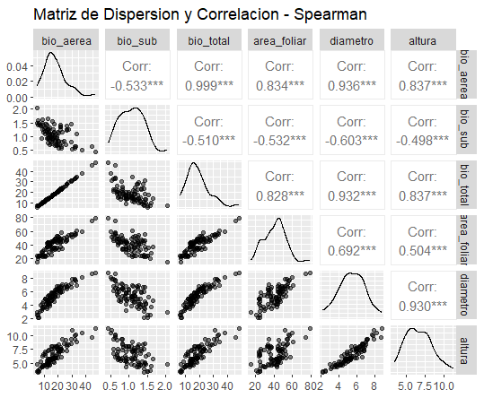

```{r setup, include=FALSE}
knitr::opts_chunk$set(echo = TRUE, comment = NA)

c1="#FF7F00"
c2="#FEB0C6"
c3="#034A94"
c4="#686868"
#-------------------------------------------------------------------------
library(tidyverse)
# install.packages("PerformanceAnalytics")
library(PerformanceAnalytics)


#install.packages("devtools") # Solo una vez
# devtools::install_github("dgonxalex80/paqueteMET") # descarga paqueteDEG
library(paqueteMETODOS) # Activa paqueteMET
data("biomasa") # Carga la base biomasa

gen.corr.data<- function(rho,n){
x <- rnorm(n)
z <- rnorm(n)
y<- rho*x + sqrt(1-rho^2)*z
result <-cbind(y,x)
return(result)
}
#-------------------------------------------------------------------------
library(ggplot2)
library(patchwork)
Theme1= theme(axis.text.x = element_blank(),
        axis.text.y = element_blank(),
        axis.ticks = element_blank(),
        axis.title.x = element_text(size = 12),
        axis.title.y = element_text(size = 12))
#------------------------------------------------------------------------
Theme2= theme(
        #axis.text.x = element_blank(),
        #axis.text.y = element_blank(),
        #axis.ticks = element_blank(),
        axis.title.x = element_text(size = 11),
        axis.title.y = element_text(size = 11))

data(biomasa)
biomasa38=biomasa[,3:8]
#------------------------------------------------------------------------
# Fijamos semilla
set.seed(20)
# Generamos datos aleatorios para la variable X
X <- sample(c("Si", "No"), 100, replace = TRUE)
# "No" "Si" "Si" "No"  "No" "Si" "No" "Si" "No" "No"

# Generamos datos aleatorios para la variable Y
Y <- sample(c("Europa", "America", "Africa"), 100, replace = TRUE)
# "Europa" "Africa"  "Africa"  "Europa"  "Africa" 
# "Europa" "Europa"  "Europa"  "America" "America"

tabla <- table(X, Y)


```


</br></br>
<h2>Coeficiente de correlación de Spearman</h2>

El **coeficiente de correlación de Spearman** (\(\gamma_s\)) es una medida no paramétrica de la asociación entre dos variables cuantitativas o ordinales. Fue propuesto por **Charles Spearman** y se basa en los **rangos de las observaciones** en lugar de los valores originales, lo que lo hace más robusto ante la presencia de valores atípicos y relaciones no lineales.


</br></br>
<h3>Fórmula de cálculo</h3>

El coeficiente de correlación de Spearman se basa en rangos en lugar de valores originales. En estadística, un **rango** es la **posición relativa** de un valor dentro de un conjunto de datos ordenados. Para calcular los rangos de un conjunto de valores, se sigue un procedimiento sistemático: primero, se ordenan los valores de menor a mayor; luego, se asigna un número de rango a cada valor, donde el menor recibe el rango 1, el siguiente menor recibe 2, y así sucesivamente. Si hay valores repetidos, se asigna el **promedio** de los rangos que les corresponderían. Este método permite analizar relaciones entre variables sin depender de distribuciones específicas ni de relaciones estrictamente lineales, lo que lo hace más robusto frente a valores atípicos y datos no normales.


Supongamos que se dispone de los siguientes valores para una variable \( X \), donde se calculan los rangos correspondientes. La **Tabla 3.3**  muestra el resultado del cálculo de los rangos:

<br/><br/>
<center>
**Tabla 3.3** Ejemplo de rangos.
</center>

| Observación | Valor de \( X \) | Rango \( R_{i}(x) \) |
|-------------|-------------|-------|
| A           | 15          | 2     |
| B           | 17          | 3.5   |
| C           | 25          | 5     |
| D           | 27          | 6     |
| E           | 17          | 3.5   |
| F           | 12          | 1     |

Este procedimiento permite transformar los valores originales en posiciones relativas dentro del conjunto de datos, facilitando su uso en métodos no paramétricos como el coeficiente de correlación de Spearman.

El **coeficiente de correlación de Spearman muestral** para las variables $X$ y $Y$, dadas las $n$ observaciones $(x_1, y_1), (x_2, y_2), \dots, (x_n, y_n)$, se denota con la letra $\gamma_{s}$ y se calcula mediante la siguiente expresión:


\[
\gamma_{s} = \dfrac{ \sum_{i=1}^{n} \Big( R_{i}(x) - \overline{R}(x) \Big) \Big( R_{i}(y) - \overline{R}(y) \Big)}
{\sqrt{\sum_{i=1}^{n} \Big( R_{i}(x) - \overline{R}(x) \Big)^2} 
\sqrt{\sum_{i=1}^{n} \Big( R_{i}(y) - \overline{R}(y) \Big)^2}}
\]

donde:

- \( R_i(x) \) y \( R_i(y) \) representan los **rangos** asignados a las observaciones de las variables \( X \) y \( Y \), respectivamente.

- \( \overline{R}(x) \) y \( \overline{R}(y) \) son los **promedios de los rangos** de las variables.

- \( n \) es el número total de observaciones.


Cuando no hay empates en los rangos, el coeficiente de correlación de Spearman puede calcularse mediante una expresión más simple:

\[
\gamma_s = 1 - \dfrac{6 \sum d_i^2}{n(n^2 - 1)}
\]

donde:

- \( d_i = R_i(x) - R_i(y) \) representa la diferencia entre los rangos de cada par de observaciones.

- \( n \) es el número total de observaciones en la muestra.

Esta fórmula simplificada es válida únicamente cuando no existen valores repetidos en los datos, lo que garantiza que los rangos sean únicos. En presencia de empates, se debe recurrir a la versión general del coeficiente de Spearman, basada en la covarianza de los rangos.


</br></br>
<h3>Interpretación</h3>


- **\( \gamma_s = 1 \)**: Relación monótona positiva perfecta (cuando una variable aumenta, la otra también lo hace siempre).

- **\( \gamma_s = -1 \)**: Relación monótona negativa perfecta (cuando una variable aumenta, la otra siempre disminuye).

- **\( \gamma_s = 0 \)**: No hay una relación monótona entre las variables.


</br></br>
<h3>Ventajas del coeficiente de Spearman</h3>

- **No requiere normalidad**: A diferencia del coeficiente de Pearson, Spearman no asume que las variables sigan una distribución normal.

- **No necesita relación lineal**: Puede capturar relaciones monótonas (crecientes o decrecientes), incluso si no son estrictamente lineales.

- **Es resistente a valores atípicos**: Dado que se basa en rangos, los valores extremos tienen menor impacto en el cálculo del coeficiente.

- **Puede aplicarse a variables ordinales**: Es útil cuando las variables representan categorías ordenadas en lugar de valores continuos.


</br></br>
<h3>Pruebas de hipótesis</h3>

Para evaluar la existencia de una **relación monótona** significativa entre dos variables las variables \( X \) y \( Y \), la prueba de Spearman se formula de la siguiente manera:

- Hipótesis nula \(\left(H_0\right)\): No existe asociación monótona entre las variables \(X\) y \(Y\).

- Hipótesis alternativa \(\left(H_1\right)\): Existe una asociación monótona significativa entre las variables \(X\) y \(Y\).


Aunque Spearman es un test **no paramétrico**, existen algunas condiciones a considerar:

1. **Escala de medición**: Las variables deben ser al menos ordinales para permitir la asignación de rangos.

2. **Relación monótona**: Aunque no requiere linealidad, el coeficiente de Spearman solo captura relaciones **monótonas** (si una variable aumenta, la otra no debe cambiar de dirección varias veces).

3. **Independencia de las observaciones**: Cada observación debe ser independiente de las demás.


**¿Cuándo usar Spearman en lugar de Pearson?**

- Cuando los datos **no cumplen con el supuesto de normalidad**.

- Si la relación entre las variables **no es lineal**, pero sigue una tendencia monótona.

- En presencia de **valores atípicos**, que podrían distorsionar la correlación de Pearson.

- Para **variables ordinales**, cuando los datos representan rangos en lugar de mediciones continuas.

El **coeficiente de Spearman** es una buena herramienta  para analizar relaciones en situaciones donde la **correlación de Pearson** no es adecuada. Su flexibilidad y resistencia a valores extremos lo hacen útil en diversos contextos, desde la investigación social hasta el análisis de datos financieros y biomédicos.


</br></br>
<div class="caja-ejemplo">
<h3>Ejemplo:</h3>
<p>

En este análisis, se exploran posibles asociaciones entre las variables del conjunto de datos `biomasa`, utilizando la función `cor()` en **R**. Como se explicó previamente, todas las variables son **cuantitativas continuas**, lo que permite aplicar métodos de correlación para evaluar sus relaciones.

Dado que las pruebas previas rechazaron la normalidad en algunas variables y se detectaron valores atípicos, se opta por utilizar la **correlación de Spearman** en lugar de la correlación de Pearson. 

El código en **R** para calcular la matriz de correlación de Spearman y realizar los test correspondientes es el siguiente:


<pre>
# Cargar las librerías necesarias
library(paqueteMETODOS)  # Paquete que contiene el conjunto de datos "biomasa"
library(GGally)          # Para matriz de gráficos de dispersión y correlación
library(dplyr)           # Para manipulación de datos
library(ggplot2)         # Para visualización de datos

# Cargar la base de datos "biomasa"
data(biomasa)

# Calcular la matriz de correlación de Spearman
correlacion_spearman <- cor(biomasa[, 3:8], method = "spearman", use = "pairwise.complete.obs") %>% round(3)

# Mostrar la matriz de correlación de Spearman
print("Matriz de correlación de Spearman:")
print(correlacion_spearman)

# Prueba de correlación de Spearman sin advertencias
print("Resultados de la prueba de correlación de Spearman:")
for (i in 3:7) {
  for (j in (i+1):8) {
    test_result <- cor.test(
      biomasa[[i]], biomasa[[j]],
      method = "spearman",
      exact = FALSE,      # Desactiva el método exacto
      alternative = "two.sided"
    )
    cat("\nVariables:", colnames(biomasa)[i], "vs", colnames(biomasa)[j], "\n")
    print(test_result)
  }
}

# Matriz de gráficos de dispersión con correlaciones de Spearman
ggpairs(
  biomasa[, 3:8],  # Seleccionamos las 6 variables
  title = "Matriz de Dispersion y Correlacion - Spearman",
  upper = list(continuous = wrap("cor", size = 4, method = "spearman")),  # Correlaciones de Spearman
  lower = list(continuous = wrap("points", alpha = 0.5, size = 1.5)),  # Dispersión en la parte inferior
  diag = list(continuous = wrap("densityDiag", alpha = 0.6))  # Densidades en la diagonal
)
</pre>


```{r,eval=FALSE,warning=FALSE,message=FALSE}
# Cargar las librerías necesarias
library(paqueteMETODOS)  # Paquete que contiene el conjunto de datos "biomasa"
library(GGally)          # Para matriz de gráficos de dispersión y correlación
library(dplyr)           # Para manipulación de datos
library(ggplot2)         # Para visualización de datos

# Cargar la base de datos "biomasa"
data(biomasa)

# **Calcular la matriz de correlación de Spearman**
correlacion_spearman <- cor(biomasa[, 3:8], method = "spearman", use = "pairwise.complete.obs") %>% round(3)

# Mostrar la matriz de correlación de Spearman
print("Matriz de correlación de Spearman:")
print(correlacion_spearman)

# Prueba de correlación de Spearman sin advertencias
print("Resultados de la prueba de correlación de Spearman:")
for (i in 3:7) {
  for (j in (i+1):8) {
    test_result <- cor.test(
      biomasa[[i]], biomasa[[j]],
      method = "spearman",
      exact = FALSE,      # Desactiva el método exacto
      alternative = "two.sided"
    )
    cat("\nVariables:", colnames(biomasa)[i], "vs", colnames(biomasa)[j], "\n")
    print(test_result)
  }
}

# Matriz de gráficos de dispersión con correlaciones de Spearman
ggpairs(
  biomasa[, 3:8],  # Seleccionamos las 6 variables
  title = "Matriz de Dispersion y Correlacion - Spearman",
  upper = list(continuous = wrap("cor", size = 4, method = "spearman")),  # Correlaciones de Spearman
  lower = list(continuous = wrap("points", alpha = 0.5, size = 1.5)),  # Dispersión en la parte inferior
  diag = list(continuous = wrap("densityDiag", alpha = 0.6))  # Densidades en la diagonal
)

```


La **Tabla 3.4** muestra la **matriz de correlaciones de Spearman** entre las variables del conjunto de datos `biomasa`. La correlación de Spearman mide la **fuerza y dirección de la relación monótona** entre dos variables, lo que significa que detecta asociaciones crecientes o decrecientes, incluso si no son estrictamente lineales.

<br/><br/>
<center>
**Tabla 3.4** Matriz de correlaciones de Spearman.
</center> 

<pre>
           bio_aerea bio_sub bio_total area_foliar diametro altura
bio_aerea       1.000  -0.533     0.999       0.834    0.936  0.837
bio_sub        -0.533   1.000    -0.510      -0.532   -0.603 -0.498
bio_total       0.999  -0.510     1.000       0.828    0.932  0.837
area_foliar     0.834  -0.532     0.828       1.000    0.692  0.504
diametro        0.936  -0.603     0.932       0.692    1.000  0.930
altura          0.837  -0.498     0.837       0.504    0.930  1.000
</pre>


De acuerdo con los resultados de la matriz de correlación se puede interpretar lo siguiente:


- Entre las correlaciones fuertes: 

     - **Biomasa aérea vs. biomasa total** (0.999) indica relación monótona positiva casi perfecta, indicando que un aumento en la biomasa aérea está directamente asociado con un aumento en la biomasa total.
     
     - **Diámetro vs. biomasa aérea** (0.936) y **diámetro vs. biomasa total** (0.932) sugieren que el diámetro es un fuerte predictor de la biomasa aérea y total.
     
     - **Altura vs. diámetro** (0.930) con relación monótona positiva fuerte, lo que indica que a medida que aumenta el diámetro, la altura también tiende a incrementarse.

- Entre  las correlaciones moderadas:

     - **Área foliar vs. biomasa aérea** (0.834) y **área foliar vs. biomasa total** (0.828) indican que un mayor desarrollo del área foliar se asocia con un mayor peso en la biomasa total y aérea.
     
     - **Área foliar vs. diámetro** (0.692) muestra correlación positiva moderada, lo que sugiere que el diámetro del tronco también tiende a aumentar con el desarrollo del área foliar.
     
     - **Área foliar vs. altura** (0.504) indica relación positiva más débil, indicando que el crecimiento en altura tiene menor dependencia directa del área foliar.
     
     - **Biomasa subterránea vs. biomasa aérea** (-0.533) y **biomasa subterránea vs. biomasa total** (-0.510) lo que muestra  una relación negativa moderada, esto sugiere un posible **balance en la asignación de recursos** entre el crecimiento aéreo y subterráneo de la planta.
     
     - **Biomasa subterránea vs. diámetro** (-0.603) tiene correlación negativa moderada, lo que indica que un mayor diámetro tiende a estar asociado con menor biomasa subterránea.


La **Figura 3.8** permite visualizar los resultados de la correlación de Spearman junto con los gráficos de dispersión para analizar la asociación entre cada par de variables. Este tipo de visualización es similar a la utilizada en la correlación de Pearson, pero en este caso, la medida de asociación refleja la existencia de relaciones **monótonas**, sin requerir linealidad ni normalidad en los datos.


<br/><br/>
<center>
```{r, echo=FALSE, out.width="80%", fig.align = "center"}

```
**Figura 3.8**. Descripción de cada par de variables de la base de datos biomasa. 
</center>
<br/><br/>


Dado que las variables **biomasa aérea**, **biomasa total** y **área foliar** no cumplieron con los supuestos de normalidad y presentaron valores atípicos, la correlación de Pearson podría no ser válida en estos casos. Por esta razón, se aplicó la **correlación de Spearman** con los siguientes resultados: 


<pre>

Variables: bio_aerea vs bio_sub 

	Spearman's rank correlation rho

data:  biomasa[[i]] and biomasa[[j]]
S = 186220, p-value = 6.428e-08
alternative hypothesis: true rho is not equal to 0
sample estimates:
       rho 
-0.5328646 


Variables: bio_aerea vs bio_total 

	Spearman's rank correlation rho

data:  biomasa[[i]] and biomasa[[j]]
S = 131, p-value < 2.2e-16
alternative hypothesis: true rho is not equal to 0
sample estimates:
      rho 
0.9989216 


Variables: bio_aerea vs area_foliar 

	Spearman's rank correlation rho

data:  biomasa[[i]] and biomasa[[j]]
S = 20162, p-value < 2.2e-16
alternative hypothesis: true rho is not equal to 0
sample estimates:
      rho 
0.8340378 


Variables: bio_aerea vs diametro 

	Spearman's rank correlation rho

data:  biomasa[[i]] and biomasa[[j]]
S = 7788.2, p-value < 2.2e-16
alternative hypothesis: true rho is not equal to 0
sample estimates:
      rho 
0.9358914 


Variables: bio_aerea vs altura 

	Spearman's rank correlation rho

data:  biomasa[[i]] and biomasa[[j]]
S = 19842, p-value < 2.2e-16
alternative hypothesis: true rho is not equal to 0
sample estimates:
      rho 
0.8366698 


Variables: bio_sub vs bio_total 

	Spearman's rank correlation rho

data:  biomasa[[i]] and biomasa[[j]]
S = 183429, p-value = 2.85e-07
alternative hypothesis: true rho is not equal to 0
sample estimates:
       rho 
-0.5098871 


Variables: bio_sub vs area_foliar 

	Spearman's rank correlation rho

data:  biomasa[[i]] and biomasa[[j]]
S = 186110, p-value = 6.832e-08
alternative hypothesis: true rho is not equal to 0
sample estimates:
       rho 
-0.5319561 


Variables: bio_sub vs diametro 

	Spearman's rank correlation rho

data:  biomasa[[i]] and biomasa[[j]]
S = 194778, p-value = 3.109e-10
alternative hypothesis: true rho is not equal to 0
sample estimates:
       rho 
-0.6033073 


Variables: bio_sub vs altura 

	Spearman's rank correlation rho

data:  biomasa[[i]] and biomasa[[j]]
S = 181999, p-value = 5.861e-07
alternative hypothesis: true rho is not equal to 0
sample estimates:
       rho 
-0.4981199 


Variables: bio_total vs area_foliar 

	Spearman's rank correlation rho

data:  biomasa[[i]] and biomasa[[j]]
S = 20890, p-value < 2.2e-16
alternative hypothesis: true rho is not equal to 0
sample estimates:
      rho 
0.8280466 


Variables: bio_total vs diametro 

	Spearman's rank correlation rho

data:  biomasa[[i]] and biomasa[[j]]
S = 8270.4, p-value < 2.2e-16
alternative hypothesis: true rho is not equal to 0
sample estimates:
      rho 
0.9319228 


Variables: bio_total vs altura 

	Spearman's rank correlation rho

data:  biomasa[[i]] and biomasa[[j]]
S = 19769, p-value < 2.2e-16
alternative hypothesis: true rho is not equal to 0
sample estimates:
      rho 
0.8372723 


Variables: area_foliar vs diametro 

	Spearman's rank correlation rho

data:  biomasa[[i]] and biomasa[[j]]
S = 37385, p-value = 4.124e-14
alternative hypothesis: true rho is not equal to 0
sample estimates:
      rho 
0.6922685 


Variables: area_foliar vs altura 

	Spearman's rank correlation rho

data:  biomasa[[i]] and biomasa[[j]]
S = 60281, p-value = 4.151e-07
alternative hypothesis: true rho is not equal to 0
sample estimates:
      rho 
0.5038023 


Variables: diametro vs altura 

	Spearman's rank correlation rho

data:  biomasa[[i]] and biomasa[[j]]
S = 8445.9, p-value < 2.2e-16
alternative hypothesis: true rho is not equal to 0
sample estimates:
      rho 
0.9304776 
</pre>

</pre>

Respecto a los resultados del test: 

- **Dado que todas las relaciones analizadas tienen valores \( valor-p < 0.001 \), se concluye que las asociaciones monótonas observadas son estadísticamente significativas.**

- **La correlación de Spearman confirma relaciones monótonas significativas** en las variables **biomasa aérea**, **biomasa total** y **área foliar**, las cuales no cumplían con los supuestos de Pearson.


</p>
</div>


