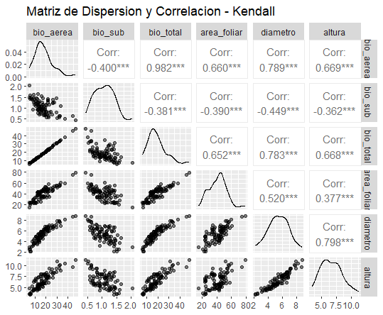

</br></br>
<h2>Coeficiente de correlación de Kendall</h2>

La **correlación de Kendall (\(\tau\))** es una **medida no paramétrica** utilizada para evaluar la relación entre dos variables ordinales o continuas. No asume una distribución específica para los datos, lo que la hace más robusta frente a valores extremos y distribuciones no normales. 

Este coeficiente mide la **asociación monótona** entre dos variables, es decir, si a medida que una aumenta, la otra también lo hace (relación positiva) o disminuye (relación negativa). A diferencia de la correlación de Pearson, que mide relaciones lineales, y la de Spearman, que trabaja con rangos, Kendall evalúa la **proporción de pares ordenados de manera concordante o discordante**.


</br></br>
<h3>Fórmula de cálculo</h3>


La correlación de Kendall se basa en la comparación de todos los pares posibles \((x_i, y_i)\) y \((x_j, y_j)\):

- **Par concordante**: Si el orden relativo de los valores en ambas variables es el mismo:

  \[
  (x_i > x_j \text{ y } y_i > y_j) \quad \text{o} \quad (x_i < x_j \text{ y } y_i < y_j)
  \]
  
- **Par discordante**: Si el orden relativo de los valores es diferente:

  \[
  (x_i > x_j \text{ y } y_i < y_j) \quad \text{o} \quad (x_i < x_j \text{ y } y_i > y_j)
  \]

El coeficiente de Kendall se calcula como:

\[
\tau = \frac{C - D}{\frac{1}{2} n (n-1)}
\]

donde:

- \( C \) es el número de pares **concordantes**.

- \( D \) es el número de pares **discordantes**.

- \( n \) es el número total de observaciones.

Si existen empates en los valores de \(X\) o \(Y\), se usa la versión ajustada de la fórmula:

\[
\tau = \frac{C - D}{\sqrt{(C+D+T_x) (C+D+T_y)}}
\]

donde:

- \( T_x \) y \( T_y \) representan las correcciones por empates en \(X\) e \(Y\).


</br></br>
<h3>Consideraciones y supuestos</h3>

Para aplicar la correlación de Kendall de manera válida, se deben cumplir los siguientes criterios:

- **Las variables deben ser ordinales o continuas**: No se puede aplicar a datos nominales.

- **Se debe evaluar una relación monótona**: Kendall no detecta relaciones no monótonas.

- **No es necesario que los datos sean normales**: A diferencia de Pearson, no requiere normalidad en los datos.

- **Es robusta ante valores atípicos**: No se ve afectada de manera significativa por outliers.


</br></br>
<h3>Interpretación</h3>


Los valores de Kendall \(\tau\) varían entre **-1 y 1**:

- **\(\tau = 1\)**: Relación monótona creciente perfecta (todos los pares son concordantes).

- **\(\tau = -1\)**: Relación monótona decreciente perfecta (todos los pares son discordantes).

- **\(\tau = 0\)**: No hay relación monótona entre las variables.

Valores intermedios indican el grado de asociación. Por ejemplo:

- \(\tau = 0.5\) indica una relación monótona positiva moderada.

- \(\tau = -0.3\) indica una relación monótona negativa débil.


</br></br>
<h3>Pruebas de hipótesis</h3>


Para evaluar la **significancia estadística** de la correlación de Kendall, se establece la siguiente prueba de hipótesis:

- Hipótesis nula \(\left(H_0\right)\): No hay asociación entre las variables.

- Hipótesis alternativa \(\left(H_1\right)\): Existe una asociación monótona entre las variables.


El **estadístico de prueba** para grandes muestras (\(n > 10\)) sigue aproximadamente una **distribución normal estándar**:

\[
Z = \frac{\tau \sqrt{n(n-1)/2}}{\sqrt{(2(2n+5))/9}}
\]


Para que la prueba de hipótesis de Kendall sea válida, se deben cumplir los siguientes criterios:

1. **Independencia de las observaciones**: Las parejas \((x_i, y_i)\) deben ser independientes entre sí.

2. **Nivel de medición ordinal o superior**: Ambas variables deben ser al menos ordinales.

3. **Tamaño de muestra adecuado**: Para pequeños tamaños de muestra (\(n < 10\)), es preferible usar tablas exactas en lugar de la aproximación normal.

4. **Ausencia de fuertes empates**: Si hay demasiados valores repetidos, la estimación de \(\tau\) puede verse afectada.


</br>
**¿Cuándo usar Kendall en lugar de Spearman o Pearson?**


- Si se espera que la relación entre las variables sea lineal, los datos sean continuos y aproximadamente normales, no haya valores atípicos fuertes que puedan afectar la media y la varianza, se necesite una medida de asociación basada en la covarianza, entonces usa Pearson.

- Si la relación entre las variables es monótona, pero no necesariamente lineal, los datos son ordinales o continuos sin cumplir normalidad, existen valores atípicos, se desea una medida basada en los rangos, en lugar de los valores absolutos, entonces usa Spearman.

- Si los datos contienen muchos empates (por ejemplo, mediciones ordinales con valores repetidos), se quiere evaluar la relación monótona de manera más robusta en comparación con Spearman, se tienen pocas observaciones, se necesita una medida más interpretativa basada en la proporción de pares ordenados correctamente, entonces usa Kendall.

La **Tabla 3.5** resume algunos de los aspectos clave de las correlaciones de Pearson, Spearman y Kendall.

<br/><br/>
<center>
**Tabla 3.5** Comparación de Pearson, Spearman y Kendall.
</center>

| **Criterio**                          | **Pearson (\(r\))**       | **Spearman (\(\gamma_{s}\))**   | **Kendall (\(\tau\))**   |
|---------------------------------------|--------------------------|--------------------------|--------------------------|
| **Tipo de relación**                  | Lineal                   | Monótona                 | Monótona                 |
| **Basado en**                          | Covarianza      | Rangos                   | Orden relativo           |
| **Sensibilidad a atípicos**            | Alta                     | Moderada                 | Baja                     |
| **Uso con datos ordinales**            | No                       | Sí                        | Sí                        |
| **Robustez con empates**               | No aplica                | Afectado                 | Mejor opción             |
| **Mejor en muestras pequeñas**         | No                       | No siempre               | Sí                        |
| **Computacionalmente eficiente**       | Sí                       | Moderado                 | Más costoso              |


</br></br>
<div class="caja-ejemplo">
<h3>Ejemplo:</h3>
<p>

Este ejemplo es la continuación de los análisis previos realizados para los coeficientes de **Pearson y Spearman**, donde se exploraron las posibles asociaciones entre las variables del conjunto de datos `biomasa`, utilizando la función `cor()` en **R**. Como se explicó previamente, todas las variables son **cuantitativas continuas**, lo que permite aplicar métodos de correlación para evaluar sus relaciones.

En este caso, se emplea la **correlación de Kendall**, la cual mide la asociación ordinal entre dos variables mediante la comparación de pares de observaciones. Esta medida es especialmente útil cuando los datos contienen empates o no siguen una distribución normal.

El código en **R** para calcular la matriz de correlación de Kendall y realizar los test de hipótesis correspondientes es el siguiente:


<pre>
# Cargar las librerías necesarias
library(paqueteMETODOS)  # Contiene el conjunto de datos "biomasa"
library(GGally)          # Para matriz de gráficos de dispersión y correlación
library(dplyr)           # Para manipulación de datos
library(ggplot2)         # Para visualización de datos

# Cargar la base de datos "biomasa"
data(biomasa)

# Calcular la matriz de correlación de Kendall
correlacion_kendall <- cor(biomasa[, 3:8], method = "kendall", use = "pairwise.complete.obs") %>% round(3)

# Mostrar la matriz de correlación de Kendall
print("Matriz de correlación de Kendall:")
print(correlacion_kendall)

#Prueba de correlación de Kendall sin advertencias
print("Resultados de la prueba de correlación de Kendall:")
for (i in 3:7) {
  for (j in (i+1):8) {
    test_result <- cor.test(
      biomasa[[i]], biomasa[[j]],
      method = "kendall",
      exact = FALSE,  # Desactiva el método exacto para evitar advertencias
      alternative = "two.sided"
    )
    cat("\nVariables:", colnames(biomasa)[i], "vs", colnames(biomasa)[j], "\n")
    print(test_result)
  }
}

#Matriz de gráficos de dispersión con correlaciones de Kendall
plot.kendall <- ggpairs(
  biomasa[, 3:8],  # Seleccionamos las 6 variables
  title = "Matriz de Dispersion y Correlacion - Kendall",
  upper = list(continuous = wrap("cor", size = 4, method = "kendall")),  # Correlaciones de Kendall
  lower = list(continuous = wrap("points", alpha = 0.5, size = 1.5)),  # Dispersión en la parte inferior
  diag = list(continuous = wrap("densityDiag", alpha = 0.6))  # Densidades en la diagonal
)

#Mostrar la matriz de gráficos
print(plot.kendall)
</pre>


```{r,eval=FALSE,warning=FALSE,message=FALSE}
# Cargar las librerías necesarias
library(paqueteMETODOS)  # Contiene el conjunto de datos "biomasa"
library(GGally)          # Para matriz de gráficos de dispersión y correlación
library(dplyr)           # Para manipulación de datos
library(ggplot2)         # Para visualización de datos

# Cargar la base de datos "biomasa"
data(biomasa)

# Calcular la matriz de correlación de Kendall
correlacion_kendall <- cor(biomasa[, 3:8], method = "kendall", use = "pairwise.complete.obs") %>% round(3)

# Mostrar la matriz de correlación de Kendall
print("Matriz de correlación de Kendall:")
print(correlacion_kendall)

#Prueba de correlación de Kendall sin advertencias
print("Resultados de la prueba de correlación de Kendall:")
for (i in 3:7) {
  for (j in (i+1):8) {
    test_result <- cor.test(
      biomasa[[i]], biomasa[[j]],
      method = "kendall",
      exact = FALSE,  # Desactiva el método exacto para evitar advertencias
      alternative = "two.sided"
    )
    cat("\nVariables:", colnames(biomasa)[i], "vs", colnames(biomasa)[j], "\n")
    print(test_result)
  }
}

#Matriz de gráficos de dispersión con correlaciones de Kendall
plot.kendall <- ggpairs(
  biomasa[, 3:8],  # Seleccionamos las 6 variables
  title = "Matriz de Dispersion y Correlacion - Kendall",
  upper = list(continuous = wrap("cor", size = 4, method = "kendall")),  # Correlaciones de Kendall
  lower = list(continuous = wrap("points", alpha = 0.5, size = 1.5)),  # Dispersión en la parte inferior
  diag = list(continuous = wrap("densityDiag", alpha = 0.6))  # Densidades en la diagonal
)

#Mostrar la matriz de gráficos
print(plot.kendall)
```

La **Tabla 3.6** presenta las estimaciones de la matriz de correlación de Kendall. De acuerdo con los resultados de las variables **biomasa aérea**, **biomasa total** y **área foliar** que no cumplieron con los supuestos de normalidad y presentaron valores atípicos se puede concluir:

- **Biomasa aérea vs. biomasa total** (\( \tau = 0.982 \)) presenta una **asociación monótona positiva muy fuerte**, lo que indica que un aumento en la biomasa aérea está prácticamente siempre acompañado por un aumento en la biomasa total.

- **Biomasa aérea vs. área foliar** (\( \tau = 0.660 \)) muestra una **relación monótona positiva moderada a fuerte**, lo que sugiere que el desarrollo del área foliar tiende a estar asociado con un aumento en la biomasa aérea.

- **Biomasa total vs. área foliar** (\( \tau = 0.652 \)) también presenta una **relación monótona positiva moderada a fuerte**, lo que confirma que un mayor desarrollo del área foliar se asocia con una mayor biomasa total.


<br/><br/>
<center>
**Tabla 3.6** Matriz de correlación de Kendall.
</center>

<pre>
           bio_aerea bio_sub bio_total area_foliar diametro altura
bio_aerea       1.000  -0.400     0.982       0.660    0.789  0.669
bio_sub        -0.400   1.000    -0.381      -0.390   -0.449 -0.362
bio_total       0.982  -0.381     1.000       0.652    0.783  0.668
area_foliar     0.660  -0.390     0.652       1.000    0.520  0.377
diametro        0.789  -0.449     0.783       0.520    1.000  0.798
altura          0.669  -0.362     0.668       0.377    0.798  1.000
</pre>


Los resultados de la implementación del test de Kendall se presentan a continuación. Dado que todas las relaciones analizadas tienen valores \( valor-p < 0.001 \), se concluye que las asociaciones monótonas observadas son estadísticamente significativas. Además,  la correlación de Kendall confirma relaciones monótonas significativas en las variables **biomasa aérea**, **biomasa total** y **área foliar**, las cuales no cumplían con los supuestos de Pearson.


<pre>
Variables: bio_aerea vs bio_sub 

	Kendall's rank correlation tau

data:  biomasa[[i]] and biomasa[[j]]
z = -5.5543, p-value = 2.787e-08
alternative hypothesis: true tau is not equal to 0
sample estimates:
       tau 
-0.4002568 


Variables: bio_aerea vs bio_total 

	Kendall's rank correlation tau

data:  biomasa[[i]] and biomasa[[j]]
z = 13.691, p-value < 2.2e-16
alternative hypothesis: true tau is not equal to 0
sample estimates:
      tau 
0.9816319 


Variables: bio_aerea vs area_foliar 

	Kendall's rank correlation tau

data:  biomasa[[i]] and biomasa[[j]]
z = 9.2118, p-value < 2.2e-16
alternative hypothesis: true tau is not equal to 0
sample estimates:
      tau 
0.6602549 


Variables: bio_aerea vs diametro 

	Kendall's rank correlation tau

data:  biomasa[[i]] and biomasa[[j]]
z = 10.929, p-value < 2.2e-16
alternative hypothesis: true tau is not equal to 0
sample estimates:
      tau 
0.7894447 


Variables: bio_aerea vs altura 

	Kendall's rank correlation tau

data:  biomasa[[i]] and biomasa[[j]]
z = 9.265, p-value < 2.2e-16
alternative hypothesis: true tau is not equal to 0
sample estimates:
      tau 
0.6687808 


Variables: bio_sub vs bio_total 

	Kendall's rank correlation tau

data:  biomasa[[i]] and biomasa[[j]]
z = -5.2858, p-value = 1.251e-07
alternative hypothesis: true tau is not equal to 0
sample estimates:
       tau 
-0.3808622 


Variables: bio_sub vs area_foliar 

	Kendall's rank correlation tau

data:  biomasa[[i]] and biomasa[[j]]
z = -5.4077, p-value = 6.382e-08
alternative hypothesis: true tau is not equal to 0
sample estimates:
       tau 
-0.3895093 


Variables: bio_sub vs diametro 

	Kendall's rank correlation tau

data:  biomasa[[i]] and biomasa[[j]]
z = -6.192, p-value = 5.942e-10
alternative hypothesis: true tau is not equal to 0
sample estimates:
       tau 
-0.4494823 


Variables: bio_sub vs altura 

	Kendall's rank correlation tau

data:  biomasa[[i]] and biomasa[[j]]
z = -4.9848, p-value = 6.204e-07
alternative hypothesis: true tau is not equal to 0
sample estimates:
       tau 
-0.3615896 


Variables: bio_total vs area_foliar 

	Kendall's rank correlation tau

data:  biomasa[[i]] and biomasa[[j]]
z = 9.0967, p-value < 2.2e-16
alternative hypothesis: true tau is not equal to 0
sample estimates:
      tau 
0.6519296 


Variables: bio_total vs diametro 

	Kendall's rank correlation tau

data:  biomasa[[i]] and biomasa[[j]]
z = 10.838, p-value < 2.2e-16
alternative hypothesis: true tau is not equal to 0
sample estimates:
      tau 
0.7827976 


Variables: bio_total vs altura 

	Kendall's rank correlation tau

data:  biomasa[[i]] and biomasa[[j]]
z = 9.251, p-value < 2.2e-16
alternative hypothesis: true tau is not equal to 0
sample estimates:
      tau 
0.6676905 


Variables: area_foliar vs diametro 

	Kendall's rank correlation tau

data:  biomasa[[i]] and biomasa[[j]]
z = 7.2008, p-value = 5.986e-13
alternative hypothesis: true tau is not equal to 0
sample estimates:
      tau 
0.5199072 


Variables: area_foliar vs altura 

	Kendall's rank correlation tau

data:  biomasa[[i]] and biomasa[[j]]
z = 5.2199, p-value = 1.79e-07
alternative hypothesis: true tau is not equal to 0
sample estimates:
      tau 
0.3766145 


Variables: diametro vs altura 

	Kendall's rank correlation tau

data:  biomasa[[i]] and biomasa[[j]]
z = 10.972, p-value < 2.2e-16
alternative hypothesis: true tau is not equal to 0
sample estimates:
      tau 
0.7978186 
</pre>


La **Figura 3.9** permite visualizar los resultados de la correlación de Kendall junto con los gráficos de dispersión para analizar la asociación entre cada par de variables. Este tipo de visualización es similar a la utilizada en la correlación de Pearson y Spearman.


<br/><br/>
<center>
```{r, echo=FALSE, out.width="80%", fig.align = "center"}

```
**Figura 3.9**. Descripción de cada par de variables de la base de datos biomasa. 
</center>
<br/><br/>


<br/><br/>
<center>
**Tabla 3.7** Comparación entre Pearson, Spearman y Kendall.
</center>


| Relación | Pearson | Spearman  | Kendall  |
|----------|--------------------|----------------------|------------------|
| **Biomasa aérea vs Biomasa total** | 0.999*** | 0.9989*** | 0.982*** |
| **Biomasa aérea vs Área foliar** | 0.865*** | 0.8340*** | 0.660*** |
| **Biomasa total vs Área foliar** | 0.860*** | 0.8280*** | 0.652*** |

De acuerdo con la **Tabla 3.7** y resultados anteriores:

- En la matriz de correlación de **Pearson**, todas las correlaciones entre estas variables presentan **tres asteriscos (\( valor-p < 0.001 \))**, lo que indica que las relaciones lineales observadas son **altamente significativas** y no ocurren al azar. Sin embargo, debido a la falta de normalidad y la presencia de valores atípicos en tres variables, la validez de estos coeficientes puede estar comprometida.


- **Pearson mostró correlaciones extremadamente altas (\(r > 0.86\)), lo que indica relaciones lineales fuertes.** Sin embargo, los resultados relacionados con 3 variables pueden estar afectadas por la falta de normalidad y valores atípicos en los datos.


- **Spearman confirmó asociaciones monótonas significativas, con valores altos pero ligeramente menores que Pearson.** Esto indica que, aunque la relación es fuerte, no necesariamente es estrictamente lineal.

- **Kendall presentó valores más bajos en comparación con Spearman y Pearson, pero sigue mostrando asociaciones significativas.** Esto es esperado, ya que Kendall mide relaciones basadas en pares concordantes y discordantes, lo que lo hace menos sensible a variaciones pequeñas en los datos.


</p>
</div>


