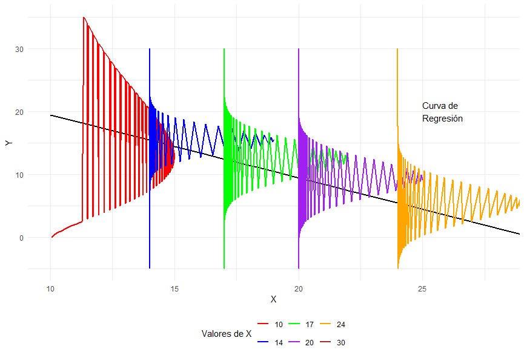

```{r setup, include=FALSE}
knitr::opts_chunk$set(echo = TRUE, comment = NA)

c1="#FF7F00"
c2="#=EB0C6"
c3="#034A94"
c4="#686868"

library(ggplot2)
library(paqueteMETODOS)
data(biomasa)
modelo=lm(log(bio_total) ~ diametro, data=biomasa)
```


<br/><br/>
<h2>Introducción</h2>

El **modelo de regresión lineal** es una de las herramientas estadísticas más utilizadas para analizar la relación entre una variable respuesta y una o más variables explicativas. Su simplicidad y facilidad de interpretación lo hacen fundamental en diversas áreas del conocimiento.

La regresión lineal permite:

- **Identificar relaciones** entre variables y cuantificar su intensidad.

- **Realizar predicciones** sobre la variable respuesta con base en valores conocidos de la variable explicativa.

- **Evaluar el impacto** de cambios en las variables explicativas sobre la respuesta.

- **Proporcionar inferencias** sobre la significancia de los parámetros del modelo.

El modelo de regresión lineal es ampliamente aplicado en diversos campos, entre ellos:

- **Economía y finanzas**: análisis de tendencias en precios, estimación del impacto de políticas económicas y modelado del comportamiento del mercado.

- **Ingeniería y ciencias exactas**: predicción de la resistencia de materiales, optimización de procesos industriales y modelado de datos experimentales.

- **Ciencias de la salud**: relación entre factores de riesgo y enfermedades, análisis de eficacia de tratamientos médicos y estudios epidemiológicos.

- **Ciencias sociales**: estudio de relaciones demográficas, comportamiento del consumidor y predicción de resultados electorales.


<div class="caja-nota">
> *"En esta unidad, el análisis se centrará en el **Modelo de Regresión Lineal Simple**, donde se modelará una única variable respuesta en función de una sola variable predictora. No se abordarán relaciones más complejas ni modelos con múltiples predictores."*  
</div>

<div class="caja-nota">
> *"En el siguiente curso **Modelos Estadísticos para la Toma de Decisiones**, se estudiará el **Modelo de Regresión Lineal Múltiple**, el cual permite modelar una variable respuesta en términos de varias variables predictoras. Este modelo amplía las capacidades de análisis al considerar múltiples factores que pueden influir simultáneamente en la variable de interés."*  
</div>


<br/><br/>
<h2>Formulación del modelo</h2>


El **modelo de regresión lineal simple** puede representarse de dos formas, cada una con una interpretación específica sobre la relación entre la variable explicativa \( X_i \) y la variable respuesta \( Y_i \).

En ambas formulaciones:

- \( X_i \) es **una variable fija**, determinada por el diseño del estudio o la muestra observada.

- \( Y_i \) es **una variable aleatoria**, cuya distribución depende de \( X_i \).

- \( \beta_0 \) y \( \beta_1 \) son **parámetros desconocidos** que representan la intersección y la pendiente de la relación lineal.

- \( \sigma^2 \) es **la varianza constante** de los errores aleatorios.


<br/><br/>
<h3>Primera forma: Expresión en términos del error aleatorio</h3>

En esta representación, la variable respuesta \( Y_i \) se expresa como la suma de un término **determinístico** \( \beta_0 + \beta_1 X_i \) y un **error aleatorio** \( \varepsilon_i \), el cual sigue una **distribución normal** con **media cero** y **varianza constante**:

$$
Y_i = \beta_0 + \beta_1 X_i + \varepsilon_i \\
\varepsilon_i \sim N(0, \sigma^2)
$$

- En esta formulación, la variabilidad de \( Y_i \) proviene tanto de la **relación lineal con \( X_i \)** como del **componente aleatorio** \( \varepsilon_i \).

- Se hace énfasis en que los errores \( \varepsilon_i \) explican las desviaciones de \( Y_i \) con respecto a la tendencia determinada por \( \beta_0 + \beta_1 X_i \).

- Dado que \( X_i \) es fijo, **la aleatoriedad proviene exclusivamente de \( \varepsilon_i \)**.


<div class="caja-nota">
> *Los errores representan la diferencia entre los valores observados \( Y_i \) y la verdadera relación lineal de la población. **No son observables**, ya que dependen de los coeficientes poblacionales \( \beta_0 \) y \( \beta_1 \), que son desconocidos.*
</div>


<br/><br/>
<h3>Segunda forma: Expresión en términos de la distribución de \( Y \)</h3>

En esta formulación, la variable respuesta \( Y_i \) se modela directamente como una **variable aleatoria normal**, cuya **esperanza condicional depende de** \( X_i \), mientras que su **varianza permanece constante**:

$$
Y_i \mid X_i \sim N(\mu_i, \sigma^2) \\ 
\mu_i=E[Y_i | X_i] = \beta_0 + \beta_1 X_i \\ \sigma^2 = \text{constante}
$$

- En esta representación, \( Y_i \) se interpreta como **una realización de una variable aleatoria normal**, donde su media depende linealmente de \( X_i \) y su varianza es fija.

- Para cada valor fijo de \( X_i \), la distribución de \( Y_i \) se mantiene normal, pero con media variable según la ecuación \( \beta_0 + \beta_1 X_i \).

- Esta formulación enfatiza la **distribución condicional** de \( Y_i \), dejando claro que la varianza \( \sigma^2 \) no depende de \( X_i \).


<div class="caja-nota">
> *En ambos enfoques, el vector de parámetros del modelo está dado por  
\(\theta = (\beta_0, \beta_1, \sigma)^\top\).  Para estimar estos parámetros, se emplean comúnmente dos métodos: **mínimos cuadrados** y **máxima verosimilitud***
</div>
 


---

En el modelo de regresión, se asume que los **errores \( \varepsilon_i \) son independientes e idénticamente distribuidos**:

$$
\varepsilon_i \sim \text{i.i.d} \quad N(0, \sigma^2), \quad \text{para } i = 1,2, \dots, n.
$$

Dado que el modelo se define como:

$$
Y_i = \beta_0 + \beta_1 X_i + \varepsilon_i,
$$

Si los errores son independientes, entonces **\( Y_i \) y \( Y_j \) son independientes condicionalmente a \( X_i \) y \( X_j \)**, pero no necesariamente marginalmente independientes. La razón es que cada \( Y_i \) depende de \( X_i \), y si \( X_i \) y \( X_j \) están correlacionados en la muestra, esto puede inducir una dependencia entre los \( Y_i \).

Por lo tanto, **el supuesto de independencia en la regresión lineal se aplica a los errores \( \varepsilon_i \), no necesariamente a las respuestas \( Y_i \)**.

---


La **Figura 3.10** proporciona una representación clara del cumplimiento de supuestos fundamentales en el análisis de regresión. En particular, permite evaluar:

- **El supuesto de normalidad de la variable  respuesta condicionada a cada valor de la variable predictora**: La distribución de \( Y_i \) condicionada a \( X_i \) indica un comportamiento aproximadamente normal.

- **La  media de la variable respuesta cambia de acuerdo con la ecuación de la recta determinada por la variable predictora**:   La media condicional cambia según la ecuación \( \beta_0 + \beta_1 X_i \).

-  **La varianza constante (homocedasticidad)**: Se analiza que la dispersión de los valores de \( Y_i \) respecto a \( X_i \) permanece constante a lo largo de toda la escala de los valores de la variable predictora.


```{r,eval=FALSE,warning=FALSE,message=FALSE,include=FALSE}
Sys.setlocale("LC_ALL", "es_ES.UTF-8")


library(ggplot2)

# Simulación de datos
set.seed(123)
x <- c(22, 24, 10, 21, 15, 22, 14, 15, 30, 20, 18, 19, 20, 19, 21, 20, 14, 16, 15, 18, 26, 14, 28, 18, 15, 18, 17, 15, 11, 13, 19, 13)
y <- c(5, 4, 25, 13, 11, 5, 16, 14, 0, 16, 10, 7, 6, 12, 11, 8, 12, 10, 16, 6, 6, 19, 3, 10, 11, 10, 15, 15, 20, 16, 12, 17)

data <- data.frame(x, y)

# Ajuste de un modelo de regresión lineal
model <- lm(y ~ x, data = data)

data$y_pred <- predict(model, newdata = data)

# Generación de distribuciones condicionales de Y dada X
density_data <- data.frame()
sd_error <- sd(residuals(model))  # Estimación de la desviación estándar de los errores
selected_x <- sort(unique(x))[seq(1, length(unique(x)), length.out = 6)]  # Reducir el número de curvas

for (x_val in selected_x) {
  y_vals <- seq(min(y) - 5, max(y) + 5, length.out = 100)
  density <- dnorm(y_vals, mean = predict(model, newdata = data.frame(x = x_val)), sd = sd_error)
  density <- density / max(density) * 5  # Escalar la densidad para mejor visualización
  temp_data <- data.frame(x = x_val, y = y_vals, density = density)
  density_data <- rbind(density_data, temp_data)
}

plot1<-ggplot() +
  geom_line(data = data, aes(x = x, y = y_pred), color = "black", linewidth = 1) +
  geom_line(data = density_data, aes(x = x + density, y = y, group = x, color = factor(x)), linewidth = 0.8) +
  scale_color_manual(values = c("red", "blue", "green", "purple", "orange", "brown")) +
  annotate("text", x = max(x) - 5, y = max(y) - 5, label = "Curva de\nRegresión", hjust = 0) +
  annotate("text", x = min(x) + 5, y = min(y) + 2, label = "Distribución\nProbabilística\nde Y", hjust = 0) +
  labs(x = "X", y = "Y", color = "Valores de X") +
  theme_minimal() +
  coord_cartesian(xlim = c(min(x), 28)) +
  theme(legend.position = "bottom")

print(plot1)
```


<br/><br/>
<center>
```{r, echo=FALSE, out.width="80%", fig.align = "center"}
knitr::include_graphics("img/fig310.png")
```
**Figura 3.10** Ejemplo donde se cumplen los supuestos de la regresión lineal simple.
</center>
<br/><br/>


La **Figura 3.11** muestra que la **varianza de las distribuciones no es constante**. Se observa que las curvas **roja y azul** presentan una varianza más pequeña en comparación con otras regiones del gráfico, lo que indica que la dispersión de los valores no es uniforme a lo largo de la variable explicativa \( X \). Esta condición puede afectar la validez de los estimadores en un modelo de regresión, ya que se incumple el supuesto de homocedasticidad.


```{r,eval=FALSE,warning=FALSE,message=FALSE,include=FALSE}


Sys.setlocale("LC_ALL", "es_ES.UTF-8")

library(ggplot2)

# Simulación de datos
set.seed(123)
x <- c(22, 24, 10, 21, 15, 22, 14, 15, 30, 20, 18, 19, 20, 19, 21, 20, 14, 16, 15, 18, 26, 14, 28, 18, 15, 18, 17, 15, 11, 13, 19, 13)
y <- c(5, 4, 25, 13, 11, 5, 16, 14, 0, 16, 10, 7, 6, 12, 11, 8, 12, 10, 16, 6, 6, 19, 3, 10, 11, 10, 15, 15, 20, 16, 12, 17)

data <- data.frame(x, y)

# Ajuste de un modelo de regresión lineal
model <- lm(y ~ x, data = data)

data$y_pred <- predict(model, newdata = data)

# Generación de distribuciones condicionales de Y dada X
density_data <- data.frame()
sd_error <- sd(residuals(model))  # Estimación de la desviación estándar de los errores
selected_x <- sort(unique(x))[seq(1, length(unique(x)), length.out = 6)]  # Reducir el número de curvas

for (i in seq_along(selected_x)) {
  x_val <- selected_x[i]
  var_factor <- ifelse(i == 1, sd_error * 0.5, ifelse(i == 2, sd_error * 0.7, sd_error))
  y_vals <- seq(min(y) - 5, max(y) + 5, length.out = 100)
  density <- dnorm(y_vals, mean = predict(model, newdata = data.frame(x = x_val)), sd = var_factor)
  density <- density / max(density) * 5  # Escalar la densidad para mejor visualización
  temp_data <- data.frame(x = x_val, y = y_vals, density = density)
  density_data <- rbind(density_data, temp_data)
}

plot1_norm<-ggplot() +
  geom_line(data = data, aes(x = x, y = y_pred), color = "black", linewidth = 1) +
  geom_line(data = density_data, aes(x = x + density, y = y, group = x, color = factor(x)), linewidth = 0.8) +
  scale_color_manual(values = c("red", "blue", "green", "purple", "orange", "brown")) +
  annotate("text", x = max(x) - 5, y = max(y) - 5, label = "Curva de
Regresión", hjust = 0) +
  annotate("text", x = min(x) + 1, y = min(y) + 3, label = "Distribución\nProbabilística\nde Y", hjust = 0) +
  labs(x = "X", y = "Y", color = "Valores de X") +
  theme_minimal() +
  coord_cartesian(xlim = c(min(x), 28)) +
  theme(legend.position = "bottom")

print(plot1_norm)
```


<br/><br/>
<center>
```{r, echo=FALSE, out.width="80%", fig.align = "center"}
knitr::include_graphics("img/fig311.png")
```
**Figura 3.11** Ejemplo donde el supuesto de varianza constante falla.
</center>
<br/><br/>


Por otro lado, en la **Figura 3.12**, la distribución de la curva **roja** no sigue una normal, sino que muestra un comportamiento más parecido a una **distribución gamma**. Esta condición puede afectar la validez de los estimadores en un modelo de regresión, ya que se incumple el supuesto de normalidad.

```{r,eval=FALSE,warning=FALSE,message=FALSE,include=FALSE}
Sys.setlocale("LC_ALL", "es_ES.UTF-8")

library(ggplot2)

# Simulación de datos
set.seed(123)
x <- c(22, 24, 10, 21, 15, 22, 14, 15, 30, 20, 18, 19, 20, 19, 21, 20, 14, 16, 15, 18, 26, 14, 28, 18, 15, 18, 17, 15, 11, 13, 19, 13)
y <- c(5, 4, 25, 13, 11, 5, 16, 14, 0, 16, 10, 7, 6, 12, 11, 8, 12, 10, 16, 6, 6, 19, 3, 10, 11, 10, 15, 15, 20, 16, 12, 17)

data <- data.frame(x, y)

# Ajuste de un modelo de regresión lineal
model <- lm(y ~ x, data = data)

data$y_pred <- predict(model, newdata = data)

# Generación de distribuciones condicionales de Y dada X
density_data <- data.frame()
sd_error <- sd(residuals(model))  # Estimación de la desviación estándar de los errores
selected_x <- sort(unique(x))[seq(1, length(unique(x)), length.out = 6)]  # Reducir el número de curvas

for (i in seq_along(selected_x)) {
  x_val <- selected_x[i]
  
  if (x_val == 10) {  # Aplicar la distribución exponencial solo para X = 10
    rate <- 1 / 20  # Parámetro de la exponencial para tener media 20
    y_vals <- seq(min(y), max(y) + 10, length.out = 100)  # Ajustar el rango para una mejor forma
    density <- dgamma(y_vals - min(y_vals) + 0.5, shape=2.9,scale=7)  # Evitar valores negativos
    density <- density / max(density) * 5  # Escalar la densidad para mejor visualización
  } else {
    var_factor <- ifelse(i == 2, sd_error * 0.7, sd_error)
    y_vals <- seq(min(y) - 5, max(y) + 5, length.out = 100)
    density <- dnorm(y_vals, mean = predict(model, newdata = data.frame(x = x_val)), sd = var_factor)
    density <- density / max(density) * 5  # Escalar la densidad para mejor visualización
  }
  
  temp_data <- data.frame(x = x_val, y = y_vals, density = density)
  density_data <- rbind(density_data, temp_data)
}

ggplot() +
  geom_line(data = data, aes(x = x, y = y_pred), color = "black", linewidth = 1) +
  geom_line(data = density_data, aes(x = x + density, y = y, group = x, color = factor(x)), linewidth = 0.8) +
  scale_color_manual(values = c("red", "blue", "green", "purple", "orange", "brown")) +
  annotate("text", x = max(x) - 5, y = max(y) - 5, label = "Curva de\nRegresión", hjust = 0) +
  annotate("text", x = min(x) + 5, y = min(y) + 10, label = "", hjust = 0) +
  labs(x = "X", y = "Y", color = "Valores de X") +
  theme_minimal() +
   coord_cartesian(xlim = c(min(x), 28)) +
  theme(legend.position = "bottom")


```


<br/><br/>
<center>
```{r, echo=FALSE, out.width="80%", fig.align = "center"}

```
**Figura 3.12** Ejemplo donde el supuesto de distribución normal falla.
</center>
<br/><br/>


<br/><br/>
<h2>Función `lm` en **R**</h2>


La función `lm()` de **R** se utiliza para ajustar un **modelo de regresión lineal simple o múltiple**. Su estructura general es la siguiente:

<pre>
lm(formula, data, subset, weights, na.action,
   method = "qr", model = TRUE, x = FALSE, y = FALSE, qr = TRUE,
   singular.ok = TRUE, contrasts = NULL, offset, ...)
</pre>


A continuación, se presenta una breve descripción de los parámetros más utilizados epara ajustar un modelo de regresión lineal:

- **`formula`**: Es un objeto de la clase **fórmula** que especifica la relación entre la variable respuesta y las covariables. Se expresa con la sintaxis: `formula = y ~ x1 + x2`.

- **`data`**: Es el marco de datos donde se encuentran las variables utilizadas en la fórmula


</br></br>
<div class="caja-ejemplo">
<h3>Ejemplo:</h3>
<p>
En este ejemplo, se ajusta un **modelo de regresión lineal simple** para analizar la relación entre la **Resistencia de una soldadura (psi)** y la **Edad de la soldadura (semanas)**. En total, se cuenta con **20 observaciones**. El objetivo es determinar si la edad de la soldadura influye en su resistencia y, en caso afirmativo, cuantificar dicha relación.


El modelo que se va a ajustar se expresa de la siguiente manera:

\[
\text{Resistencia}_i \sim N(\mu_i, \sigma^2)\\
\mu_i =E(\text{Resistencia}_i \mid \text{Edad}_i) = \beta_0 + \beta_1 \times \text{Edad}_i, \\
\sigma^2 = \text{constante}
\]

Este modelo asume que la **Resistencia de la soldadura** sigue una distribución normal con media \(\mu_i\) y varianza constante \(\sigma^2\). La media \(\mu_i\) se modela como una función lineal de la **Edad de la soldadura** en términos de \(\beta_0\) y \(\beta_1\). 


Otra opción para plantear el modelo de regresión lineal simple es la siguiente:

\[
\text{Resistencia}_i = \beta_0 + \beta_1 \times \text{Edad}_i + \varepsilon_i \\
\varepsilon_i \sim N(0, \sigma^2)
\]

 Para ambos planteamientos:
 
 - **\(\beta_0\)**: Intercepto del modelo, que representa la resistencia esperada cuando la edad de la soldadura es **cero**.

- **\(\beta_1\)**: Coeficiente de regresión, que indica el **cambio esperado** en la resistencia por **cada unidad** de aumento en la edad de la soldadura.

- **\(\sigma^2\)**: Varianza del **error**, que se asume **constante** en todo el rango de los datos.

---

Para que la regresión lineal proporcione resultados válidos, es necesario que el término de error \(\varepsilon_i\) cumpla con los siguientes supuestos:

1. **Normalidad del error**: Se asume que los errores siguen una distribución normal con media cero y varianza constante:

   \[
   \varepsilon_i \sim N(0, \sigma^2)
   \]

2. **Homocedasticidad (varianza constante del error)**: La varianza de los errores debe ser **constante** para todos los valores de la variable explicativa:

   \[
   \text{Var}(\varepsilon_i) = \sigma^2, \quad \forall i
   \]

3. **Independencia de los errores**: Los errores del modelo no deben estar correlacionados.

El cumplimiento de estos supuestos es fundamental para la validez de las inferencias estadísticas realizadas a partir del modelo. En caso de que estos supuestos no se cumplan, se pueden considerar transformaciones de los datos o el uso de modelos alternativos.


<div class="caja-nota">
> "Los **supuestos** del modelo de regresión lineal son:
>
- Los errores tienen distribución normal.
>
- Los errores tienen media cero.
>
- Los errores tienen varianza constante.
>
- Los errores no están correlacionados."
</div>

---

En este ejemplo, se mostrará  cómo obtener usando **R** las **estimaciones de los parámetros** \(\beta_0\) y \(\beta_1\), **estimación de la desviación estándar del error**, **valores predichos de la resistencia**, **estimaciones de los errores (residuales)**  en un **modelo de regresión lineal simple**.

El código en **R** para crear el gráfico de dispersión y estimar los parámetros del modelo de regresión lineal simple  es el siguiente:

<pre>

Sys.setlocale("LC_ALL", "es_ES.UTF-8")

# Definir la URL del archivo con los datos
file <- "https://github.com/Centromagis/metodosySIM3_V2/blob/main/datos_MetySim/dat_reg1.txt"

# Cargar el conjunto de datos desde la URL
datos <- read.table(file = file, header = TRUE)

# Cargar la librería ggplot2 para visualización de datos
library(ggplot2)

# Crear un gráfico de dispersión para visualizar la relación entre Edad y Resistencia
plot_reg <- ggplot(datos, aes(x = Edad, y = Resistencia)) + 
  geom_point(color = "blue", size = 2) +  # Agregar puntos con color azul y tamaño adecuado
  theme_light() +                         # Aplicar un tema ligero para mejorar la presentación
  labs(title = "Relación entre Edad y Resistencia",
       x = "Edad de la Soldadura (meses)",
       y = "Resistencia de la Soldadura")

# Ajustar un modelo de regresión lineal simple
mod1 <- lm(Resistencia ~ Edad, data = datos)

# Mostrar un resumen del modelo ajustado
summary(mod1)

# Imprimir el gráfico de dispersión
print(plot_reg)

# Imprimir el objeto del modelo para visualizar los coeficientes estimados
print(mod1)
</pre>


```{r,eval=FALSE,warning=FALSE,message=FALSE}

Sys.setlocale("LC_ALL", "es_ES.UTF-8")

# Definir la URL del archivo con los datos
file <- "https://github.com/Centromagis/metodosySIM3_V2/blob/main/datos_MetySim/dat_reg1.txt"

# Cargar el conjunto de datos desde la URL
datos <- read.table(file = file, header = TRUE)

# Cargar la librería ggplot2 para visualización de datos
library(ggplot2)

# Crear un gráfico de dispersión para visualizar la relación entre Edad y Resistencia
plot_reg <- ggplot(datos, aes(x = Edad, y = Resistencia)) + 
  geom_point(color = "blue", size = 2) +  # Agregar puntos con color azul y tamaño adecuado
  theme_light() +                         # Aplicar un tema ligero para mejorar la presentación
  labs(title = "Relación entre Edad y Resistencia",
       x = "Edad de la Soldadura (meses)",
       y = "Resistencia de la Soldadura")

# Ajustar un modelo de regresión lineal simple
mod1 <- lm(Resistencia ~ Edad, data = datos)

# Mostrar un resumen del modelo ajustado
summary(mod1)

# Imprimir el gráfico de dispersión
print(plot_reg)

# Imprimir el objeto del modelo para visualizar los coeficientes estimados
print(mod1)
 
```

La **Figura 3.13** muestra claramente que, a medida que aumenta la **edad de la soldadura**, la **resistencia que esta ofrece disminuye**. Esta tendencia sugiere una relación **negativa** entre las variables, indicando que las soldaduras más antiguas presentan menor resistencia.

Además, se observa que la relación entre la **edad y la resistencia** es aproximadamente **lineal**, lo que justifica el uso de un **modelo de regresión lineal** para describir esta asociación. 


Otro aspecto importante es que la **dispersión de los puntos parece constante** a lo largo de los valores de la edad, lo que sugiere que el supuesto de **homocedasticidad** (varianza constante del error) se cumple en el modelo.

<br/><br/>
<center>
```{r, echo=FALSE, out.width="80%", fig.align = "center"}
knitr::include_graphics("img/fig313.png")
```
**Figura 3.13** Relación lineal entre las variables Resistencia y Edad.
</center>
<br/><br/>

La salida del ajuste del modelo con la función `lm()` y `summary`  en **R** se presenta de la siguiente manera:

<pre>
Call:
lm(formula = Resistencia ~ Edad, data = datos)

Residuals:
    Min      1Q  Median      3Q     Max 
-215.98  -50.68   28.74   66.61  106.76 

Coefficients:
            Estimate Std. Error t value Pr(>|t|)    
(Intercept) 2627.822     44.184   59.48  < 2e-16 ***
Edad         -37.154      2.889  -12.86 1.64e-10 ***
---
Signif. codes:  0 ‘***’ 0.001 ‘**’ 0.01 ‘*’ 0.05 ‘.’ 0.1 ‘ ’ 1

Residual standard error: 96.11 on 18 degrees of freedom
Multiple R-squared:  0.9018,	Adjusted R-squared:  0.8964 
F-statistic: 165.4 on 1 and 18 DF,  p-value: 1.643e-10
</pre>
  

En esta salida se presentan los **coeficientes estimados** del modelo de regresión lineal simple, junto con la estimación de la **desviación estándar del error**.

- **Intercepto estimado \(\left(\hat{\beta}_0 = 2627.82 \right)\)**: La resistencia esperada de la soldadura cuando la **edad es cero** es de 2627.82 psi.

- **Pendiente estimada \(\left(\hat{\beta}_1 = -37.15 \right)\)**: Indica que, por cada **semana de aumento en la edad de la soldadura**, la resistencia disminuye en promedio en 37.15 psi.

- **Desviación estándar estimada de los errores \(\left(\hat{\sigma} = 96.11 \right)\)**: La dispersión estimada de los errores en torno a la línea de regresión es de aproximadamente 96.11 psi. 

A partir de estos valores, el modelo de regresión se puede expresar de dos maneras:

 1. En términos de la distribución de la variable respuesta: 

\[
\widehat{\text{Resistencia}}_i \sim N(\hat{\mu}_i, \hat{\sigma}^2)
\]
\[
\hat{\mu}_i = \hat{\beta}_0 + \hat{\beta}_1 \times \text{Edad}_i
\]
\[
\hat{\mu}_i = 2627.82 - 37.15 \times \text{Edad}_i\\
\hat{\sigma} = 96.11
\]

En este planteamiento, la resistencia de la soldadura sigue una **distribución normal** con media \(\hat{\mu}_i\) dependiente de la edad y varianza constante \(\hat{\sigma}^2\).

2. En términos de la variable respuesta con el error

\[
\widehat{\text{Resistencia}}_i = \hat{\beta}_0 + \hat{\beta}_1 \times \text{Edad}_i 
\]
\[
\widehat{\text{Resistencia}}_i = 2627.82 - 37.15 \times \text{Edad}_i, \\ \varepsilon_i \sim N(0, \hat{\sigma}^2=96.11^2)
\]

Aquí, el término del error aleatorio **\(\varepsilon_i\)** se incluye explícitamente, reflejando la variabilidad de la resistencia no explicada por la edad.

---

**Expresión matemática de los valores predichos o ajustados**

Matemáticamente, los **valores ajustados** o **predichos** en el modelo de regresión se expresan como:

\[
\widehat{\mu}_i=\widehat{Y}_i = \widehat{\beta}_0 + \widehat{\beta}_1 \times X_i
\]

Sustituyendo los valores estimados:

\[
\widehat{Y}_i = 2627.82 - 37.15 \times X_i
\]

Donde **\(\widehat{Y}_i\)** representa la **resistencia predicha** para la edad \( X_i \).


El objeto `mod1$fitted.values` en **R** almacena los valores ajustados del modelo de regresión para cada observación en los datos. 

---

**Expresión matemática de los residuales**

Los **residuales del modelo ajustado** permiten analizar el comportamiento de los **errores del modelo**. Matemáticamente, los **residuales \(\left(\widehat{\varepsilon}_i=e_i\right)\)** en un modelo de regresión lineal se definen como:

\[
\widehat{\varepsilon}_i =e_i= Y_i - \widehat{Y}_i
\]

El objeto `mod1$residuals` en **R** almacena la diferencia entre los valores observados y los valores ajustados del modelo. El análisis de los residuales es fundamental para validar los supuestos del modelo de regresión  y garantizar que las inferencias obtenidas sean confiables.

Los siguientes códigos en **R** permiten obtener las **predicciones de la resistencia** para los valores de la **edad** y calcular los **residuales del modelo** de regresión después de su ajuste:

<pre>
# Definir la URL del archivo con los datos
file <- "https://github.com/Centromagis/metodosySIM3_V2/blob/main/datos_MetySim/dat_reg1.txt"

# Cargar el conjunto de datos desde la URL en un data frame
datos <- read.table(file = file, header = TRUE)

# Ajustar un modelo de regresión lineal simple
# Se modela la Resistencia de la soldadura en función de la Edad
mod1 <- lm(Resistencia ~ Edad, data = datos)

# Extraer los valores ajustados (predicciones del modelo)
valores_ajustados <- mod1$fitted.values

# Extraer los residuales (diferencia entre valores observados y predichos)
residuales <- mod1$residuals

# Agregar las predicciones al conjunto de datos original
datos$predicciones <- predict(mod1)

# Crear un data frame con la Edad, Resistencia observada, Predicciones y Residuales
resultados <- data.frame(
  Edad = datos$Edad,
  Resistencia = datos$Resistencia,
  Predicciones = valores_ajustados,
  Residuales = residuales
)

# Mostrar las primeras filas del data frame con los resultados
print(head(resultados))

# Crear un gráfico de dispersión con la recta de regresión y los residuales
ggplot(datos, aes(x = Edad, y = Resistencia)) +
  geom_smooth(method = "lm", se = FALSE, color = "lightgrey") +  # Línea de regresión en gris
  geom_segment(aes(xend = Edad, yend = predicciones), col = 'red', lty = 'dashed') +  # Residuales en líneas rojas
  geom_point() +  # Puntos de datos observados
  geom_point(aes(y = predicciones), col = 'red') +  # Puntos de predicción en rojo
  theme_light()  # Aplicar un tema ligero para mejorar la visualización
</pre>


```{r,eval=FALSE,warning=FALSE,message=FALSE}
# Definir la URL del archivo con los datos
file <- "https://github.com/Centromagis/metodosySIM3_V2/blob/main/datos_MetySim/dat_reg1.txt"

# Cargar el conjunto de datos desde la URL en un data frame
datos <- read.table(file = file, header = TRUE)

# Ajustar un modelo de regresión lineal simple
# Se modela la Resistencia de la soldadura en función de la Edad
mod1 <- lm(Resistencia ~ Edad, data = datos)

# Extraer los valores ajustados (predicciones del modelo)
valores_ajustados <- mod1$fitted.values

# Extraer los residuales (diferencia entre valores observados y predichos)
residuales <- mod1$residuals

# Agregar las predicciones al conjunto de datos original
datos$predicciones <- predict(mod1)

# Crear un data frame con la Edad, Resistencia observada, Predicciones y Residuales
resultados <- data.frame(
  Edad = datos$Edad,
  Resistencia = datos$Resistencia,
  Predicciones = valores_ajustados,
  Residuales = residuales
)

# Mostrar las primeras filas del data frame con los resultados
print(head(resultados))

# Crear un gráfico de dispersión con la recta de regresión y los residuales
ggplot(datos, aes(x = Edad, y = Resistencia)) +
  geom_smooth(method = "lm", se = FALSE, color = "lightgrey") +  # Línea de regresión en gris
  geom_segment(aes(xend = Edad, yend = predicciones), col = 'red', lty = 'dashed') +  # Residuales en líneas rojas
  geom_point() +  # Puntos de datos observados
  geom_point(aes(y = predicciones), col = 'red') +  # Puntos de predicción en rojo
  theme_light()  # Aplicar un tema ligero para mejorar la visualización
```

La siguiente tabla muestra los resultados del modelo de regresión lineal simple, donde se incluyen: La edad de la soldadura en meses (Edad), el valor real medido de la resistencia en psi (Resistencia), el valor estimado de la resistencia según el modelo ajustado (Predichos), la diferencia entre la resistencia observada y la predicha (Residuales).

<pre>
Edad      Resistencia Predicciones  Residuales
1  15.50     2158.70  2051.942      106.758301
2  23.75     1678.15  1745.425      -67.274574
3   8.00     2316.00  2330.594      -14.593631
4  17.00     2061.30  1996.211       65.088687
5   5.50     2207.50  2423.478     -215.977609
6  19.00     1708.30  1921.904     -213.604131
7  24.00     1784.70  1736.136       48.563824
8   2.50     2575.00  2534.938       40.061618
9   7.50     2357.90  2349.170        8.729573
10 11.00     2256.70  2219.133       37.567141
11 13.00     2165.20  2144.826       20.374323
12  3.75     2399.55  2488.496      -88.946393
13 25.00     1779.80  1698.983       80.817415
14  9.75     2336.75  2265.575       71.175153
15 22.00     1765.30  1810.443      -45.143358
16 18.00     2053.50  1959.058       94.442278
17  6.00     2414.40  2404.901        9.499187
18 12.50     2200.50  2163.402       37.097528
19  2.00     2654.20  2553.515      100.684823
20 21.50     1753.70  1829.020      -75.320154
</pre>


<br/><br/>
<center>
```{r, echo=FALSE, out.width="80%", fig.align = "center"}
knitr::include_graphics("img/fig314.png")
```
**Figura 3.14** Resistencias originales (datos observados) en negro y predicciones con el modelo ajustado en rojo.
</center>
<br/><br/>


La **Figura 3.14** muestra lo siguiente:

- **Los puntos negros** representan las observaciones originales \((x_i, y_i)\).

- **Los puntos rojos** corresponden a las estimaciones \((x_i, \widehat{y}_i)\), los cuales coinciden con la **recta de regresión estimada** en color **gris**.

- **Los residuales \( e_i \)** se visualizan como **líneas rojas punteadas**, conectando cada punto observado con su correspondiente predicción.


</p>
</div>


<div class="caja-nota">
> *"Los **residuales del modelo de regresión lineal ajustado no corresponden exactamente a los errores**, sino que representan una estimación de estos. Su análisis permite evaluar si los supuestos sobre los errores del modelo se cumplen, proporcionando información clave sobre su comportamiento."*
</div>

