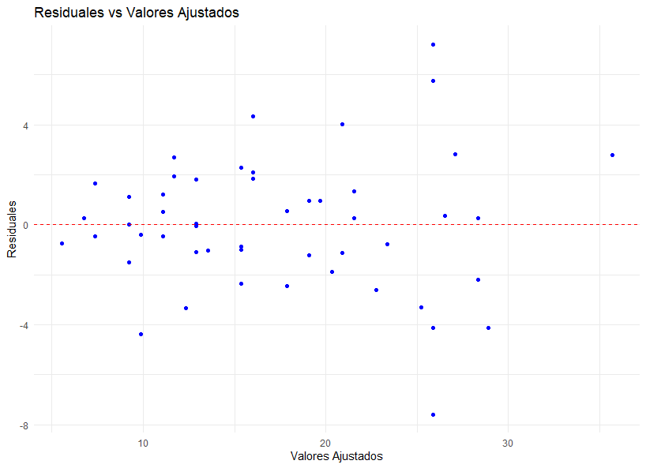
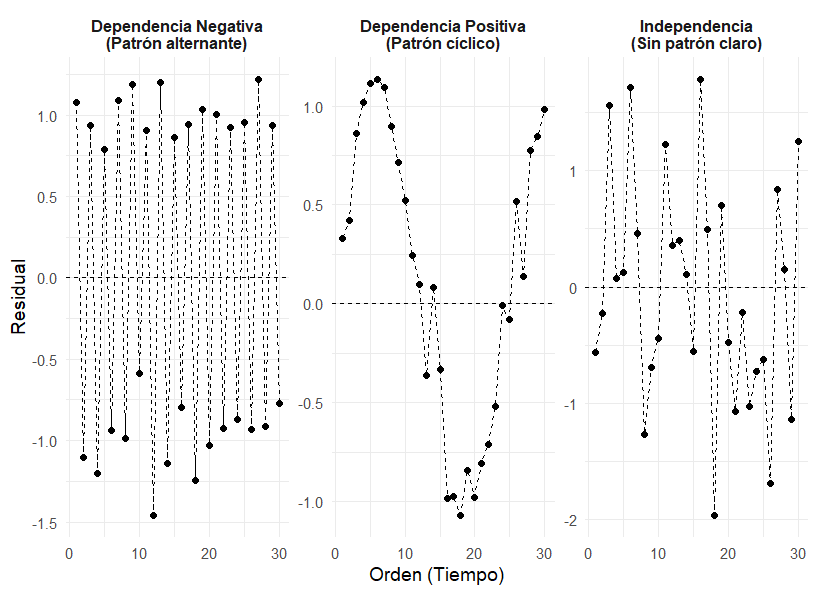
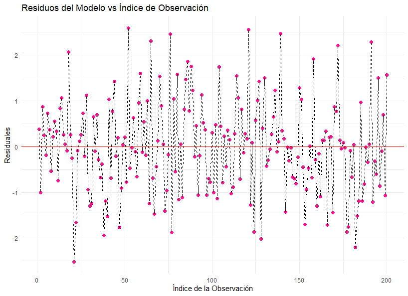
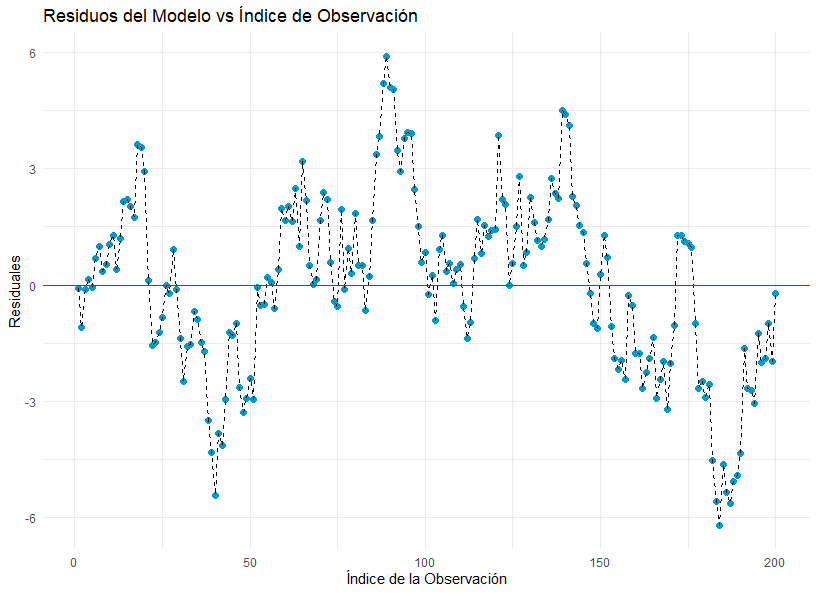
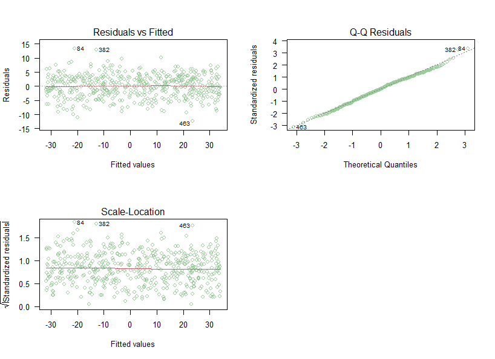
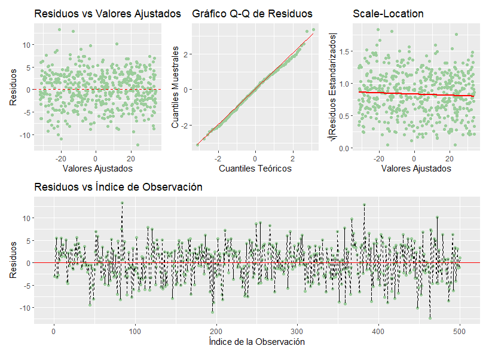

</br></br>
<h2>Normalidad de los errores</h2>


</br></br>
<h3>Gráficos</h3>


Para evaluar si los errores del modelo de regresión tienen una **distribución aproximadamente normal**, se analizan los **residuales estandarizados** \( d_i \), asumiendo \( W_i = 1 \): 


\[
d_i = \frac{e_i}{\hat{\sigma} \sqrt{1 - h_{ii}}}
\]

donde:

- \( e_i \) son los **residuales ordinarios**.

- \( \hat{\sigma} \) es la **desviación estándar del error** estimada en el modelo.

- \( h_{ii} \) es el **leverage** de la observación \( i \), que mide su influencia en el ajuste del modelo.


Una vez calculados los **\( d_i \)**, se utiliza un **gráfico de normalidad** o **QQ-Plot** para visualizar si los residuales siguen una distribución normal. Un ejemplo de este tipo de gráfico es el de la **Figura 3.16**. El gráfico compara los cuantiles de los residuales estandarizados (eje vertical) con los cuantiles teóricos de una distribución normal estándar (eje horizontal). La línea roja representa la relación esperada si los datos siguen una distribución normal. Los puntos azules representan los cuantiles de los residuales. Si la mayoría de los puntos siguen la línea roja, entonces se concluye que los errores del modelo pueden considerarse normalmente distribuidos.


```{r,eval=FALSE,warning=FALSE,message=FALSE,include=FALSE}
# Configurar el entorno para el uso del idioma español
Sys.setlocale("LC_ALL", "es_ES.UTF-8")

# Crear el data.frame con los datos de desintegración radiactiva
datos <- data.frame(
  x = c(0.0, 0.1, 0.3, 0.4, 0.6, 0.7, 0.9, 1.0, 1.1, 1.3,
             1.4, 1.6, 1.7, 1.9, 2.0, 2.1, 2.3, 2.4, 2.6, 2.7,
             2.9, 3.0, 3.1, 3.3, 3.4, 3.6, 3.7, 3.9, 4.0, 4.1,
             4.3, 4.4, 4.6, 4.7, 4.9, 5.0, 5.1, 5.3, 5.4, 5.6,
             5.7, 5.9, 6.0, 6.1, 6.3, 6.4, 6.6, 6.7, 6.9, 7.0),
  y = c(99.4, 97.0, 96.0, 91.9, 89.3, 88.4, 84.7, 80.6, 78.9, 76.9,
               76.4, 73.4, 71.4, 69.1, 66.5, 66.9, 63.8, 59.6, 60.5, 57.6,
               55.4, 54.7, 52.3, 51.1, 49.7, 47.3, 48.4, 46.4, 43.8, 44.9,
               42.9, 40.9, 41.0, 39.8, 38.7, 37.5, 36.3, 34.7, 33.5, 32.4,
               31.2, 30.8, 28.9, 31.4, 29.7, 26.5, 26.5, 25.6, 26.2, 24.6)
)

# Cargar librerías necesarias
library(ggplot2)

# Ajustar un modelo de regresión lineal
modelo <- lm(log(y) ~ x, data = datos)

# Obtener residuales estandarizados
residuales_estandarizados <- rstandard(modelo)

# Generar el QQ-Plot para evaluar normalidad
qqnorm(residuales_estandarizados, main="QQ-Plot de los Residuales Estandarizados", col="blue")
qqline(residuales_estandarizados, col="red", lwd=2)  # Agregar línea de referencia
```


<br/><br/>
<center>
```{r, echo=FALSE, out.width="50%", fig.align = "center"}
knitr::include_graphics("img/fig316.png")
```
**Figura 3.16** QQ-plot de los residuales estandarizados.
</center>
<br/><br/>


```{r,eval=FALSE,warning=FALSE,message=FALSE,include=FALSE}
# Cargar librerías necesarias
library(ggplot2)
library(gridExtra)

# Establecer semilla para reproducibilidad
set.seed(123)

# Generar datos para cada caso
normal_data <- rnorm(100)  # Normalidad
skewed_data <- rgamma(100, shape = 2)  # Sesgo positivo
outlier_data <- c(rnorm(95), rnorm(5, mean = 5))  # Con valores atípicos
s_shape_data <- c(rnorm(50, mean = -2), rnorm(50, mean = 2))  # Forma de S
bimodal_data <- c(rnorm(50, mean = -2), rnorm(50, mean = 2))  # Bimodalidad

# Función para crear QQ-Plots
crear_qqplot <- function(datos, titulo) {
  ggplot(data.frame(sample = datos), aes(sample = sample)) +
    stat_qq() +
    stat_qq_line(color = "red") +
    labs(title = titulo) +
    theme_minimal()
}

# Crear cada QQ-Plot
qq1 <- crear_qqplot(normal_data, "Normalidad")
qq2 <- crear_qqplot(skewed_data, "Sesgo")
qq3 <- crear_qqplot(outlier_data, "Valores Atípicos")
qq4 <- crear_qqplot(s_shape_data, "Forma de S")
qq5 <- crear_qqplot(bimodal_data, "Forma de S")

# Mostrar todos los gráficos en una cuadrícula
grid.arrange(qq1, qq2, qq3, qq4, qq5, ncol = 3)
```

<br/><br/>
<center>
```{r, echo=FALSE, out.width="80%", fig.align = "center"}
knitr::include_graphics("img/fig317.png")
```
**Figura 3.17** Diferentes escenarios de residuales estandarizados.
</center>
<br/><br/>

La **Figura 3.17** presenta diferentes patrones que pueden observarse en un **QQ-Plot**:

- **Gráfico con normalidad**:  Los puntos están alineados con la **línea de referencia** (recta roja), lo que indica que los errores podrían seguir una **distribución normal**.

- **Gráficos con "no normalidad"**: Entre los gráficos se observa que se presenta **curvatura en los extremos**  lo que indica **colas pesadas** o **distribución sesgada**. También hay **saturación de puntos en un extremo** lo que muestra la **presencia de valores atípicos** o distribución no simétrica. Adicionalmente se aprecia una **S marcada** lo que señala de una distribución bimodal o de una transformación incorrecta de los datos.

---

</br></br>
<h3>Pruebas de hipótesis</h3>

Para determinar **inferencialmente** si los errores del modelo de regresión siguen una **distribución normal**, se aplica un **test de normalidad** sobre los **residuales ordinarios** del modelo.

**Hipótesis del test de normalidad:**

-  Hipótesis nula \(\left(H_0\right)\): Los errores siguen una **distribución normal**.

-  Hipótesis alterna \(\left(H_1\right)\): Los errores **no** siguen una distribución normal.

Si el \(valor-p \) obtenido en el test es **mayor** que un nivel de significancia establecido \(\alpha\), no se rechaza \(H_0\), lo que sugiere que los errores pueden considerarse normales. Por el contrario, si el \(valor-p \) es menor que el nivel de significancia, se rechaza \(H_0\) en favor de \(H_1\), indicando que los errores **no** siguen una distribución normal.

**Algunos de los tests de normalidad antes estudiados son:**
 
1. **Test de Shapiro-Wilk** 

   - Función en **R**: `shapiro.test(residuos)`

2. **Test de Kolmogorov-Smirnov**  

   - Función en **R**: `ks.test(residuos, "pnorm", mean = mean(residuos), sd = sd(residuos))`


</br></br>
<div class="caja-ejemplo">
<h3>Ejemplo:</h3>
<p>

En este análisis, se busca modelar la variable respuesta \( Y \) en función de la variable predictora \( X \). Para analizar la validez del modelo de regresión, es fundamental verificar el cumplimiento de los **supuestos estadísticos**, entre ellos el supuesto de **normalidad de los errores**.

Para ello, se utilizarán dos enfoques:

1. **Análisis gráfico**: Se generará un gráfico **Q-Q Plot (Quantile-Quantile Plot)**.
2. **Prueba de hipótesis**: Se aplicará la **prueba de Shapiro-Wilk**.

El conjunto de datos utilizado se encuentra disponible en el siguiente enlace:  
[**Dataset - Normalidad en Regresión**](https://github.com/Centromagis/metodosySIM3_V2/blob/main/datos_MetySim/dat_reg_norm.txt).

---


```{r,eval=FALSE,warning=FALSE,message=FALSE,include=FALSE}
gen_dat <- function(n) {
  varianza <- 16
  x <- runif(n=n, min=-5, max=6)
  media <- 4 - 6 * x + 2 * x^2
  y <- rnorm(n=n, mean=media, sd=sqrt(varianza))
  marco_datos <- data.frame(y=y, x=x)
  return(marco_datos)
}

# datos.sim <- gen_dat(n=500)
# write.table(datos.sim,"gen_dat.txt")
```


Los códigos comentados para construir los gráficos y aplicar el test son los siguientes:


<pre>
# Configurar el entorno para el uso del idioma español
# Sys.setlocale("LC_ALL", "es_ES.UTF-8")

# Lectura de datos
file <- "https://github.com/Centromagis/metodosySIM3_V2/blob/main/datos_MetySim/dat_reg_norm.txt"
datos <- read.table(file=file, header=TRUE)

# Ajustar un modelo de regresión lineal 
# Se genera un modelo de regresión lineal simple donde Y es la variable respuesta y X la predictora.
mod <- lm(y ~ x, data = datos)

# Obtener residuales estandarizados
residuales_estandarizados <- rstandard(mod)

# Generar el QQ-Plot para evaluar normalidad
qqnorm(residuales_estandarizados, main="QQ-Plot de los Residuales Estandarizados", col="blue")
qqline(residuales_estandarizados, col="red", lwd=2)  # Agregar línea de referencia

# Determinar residuos ordinarios y aplicar test de normalidad
ei <- residuals(mod)
shapiro.test(ei)
</pre>


```{r,eval=FALSE,warning=FALSE,message=FALSE}
# Configurar el entorno para el uso del idioma español
# Sys.setlocale("LC_ALL", "es_ES.UTF-8")

# Lectura de datos
file <- "https://github.com/Centromagis/metodosySIM3_V2/blob/main/datos_MetySim/dat_reg_norm.txt"
datos <- read.table(file=file, header=TRUE)

# Ajustar un modelo de regresión lineal 
# Se genera un modelo de regresión lineal simple donde Y es la variable respuesta y X la predictora.
mod <- lm(y ~ x, data = datos)

# Obtener residuales estandarizados
residuales_estandarizados <- rstandard(mod)

# Generar el QQ-Plot para evaluar normalidad
qqnorm(residuales_estandarizados, main="QQ-Plot de los Residuales Estandarizados", col="blue")
qqline(residuales_estandarizados, col="red", lwd=2)  # Agregar línea de referencia

# Determinar residuos ordinarios y aplicar test de normalidad
ei <- residuals(mod)
shapiro.test(ei)
```

La **Figura 3.18** muestra que los puntos del **gráfico de normalidad de los residuales estandarizados** (\( d_i \)) se alejan de la línea de referencia. Esto sugiere que los errores no siguen aproximadamente una distribución normal, lo que **no apoya el supuesto de normalidad** de los errores.

<br/><br/>
<center>
```{r, echo=FALSE, out.width="80%", fig.align = "center"}
knitr::include_graphics("img/fig318.png")
```
**Figura 3.18** QQ-plot de los residuales estandarizados.
</center>
<br/><br/>


Las hipótesis y los resultados de la **prueba de Shapiro-Wilk** aplicada a los residuos ordinarios del modelo de regresión son los siguientes:

**Hipótesis**:

-  Hipótesis nula \(\left(H_0\right)\): Los errores del modelo siguen una distribución normal.

-  Hipótesis alterna \(\left(H_1\right)\): Los errores del modelo **no** siguen una distribución normal.


**Salidas computacionales**:

<pre>
Shapiro-Wilk normality test

data:  ei
W = 0.93259, p-value = 3.119e-14
</pre>


De la salida anterior se aprecia que el \(valor-p =3.119 \times 10^{-14} \) es menor que un nivel de significancia del \( 0.001 \), eso significa que  hay fuerte evidencia para rechazar  la hipótesis de normalidad de los errores.


</p>
</div>


---


</br></br>
<h2>Homocedasticidad</h2>


</br></br>
<h3>Gráficos</h3>

Para evaluar si los **errores tienen varianza constante (homocedasticidad)**, se construye un **gráfico de residuales ordinarios \( e_i \) versus valores ajustados \( \hat{\mu}_i \) o \( \hat{y}_i \)**. Otro gráfico útil para evaluar este supuesto es el **diagrama de dispersión de**  \(\sqrt{|e_i|}\) versus \(\hat{\mu}_i\) o \( \hat{y}_i \), donde:
  
- \( e_i = y_i - \hat{y}_i \) representa los **residuales ordinarios**.

- \( \hat{y}_i \) o \(\hat{\mu}_i\) son los **valores ajustados** del modelo de regresión.

Para analizar los gráficos debe tener en cuenta lo siguiente:

- **Si la varianza de los errores es constante (homocedasticidad)**, los residuales deben distribuirse **aleatoriamente** alrededor de **cero**, sin mostrar un patrón estructurado.

- **Si la varianza de los errores no es constante  (heterocedasticidad)**, los residuos formarán **patrones sistemáticos**, como una forma de embudo o una tendencia en la dispersión.


```{r,eval=FALSE,warning=FALSE,message=FALSE,include=FALSE}
# Configurar el entorno para el uso del idioma español
Sys.setlocale("LC_ALL", "es_ES.UTF-8")


# Cargar librerías necesarias
library(ggplot2)
library(gridExtra)  # Para organizar múltiples gráficos

set.seed(123)

# 1. Simulación de datos con diferentes patrones de residuales 

# Homocedasticidad
x1 <- seq(1, 100, length.out = 100)
y1 <- 5 + 2 * x1 + rnorm(100, mean = 0, sd = 5)
modelo1 <- lm(y1 ~ x1)
residuales1 <- residuals(modelo1)
valores_ajustados1 <- fitted(modelo1)

# Heterocedasticidad (efecto embudo)
y2 <- 5 + 2 * x1 + rnorm(100, mean = 0, sd = x1/10)
modelo2 <- lm(y2 ~ x1)
residuales2 <- residuals(modelo2)
valores_ajustados2 <- fitted(modelo2)

# Heterocedasticidad (varianza en aumento y disminución)
y3 <- 5 + 2 * x1 + rnorm(100, mean = 0, sd = abs(sin(x1/10) * 10))
modelo3 <- lm(y3 ~ x1)
residuales3 <- residuals(modelo3)
valores_ajustados3 <- fitted(modelo3)

# No linealidad
y4 <- 5 + 2 * x1 + 50 * sin(x1 / 10) + rnorm(100, mean = 0, sd = 5)
modelo4 <- lm(y4 ~ x1)
residuales4 <- residuals(modelo4)
valores_ajustados4 <- fitted(modelo4)

# 2. Crear gráficos de dispersión de residuales vs valores ajustados 

grafico1 <- ggplot(data.frame(Ajustados = valores_ajustados1, Residuales = residuales1), aes(x = Ajustados, y = Residuales)) +
  geom_point(color = "black") +
  geom_hline(yintercept = 0, linetype = "solid", color = "black") +
  labs(title = "✅ Homocedasticidad", x = expression(hat(y)[i]), y = expression(e[i])) +
  theme_minimal()

grafico2 <- ggplot(data.frame(Ajustados = valores_ajustados2, Residuales = residuales2), aes(x = Ajustados, y = Residuales)) +
  geom_point(color = "black") +
  geom_hline(yintercept = 0, linetype = "solid", color = "black") +
  labs(title = "Heterocedasticidad (Patrón Embudo)", x = expression(hat(y)[i]), y = expression(e[i])) +
  theme_minimal()

grafico3 <- ggplot(data.frame(Ajustados = valores_ajustados3, Residuales = residuales3), aes(x = Ajustados, y = Residuales)) +
  geom_point(color = "black") +
  geom_hline(yintercept = 0, linetype = "solid", color = "black") +
  labs(title = "Heterocedasticidad (Patrón Ovalado)", x = expression(hat(y)[i]), y = expression(e[i])) +
  theme_minimal()

grafico4 <- ggplot(data.frame(Ajustados = valores_ajustados4, Residuales = residuales4), aes(x = Ajustados, y = Residuales)) +
  geom_point(color = "black") +
  geom_hline(yintercept = 0, linetype = "solid", color = "black") +
  labs(title = "No Linealidad", x = expression(hat(y)[i]), y = expression(e[i])) +
  theme_minimal()

# 3. Organizar gráficos en una cuadrícula
#grid.arrange(grafico1, grafico2, grafico3, grafico4, ncol = 2)
```

La **Figura 3.19** muestra distintos escenarios para evaluar el supuesto de **homocedasticidad** de los errores. Se analizan los **gráficos de residuos ordinarios** versus **valores ajustados** del modelo para revisar si la varianza de los errores es constante. La **homocedasticidad** se implica si los residuos se distribuyen de manera uniforme sin patrones claros. En contraste, la **heterocedasticidad** se concluye si la varianza de los residuos cambia a lo largo de los valores ajustados.


<br/><br/>
<center>
```{r, echo=FALSE, out.width="80%", fig.align = "center"}
knitr::include_graphics("img/fig319.png")
```
**Figura 3.19** Algunos casos posibles de homocedasticidad u heterocedasticidad.
</center>
<br/><br/>


---

</br></br>
<h3>Pruebas de hipótesis</h3>


Para verificar este supuesto, se aplican pruebas estadísticas de homocedasticidad, cuyas hipótesis son:

-  Hipótesis nula \(\left(H_0\right)\): Los errores tienen varianza constante (homocedasticidad).

-  Hipótesis alterna \(\left(H_1\right)\): Los errores no tienen varianza constante (heterocedasticidad).

Entre las pruebas más utilizadas para evaluar este supuesto se encuentran:

- **Test de Breusch-Pagan**: Evalúa si la varianza de los errores está relacionada con las variables explicativas o los valores ajustados. Se basa en una **regresión auxiliar** donde la **variable respuesta** son los **residuos al cuadrado**.

- **Test de White**: Permite detectar no solo dependencia de la varianza de los errores con los valores ajustados, sino también **relaciones no lineales**. Es una extensión de la prueba de Breusch-Pagan que incluye términos cuadráticos y productos cruzados.

- **Test de Goldfeld-Quandt**: Divide los datos en dos grupos y compara la varianza de los errores en cada uno. Es útil cuando se sospecha que la heterocedasticidad está relacionada con el **tamaño de las observaciones** o el **orden de los datos**.

- **Test Score for Nonconstant Error Variance**: Evalúa si la varianza de los errores varía con los valores ajustados. Su ventaja es que no requiere una especificación funcional precisa de la heterocedasticidad.

- **Test de Harrison-McCabe**:  Analiza si los residuos tienen una variabilidad constante a lo largo del conjunto de datos. Se basa en la comparación de la varianza de los residuos en diferentes segmentos de la muestra.


</br></br>
<h4>Breusch-Pagan test</h4>

El procedimiento de la prueba de Breusch-Pagan se basa en ajustar un **modelo de regresión auxiliar**, donde la variable respuesta es el cuadrado de los **residuales** del modelo original (\(\hat{e}_i^2\)), y las covariables son las mismas del modelo original.  

Si el modelo original es:

\[
Y_i = \beta_0 + \beta_1 X_{1i} + \beta_2 X_{2i} + \dots + \beta_k X_{ki} + \varepsilon_i
\]

Entonces, la regresión auxiliar que se ajusta es:

\[
\hat{e}_i^2 = \delta_0 + \delta_1 X_{1i} + \delta_2 X_{2i} + \dots + \delta_k X_{ki} + u_i
\]

Donde:  

- \( \delta_0, \delta_1, \dots, \delta_k \) son los coeficientes de la regresión auxiliar.  

- \( u_i \) representa los errores de este modelo auxiliar.  

Bajo **homocedasticidad**, los coeficientes \( \delta_1, \dots, \delta_k \) deben ser **estadísticamente iguales a cero**.

El estadístico de Breusch-Pagan se define como:

\[
BP = n \times R^2
\]

donde:

- \( n \) es el número de observaciones.  

- \( R^2 \) es el coeficiente de determinación de la **regresión auxiliar**. 

Bajo la hipótesis nula, este estadístico sigue una distribución **\( \chi^2_k \)** con \( k \) grados de libertad (número de predictores en la regresión auxiliar).  

---

Si el modelo original de **regresión lineal simple** es:

\[
Y_i = \beta_0 + \beta_1 X_i + \varepsilon_i, \quad \text{con} \quad \varepsilon_i \sim N(0, \sigma^2)
\]

entonces, la **regresión auxiliar** que se ajusta en la prueba de **Breusch-Pagan** es:

\[
\hat{e}_i^2 = \delta_0 + \delta_1 X_i + u_i
\]

donde:

- \( \hat{e}_i^2 \) son los **residuales al cuadrado** del modelo original.

- \( X_i \) es la única covariable en la regresión auxiliar.

- \( \delta_0, \delta_1 \) son los **coeficientes de la regresión auxiliar**.

- \( u_i \) es el **error** del modelo auxiliar.


Bajo la hipótesis de **homocedasticidad**, se espera que \( \delta_1 = 0 \), lo que significa que la varianza de los errores no depende de \( X_i \).  

---

En **R**, la prueba de Breusch-Pagan se puede implementar con la función `bptest()` del paquete **lmtest**.


</br></br>
<div class="caja-ejemplo">
<h3>Ejemplo:</h3>
<p>

En este análisis, se busca modelar la variable respuesta \( Y \) en función de las variables predictoras \( X_1 \) y \( X_2 \). Para garantizar la validez del modelo de regresión, es fundamental verificar el cumplimiento de los **supuestos estadísticos**, en particular, el supuesto de **homocedasticidad**.

Para ello, se utilizarán dos enfoques:

1. **Análisis gráfico**: Se generarán gráficos de dispersión de los residuales para detectar posibles patrones que indiquen heterocedasticidad.

2. **Prueba de hipótesis**: Se aplicará la **prueba de Breusch-Pagan**, que evalúa si la varianza de los errores depende de las variables predictoras.

El conjunto de datos utilizado se encuentra disponible en el siguiente enlace:  
[**Dataset - Homocedasticidad en Regresión**](https://github.com/Centromagis/metodosySIM3_V2/blob/main/datos_MetySim/dat_reg_hom.txt).

---

```{r,eval=FALSE,warning=FALSE,message=FALSE,include=FALSE}
Sys.setlocale("LC_ALL", "es_ES.UTF-8")

gen_data <- function(n) {
  x1 <- rpois(n, lambda=5)
  x2 <- rbinom(n, size=6, prob=0.4)
  ei <- rnorm(n=n, sd=x2)
  y <- -3 + 2 * x1 + 4 * x2 + ei
  data.frame(y, x1, x2)
}

n <- 200
datos <- gen_data(n=n)


mod <- lm(y ~ x1 + x2, data=datos) # Modelo de interes

ei <- resid(mod)
fit <- lm(ei^2 ~ x1 + x2, data=datos) # Modelando ei^2 ~ x1 + x2
R2 <- summary(fit)$r.squared
k <- 2
estadistico <- n * R2
valorP <- pchisq(q=estadistico, df=k, lower.tail=FALSE)
#cbind(estadistico, valorP)

library(lmtest)
#bptest(mod)
```


El siguiente análisis ajusta un **modelo de regresión lineal múltiple** para explicar \( Y \) en función de \( X_1 \) y \( X_2 \), y evalúa el **supuesto de homocedasticidad** mediante la **prueba de Breusch-Pagan**, tanto de forma manual como con la función `bptest()` del paquete `lmtest`. 

Primero, se extraen los **residuales** del modelo ajustado y se construye un **modelo auxiliar** que modela la varianza de los residuos en función de las variables predictoras. Luego, se calcula el **estadístico de prueba** y su respectivo \(valor-p \) para determinar si los errores presentan varianza constante. 

Adicionalmente, se generan dos gráficos para visualizar la posible heterocedasticidad:

1. **Diagrama de residuales \( e_i \) vs. valores ajustados \( \hat{y}_i \)**

2. **Diagrama de \( \sqrt{|e_i|} \) vs. valores ajustados \( \hat{y}_i \)**


Los códigos comentados para construir los gráficos y aplicar el test son los siguientes:

<pre>
# Para usar leyendas en español
Sys.setlocale("LC_ALL", "es_ES.UTF-8")

# Cargar paquetes necesarios
library(ggplot2)  
library(lmtest)


# Lectura de datos
file <- "https://github.com/Centromagis/metodosySIM3_V2/blob/main/datos_MetySim/dat_reg_hom.txt"
datos <- read.table(file=file, header=TRUE)


# Se ajusta un modelo de regresión lineal con las variables predictoras x1 y x2
mod <- lm(y ~ x1 + x2, data = datos)

# Se obtienen los residuales del modelo
ei <- resid(mod)  # Residuales ordinarios
y_ajustados <- fitted(mod)  # Valores ajustados (predichos)

# Prueba de Breusch-Pagan 
# Se ajusta un modelo auxiliar de regresión de los residuales al cuadrado en función de x1 y x2
fit <- lm(ei^2 ~ x1 + x2, data = datos)
R2 <- summary(fit)$r.squared  # Coeficiente de determinación
n <- nrow(datos)  # Número de observaciones
k <- 2  # Número de predictores
estadistico <- n * R2  # Estadístico de prueba
valorP <- pchisq(q = estadistico, df = k, lower.tail = FALSE)  # Valor p de la prueba

# Mostrar resultados de la prueba Breusch-Pagan
cbind(estadistico, valorP)

# Aplicar la prueba de Breusch-Pagan directamente con lmtest
bptest(mod)

# Visualización de la Homocedasticidad
# Gráfico de Residuales vs Valores Ajustados 
plot1.bt<-ggplot(data = datos, aes(x = y_ajustados, y = ei)) +
  geom_point(color = "blue") +  # Puntos de residuales
  geom_hline(yintercept = 0, linetype = "dashed", color = "red") +  # Línea horizontal en cero
  labs(title = "Residuales vs Valores Ajustados",
       x = "Valores Ajustados",
       y = "Residuales") +
  theme_minimal()

#Gráfico de Raíz de Valor Absoluto de Residuales vs Valores Ajustados 
plot2.bt<-ggplot(data = datos, aes(x = y_ajustados, y = sqrt(abs(ei)))) +
  geom_point(color = "blue") +  # Puntos
  geom_smooth(method = "lm", se = FALSE, color = "red") +  # Línea de tendencia
  labs(title = "Raíz Cuadrada del Valor Absoluto de Residuales vs Valores Ajustados",
       x = "Valores Ajustados",
       y = "√|Residuales|") +
  theme_minimal()

print(plot1.bt)
print(plot2.bt)
</pre>


```{r,eval=FALSE,warning=FALSE,message=FALSE}
# Para usar leyendas en español
Sys.setlocale("LC_ALL", "es_ES.UTF-8")

# Cargar paquetes necesarios
library(ggplot2)  
library(lmtest)


# Lectura de datos
file <- "https://github.com/Centromagis/metodosySIM3_V2/blob/main/datos_MetySim/dat_reg_hom.txt"
datos <- read.table(file=file, header=TRUE)


# Se ajusta un modelo de regresión lineal con las variables predictoras x1 y x2
mod <- lm(y ~ x1 + x2, data = datos)

# Se obtienen los residuales del modelo
ei <- resid(mod)  # Residuales ordinarios
y_ajustados <- fitted(mod)  # Valores ajustados (predichos)

# Prueba de Breusch-Pagan 
# Se ajusta un modelo auxiliar de regresión de los residuales al cuadrado en función de x1 y x2
fit <- lm(ei^2 ~ x1 + x2, data = datos)
R2 <- summary(fit)$r.squared  # Coeficiente de determinación
n <- nrow(datos)  # Número de observaciones
k <- 2  # Número de predictores
estadistico <- n * R2  # Estadístico de prueba
valorP <- pchisq(q = estadistico, df = k, lower.tail = FALSE)  # Valor p de la prueba

# Mostrar resultados de la prueba Breusch-Pagan
cbind(estadistico, valorP)

# Aplicar la prueba de Breusch-Pagan directamente con lmtest
bptest(mod)

# Visualización de la Homocedasticidad
# Gráfico de Residuales vs Valores Ajustados 
plot1.bt<-ggplot(data = datos, aes(x = y_ajustados, y = ei)) +
  geom_point(color = "blue") +  # Puntos de residuales
  geom_hline(yintercept = 0, linetype = "dashed", color = "red") +  # Línea horizontal en cero
  labs(title = "Residuales vs Valores Ajustados",
       x = "Valores Ajustados",
       y = "Residuales") +
  theme_minimal()

#Gráfico de Raíz de Valor Absoluto de Residuales vs Valores Ajustados 
plot2.bt<-ggplot(data = datos, aes(x = y_ajustados, y = sqrt(abs(ei)))) +
  geom_point(color = "blue") +  # Puntos
  geom_smooth(method = "lm", se = FALSE, color = "red") +  # Línea de tendencia
  labs(title = "Raíz Cuadrada del Valor Absoluto de Residuales vs Valores Ajustados",
       x = "Valores Ajustados",
       y = "√|Residuales|") +
  theme_minimal()

print(plot1.bt)
print(plot2.bt)
```


A continuación se muestran los resultados de la prueba Breusch-Pagan. Las **Figura 3.20** y **3.21** complementan la
información para estudiar la variabilidad de los errores.


<pre>
	studentized Breusch-Pagan test

data:  mod
BP = 8.514, df = 2, p-value = 0.01416
</pre>


<br/><br/>
<center>
```{r, echo=FALSE, out.width="80%", fig.align = "center"}

```
**Figura 3.20** Diagrama de residuales \( e_i \) vs. valores ajustados \( \hat{y}_i \).
</center>
<br/><br/>


<br/><br/>
<center>
```{r, echo=FALSE, out.width="80%", fig.align = "center"}
knitr::include_graphics("img/fig321.png")
```
**Figura 3.21** Diagrama de \( \sqrt{|e_i|} \) vs. valores ajustados \( \hat{y}_i \).
</center>
<br/><br/>


Los gráficos de las **Figura 3.20** y **3.21** se observa una estructura no aleatoria en los residuos, y el \(valor-p =0.01416 \) es menor a \( 0.02 \), por tanto se concluye la presencia de **heterocedasticidad** con una significancia del 2%.


</p>
</div>


</br></br>
<h4>White test</h4>

El **test de Breusch-Pagan** es útil para detectar **heterocedasticidad de forma lineal** en los errores del modelo de regresión. Sin embargo, este test no es adecuado cuando la heterocedasticidad presenta una estructura **no lineal**. 

Para abordar este problema, **White (1980)** propuso una prueba más flexible que permite detectar **patrones no lineales** en la varianza de los errores, incorporando términos cuadráticos y productos cruzados de los regresores.

Si el modelo original tiene \( k = 2 \) covariables (\( x_1 \) y \( x_2 \)), el test de White se basa en la siguiente regresión auxiliar:

\[
\hat{e}_i^2 = \delta_0 + \delta_1 x_{1i} + \delta_2 x_{2i} + \delta_3 x_{1i} x_{2i} + \delta_4 x_{1i}^2 + \delta_5 x_{2i}^2 + u_i
\]

donde:

- \( \hat{e}_i^2 \) son los **errores al cuadrado** del modelo original.

- Los coeficientes \( \delta_j \) representan el impacto de cada predictor en la varianza del error.

- El término \( u_i \) es el error aleatorio en la regresión auxiliar.

Si **\( \delta_1 = \delta_2 = \delta_3 = \delta_4 = \delta_5 = 0 \)**, significa que los errores no dependen de las variables predictoras, es decir, el modelo es **homocedástico**.

---

Para evaluar la **homocedasticidad** en una regresión lineal simple, se aplica el **test de White** mediante una regresión auxiliar donde los errores al cuadrado se explican en función de \( X \) y \( X^2 \).


Si el modelo de regresión es:

\[
Y_i = \beta_0 + \beta_1 X_i + \varepsilon_i
\]

entonces la regresión auxiliar utilizada en la prueba de White es:

\[
\hat{e}_i^2 = \delta_0 + \delta_1 X_i + \delta_2 X_i^2 + u_i
\]

donde:

- \( \hat{e}_i^2 \) son los **errores al cuadrado** del modelo original.

- \( X_i \) es la variable predictora.

- \( \delta_1 \) y \( \delta_2 \) evalúan la dependencia de la varianza respecto a \( X_i \).

- \( u_i \) es un término de error aleatorio.


---

En **R**, la prueba de White se puede implementar con la función `bptest()` del paquete **lmtest**, especificando los términos no lineales en la regresión auxiliar.


</br></br>
<div class="caja-ejemplo">
<h3>Ejemplo:</h3>
<p>

Continuando con el ejemplo anterior, ahora se evaluará el supuesto de **homocedasticidad de los errores** utilizando el **test de White**. 

En un modelo de regresión múltiple con dos variables predictoras \( X_1 \) y \( X_2 \), la regresión auxiliar utilizada en el test de White es:

\[
\hat{e}_i^2 = \delta_0 + \delta_1 X_1 + \delta_2 X_2 + \delta_3 X_1 X_2 + \delta_4 X_1^2 + \delta_5 X_2^2 + u_i
\]

donde:

- \( \hat{e}_i^2 \) representa los **errores al cuadrado** obtenidos del modelo original.

- \( X_1 \) y \( X_2 \) son las variables predictoras.

- Los coeficientes \( \delta_1, \delta_2, \delta_3, \delta_4, \delta_5 \) evalúan la relación de los errores con los regresores de forma lineal y no lineal.

- \( u_i \) es un término de error aleatorio de la regresión auxiliar.

A continuación se presentan los códigos de **R** para implementar el test White de forma manual y con la función de **R**. inicialmente se analiza si la varianza puede depender de $X_1$ y $X_2$. 

<pre>
# Cargar paquetes necesarios
library(ggplot2)  # Para visualización de datos (no utilizado en este código, pero útil para gráficos)
library(lmtest)   # Para realizar pruebas de heterocedasticidad, incluyendo el test de Breusch-Pagan y White


# Lectura de datos
# URL del archivo de datos
file <- "https://github.com/Centromagis/metodosySIM3_V2/blob/main/datos_MetySim/dat_reg_hom.txt"

# Cargar el conjunto de datos desde la URL
datos <- read.table(file = file, header = TRUE)


# Se ajusta un modelo de regresión lineal con las variables predictoras x1 y x2
mod <- lm(y ~ x1 + x2, data = datos)


# Aplicación manual del Test de White
# Se ajusta un nuevo modelo donde la variable respuesta es el cuadrado de los residuales del modelo original.
# En este modelo auxiliar, se incluyen términos lineales y no lineales de las variables predictoras.
fit <- lm(resid(mod)^2 ~ x1 + x2 + x1 * x2 + I(x1^2) + I(x2^2), data = datos)

# Se extrae el coeficiente de determinación (R²) del modelo auxiliar
R2 <- summary(fit)$r.squared

# Cálculo del estadístico de prueba
n <- nrow(datos)  # Número de observaciones en los datos
estadistico <- n * R2  # Estadístico de prueba basado en R² y el tamaño de muestra

# Cálculo del valor p basado en la distribución Chi-cuadrado con 5 grados de libertad
valorP <- pchisq(q = estadistico, df = 5, lower.tail = FALSE)

# Mostrar resultados del test manual
cbind(estadistico, valorP)


# Aplicación del Test de White con función de R
# Se aplica el test de White utilizando la función `bptest` del paquete `lmtest`
# Se especifica la fórmula con los términos no lineales de x1 y x2
bptest(mod, varformula = ~ x1 * x2 + I(x1^2) + I(x2^2), data = datos)
</pre>


```{r,eval=FALSE,warning=FALSE,message=FALSE}

# Cargar paquetes necesarios
library(ggplot2)  # Para visualización de datos (no utilizado en este código, pero útil para gráficos)
library(lmtest)   # Para realizar pruebas de heterocedasticidad, incluyendo el test de Breusch-Pagan y White


# Lectura de datos
# URL del archivo de datos
file <- "https://github.com/Centromagis/metodosySIM3_V2/blob/main/datos_MetySim/dat_reg_hom.txt"

# Cargar el conjunto de datos desde la URL
datos <- read.table(file = file, header = TRUE)


# Se ajusta un modelo de regresión lineal con las variables predictoras x1 y x2
mod <- lm(y ~ x1 + x2, data = datos)


# Aplicación manual del Test de White
# Se ajusta un nuevo modelo donde la variable respuesta es el cuadrado de los residuales del modelo original.
# En este modelo auxiliar, se incluyen términos lineales y no lineales de las variables predictoras.
fit <- lm(resid(mod)^2 ~ x1 + x2 + x1 * x2 + I(x1^2) + I(x2^2), data = datos)

# Se extrae el coeficiente de determinación (R²) del modelo auxiliar
R2 <- summary(fit)$r.squared

# Cálculo del estadístico de prueba
n <- nrow(datos)  # Número de observaciones en los datos
estadistico <- n * R2  # Estadístico de prueba basado en R² y el tamaño de muestra

# Cálculo del valor p basado en la distribución Chi-cuadrado con 5 grados de libertad
valorP <- pchisq(q = estadistico, df = 5, lower.tail = FALSE)

# Mostrar resultados del test manual
cbind(estadistico, valorP)


# Aplicación del Test de White con función de R
# Se aplica el test de White utilizando la función `bptest` del paquete `lmtest`
# Se especifica la fórmula con los términos no lineales de x1 y x2
bptest(mod, varformula = ~ x1 * x2 + I(x1^2) + I(x2^2), data = datos)

```

Los resultados del test realizando los calculos manualmente y con la función de **R** son los siguientes:

<pre>
 estadistico     valorP
[1,]    10.44574 0.06354684
</pre>

<pre>
studentized Breusch-Pagan test

data:  mod
BP = 10.446, df = 5, p-value = 0.06355
</pre>

Como el \(valor-p=0.06355 \) es mayor a \(0.05\), no hay  evidencia suficiente  para rechazar la hipótesis de homocedasticidad con una significancia del 5%.

El test de White se basa en modelar la varianza de los errores en función de los regresores y sus términos no lineales. Sin embargo, no todas las formas de heterocedasticidad pueden ser captadas por este modelo auxiliar.

A pesar de la presencia de heterocedasticidad en los gráficos, el test no siempre produce un \(valor-p \) significativo, especialmente si la relación entre la varianza de los errores y los regresores es débil o no es bien representada por el modelo auxiliar.


Para confirmar qué variable está realmente generando la heterocedasticidad, se deben analizar de manera separada los efectos de $X_1$ y $X_2$. A continuación se aplica el test de White considerando: solo a $X_1$ y solo a $X_2$.


<pre>
# Configurar el entorno para el uso del idioma español
Sys.setlocale("LC_ALL", "es_ES.UTF-8")


# Cargar paquetes necesarios
library(ggplot2)   # Para visualización de datos
library(lmtest)    # Para realizar pruebas de heterocedasticidad
library(patchwork) # Para combinar gráficos

# Lectura de datos
file <- "https://github.com/Centromagis/metodosySIM3_V2/blob/main/datos_MetySim/dat_reg_hom.txt
datos <- read.table(file = file, header = TRUE)

# Ajustar el modelo de regresión principal con ambas variables predictoras
mod <- lm(y ~ x1 + x2, data = datos)
residuos <- resid(mod)  # Residuos del modelo conjunto

# Aplicación del Test de White considerando los residuos del modelo conjunto 

# Test de White para X1
fit_x1 <- lm(I(residuos^2) ~ x1 + I(x1^2), data = datos)
R2_x1 <- summary(fit_x1)$r.squared
estadistico_x1 <- nrow(datos) * R2_x1
valorP_x1 <- pchisq(q = estadistico_x1, df = 2, lower.tail = FALSE)
cbind(estadistico_x1, valorP_x1)  # Mostrar resultados del test para X1

# Test de White para X2
fit_x2 <- lm(I(residuos^2) ~ x2 + I(x2^2), data = datos)
R2_x2 <- summary(fit_x2)$r.squared
estadistico_x2 <- nrow(datos) * R2_x2
valorP_x2 <- pchisq(q = estadistico_x2, df = 2, lower.tail = FALSE)
cbind(estadistico_x2, valorP_x2)  # Mostrar resultados del test para X2

# Visualización de los residuales al cuadrado vs X1 y X2 

# Gráfico de Residuales al cuadrado vs X1
grafico_x1 <- ggplot(datos, aes(x = x1, y = residuos^2)) +
  geom_point(color = "blue") +  
  geom_smooth(method = "lm", se = FALSE, color = "red") +  
  labs(title = bquote("Residuales al Cuadrado vs " ~ X[1]), 
       x = bquote(X[1]), 
       y = bquote(e[i]^2))

# Gráfico de Residuales al cuadrado vs X2
grafico_x2 <- ggplot(datos, aes(x = x2, y = residuos^2)) +
  geom_point(color = "blue") +  
  geom_smooth(method = "lm", se = FALSE, color = "red") +  
  labs(title = bquote("Residuales al Cuadrado vs " ~ X[2]), 
       x = bquote(X[2]), 
       y = bquote(e[i]^2))

# Combinar ambos gráficos
grafico_x1 + grafico_x2  # Mostrar gráficos lado a lado

</pre>


```{r,eval=FALSE,warning=FALSE,message=FALSE}
# Configurar el entorno para el uso del idioma español
Sys.setlocale("LC_ALL", "es_ES.UTF-8")


# Cargar paquetes necesarios
library(ggplot2)   # Para visualización de datos
library(lmtest)    # Para realizar pruebas de heterocedasticidad
library(patchwork) # Para combinar gráficos

# Lectura de datos
file <- "https://github.com/Centromagis/metodosySIM3_V2/blob/main/datos_MetySim/dat_reg_hom.txt"
datos <- read.table(file = file, header = TRUE)

# Ajustar el modelo de regresión principal con ambas variables predictoras
mod <- lm(y ~ x1 + x2, data = datos)
residuos <- resid(mod)  # Residuos del modelo conjunto

# Aplicación del Test de White considerando los residuos del modelo conjunto 

# Test de White para X1
fit_x1 <- lm(I(residuos^2) ~ x1 + I(x1^2), data = datos)
R2_x1 <- summary(fit_x1)$r.squared
estadistico_x1 <- nrow(datos) * R2_x1
valorP_x1 <- pchisq(q = estadistico_x1, df = 2, lower.tail = FALSE)
cbind(estadistico_x1, valorP_x1)  # Mostrar resultados del test para X1

# Test de White para X2
fit_x2 <- lm(I(residuos^2) ~ x2 + I(x2^2), data = datos)
R2_x2 <- summary(fit_x2)$r.squared
estadistico_x2 <- nrow(datos) * R2_x2
valorP_x2 <- pchisq(q = estadistico_x2, df = 2, lower.tail = FALSE)
cbind(estadistico_x2, valorP_x2)  # Mostrar resultados del test para X2

# Visualización de los residuales al cuadrado vs X1 y X2 

# Gráfico de Residuales al cuadrado vs X1
grafico_x1 <- ggplot(datos, aes(x = x1, y = residuos^2)) +
  geom_point(color = "blue") +  
  geom_smooth(method = "lm", se = FALSE, color = "red") +  
  labs(title = bquote("Residuales al Cuadrado vs " ~ X[1]), 
       x = bquote(X[1]), 
       y = bquote(e[i]^2))

# Gráfico de Residuales al cuadrado vs X2
grafico_x2 <- ggplot(datos, aes(x = x2, y = residuos^2)) +
  geom_point(color = "blue") +  
  geom_smooth(method = "lm", se = FALSE, color = "red") +  
  labs(title = bquote("Residuales al Cuadrado vs " ~ X[2]), 
       x = bquote(X[2]), 
       y = bquote(e[i]^2))

# Combinar ambos gráficos 
grafico_x1 + grafico_x2  # Mostrar gráficos lado a lado

```

Los resultados obtenidos para el análisis de heterocedasticidad mediante el test de White aplicado a cada variable predictora de forma individual usando los residuos del modelo conjunto de $X_1$ y $X2$ son los siguientes:

<pre>
       estadistico_x1 valorP_x1
[1,]       1.433105 0.4884332
</pre>

<pre>
     estadistico_x2 valorP_x2
[1,]       8.832904  0.012077
</pre>

Estos resultados indican que el supuesto de homocedasticidad se viola en función de $X_2$, pero no de $X_1$. Por lo tanto, cualquier corrección o modelado posterior de la heterocedasticidad debe considerar la influencia de $X_2$ sobre la varianza de los errores.

Respecto a la **Figura 3.22**, que muestra la relación entre el cuadrado de los residuales ordinarios y cada variable predictora:

- **En relación con \( X_1 \)**: Se observa que la mayoría de los puntos se concentran en valores bajos del cuadrado de los residuales. Sin embargo, hay tres valores atípicos extremadamente grandes que afectan significativamente la varianza de los errores. A pesar de su presencia, la regresión ajustada (línea roja) presenta una pendiente relativamente plana, lo que indica una relación débil entre \( X_1 \) y la varianza de los errores. Esto explica por qué el test de White no detecta heterocedasticidad en esta variable, ya que dicho test evalúa patrones sistemáticos en la varianza y no está diseñado para identificar heterocedasticidad provocada exclusivamente por valores atípicos.

- **En relación con \( X_2 \)**: A diferencia de \( X_1 \), la relación entre \( X_2 \) y el cuadrado de los residuales es más evidente. A medida que \( X_2 \) aumenta, la dispersión de los puntos también crece, lo que indica una mayor variabilidad en los errores. Este patrón concuerda con el resultado del test de White aplicado a \( X_2 \), que sugiere la presencia de heterocedasticidad en función de esta variable.


<br/><br/>
<center>
```{r, echo=FALSE, out.width="80%", fig.align = "center"}
knitr::include_graphics("img/fig322.png")
```
**Figura 3.22** El cuadrado de los residuales versus cada variable $X_1$ y $X_2$.
</center>
<br/><br/>


</p>
</div>


</br></br>
<h4> Otros tests</h4>


El presente documento no aborda en detalle los métodos **Score test for nonconstant error variance**, **Goldfeld-Quandt test** y **Harrison-McCabe test**. Sin embargo, a continuación, se presenta la **Tabla 3.8** comparativa que incluye los test de **Breusch-Pagan** y **White**, junto con las funciones correspondientes en **R** utilizadas para su implementación. 

<br/><br/>
<center>
**Tabla 3.8** Comparación de tests para revisar el supuesto de homocedasticidad para una regresión lineal simple.
</center> 

| **Test** | **Objetivo** | **Supuesto evaluado** | **Función en R** |
|----------|-------------|----------------------|-----------------|
| **Breusch-Pagan** | Detectar heterocedasticidad basada en una relación lineal entre los errores y la variable explicativa. | La varianza de los errores debe ser constante (homocedasticidad). | `bptest(mod, data = datos)` (paquete **lmtest**) |
| **White (Regresión Simple con \(X_1\))** | Detectar heterocedasticidad en forma no lineal utilizando términos cuadráticos del predictor. | La varianza de los errores no debe depender de ninguna función de \(X_1\). | `bptest(mod, varformula = ~ I(x1^2), data = datos)` (paquete **lmtest**) |
| **Score test for nonconstant error variance** | Evaluar si la varianza de los errores sigue una función específica del predictor. | Los errores deben tener varianza constante en función de \(X_1\). | `ncvTest(mod)` (paquete **car**) |
| **Goldfeld-Quandt** | Comparar la varianza de los errores en dos subconjuntos de datos ordenados por \(X_1\). | La varianza de los errores no debe cambiar entre subconjuntos de datos ordenados. | `gqtest(mod, order.by = ~ x1, data = datos)` (paquete **lmtest**) |
| **Harrison-McCabe** | Evaluar la homocedasticidad mediante la transformación de los residuos y análisis de varianza. | La varianza de los errores debe ser constante en toda la muestra. | No hay una implementación directa en **R**, se puede programar manualmente mediante pruebas de varianza. |


</br></br>
<div class="caja-ejemplo">
<h3>Ejemplo:</h3>
<p>

En este análisis, se continúa con el modelo del ejemplo anterior y se examina el supuesto de **homocedasticidad de los errores** utilizando las siguientes pruebas estadísticas:

- Test Non-constant Variance Score  

- Test Goldfeld-Quandt  

- Test Harrison-McCabe  

A continuación, se presentan los códigos en **R** para la implementación de estas pruebas, permitiendo evaluar si los errores del modelo presentan varianza constante o si existe evidencia de heterocedasticidad.


<pre>
# Configurar el entorno para el uso del idioma español
 Sys.setlocale("LC_ALL", "es_ES.UTF-8")

# Cargar paquetes necesarios 
library(ggplot2)   # Para visualización de datos
library(lmtest)    # Para realizar pruebas de heterocedasticidad (gqtest y hmctest)
library(patchwork) # Para combinar gráficos
library(car)       # Para aplicar el test ncvTest

# Lectura de datos 
# Se carga el conjunto de datos desde un archivo en línea
file <- "https://github.com/Centromagis/metodosySIM3_V2/blob/main/datos_MetySim/dat_reg_hom.txt"
datos <- read.table(file = file, header = TRUE)  # Leer el archivo con nombres de columnas

# Ajustar el modelo de regresión lineal múltiple 
# Se ajusta un modelo de regresión donde la variable respuesta es "y"
# y las variables predictoras son "x1" y "x2"
mod <- lm(y ~ x1 + x2, data = datos)

# Aplicación de pruebas de homocedasticidad 

# Test de variancia no constante
# Evalúa la presencia de heterocedasticidad en los errores del modelo
ncv_result <- car::ncvTest(mod)
print(ncv_result)

# Test Goldfeld-Quandt (Prueba de heterocedasticidad basada en subgrupos)
# Divide la muestra en dos partes y compara la varianza de los errores en cada una
gq_result <- lmtest::gqtest(mod)
print(gq_result)

# Test Harrison-McCabe  (Prueba para detectar heterocedasticidad)
# Se basa en una regresión auxiliar que evalúa la varianza de los errores en función de los valores ajustados
hmc_result <- lmtest::hmctest(mod)
print(hmc_result)
</pre>

```{r,eval=FALSE,warning=FALSE,message=FALSE}
# Configurar el entorno para el uso del idioma español
 Sys.setlocale("LC_ALL", "es_ES.UTF-8")

# Cargar paquetes necesarios 
library(ggplot2)   # Para visualización de datos
library(lmtest)    # Para realizar pruebas de heterocedasticidad (gqtest y hmctest)
library(patchwork) # Para combinar gráficos
library(car)       # Para aplicar el test ncvTest

# Lectura de datos 
# Se carga el conjunto de datos desde un archivo en línea
file <- "https://github.com/Centromagis/metodosySIM3_V2/blob/main/datos_MetySim/dat_reg_hom.txt
datos <- read.table(file = file, header = TRUE)  # Leer el archivo con nombres de columnas

# Ajustar el modelo de regresión lineal múltiple 
# Se ajusta un modelo de regresión donde la variable respuesta es "y"
# y las variables predictoras son "x1" y "x2"
mod <- lm(y ~ x1 + x2, data = datos)

# Aplicación de pruebas de homocedasticidad 

# Test Non-constant Variance Score (Test de variancia no constante)
# Evalúa la presencia de heterocedasticidad en los errores del modelo
ncv_result <- car::ncvTest(mod)
print(ncv_result)

# Test Goldfeld-Quandt (Prueba de heterocedasticidad basada en subgrupos)
# Divide la muestra en dos partes y compara la varianza de los errores en cada una
gq_result <- lmtest::gqtest(mod)
print(gq_result)

# Test Harrison-McCabe (Prueba para detectar heterocedasticidad)
# Se basa en una regresión auxiliar que evalúa la varianza de los errores en función de los valores ajustados
hmc_result <- lmtest::hmctest(mod)
print(hmc_result)
```


Los resultados de las pruebas de homocedasticidad se presentan a continuación:

- Los tests **Goldfeld-Quandt** y **Non-constant Variance Score** rechazan la hipótesis nula de homocedasticidad con niveles de significancia del **1%** y **5%**, respectivamente. Esto indica que existe evidencia de que los errores del modelo presentan **heterocedasticidad**.


- El test de **Harrison-McCabe** no rechaza la homocedasticidad con un nivel de significancia del **5%**, lo que sugiere que, bajo este test, no se encuentra suficiente evidencia para afirmar que los errores presentan variabilidad no constante.

A continuación, se muestran los resultados de cada prueba:

<pre>
Non-constant Variance Score Test 
Variance formula: ~ fitted.values 
Chisquare = 11.38644, Df = 1, p = 0.00073982
</pre>

<pre>
Goldfeld-Quandt test

data:  mod
GQ = 2.0997, df1 = 22, df2 = 22, p-value = 0.04446
alternative hypothesis: variance increases from segment 1 to 2
</pre>

<pre>
	Harrison-McCabe test

data:  mod
HMC = 0.34793, p-value = 0.066
</pre>

El test de **Harrison-McCabe** evalúa la heterocedasticidad mediante una **regresión auxiliar basada en los valores ajustados** del modelo. Esto significa que el test **asume que la heterocedasticidad es monótona** y está relacionada con los valores ajustados \( \hat{Y} \).

Sin embargo, en este caso, la heterocedasticidad está **fuertemente asociada con una única variable predictora**, específicamente **\(X_2\)**, y **no con los valores ajustados \( \hat{Y} \)**. Esta particularidad **reduce la sensibilidad del test**, dificultando la detección de heterocedasticidad cuando su estructura depende de una sola variable y no del modelo en su conjunto.

Además, si la **varianza de los errores depende de \(X_2\) de manera no lineal**, el test puede **no captar adecuadamente esta relación**, dado que se basa en relaciones más simples entre los errores y los valores ajustados.

En términos generales, el **Harrison-McCabe test** es menos flexible para detectar heterocedasticidad **cuando esta está localizada en una única variable predictora** y **no afecta significativamente los valores ajustados \( \hat{Y} \)**. 

Dado que en este caso la heterocedasticidad depende directamente de **\(X_2\) y no de \( \hat{Y} \)**, **el test no la detecta con suficiente potencia**. Por esta razón, **el Non-constant Variance Score Test y el test de Goldfeld-Quandt resultan más apropiados** para identificar la heterocedasticidad en este tipo de escenarios.

  
</p>
</div>


---

</br></br>
<h2>Independencia</h2>


</br></br>
<h3>Gráficos</h3>

Para evaluar el supuesto de **independencia de los errores**, se analiza el **gráfico de residuos (\( e_i \)) versus tiempo**. La independencia implica que no existe un **patrón sistemático** en los residuos a lo largo del tiempo. Si los residuos presentan **tendencias o correlaciones**, es una señal de que el modelo no captura correctamente la estructura de los datos.

Los gráficos de la **Figura 3.23** presentan tres posibles escenarios: dos de dependencia y uno de independencia.

```{r, eval=FALSE, warning=FALSE, message=FALSE,include=FALSE}
# Cargar librerías necesarias
library(ggplot2)
library(dplyr)

# Generar datos simulados
set.seed(123)

# Independencia (ruido aleatorio sin patrón)
n <- 30
orden_tiempo <- 1:n
residuales_independientes <- rnorm(n, mean = 0, sd = 1)

# Dependencia positiva (patrón cíclico)
residuales_dependencia_positiva <- sin(orden_tiempo / 4) + rnorm(n, mean = 0, sd = 0.2)

# Dependencia negativa (patrón alternante)
residuales_dependencia_negativa <- rep(c(1, -1), length.out = n) + rnorm(n, mean = 0, sd = 0.2)

# Crear un dataframe con los tres conjuntos de datos
datos <- data.frame(
  Orden = rep(orden_tiempo, 3),
  Residual = c(residuales_independientes, residuales_dependencia_positiva, residuales_dependencia_negativa),
  Tipo = rep(c("Independencia", "Dependencia Positiva", "Dependencia Negativa"), each = n)
)

# Etiquetas mejoradas para las gráficas
etiquetas <- c(
  "Independencia" = "Independencia\n(Sin patrón claro)",
  "Dependencia Positiva" = "Dependencia Positiva\n(Patrón cíclico)",
  "Dependencia Negativa" = "Dependencia Negativa\n(Patrón alternante)"
)

# Generar gráfico con ggplot2
plot.ind<-ggplot(datos, aes(x = Orden, y = Residual)) +
  geom_point(size = 2) +
  geom_line(linetype = "dashed") +
  geom_hline(yintercept = 0, linetype = "dashed", color = "black") +
  facet_wrap(~ Tipo, scales = "free_y", labeller = labeller(Tipo = etiquetas)) +
  theme_minimal(base_size = 14) +
  labs(x = "Orden (Tiempo)", y = "Residual") +
  theme(strip.text = element_text(size = 12, face = "bold"))
```


<br/><br/>
<center>
```{r, echo=FALSE, out.width="80%", fig.align = "center"}

```
**Figura 3.23** Escenarios de dependencia e independencia.
</center>
<br/><br/>


</br></br>
<h3>Pruebas de hipótesis</h3>

Para verificar el **supuesto de independencia de los errores**, se aplican pruebas estadísticas diseñadas para detectar la presencia de **autocorrelación** en los residuos del modelo de regresión.

Las hipótesis de estas pruebas son:

- Hipótesis nula \(\left(H_0\right)\): Los errores son independientes, es decir, no presentan autocorrelación.

- Hipótesis alterna \(\left(H_1\right)\): Los errores **no** son independientes, es decir, presentan autocorrelación.

Entre las pruebas más utilizadas para evaluar este supuesto se encuentran:

- Test de **Durbin-Watson**: Evalúa la presencia de **autocorrelación de primer orden** en los errores del modelo. Es especialmente útil en datos ordenados temporalmente.

- Test de **Breusch-Godfrey**: Es una generalización del **Durbin-Watson Test**, que permite detectar autocorrelación de **orden superior** en los errores.


---

</br></br>
<div class="caja-ejemplo">
<h3>Ejemplo:</h3>
<p>


```{r, eval=FALSE, warning=FALSE, message=FALSE,include=FALSE}
library(lmtest)

## generate regressor
x <- rep(c(-1, 1), 100)

## generate the AR(1) error terms with parameter rho = 0 (white noise)
err1 <- rnorm(200)
## generate dependent variable
y1 <- 1 + x + err1

dat<-data.frame(x,y=y1)
#write.table(dat,"dat_reg_ind1.txt")


mod1 <- lm(y1 ~ x)
#plot(residuals(mod1), pch=19, col="deepskyblue1")


#dwtest(mod1) ## perform Durbin-Watson test
#bgtest(mod1) ## perform Durbin-Watson test


## generate the AR(1) error terms with parameter rho = 0.9 respectively
err2 <- stats::filter(x=err1, filter=0.9, method="recursive")
## generate dependent variable
y2 <- 1 + x + err2

dat<-data.frame(x,y=y2)
#write.table(dat,"dat_reg_ind2.txt")

mod2 <- lm(y2 ~ x)
#plot(residuals(mod2), pch=19, col="tomato")

#dwtest(mod2) ## perform Durbin-Watson test
#bgtest(mod2) ## perform Durbin-Watson test

```


En este ejemplo, se analiza la independencia de los errores en modelos de regresión lineal simple. Se modela la variable **\( Y \)** a partir de la variable **\( X \)** utilizando dos conjuntos de datos disponibles en los siguientes enlaces:

- [Base de datos 1](https://raw.githubusercontent.com/Centromagis/metodosySIM3_V2/refs/heads/main/datos_MetySim/dat_reg_ind1.txt)

- [Base de datos 2](https://raw.githubusercontent.com/Centromagis/metodosySIM3_V2/refs/heads/main/datos_MetySim/dat_reg_ind2.txt)


Se ajusta un **modelo de regresión lineal simple** en cada conjunto de datos y se aplican pruebas estadísticas para verificar si los errores del modelo cumplen con el supuesto de **independencia**. 

Para ello, se utilizan las siguientes pruebas:

- **Test de Durbin-Watson**: Evalúa la presencia de autocorrelación de primer orden en los errores.

- **Test de Breusch-Godfrey**: Evalúa la autocorrelación de orden superior en los errores.

A continuación, se presentan los códigos en **R**, los resultados obtenidos y su interpretación.


---


**Para los datos 1**:

Los códigos en **R** son los siguientes:

<pre>
# Configurar el entorno para el uso del idioma español
Sys.setlocale("LC_ALL", "es_ES.UTF-8")


# Cargar paquetes necesarios
library(ggplot2)  # Para la visualización de los residuos
library(lmtest)   # Para las pruebas de independencia de los errores

# Lectura de datos 
# URL del archivo de datos
file <- "https://raw.githubusercontent.com/Centromagis/metodosySIM3_V2/refs/heads/main/datos_MetySim/dat_reg_ind1.txt"

# Cargar el conjunto de datos desde la URL
datos <- read.table(file = file, header = TRUE)

# Ajuste del modelo de regresión 
# Se ajusta un modelo de regresión lineal simple con 'x' como predictor de 'y'
mod1 <- lm(y ~ x, data = datos)

# Visualización de los residuos 
# Se crea un data frame con los residuos y su índice de observación
resid_data <- data.frame(
  Observacion = seq_along(residuals(mod1)),  # Índice de cada observación
  Residuales = residuals(mod1)              # Valores de los residuos
)

# Gráfico de residuos usando ggplot2
ggplot(resid_data, aes(x = Observacion, y = Residuales)) +
  geom_point(color = "deeppink", size = 2) +       # Puntos de los residuos
  geom_line(color = "black", linetype = "dashed") + # Línea guía de los residuos
  geom_hline(yintercept = 0, color = "red", linetype = "solid") + # Línea en y = 0
  labs(title = "Residuos del Modelo vs Índice de Observación",
       x = "Índice de la Observación", 
       y = "Residuales") +
  theme_minimal()  # Estilo de gráfico limpio

# Pruebas de independencia de los errores 

# Test de Durbin-Watson
# Evalúa si los errores presentan autocorrelación de primer orden
dw_test <- dwtest(mod1)
print(dw_test)

# Test de Breusch-Godfrey
# Permite evaluar autocorrelación de orden superior en los errores
bg_test <- bgtest(mod1)
print(bg_test)
</pre>


```{r, eval=FALSE, warning=FALSE, message=FALSE}
# Configurar el entorno para el uso del idioma español
Sys.setlocale("LC_ALL", "es_ES.UTF-8")


# Cargar paquetes necesarios
library(ggplot2)  # Para la visualización de los residuos
library(lmtest)   # Para las pruebas de independencia de los errores

# Lectura de datos 
# URL del archivo de datos
file <- "https://raw.githubusercontent.com/Centromagis/metodosySIM3_V2/refs/heads/main/datos_MetySim/dat_reg_ind1.txt"

# Cargar el conjunto de datos desde la URL
datos <- read.table(file = file, header = TRUE)

# Ajuste del modelo de regresión 
# Se ajusta un modelo de regresión lineal simple con 'x' como predictor de 'y'
mod1 <- lm(y ~ x, data = datos)

# Visualización de los residuos 
# Se crea un data frame con los residuos y su índice de observación
resid_data <- data.frame(
  Observacion = seq_along(residuals(mod1)),  # Índice de cada observación
  Residuales = residuals(mod1)              # Valores de los residuos
)

# Gráfico de residuos usando ggplot2
ggplot(resid_data, aes(x = Observacion, y = Residuales)) +
  geom_point(color = "deeppink", size = 2) +       # Puntos de los residuos
  geom_line(color = "black", linetype = "dashed") + # Línea guía de los residuos
  geom_hline(yintercept = 0, color = "red", linetype = "solid") + # Línea en y = 0
  labs(title = "Residuos del Modelo vs Índice de Observación",
       x = "Índice de la Observación", 
       y = "Residuales") +
  theme_minimal()  # Estilo de gráfico limpio

# Pruebas de independencia de los errores 

# Test Durbin-Watson
# Evalúa si los errores presentan autocorrelación de primer orden
dw_test <- dwtest(mod1)
print(dw_test)

# Test Breusch-Godfrey
# Permite evaluar autocorrelación de orden superior en los errores
bg_test <- bgtest(mod1)
print(bg_test)

```

Los $valores-p$ obtenidos en ambas pruebas son mayores a **0.05**, lo que indica que con un nivel de significancia del **5%**, **no se rechaza la hipótesis nula de independencia de los errores**. 

La **Figura 3.24** presenta la gráfica de los residuos del modelo en función del índice de observación. Se observa que los residuos oscilan aleatoriamente alrededor de cero, sin mostrar un patrón sistemático, lo cual concuerda con los resultados de ambas pruebas y sugiere que no hay evidencia de autocorrelación en los errores.


A continuación, se muestran los resultados de cada prueba: 


<pre>
Durbin-Watson test

data:  mod1
DW = 1.9715, p-value = 0.4477
alternative hypothesis: true autocorrelation is greater than 0
</pre>


<pre>
Breusch-Godfrey test for serial correlation of order up to 1

data:  mod1
LM test = 0.013288, df = 1, p-value = 0.9082
</pre>


<br/><br/>
<center>
```{r, echo=FALSE, out.width="80%", fig.align = "center"}

```
**Figura 3.24** Residuos del modelo en función del índice de observación para datos 1.
</center>
<br/><br/>


**Para los datos 2**:

Los códigos en **R** son los siguientes:

<pre>
# Configurar el entorno para el uso del idioma español
Sys.setlocale("LC_ALL", "es_ES.UTF-8")

# Cargar paquetes necesarios
library(ggplot2)  # Para visualización de residuos
library(lmtest)   # Para realizar pruebas de independencia de los errores

# Lectura de datos 
# URL del archivo de datos
file <- "https://raw.githubusercontent.com/Centromagis/metodosySIM3_V2/refs/heads/main/datos_MetySim/dat_reg_ind2.txt"

# Cargar el conjunto de datos desde la URL
datos <- read.table(file = file, header = TRUE)

# Ajuste del modelo de regresión 
# Se ajusta un modelo de regresión lineal simple con 'x' como predictor de 'y'
mod2 <- lm(y ~ x, data = datos)

# Visualización de los residuos 
# Crear un data frame con los residuos y su índice de observación
resid_data <- data.frame(
  Observacion = seq_along(residuals(mod2)),  # Índice de cada observación
  Residuales = residuals(mod2)              # Valores de los residuos
)

# Gráfico de residuos usando ggplot2
ggplot(resid_data, aes(x = Observacion, y = Residuales)) +
  geom_point(color = "deepskyblue3", size = 2) +       # Puntos de los residuos
  geom_line(color = "black", linetype = "dashed") +    # Línea discontinua para seguir la tendencia
  geom_hline(yintercept = 0, color = "red", linetype = "solid") + # Línea en y = 0
  labs(title = "Residuos del Modelo vs Índice de Observación",
       x = "Índice de la Observación", 
       y = "Residuales") +
  theme_minimal()  # Estilo de gráfico limpio

# Pruebas de independencia de los errores 

# Test de Durbin-Watson 
# Evalúa la presencia de autocorrelación de primer orden en los errores
dw_test <- dwtest(mod2)
print(dw_test)

# Test de Breusch-Godfrey
# Evalúa la autocorrelación de orden superior en los errores
bg_test <- bgtest(mod2)
print(bg_test)

</pre>


```{r, eval=FALSE, warning=FALSE, message=FALSE}
# Configurar el entorno para el uso del idioma español
Sys.setlocale("LC_ALL", "es_ES.UTF-8")

# Cargar paquetes necesarios
library(ggplot2)  # Para visualización de residuos
library(lmtest)   # Para realizar pruebas de independencia de los errores

# Lectura de datos 
# URL del archivo de datos
file <- "https://raw.githubusercontent.com/Centromagis/metodosySIM3_V2/refs/heads/main/datos_MetySim/dat_reg_ind2.txt"

# Cargar el conjunto de datos desde la URL
datos <- read.table(file = file, header = TRUE)

# Ajuste del modelo de regresión 
# Se ajusta un modelo de regresión lineal simple con 'x' como predictor de 'y'
mod2 <- lm(y ~ x, data = datos)

# Visualización de los residuos 
# Crear un data frame con los residuos y su índice de observación
resid_data <- data.frame(
  Observacion = seq_along(residuals(mod2)),  # Índice de cada observación
  Residuales = residuals(mod2)              # Valores de los residuos
)

# Gráfico de residuos usando ggplot2
ggplot(resid_data, aes(x = Observacion, y = Residuales)) +
  geom_point(color = "deepskyblue3", size = 2) +       # Puntos de los residuos
  geom_line(color = "black", linetype = "dashed") +    # Línea discontinua para seguir la tendencia
  geom_hline(yintercept = 0, color = "red", linetype = "solid") + # Línea en y = 0
  labs(title = "Residuos del Modelo vs Índice de Observación",
       x = "Índice de la Observación", 
       y = "Residuales") +
  theme_minimal()  # Estilo de gráfico limpio

# Pruebas de independencia de los errores 

# Test Durbin-Watson
# Evalúa la presencia de autocorrelación de primer orden en los errores
dw_test <- dwtest(mod2)
print(dw_test)

# Test Breusch-Godfrey
# Evalúa la autocorrelación de orden superior en los errores
bg_test <- bgtest(mod2)
print(bg_test)


```


Los $valores-p$ obtenidos en ambas pruebas son menores a **0.001**, lo que indica que con un nivel de significancia del **1%**, **se rechaza la hipótesis nula de independencia de los errores**. 

La **Figura 3.25** presenta la gráfica de los residuos del modelo en función del índice de observación. En un modelo con errores independientes, los residuos deberían oscilar de manera aleatoria alrededor de cero, sin mostrar **patrones evidentes**. Sin embargo, en este caso, se observa un **comportamiento cíclico o estructurado en los residuos**, lo que sugiere una fuerte dependencia temporal o secuencial en los errores. 

Este patrón indica que los errores **no son independientes**, sino que pueden estar correlacionados entre sí. En particular:

- Se observan **secciones donde los residuos permanecen positivos o negativos por varios puntos consecutivos**, en lugar de distribuirse de manera aleatoria.

- Se presentan **fluctuaciones amplias y persistentes**, lo que indica que el modelo no captura adecuadamente la estructura de los datos.

- El comportamiento oscilatorio es consistente con la **autocorrelación positiva**, donde los errores en un instante tienden a estar relacionados con los errores en instantes previos.

A continuación, se muestran los resultados de cada prueba:

<pre>
Durbin-Watson test

data:  mod2
DW = 0.20866, p-value < 2.2e-16
alternative hypothesis: true autocorrelation is greater than 0

</pre>


<pre>
Breusch-Godfrey test for serial correlation of order up to 1

data:  mod2
LM test = 160.44, df = 1, p-value < 2.2e-16
</pre>


<br/><br/>
<center>
```{r, echo=FALSE, out.width="80%", fig.align = "center"}

```
**Figura 3.25** Residuos del modelo en función del índice de observación para datos 2.
</center>
<br/><br/>

</p>
</div>


---


</br></br>
<div class="caja-ejemplo">
<h3>Ejemplo:</h3>
<p>

En este análisis, se verifican los **supuestos de los errores** en un modelo de **regresión lineal simple**. Se modela la variable **\( Y \)** en función de la variable **\( X \)** utilizando un conjunto de datos disponible en el siguiente enlace:

- [Base de datos](https://raw.githubusercontent.com/Centromagis/metodosySIM3_V2/refs/heads/main/datos_MetySim/dat_ok.txt)

Se ajusta un **modelo de regresión lineal simple** y se aplican **pruebas estadísticas** para evaluar si los errores cumplen con los supuestos de **normalidad, homocedasticidad e independencia**.

Pruebas utilizadas para evaluar los supuestos:

- **Prueba de normalidad:**

  - Test de Shapiro-Wilk.
  
  - Test de Anderson-Darling.
  
  - Test de Kolmogorov-Smirnov.
  
  

- **Pruebas de homocedasticidad:**

  - Test de Breusch-Pagan.
  
  - Test de White.
  
  - Test de Goldfeld-Quandt.

- **Pruebas de independencia:**

  - Test de Durbin-Watson.
  
  - Test de Breusch-Godfrey.

A continuación, se presentan los códigos en **R**, los resultados obtenidos y su interpretación.


```{r, eval=FALSE, warning=FALSE, message=FALSE,include=FALSE}
gen_dat <- function(n) {
  varianza <- 16
  x <- runif(n=n, min=-5, max=6)
  media <- 4 - 6 * x
  y <- rnorm(n=n, mean=media, sd=sqrt(varianza))
  marco_datos <- data.frame(y=y, x=x)
  return(marco_datos)
}

dat <- gen_dat(n=500)
#write.table(dat,"dat_ok.txt")
mod <- lm(y ~ x, data=datos)
```


<pre>
# Configurar el entorno para el uso del idioma español
Sys.setlocale("LC_ALL", "es_ES.UTF-8")


# Cargar paquetes necesarios
library(ggplot2)   # Para visualización de datos
library(lmtest)    # Para pruebas de independencia y homocedasticidad
library(car)       # Para el test de normalidad y homocedasticidad
library(nortest)   # Para pruebas adicionales de normalidad
library(patchwork) # Para combinar gráficos en una sola figura


# Lectura de datos
file <- "https://raw.githubusercontent.com/Centromagis/metodosySIM3_V2/refs/heads/main/datos_MetySim/dat_ok.txt"
datos <- read.table(file = file, header = TRUE)

# Ajuste del modelo de regresión
mod <- lm(y ~ x, data=datos)

# Evaluación de los supuestos del modelo 

## Verificación de homocedasticidad
# Se generan gráficos de diagnóstico para evaluar la homocedasticidad y la normalidad
par(mfrow=c(2, 2))  # Organiza los gráficos en una cuadrícula de 2x2
plot(mod, las=1, col='darkseagreen3', which=1:3) 

# Evaluación de normalidad de los errores
ei <- residuals(mod)  # Se extraen los residuos del modelo

# Prueba de Shapiro-Wilk
shapiro.test(ei)  # Prueba de normalidad para muestras pequeñas

# Prueba de Anderson-Darling (más robusta para normalidad)
ad.test(ei)

# Prueba de Kolmogorov-Smirnov (para verificar normalidad)
ks.test(ei, "pnorm", mean(ei), sd(ei))


# Evaluación de independencia de los errores
# Test de Durbin-Watson para detectar autocorrelación de primer orden
dwtest(mod)

# Test de Breusch-Godfrey para correlación serial de orden superior
bgtest(mod)


# Evaluación de homocedasticidad
# Test de Breusch-Pagan (detecta heterocedasticidad)
bptest(mod)

# Test de White (heterocedasticidad con términos no lineales)
bptest(mod, varformula = ~ poly(x, 2), data=datos)

# Test de Goldfeld-Quandt (para heterocedasticidad en la mitad de los datos)
gqtest(mod)


# Visualización adicional de los residuos 


# Obtener residuos, valores ajustados e índice de observación
residuos <- residuals(mod)
valores_ajustados <- fitted(mod)
residuos_estandarizados <- rstandard(mod)
indice_observacion <- 1:length(residuos)

# Obtener residuos y valores ajustados
residuos <- residuals(mod)
valores_ajustados <- fitted(mod)
residuos_estandarizados <- rstandard(mod)

# Gráfico de Residuos vs Valores Ajustados
grafico_residuos <- ggplot(data = data.frame(valores_ajustados, residuos), aes(x = valores_ajustados, y = residuos)) +
  geom_point(color = "darkseagreen3") +
  geom_hline(yintercept = 0, linetype = "dashed", color = "red") +
  labs(title = "Residuos vs Valores Ajustados", x = "Valores Ajustados", y = "Residuos")

# Gráfico Q-Q de Residuos
grafico_qq <- ggplot(data = data.frame(residuos_estandarizados), aes(sample = residuos_estandarizados)) +
  stat_qq(color = "darkseagreen3") +
  stat_qq_line(color = "red") +
  labs(title = "Gráfico Q-Q de Residuos", x = "Cuantiles Teóricos", y = "Cuantiles Muestrales")

# Gráfico Scale-Location (Raíz cuadrada de |Residuos Estandarizados| vs Valores Ajustados)
grafico_scale <- ggplot(data = data.frame(valores_ajustados, residuos_estandarizados), 
                        aes(x = valores_ajustados, y = sqrt(abs(residuos_estandarizados)))) +
  geom_point(color = "darkseagreen3") +
  geom_smooth(method = "lm", se = FALSE, color = "red") +
  labs(title = "Scale-Location", x = "Valores Ajustados", y = "√|Residuos Estandarizados|")


# Gráfico de Residuos vs Índice de Observación (para independencia de los errores)
grafico_residuos_index <- ggplot(data = data.frame(indice_observacion, residuos), aes(x = indice_observacion, y = residuos)) +
  geom_point(color = "darkseagreen3") +
  geom_line(linetype = "dashed", color = "black") +
  geom_hline(yintercept = 0, linetype = "solid", color = "red") +
  labs(title = "Residuos vs Índice de Observación", x = "Índice de la Observación", y = "Residuos")

# Visualización combinada
(grafico_residuos + grafico_qq + grafico_scale) / grafico_residuos_index  # Organiza los gráficos en filas

</pre>


```{r, eval=FALSE, warning=FALSE, message=FALSE}
# Configurar el entorno para el uso del idioma español
Sys.setlocale("LC_ALL", "es_ES.UTF-8")


# Cargar paquetes necesarios
library(ggplot2)   # Para visualización de datos
library(lmtest)    # Para pruebas de independencia y homocedasticidad
library(car)       # Para el test de normalidad y homocedasticidad
library(nortest)   # Para pruebas adicionales de normalidad
library(patchwork) # Para combinar gráficos en una sola figura


# Lectura de datos
file <- "https://raw.githubusercontent.com/Centromagis/metodosySIM3_V2/refs/heads/main/datos_MetySim/dat_ok.txt"
datos <- read.table(file = file, header = TRUE)

# Ajuste del modelo de regresión
mod <- lm(y ~ x, data=datos)

# Evaluación de los supuestos del modelo 

## Verificación de homocedasticidad
# Se generan gráficos de diagnóstico para evaluar la homocedasticidad y la normalidad
par(mfrow=c(2, 2))  # Organiza los gráficos en una cuadrícula de 2x2
plot(mod, las=1, col='darkseagreen3', which=1:3) 

# Evaluación de normalidad de los errores
ei <- residuals(mod)  # Se extraen los residuos del modelo

# Prueba de Shapiro-Wilk
shapiro.test(ei)  # Prueba de normalidad para muestras pequeñas

# Prueba de Anderson-Darling (más robusta para normalidad)
ad.test(ei)

# Prueba de Kolmogorov-Smirnov (para verificar normalidad)
ks.test(ei, "pnorm", mean(ei), sd(ei))


# Evaluación de independencia de los errores
# Test de Durbin-Watson para detectar autocorrelación de primer orden
dwtest(mod)

# Test de Breusch-Godfrey para correlación serial de orden superior
bgtest(mod)


# Evaluación de homocedasticidad
# Test de Breusch-Pagan (detecta heterocedasticidad)
bptest(mod)

# Test de White (heterocedasticidad con términos no lineales)
bptest(mod, varformula = ~ poly(x, 2), data=datos)

# Test de Goldfeld-Quandt (para heterocedasticidad en la mitad de los datos)
gqtest(mod)


# Visualización adicional de los residuos 


# Obtener residuos, valores ajustados e índice de observación
residuos <- residuals(mod)
valores_ajustados <- fitted(mod)
residuos_estandarizados <- rstandard(mod)
indice_observacion <- 1:length(residuos)

# Obtener residuos y valores ajustados
residuos <- residuals(mod)
valores_ajustados <- fitted(mod)
residuos_estandarizados <- rstandard(mod)

# Gráfico de Residuos vs Valores Ajustados
grafico_residuos <- ggplot(data = data.frame(valores_ajustados, residuos), aes(x = valores_ajustados, y = residuos)) +
  geom_point(color = "darkseagreen3") +
  geom_hline(yintercept = 0, linetype = "dashed", color = "red") +
  labs(title = "Residuos vs Valores Ajustados", x = "Valores Ajustados", y = "Residuos")

# Gráfico Q-Q de Residuos
grafico_qq <- ggplot(data = data.frame(residuos_estandarizados), aes(sample = residuos_estandarizados)) +
  stat_qq(color = "darkseagreen3") +
  stat_qq_line(color = "red") +
  labs(title = "Gráfico Q-Q de Residuos", x = "Cuantiles Teóricos", y = "Cuantiles Muestrales")

# Gráfico Scale-Location (Raíz cuadrada de |Residuos Estandarizados| vs Valores Ajustados)
grafico_scale <- ggplot(data = data.frame(valores_ajustados, residuos_estandarizados), 
                        aes(x = valores_ajustados, y = sqrt(abs(residuos_estandarizados)))) +
  geom_point(color = "darkseagreen3") +
  geom_smooth(method = "lm", se = FALSE, color = "red") +
  labs(title = "Scale-Location", x = "Valores Ajustados", y = "√|Residuos Estandarizados|")


# Gráfico de Residuos vs Índice de Observación (para independencia de los errores)
grafico_residuos_index <- ggplot(data = data.frame(indice_observacion, residuos), aes(x = indice_observacion, y = residuos)) +
  geom_point(color = "darkseagreen3") +
  geom_line(linetype = "dashed", color = "black") +
  geom_hline(yintercept = 0, linetype = "solid", color = "red") +
  labs(title = "Residuos vs Índice de Observación", x = "Índice de la Observación", y = "Residuos")

# Visualización combinada
(grafico_residuos + grafico_qq + grafico_scale) / grafico_residuos_index  # Organiza los gráficos en filas

```

Los $valores-p$ obtenidos en los tests de normalidad son **mayores a 0.05**, lo que indica que **no hay suficiente evidencia para rechazar la hipótesis nula de normalidad de los errores** con un nivel de significancia del **5%**.

La **Figura 3.26** y **Figura 3.27** presentan el **QQ-plot** de los residuos estandarizados del modelo ajustado. Se observa que los puntos están **muy cerca de la recta de referencia**, lo que también sugiere que los errores del modelo de regresión lineal ajustado siguen una distribución normal.

A continuación, se muestran los resultados de cada prueba:

<pre>
Shapiro-Wilk normality test

data:  ei
W = 0.99609, p-value = 0.2552
</pre>


<pre>
Anderson-Darling normality test

data:  ei
A = 0.61456, p-value = 0.1094
</pre>


<pre>
Asymptotic one-sample Kolmogorov-Smirnov test

data:  ei
D = 0.041783, p-value = 0.3472
alternative hypothesis: two-sided
</pre>


<br/><br/>
<center>
```{r, echo=FALSE, out.width="80%", fig.align = "center"}

```
**Figura 3.26** Gráficos para análisis de residuales.
</center>
<br/><br/>


<br/><br/>
<center>
```{r, echo=FALSE, out.width="80%", fig.align = "center"}

```
**Figura 3.27** Gráficos para análisis de residuales.
</center>
<br/><br/>


Los $valores-p$ obtenidos en las pruebas de independencia son **mayores a 0.05**, lo que indica que **no hay suficiente evidencia para rechazar la hipótesis nula de independencia de los errores** con un nivel de significancia del **5%**.

El **gráfico de residuos versus el índice de observación** en la **Figura 3.27** no muestra un patrón o tendencia clara, y los puntos se distribuyen aleatoriamente alrededor de cero. Esto respalda la suposición de independencia de los errores en el modelo de regresión ajustado.

A continuación, se presentan los resultados de cada prueba:


<pre>
Durbin-Watson test

data:  mod
DW = 1.9031, p-value = 0.1391
alternative hypothesis: true autocorrelation is greater than 0
</pre>


<pre>
Breusch-Godfrey test for serial correlation of order up to 1

data:  mod
LM test = 1.1435, df = 1, p-value = 0.2849
</pre>


Los $valores-p$ obtenidos en las pruebas de **homocedasticidad** son **mayores a 0.05**, lo que indica que **no hay suficiente evidencia para rechazar la hipótesis nula de homocedasticidad de los errores** con un nivel de significancia del **5%**.

Las **Figuras 3.26 y 3.27** presentan los residuos  frente a los valores ajustados del modelo. Se observa que los puntos no muestran ningún patrón o tendencia sistemática, lo que sugiere que los errores del modelo de regresión lineal ajustado cumplen con el supuesto de varianza constante.

A continuación, se presentan los resultados de cada prueba:


<pre>
studentized Breusch-Pagan test

data:  mod
BP = 2.2987, df = 1, p-value = 0.1295
</pre>

<pre>
studentized Breusch-Pagan test

data:  mod
BP = 2.2988, df = 2, p-value = 0.3168
</pre>


<pre>

	Goldfeld-Quandt test

data:  mod
GQ = 1.1477, df1 = 248, df2 = 248, p-value = 0.1393
alternative hypothesis: variance increases from segment 1 to 2
</pre>


De acuerdo con los resultados de las pruebas estadísticas aplicadas y el análisis gráfico de los residuos, el **modelo de regresión lineal simple ajustado cumple con los supuestos fundamentales** de independencia, normalidad y homocedasticidad de los errores.

En los gráficos de residuos de la **Figura 3.26**, se destacan las observaciones **84, 382 y 463**, cuyos residuos son notablemente diferentes al resto. Estos puntos atípicos pueden influir en la calidad del ajuste del modelo y en la validez de los supuestos. Es necesario realizar una inspección más detallada para determinar si corresponden a errores de medición, valores influenciales o simplemente a una variabilidad inherente en los datos.


</p>
</div>


</p>
</div>


