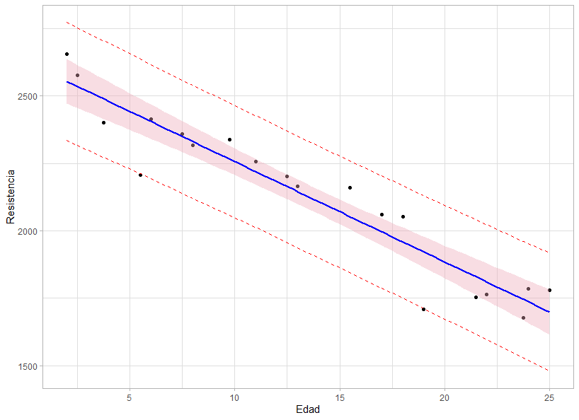

</br></br>
<h3>Intervalo de confianza para la respuesta media</h3>


En un modelo de **regresión lineal simple**, el objetivo es estimar la media de la variable respuesta \( Y \) en un punto específico \( x_0 \). Para ello, se construye un **intervalo de confianza (IC)** para la esperanza condicional de \( Y \), es decir:

\[
E(Y | x_0)
\]

Si denotamos por \( \hat{\mu}_{Y|x_0} \) la media estimada de la variable respuesta cuando \( X = x_0 \), entonces un **intervalo de confianza del \( (1 - \alpha)100\% \)** para \( E(Y | x_0) \) está dado por:

\[
\hat{\mu}_{Y|x_0} \pm t_{\alpha/2, n-p} \sqrt{MS_{Res} \left( \frac{1}{n} + \frac{(x_0 - \bar{x})^2}{\sum (x_i - \bar{x})^2} \right)}
\]

donde:

- \( \hat{\mu}_{Y|x_0} \) es el valor estimado de la media de la respuesta en \( x_0 \).

- \( t_{\alpha/2, n-p} \) es el **valor crítico** de la distribución \( t \) de Student con \( n - p \) grados de libertad.

- \( MS_{Res} \) es el **cuadrado medio del error residual**, obtenido de la tabla ANOVA.

- \( n \) es el **tamaño de la muestra**.

- \( \bar{x} \) es la **media de los valores de \( X \)**.

- \( \sum (x_i - \bar{x})^2 \) es la **suma de cuadrados de la variable predictora**.

Este intervalo permite cuantificar la incertidumbre en la estimación de la media de la respuesta para un valor dado de \( x_0 \), proporcionando un rango dentro del cual se espera que esté el verdadero valor de \( E(Y | x_0) \) con una confianza del \( (1-\alpha)100\% \).


</br></br>
<h3>Intervalo de confianza para la predicción de nuevas observaciones</h3>

En un modelo de **regresión lineal simple**, además de estimar la media de la respuesta en un punto específico \( x_0 \), también se puede predecir una **nueva observación** \( Y_0 \) en ese mismo valor de \( X \). Sin embargo, dado que las nuevas observaciones incluyen tanto la variabilidad de la media como la variabilidad del error residual, el intervalo de predicción será más amplio que el intervalo de confianza para la media.

Si denotamos por \( \hat{Y}_0 \) el valor estimado de la variable respuesta cuando \( X = x_0 \), entonces un **intervalo de predicción del \( (1 - \alpha)100\% \)** para \( Y_0 \) está dado por:

\[
\hat{Y}_0 \pm t_{\alpha/2, n-p} \sqrt{MS_{Res} \left( 1 + \frac{1}{n} + \frac{(x_0 - \bar{x})^2}{\sum (x_i - \bar{x})^2} \right)}
\]

donde:

- \( \hat{Y}_0 \) es la **predicción del valor de \( Y \)** en \( x_0 \).

- \( t_{\alpha/2, n-p} \) es el **valor crítico** de la distribución \( t \) de Student con \( n - p \) grados de libertad.

- \( MS_{Res} \) es el **cuadrado medio del error residual**, obtenido de la tabla ANOVA.

- \( n \) es el **tamaño de la muestra**.

- \( \bar{x} \) es la **media de los valores de \( X \)**.

- \( \sum (x_i - \bar{x})^2 \) es la **suma de cuadrados de la variable predictora**.

Este intervalo de predicción es más amplio que el intervalo de confianza para la media de la respuesta, ya que incorpora la incertidumbre asociada a una **nueva observación individual**, reflejando tanto la variabilidad en la media como la variabilidad del error del modelo.


</br></br>
<h3>La función `predict()`</h3>

La función `predict()` es una función que permite obtener los valores estimados de \( \hat{y} \) a partir de un modelo ajustado. Su uso es fundamental para la predicción en modelos de regresión.

A continuación, se muestra la estructura de la función `predict()` aplicada a modelos lineales (`lm`), junto con sus principales argumentos:


<pre>
predict.lm(object, newdata, se.fit = FALSE, scale = NULL, df = Inf, 
    interval = c("none", "confidence", "prediction"), 
    level = 0.95, type = c("response", "terms"), 
    terms = NULL, na.action = na.pass, pred.var = res.var/weights, 
    weights = 1, ...)
</pre>


</br></br>
<div class="caja-ejemplo">
<h3>Ejemplo:</h3>
<p>

En este ejemplo, se continua con el **modelo de regresión lineal simple** para analizar la relación entre la **Resistencia de una soldadura (psi)** y la **Edad de la soldadura (semanas)**. El modelo resultante es el siguiente: 

\[
\widehat{\text{Resistencia}}_i \sim N(\hat{\mu}_i, \hat{\sigma}^2)
\]
\[
\hat{\mu}_i = \hat{\beta}_0 + \hat{\beta}_1 \times \text{Edad}_i
\]
\[
\hat{\mu}_i = 2627.82 - 37.15 \times \text{Edad}_i\\
\hat{\sigma} = 96.11
\]

Considerando a $Y$ como la Resistencia y a $X$ como la Edad. En este análisis, se busca calcular los **intervalos de confianza (IC)** para la media de la respuesta \( E(Y | x_0) \) y los **intervalos de predicción (IP)** para una nueva observación \( \hat{Y}_0 \) en valores específicos de la variable predictora **\( X \)**.

Los cálculos incluyen:

- IC del 95% para \( E(Y | x_0) \) cuando \( x_0 = 13 \) semanas.

- IC del 95% para \( E(Y | x_0) \) cuando \( x_0 = 2 \) semanas.

- IP del 90% para \( \hat{Y}_0 \) cuando \( x_0 = 10 \) semanas.

- Diagrama de dispersión con líneas de los intervalos de confianza y predicción.

---

Para calcular el **intervalo de confianza (IC)** del **95%** para la media de la Resistencia \( E(Y \mid x_0) \) en los valores de la Edad de \( x_0 = 13 \) y \( x_0 = 2 \), se utiliza la función `predict()` con el argumento `interval = "confidence"`. Este intervalo proporciona un rango dentro del cual se espera que esté la **media poblacional** de la Resistencia para los valores específicos de  la Edad \( x_0 \), con un **nivel de confianza del 95%**. 

<pre>
# Definir la URL del archivo con los datos
file <- "https://raw.githubusercontent.com/smramirezb/datos_ejemplos/refs/heads/main/dat_reg1.txt"

# Cargar el conjunto de datos desde la URL
datos <- read.table(file = file, header = TRUE)

# Ajustar un modelo de regresión lineal simple
mod1 <- lm(Resistencia ~ Edad, data = datos)

# Crear un nuevo conjunto de datos con los valores específicos de Edad para calcular el IC
new_dt <- data.frame(Edad = c(13, 2))

# Calcular el intervalo de confianza al 95% para la media de Resistencia en los valores seleccionados
ic_result <- predict(object = mod1, newdata = new_dt, interval = "confidence", level = 0.95)

# Mostrar los resultados
ic_result
</pre>


```{r,eval=FALSE,warning=FALSE,message=FALSE}
# Definir la URL del archivo con los datos
file <- "https://raw.githubusercontent.com/smramirezb/datos_ejemplos/refs/heads/main/dat_reg1.txt"

# Cargar el conjunto de datos desde la URL
datos <- read.table(file = file, header = TRUE)

# Ajustar un modelo de regresión lineal simple
mod1 <- lm(Resistencia ~ Edad, data = datos)

# Crear un nuevo conjunto de datos con los valores específicos de Edad para calcular el IC
new_dt <- data.frame(Edad = c(13, 2))

# Calcular el intervalo de confianza al 95% para la media de Resistencia en los valores seleccionados
ic_result <- predict(object = mod1, newdata = new_dt, interval = "confidence", level = 0.95)

# Mostrar los resultados
ic_result
```

Los **intervalos de confianza del 95%** para la **resistencia media** cuando la soldadura tiene **13 semanas** y **2 semanas** de edad son los siguientes:

- Para \( E(Y \mid x_0 = 13) \), el intervalo de confianza es **(2099.623, 2190.028)**.

- Para \( E(Y \mid x_0 = 2) \), el intervalo de confianza es **(2471.083, 2635.947)**.

Las salidas computacionales obtenidas en **R** son:

<pre>
      fit      lwr      upr
1 2144.826 2099.623 2190.028
2 2553.515 2471.083 2635.947
</pre>


Para obtener el **intervalo de predicción (IC)** del **90%** para una **nueva observación** \( Y_0 \) cuando \( x_0 = 10 \), se utiliza la función `predict()` con el argumento `interval = "prediction"`. Este intervalo proporciona un rango donde se espera que caiga una futura observación individual con un **90% de confianza**.


<pre>
# Definir la URL del archivo con los datos
file <- "https://raw.githubusercontent.com/smramirezb/datos_ejemplos/refs/heads/main/dat_reg1.txt"

# Cargar el conjunto de datos desde la URL y almacenarlo en un dataframe
datos <- read.table(file = file, header = TRUE)

# Ajustar un modelo de regresión lineal simple con la variable Edad como predictor
mod1 <- lm(Resistencia ~ Edad, data = datos)

# Crear un nuevo conjunto de datos con la Edad = 10 para realizar la predicción
new_dt <- data.frame(Edad = 10)

# Obtener el intervalo de predicción del 90% para la resistencia cuando Edad = 10
predict(object = mod1, newdata = new_dt, interval = "prediction", level = 0.90)

</pre>


```{r,eval=FALSE,warning=FALSE,message=FALSE}
# Definir la URL del archivo con los datos
file <- "https://raw.githubusercontent.com/smramirezb/datos_ejemplos/refs/heads/main/dat_reg1.txt"

# Cargar el conjunto de datos desde la URL y almacenarlo en un dataframe
datos <- read.table(file = file, header = TRUE)

# Ajustar un modelo de regresión lineal simple con la variable Edad como predictor
mod1 <- lm(Resistencia ~ Edad, data = datos)

# Crear un nuevo conjunto de datos con la Edad = 10 para realizar la predicción
new_dt <- data.frame(Edad = 10)

# Obtener el intervalo de predicción del 90% para la resistencia cuando Edad = 10
predict(object = mod1, newdata = new_dt, interval = "prediction", level = 0.90)


```

El **intervalo de predicción del 90%** para la resistencia cuando han transcurrido **10 meses** es el siguiente:

<pre>
       fit      lwr      upr
1 2256.286 2084.688 2427.885
</pre>

Este intervalo indica que, con un **90% de confianza**, una **nueva observación** de la resistencia de la soldadura cuando la edad es de **10 meses** estará en el rango de **2084.688 a 2427.885**. A diferencia del **intervalo de confianza para la media**, este intervalo es más amplio, ya que captura la variabilidad inherente a futuras observaciones individuales.


<pre>
       fit      lwr      upr
1 2256.286 2084.688 2427.885
</pre>


Con el siguiente código se genera el **diagrama de dispersión** y se añaden diferentes elementos para visualizar el ajuste del modelo y sus intervalos:  

- **Línea de regresión** (en azul) junto con los **intervalos de confianza** para la media esperada de \( Y \mid x_0 \) (en rosado), utilizando `geom_smooth()`. 

- **Intervalos de predicción** para \( \hat{Y}_0 \) (en rojo), agregados con `geom_line()`.  

Los códigos en **R** son:

<pre>
# Definir la URL del archivo con los datos
file <- "https://raw.githubusercontent.com/smramirezb/datos_ejemplos/refs/heads/main/dat_reg1.txt"

# Cargar el conjunto de datos desde la URL y almacenarlo en un dataframe
datos <- read.table(file = file, header = TRUE)

# Ajustar un modelo de regresión lineal simple con la variable Edad como predictor
mod1 <- lm(Resistencia ~ Edad, data = datos)

# Obtener los intervalos de predicción del 95% para cada observación en el conjunto de datos
future_y <- predict(object = mod1, interval = "prediction", level = 0.95)

# Agregar los intervalos de predicción al conjunto de datos original
nuevos_datos <- cbind(datos, future_y)

# Cargar la librería ggplot2 para la visualización de datos
library(ggplot2)

# Crear un gráfico de dispersión con intervalos de predicción y la línea de regresión ajustada
ggplot(nuevos_datos, aes(x = Edad, y = Resistencia)) +
    geom_point() +  # Puntos de los datos observados
    geom_line(aes(y = lwr), color = "red", linetype = "dashed") +  # Límite inferior del intervalo de predicción
    geom_line(aes(y = upr), color = "red", linetype = "dashed") +  # Límite superior del intervalo de predicción
    geom_smooth(method = lm, formula = y ~ x, se = TRUE, level = 0.95, col = 'blue', fill = 'pink2') +  
    # Línea de regresión con banda de confianza del 95%
    theme_light()  # Aplicar un tema claro para mejorar la visualización

</pre>


```{r,eval=FALSE,warning=FALSE,message=FALSE}

# Definir la URL del archivo con los datos
file <- "https://raw.githubusercontent.com/smramirezb/datos_ejemplos/refs/heads/main/dat_reg1.txt"

# Cargar el conjunto de datos desde la URL y almacenarlo en un dataframe
datos <- read.table(file = file, header = TRUE)

# Ajustar un modelo de regresión lineal simple con la variable Edad como predictor
mod1 <- lm(Resistencia ~ Edad, data = datos)

# Obtener los intervalos de predicción del 95% para cada observación en el conjunto de datos
future_y <- predict(object = mod1, interval = "prediction", level = 0.95)

# Agregar los intervalos de predicción al conjunto de datos original
nuevos_datos <- cbind(datos, future_y)

# Cargar la librería ggplot2 para la visualización de datos
library(ggplot2)

# Crear un gráfico de dispersión con intervalos de predicción y la línea de regresión ajustada
ggplot(nuevos_datos, aes(x = Edad, y = Resistencia)) +
    geom_point() +  # Puntos de los datos observados
    geom_line(aes(y = lwr), color = "red", linetype = "dashed") +  # Límite inferior del intervalo de predicción
    geom_line(aes(y = upr), color = "red", linetype = "dashed") +  # Límite superior del intervalo de predicción
    geom_smooth(method = lm, formula = y ~ x, se = TRUE, level = 0.95, col = 'blue', fill = 'pink2') +  
    # Línea de regresión con banda de confianza del 95%
    theme_light()  # Aplicar un tema claro para mejorar la visualización

```


En la **Figura 3.43** se puede observar que los **intervalos de predicción** para \( \hat{Y}_0 \) son siempre más amplios que los **intervalos de confianza** para \( E(Y \mid x_0) \). Esto se debe a que los intervalos de predicción consideran tanto la incertidumbre en la estimación de la media como la variabilidad individual de nuevas observaciones.


<br/><br/>
<center>
```{r, echo=FALSE, out.width="80%", fig.align = "center"}

```
**Figura 3.43** Intervalos de predicción para \( \hat{Y}_0 \) en rojo e intervalos de confianza para \( E(Y \mid x_0) \) en rosado.
</center>
<br/><br/>


</p>
</div>


