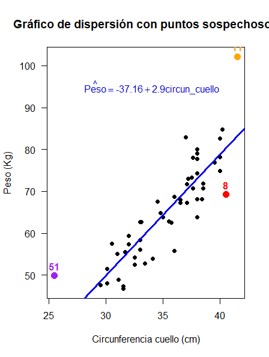

</br></br>
<h2>Matriz sombrero o hat</h2>


```{r,eval=FALSE,warning=FALSE,message=FALSE,include=FALSE}
library(rgl)

# Generar puntos aleatorios para representar el espacio de regresión
set.seed(123)
n <- 20
X1 <- runif(n, -2, 2)
X2 <- runif(n, -2, 2)
X3 <- runif(n, -2, 2)

data <- data.frame(X1, X2, X3)

# Definir el punto central (punto proyectado)
center <- c(0, 0, 0)

# Abrir la ventana gráfica y dibujar la figura
open3d()
plot3d(X1, X2, X3, col = "black", size = 2, type = "s", xlab = "", ylab = "", zlab = "")

# Dibujar las proyecciones de los puntos al origen
for (i in 1:n) {
  segments3d(rbind(center, data[i, ]), col = "black", lwd = 2)
}

# Agregar un punto rojo en el origen
spheres3d(center[1], center[2], center[3], col = "red", radius = 0.1)

# Agregar etiquetas a los ejes
title3d(xlab = "X1", ylab = "X2", zlab = "X3", col = "blue", cex = 1.5)

# Ajustar la perspectiva
par3d(userMatrix = rotationMatrix(pi/6, 1, 0, 0) %*% rotationMatrix(pi/6, 0, 1, 0))

# Pausa breve para renderizar
Sys.sleep(2)  # Espera 2 segundos para que se renderice correctamente

# Guardar la imagen como PNG
rgl.snapshot("hat_matrix_projection.png", fmt = "png")
```

La **matriz hat** (o **matriz sombrero**) es una herramienta fundamental en la regresión lineal, ya que permite medir la influencia que tiene cada observación en los valores ajustados del modelo. En particular, los valores de su **diagonal** representan la **distancia relativa** de cada observación con respecto al **centroide** de las variables explicativas.

En otras palabras, estos valores indican **qué tan alejados están los puntos individuales en el espacio de las variables predictoras** con respecto al centro de la nube de datos. 

En la **Figura 3.44** se ilustra este concepto en un caso con tres variables explicativas \( X_1, X_2 \) y \( X_3 \). En ella, el centroide de los datos se representa con un **punto rojo**, y se observan las distancias relativas de cada observación con respecto a este centroide.


<br/><br/>
<center>
```{r, echo=FALSE, out.width="60%", fig.align = "center"}
knitr::include_graphics("img/fig344.png")
```
**Figura 3.44** Matriz sombrero o hat.
</center>
<br/><br/>


La cantidad \( h_{ii} \) se denomina **leverage** y corresponde al elemento \( i \)-ésimo de la diagonal de la matriz **sombrero** \( H \). Este valor indica qué tan influyente es una observación en la estimación de los valores ajustados del modelo.

Los valores de \( h_{ii} \) cumplen las siguientes propiedades:

- Siempre están dentro del rango:

\[
\frac{1}{n} \leq h_{ii} \leq 1
\]

donde \( n \) es el número total de observaciones.

- La **suma de todos los valores de leverage** es igual al número de coeficientes del modelo, incluyendo el intercepto:

\[
\sum h_{ii} = k + 1
\]

donde \( k \) es el número de variables explicativas en el modelo.

**Interpretación de los valores de leverage**:

- **Valores grandes de \( h_{ii} \)**: Indican que la observación tiene valores inusuales de \( x_i \) y se encuentra alejada del centro de la nube de datos.

- **Valores pequeños de \( h_{ii} \)**: Indican que la observación está cerca del **centroide** del conjunto de datos y tiene menor influencia en el ajuste del modelo.

-  En regresión lineal, un valor de **leverage** (\( h_{ii} \)) se considera grande cuando excede el siguiente umbral:

   \[
   h_{ii} > \frac{2p}{n}
   \]

   donde:
   
   - \( p \) es el número de parámetros en el modelo (incluyendo el intercepto),
   
   - \( n \) es el número total de observaciones.

  Un valor de **leverage** mayor a este umbral indica que la observación tiene un impacto considerable en el ajuste del modelo, ya que se encuentra alejada del centro  de los predictores en el espacio de covariables.


Este concepto es crucial para identificar **puntos con alta influencia** en el modelo de regresión y evaluar la robustez de los resultados obtenidos.


</br></br>
<h2>Punto atípico (outlier) y punto influyente</h2>


```{r,eval=FALSE,warning=FALSE,message=FALSE,include=FALSE}

library(ggplot2)

# Simulación de datos
set.seed(123)
n <- 20
x <- rnorm(n, mean = 5, sd = 2)
y <- 2 + 0.5 * x + rnorm(n, mean = 0, sd = 1)

data <- data.frame(x, y)

# Agregar tres puntos atípicos
outliers <- data.frame(
  x = c(5, 13, 13),
  y = c(12, 8.5, 3),  # Uno normal, otro no influyente y otro muy influyente
  label = c("Outlier (hii bajo, influyente)", "Outlier (hii alto, no influyente)", "Outlier (hii alto, influyente)")
)

# Ajuste de modelo de regresión sin los outliers
modelo <- lm(y ~ x, data = data)

# Crear gráfico
ggplot(data, aes(x, y)) +
  geom_point(color = "blue", size = 3) +
  geom_smooth(method = "lm", color = "black", se = FALSE) +
  geom_point(data = outliers, aes(x, y, color = label), size = 4) +
  scale_color_manual(values = c("red", "orange", "purple")) +
  labs(title = "Tipos de Outliers e Influencia en Regresión",
       x = "X", y = "Y") +
  theme_minimal()


```


La **Figura 3.45** ilustra distintos tipos de **puntos atípicos (outliers)** y su **influencia** en un **modelo de regresión lineal**, representado por la **línea negra** ajustada a los datos.

Los puntos atípicos están coloreados según su **leverage (\( h_{ii} \))** y su **influencia en la regresión**.

1. **Outlier con leverage bajo (\( h_{ii} \) bajo) e influyente - Punto Morado**

   - Este punto se encuentra **cerca del centroide en \( X \)**, lo que significa que **su leverage es bajo**.
   
   - Sin embargo, su valor de \( Y \) es **atípico** y se aleja significativamente de la tendencia general del modelo.
   
   - **Impacto en la regresión**: Aunque está cerca del centro en \( X \), su gran diferencia en \( Y \) hace que **pueda influir en la varianza de los errores**.

2. **Outlier con leverage alto (\( h_{ii} \) alto) pero no influyente - Punto Naranja**

   - Este punto se encuentra **lejos del centroide de los datos en \( X \)**, por lo que tiene un **leverage alto**.
   
   - No es influyente porque **su valor de \( Y \)** sigue la tendencia de la recta de regresión.
   
   - **Impacto en la regresión**: A pesar de su alta distancia en \( X \), **no altera significativamente la pendiente** ni el intercepto del modelo.

3. **Outlier con leverage alto (\( h_{ii} \) alto) e influyente - Punto Rojo**

   - Este punto se encuentra **muy lejos del centroide de los datos en \( X \)**, lo que le otorga **un leverage alto**.
   
   - Además, su valor de \( Y \) es **atípico**, lo que lo convierte en un punto con **gran influencia** sobre la pendiente de la regresión.
   
   - **Impacto en la regresión**: Puede **distorsionar la pendiente** y el ajuste del modelo de manera significativa. 
   

Este tipo de análisis es crucial para **evaluar la estabilidad del modelo de regresión**, ya que la presencia de puntos influyentes puede **distorsionar los coeficientes estimados y afectar la interpretación de los resultados**. Por tanto hay que analizar este tipo de puntos y su impacto en el modelo:

- **El leverage alto (\( h_{ii} \)) no implica que un punto sea influyente**, como se observa en el punto **naranja**.

- **Los puntos atípicos en \( Y \) pueden ser influyentes aunque su leverage sea bajo**, como se ve en el punto **morado**.

- **Los puntos con leverage alto y valores atípicos en \( Y \) son altamente influyentes**, como el **punto rojo**.


<br/><br/>
<center>
```{r, echo=FALSE, out.width="100%", fig.align = "center"}
knitr::include_graphics("img/fig345.png")
```
**Figura 3.45** Puntos influyentes y outlier.
</center>
<br/><br/>

Para determinar si un punto es atípico (outlier) se puede usar la prueba de Bonferroni o los residuales
 y para saber si un punto es influyente se puede utilizar Distancia de Cook.

</br></br>
<h3>Residuales para detectar atípicos (outliers)</h3>


1. **Residuales estandarizados \( d_i \) grandes**:

   \[
   | d_i | > 3
   \]
   
   - Indica una observación con un error inusualmente grande.
   
   - Se compara cada residual con 3 desviaciones estándar de la distribución normal.

2. **Residuales studentizados \( r_i \) grandes**:

   \[
   | r_i | > 3
   \]
   
   - Indica una observación atípica considerando la varianza ajustada de los residuos.
   
   - Más sensible en conjuntos de datos con tamaño de muestra moderado.


En **R** se usan las funciones `rstandard` y `rstudent`.


</br></br>
<h3>Test de Bonferroni</h3> 

Este test se utiliza para evaluar **si una observación atípica es significativa** después de ajustar por comparaciones múltiples. Las hipótesis del test son las siguientes:

  - \( H_0 \): No hay observaciones atípicas.
  
  - \( H_1 \): Existen observaciones atípicas en los datos.

En **R** se usa la función `outlierTest`


</br></br>
<h3>Distancia de Cook</h3> 

La **Distancia de Cook** es una métrica que **cuantifica el impacto** que tiene cada observación sobre la estimación de los coeficientes \( \beta \) en un modelo de regresión. Una distancia de Cook elevada indica que una observación **influye significativamente** en la estimación de los parámetros del modelo. Existen dos formas principales para calcular la **Distancia de Cook** \( D_i \):

- A través del residual estandarizado:
   
  \[
  D_i = \frac{d_i^2}{k + 1} \times \frac{h_{ii}}{1 - h_{ii}}
  \]
  
  donde:
     
  - \( d_i \) es el **residuo estandarizado**.
  
  - \( h_{ii} \) es el **leverage** de la observación \( i \)-ésima.
  
  - \( k \) es el número de variables explicativas en el modelo.

- Usando la influencia de la observación \( i \)-ésima:
     
  \[
   D_i = \sum_{j=1}^{n} \frac{(\hat{y}_j - \hat{y}_{j(i)})^2}{p \hat{\sigma}^2}
  \]

    
   donde:
    
   - \( \hat{y}_j \) es el valor estimado con todas las observaciones.
   
   - \( \hat{y}_{j(i)} \) es la estimación del modelo **sin la observación \( i \)-ésima**.
   
   - \( p = k + 1 \) representa el número total de parámetros en el modelo, incluyendo el intercepto.
   
   - \( \hat{\sigma}^2 \) es la varianza residual del modelo.
   
   
Respecto a cómo interpretar:
  
- **\( D_i > 1 \)**: La observación tiene **una influencia significativa** en la estimación de los coeficientes y debe analizarse con detalle.

- Para muestras grandes, una observación puede considerarse influyente si:
  \[
  D_i > \frac{4}{n}
  \]
  donde \( n \) es el número total de observaciones.

- Un criterio más conservador que toma en cuenta el número de predictores \( p \) es:
  \[
  D_i > \frac{4}{n - p}
  \]
  donde \( p \) representa la cantidad de parámetros en el modelo, incluyendo el intercepto.
   
Para calcular la **Distancia de Cook** en **R**, se usa la función `cooks.distance()` aplicada a un modelo de regresión

Si se desea evaluar la influencia de cada observación, se recomienda calcular la distancia de Cook y analizarla en conjunto con el **leverage** y los **residuos estandarizados**.

<div class="caja-nota">
>*"En esta unidad, el análisis se centra en la **Regresión Lineal Simple**, la cual permite modelar la relación entre una **única variable explicativa** y una **variable respuesta**. Sin embargo, en muchos casos, los fenómenos de interés involucran **múltiples factores** que afectan la variable respuesta. Por ello, en el curso de **Modelos**, que se estudiará el siguiente semestre, se explorará la **Regresión Lineal Múltiple**. Este modelo amplía las herramientas de análisis al considerar **varias variables explicativas simultáneamente**."*  
</div>


</br></br>
<div class="caja-ejemplo">
<h3>Ejemplo:</h3>
<p>

En este análisis, se trabajará con una base de datos que contiene **medidas antropométricas** de un grupo de estudiantes universitarios. El objetivo es **determinar la variable que tenga la mayor correlación con el peso corporal** y, a partir de ello, **ajustar un modelo de regresión lineal simple** para explicar el peso promedio.

**Pasos del análisis:**

1. **Cálculo de la matriz de correlación**: Se analizará la relación entre el peso y las demás variables cuantitativas de la base de datos para seleccionar la más correlacionada.

2. **Selección de la variable explicativa**: Se elegirá la variable con la **mayor correlación con el peso** para utilizarla en el modelo.

3. **Ajuste del modelo de regresión lineal simple**: Se estimarán los coeficientes del modelo.

4. **Evaluación del modelo**: Se realizarán pruebas estadísticas y análisis de residuos para validar los supuestos del modelo.

5. **Determinación de puntos atípicos u influyentes**: Se realizarán gráficos  de residuos y se calculará la distancia de Cook.

Los datos están disponibles en el siguiente enlace:

[Datos de medidas antropométricas](https://raw.githubusercontent.com/smramirezb/datos_ejemplos/refs/heads/main/dat_atip.txt)

 


```{r,eval=FALSE,warning=FALSE,message=FALSE}

# =======================
# Lectura y exploración de datos
# =======================

# Configurar el entorno para el uso del idioma español
Sys.setlocale("LC_ALL", "es_ES.UTF-8")

# Cargar paquetes necesarios
library(MASS)       # Para cálculos estadísticos
library(ggplot2)   # Para visualización de datos
library(lmtest)    # Para pruebas de independencia y homocedasticidad
library(car)       # Para pruebas de normalidad y análisis de influencia
library(nortest)   # Para pruebas adicionales de normalidad
library(patchwork) # Para combinar gráficos en una sola figura
library("GGally")  # Para matriz de gráficos de dispersión y correlación

# Definir la URL del archivo con los datos
file <- "https://raw.githubusercontent.com/smramirezb/datos_ejemplos/refs/heads/main/dat_atip.txt"

# Cargar el conjunto de datos desde la URL
datos <- read.table(file = file, header = TRUE)

# Matriz de correlación
correlacion_pearson <- cor(datos[,c(3,5,6,7)], method = "pearson", use = "pairwise.complete.obs") %>% round(3)
correlacion_kendall <- cor(datos[,c(3,5,6,7)], method = "kendall", use = "pairwise.complete.obs") %>% round(3)
correlacion_spearman <- cor(datos[,c(3,5,6,7)], method = "spearman", use = "pairwise.complete.obs") %>% round(3)

#Matriz de gráficos de dispersión con correlaciones de Pearson
plot.pearson <- ggpairs(
  datos[,c(3,5,6,7)],  
  title = "Matriz de Dispersion y Correlacion - Pearson",
  upper = list(continuous = wrap("cor", size = 4, method = "pearson")),  
  lower = list(continuous = wrap("points", alpha = 0.5, size = 1.5)),  
  diag = list(continuous = wrap("densityDiag", alpha = 0.6))  
)


#Matriz de gráficos de dispersión con correlaciones de Kendall
plot.kendall <- ggpairs(
  datos[,c(3,5,6,7)],  
  title = "Matriz de Dispersion y Correlacion - Kendall",
  upper = list(continuous = wrap("cor", size = 4, method = "kendall")), 
  lower = list(continuous = wrap("points", alpha = 0.5, size = 1.5)), 
  diag = list(continuous = wrap("densityDiag", alpha = 0.6))  
)

#Mostrar la matriz de gráficos
print(plot.pearson)
print(plot.kendall)


# =======================
#Ajuste del modelo
# =======================

# Ajustar el modelo de regresión lineal
mod1 <- lm(Peso ~ circun_cuello, data=datos)

# Mostrar resumen del modelo ajustado
summary(mod1)

# Extraer coeficientes del modelo (intercepto y pendiente)
intercepto <- round(coef(mod1)[1], 2)
pendiente <- round(coef(mod1)[2], 2)

# Construcción del gráfico de dispersión con línea de tendencia
with(datos, 
     plot(x=circun_cuello, y=Peso, pch=19, las=1,
          xlab="Circunferencia cuello (cm)", ylab="Peso (Kg)"))

# Agregar la línea de regresión
abline(mod1, lwd=3, col='blue2')

# Agregar la ecuación del modelo en la gráfica
text(x=34, y=95, labels = bquote(hat(Peso) == .(intercepto) + .(pendiente) * C.cuello), 
     col='blue3' )


# =======================
# Análisis de Influencia
# =======================


# Calcular residuos estandarizados
residuos_est <- rstandard(mod1)

# Calcular leverage (h_ii) de la matriz sombrero
leverage <- hatvalues(mod1)

# Calcular distancia de Cook
dist_cook <- cooks.distance(mod1)

# Definir umbrales para considerar valores atípicos o influyentes
umbral_residuos <- 3  # Para residuos estandarizados
umbral_cook <- 4/(nrow(datos))      # Umbral estándar para distancia de Cook
umbral_leverage <- 2 * length(coef(mod1)) / nrow(datos)  # Umbral de leverage

# Gráfico de la distancia de Cook
plot(mod1, which=4, cook.levels=umbral_cook, las=1, main="Distancia de Cook")
abline(h=umbral_cook, lty="dashed", col="dodgerblue2")

# Índice de influencia gráfica
influenceIndexPlot(mod1, vars="Cook", main="Índice de Influencia - Distancia de Cook")


# Diagnóstico de residuos

# Configurar gráficos en formato 2x2 para diagnóstico de residuos
par(mfrow=c(2, 2))

# Gráficos de diagnóstico del modelo
plot(mod1, col='deepskyblue4', pch=19, main="Diagnóstico de Residuos")


# =======================
# Datos sospechosos
# =======================


# Crear un dataframe con los resultados
analisis_puntos <- data.frame(
  Observacion = 1:nrow(datos),
  Residuo_Estandarizado = residuos_est,
  Leverage = leverage,
  Distancia_Cook = dist_cook
)


# Identificar posibles outliers e influyentes
# Asegurarnos de que sean vectores lógicos
outliers <- which(abs(analisis_puntos$Residuo_Estandarizado) > umbral_residuos)
influyentes <- which(analisis_puntos$Distancia_Cook > umbral_cook )
high_leverage <- which(analisis_puntos$Leverage > umbral_leverage)

# Convertir a vectores lógicos con la misma longitud que la tabla
outliers_log <- rep(FALSE, nrow(analisis_puntos))
outliers_log[outliers] <- TRUE

influyentes_log <- rep(FALSE, nrow(analisis_puntos))
influyentes_log[influyentes] <- TRUE

high_leverage_log <- rep(FALSE, nrow(analisis_puntos))
high_leverage_log[high_leverage] <- TRUE

# Filtrar las observaciones que deben analizarse
analisis_puntos_filtrados <- analisis_puntos[outliers_log | influyentes_log | high_leverage_log, ]

# Mostrar tabla de observaciones sospechosas
print(analisis_puntos_filtrados)


# =======================
# Sospechosos y el modelo
# =======================


# Identificar observaciones sospechosas
puntos_sospechosos <- c(analisis_puntos_filtrados[1,1], 
                        analisis_puntos_filtrados[2,1], 
                        analisis_puntos_filtrados[3,1])  # Observaciones que deben resaltarse

# Crear el gráfico base
plot(datos$circun_cuello, datos$Peso, 
     pch=19, las=1, xlab="Circunferencia cuello (cm)", ylab="Peso (Kg)",
     col="black", main="Gráfico de dispersión con puntos sospechosos")

# Agregar la línea de regresión
abline(mod1, lwd=3, col='blue2')

# Resaltar los puntos sospechosos con diferentes colores
colores_puntos <- c("red", "orange", "purple")  # Asignar colores distintos
points(datos$circun_cuello[puntos_sospechosos], 
       datos$Peso[puntos_sospechosos], 
       pch=19, col=colores_puntos, cex=1.5)

# Agregar etiquetas a los puntos sospechosos
text(datos$circun_cuello[puntos_sospechosos], 
     datos$Peso[puntos_sospechosos], 
     labels=puntos_sospechosos, pos=3, col=colores_puntos, font=2)

# Agregar la ecuación del modelo en la gráfica
text(x=34, y=95, labels = bquote(hat(Peso) == .(intercepto) + .(pendiente) * circun_cuello), 
     col='blue3', font=2 )


# =======================
# Cook vesus levergae
# =======================


# Convertir la variable Observacion a factor para usar colores categóricos
analisis_puntos$Observacion <- as.factor(analisis_puntos$Observacion)

# Crear un vector de colores solo para las observaciones resaltadas
colores_destacados <- c("8" = "purple", "11" = "red", "51" = "orange")

# Crear gráfico de leverage vs. distancia de Cook con puntos resaltados
ggplot(analisis_puntos, aes(x=Leverage, y=Distancia_Cook)) +
  geom_point(aes(color=Observacion), size=3) +  # Asignar color por observación
  geom_hline(yintercept=umbral_cook, linetype="dashed", color="blue") +
  geom_vline(xintercept=umbral_leverage, linetype="dashed", color="green") +
  geom_text(data=subset(analisis_puntos, Observacion %in% c("8", "11", "51")), 
            aes(label=Observacion), 
            vjust=-1, color="black", fontface="bold") +
  scale_color_manual(values=colores_destacados, na.value="gray") +  # Asignar colores a los puntos resaltados
  labs(title="Detección de Observaciones Atípicas e Influyentes",
       x="Leverage",
       y="Distancia de Cook",
       color="Observación") +
  theme_minimal()


# =======================
# Ajuste del Modelo y Comparación de Métricas
# =======================

# Función para ajustar el modelo y extraer métricas
ajustar_modelo <- function(datos_filtrados) {
  modelo <- lm(Peso ~ circun_cuello, data = datos_filtrados)
  resumen <- summary(modelo)
  
  # Extraer métricas clave
  R2 <- resumen$r.squared
  R2_ajustado <- resumen$adj.r.squared
  desv_estandar <- resumen$sigma
  coef1 <- resumen$coefficients[1]
  coef2 <- resumen$coefficients[2]
  
  
  # Pruebas estadísticas sobre residuos
  p_shapiro <- shapiro.test(residuals(modelo))$p.value  # Normalidad
  p_bptest <- bptest(modelo)$p.value                    # Homocedasticidad (Breusch-Pagan)
  p_dwtest <- dwtest(modelo)$p.value                    # Independencia de errores (Durbin-Watson)
  
  return(c(coef1,coef2,R2,desv_estandar,p_shapiro, p_bptest, p_dwtest))
}


# =======================
# Ajustar Modelos con Diferentes Exclusiones
# =======================

# Identificar las dos observaciones con mayor distancia de Cook
observaciones_mayor_cook <- order(dist_cook, decreasing = TRUE)[1:2]

# Lista de modelos con diferentes filtraciones de datos
modelos <- list(
  "Modelo Original" = datos,
  "Sin Observación con Mayor Cook" = datos[-which.max(dist_cook), ],  # Sin la observación más influyente
  "Sin Dos Observaciones con Mayor Cook" = datos[-observaciones_mayor_cook, ],  # Sin las dos más influyentes
  "Sin Observaciones Sospechosas" = datos[-puntos_sospechosos, ]       # Sin todas las sospechosas
)


# Aplicar la función de ajuste a cada conjunto de datos
resultados <- sapply(modelos, ajustar_modelo)

# Crear un dataframe con los resultados
resultados_df <- data.frame(
  R2 = resultados[3, ],
  R2_Ajustado = resultados[4, ],
  Desviacion_Estandar = resultados[5, ],
  coef1 = resultados[1, ],
  coef2 = resultados[2, ]
)

# Mostrar la tabla de comparación
print(resultados_df)

```


Para evaluar el nivel de asociación lineal o monótona entre **el peso corporal** y las variables **estatura**, **longitud de la circunferencia del cuello** y **longitud de la circunferencia de la muñeca**, se calcularon los coeficientes de correlación de **Pearson** y **Kendall**.

Las **Figuras 3.46 y 3.47** presentan la matriz de correlación y los gráficos de dispersión de las variables analizadas. Se observa que la distribución de la **longitud de la circunferencia del cuello** y la **longitud de la circunferencia de la muñeca** exhibe curvas de densidad bimodal, lo que justifica el uso del coeficiente de correlación de **Kendall**. En ambos casos, tanto con Pearson como con Kendall (0.866 y 0.709), la variable con mayor asociación con el peso corporal es la **longitud de la circunferencia del cuello**, lo que indica que a medida que esta longitud aumenta, el peso tiende a incrementarse.

Además, en el gráfico de dispersión **Peso vs. Circunferencia del cuello**, se identifica un **punto que se aleja significativamente de la nube de datos**, correspondiente a un estudiante con un peso superior a **100 kilogramos**. Esta observación debe analizarse en términos de su impacto en el ajuste del modelo.

El siguiente código genera las matrices de correlación y los gráficos de dispersión:


<pre>
# Configurar el entorno para el uso del idioma español
Sys.setlocale("LC_ALL", "es_ES.UTF-8")

# Cargar paquetes necesarios
library(MASS)       # Para cálculos estadísticos
library(ggplot2)   # Para visualización de datos
library(lmtest)    # Para pruebas de independencia y homocedasticidad
library(car)       # Para pruebas de normalidad y análisis de influencia
library(nortest)   # Para pruebas adicionales de normalidad
library(patchwork) # Para combinar gráficos en una sola figura
library("GGally")  # Para matriz de gráficos de dispersión y correlación

# Definir la URL del archivo con los datos
file <- "https://raw.githubusercontent.com/smramirezb/datos_ejemplos/refs/heads/main/dat_atip.txt"

# Cargar el conjunto de datos desde la URL
datos <- read.table(file = file, header = TRUE)

# Matriz de correlación
correlacion_pearson <- cor(datos[,c(3,5,6,7)], method = "pearson", use = "pairwise.complete.obs") %>% round(3)
correlacion_kendall <- cor(datos[,c(3,5,6,7)], method = "kendall", use = "pairwise.complete.obs") %>% round(3)
correlacion_spearman <- cor(datos[,c(3,5,6,7)], method = "spearman", use = "pairwise.complete.obs") %>% round(3)

#Matriz de gráficos de dispersión con correlaciones de Pearson
plot.pearson <- ggpairs(
  datos[,c(3,5,6,7)],  
  title = "Matriz de Dispersion y Correlacion - Pearson",
  upper = list(continuous = wrap("cor", size = 4, method = "pearson")),  
  lower = list(continuous = wrap("points", alpha = 0.5, size = 1.5)),  
  diag = list(continuous = wrap("densityDiag", alpha = 0.6))  
)


#Matriz de gráficos de dispersión con correlaciones de Kendall
plot.kendall <- ggpairs(
  datos[,c(3,5,6,7)],  
  title = "Matriz de Dispersion y Correlacion - Kendall",
  upper = list(continuous = wrap("cor", size = 4, method = "kendall")), 
  lower = list(continuous = wrap("points", alpha = 0.5, size = 1.5)), 
  diag = list(continuous = wrap("densityDiag", alpha = 0.6))  
)

#Mostrar la matriz de gráficos
print(plot.pearson)
print(plot.kendall)
</pre>


<br/><br/>
<center>
```{r, echo=FALSE, out.width="80%", fig.align = "center"}
knitr::include_graphics("img/fig346.png")
```
**Figura 3.46** Matriz de correlación de Pearson.
</center>
<br/><br/>


<br/><br/>
<center>
```{r, echo=FALSE, out.width="80%", fig.align = "center"}
knitr::include_graphics("img/fig347.png")
```
**Figura 3.47** Matriz de correlación de Kendall.
</center>
<br/><br/>


---

Se ajusta un **modelo de regresión lineal simple** para explicar la variable **Peso** en función de la **circunferencia del cuello**. 

El modelo estimado es el siguiente:

\[
\hat{\text{Peso}} = -37.1552 + 2.9002 \times \text{Circunferencia del cuello}
\]

Ambos coeficientes son **estadísticamente significativos**, con valores-p de **\(5.33 \times 10^{-5}\)** y **\( < 2 \times 10^{-16}\)**, respectivamente.

La **Figura 3.48** muestra la relación entre el peso y la circunferencia del cuello, junto con la **línea de regresión ajustada**. En este gráfico se destaca un posible **punto atípico**, correspondiente a un estudiante con un peso superior a **100 kilogramos**, que se encuentra alejado de la recta de regresión.

El siguiente código genera el modelo y la visualización:


<pre>
# Ajustar el modelo de regresión lineal
mod1 <- lm(Peso ~ circun_cuello, data=datos)

# Mostrar resumen del modelo ajustado
summary(mod1)

# Extraer coeficientes del modelo (intercepto y pendiente)
intercepto <- round(coef(mod1)[1], 2)
pendiente <- round(coef(mod1)[2], 2)

# Construcción del gráfico de dispersión con línea de tendencia
with(datos, 
     plot(x=circun_cuello, y=Peso, pch=19, las=1,
          xlab="Circunferencia cuello (cm)", ylab="Peso (Kg)"))

# Agregar la línea de regresión
abline(mod1, lwd=3, col='blue2')

# Agregar la ecuación del modelo en la gráfica
text(x=34, y=95, labels = bquote(hat(Peso) == .(intercepto) + .(pendiente) * C.cuello), 
     col='blue3' )
</pre>


<pre>
Call:
lm(formula = Peso ~ circun_cuello, data = datos)

Residuals:
     Min       1Q   Median       3Q      Max 
-11.4526  -3.7980  -0.5279   3.6603  18.9962 

Coefficients:
              Estimate Std. Error t value Pr(>|t|)    
(Intercept)   -37.1552     8.4079  -4.419 5.33e-05 ***
circun_cuello   2.9002     0.2368  12.250  < 2e-16 ***
---
Signif. codes:  0 ‘***’ 0.001 ‘**’ 0.01 ‘*’ 0.05 ‘.’ 0.1 ‘ ’ 1

Residual standard error: 5.936 on 50 degrees of freedom
Multiple R-squared:  0.7501,	Adjusted R-squared:  0.7451 
F-statistic: 150.1 on 1 and 50 DF,  p-value: < 2.2e-16
</pre>


<br/><br/>
<center>
```{r, echo=FALSE, out.width="80%", fig.align = "center"}
knitr::include_graphics("img/fig348.png")
```
**Figura 3.48** Gráfico de dispersión con el modelo de regresión lineal estimado.
</center>
<br/><br/>

---

Dado que existe una observación alejada de la nube de datos, se realizan gráficos de residuales y se calcula la distancia de Cook para todas las observaciones. Representar gráficamente estas distancias permite identificar posibles puntos influyentes que podrían afectar significativamente los coeficientes del modelo.

Las **Figuras 3.49** muestran que las observaciones **11 y 51** presentan los valores más altos de **distancia de Cook**. Sin embargo, dichos valores son inferiores a 1, lo que sugiere que no ejercen una influencia significativa en el ajuste del modelo.


<pre>
# Calcular residuos estandarizados
residuos_est <- rstandard(mod1)

# Calcular leverage (h_ii) de la matriz sombrero
leverage <- hatvalues(mod1)

# Calcular distancia de Cook
dist_cook <- cooks.distance(mod1)

# Definir umbrales para considerar valores atípicos o influyentes
umbral_residuos <- 3  # Para residuos estandarizados
umbral_cook <- 4/(nrow(datos))      # Umbral estándar para distancia de Cook
umbral_leverage <- 2 * length(coef(mod1)) / nrow(datos)  # Umbral de leverage

# Gráfico de la distancia de Cook
plot(mod1, which=4, cook.levels=umbral_cook, las=1, main="Distancia de Cook")
abline(h=umbral_cook, lty="dashed", col="dodgerblue2")

# Índice de influencia gráfica
influenceIndexPlot(mod1, vars="Cook", main="Índice de Influencia - Distancia de Cook")

</pre>


<br/><br/>
<center>
```{r, echo=FALSE, out.width="80%", fig.align = "center"}
knitr::include_graphics("img/fig349.png")
```
**Figura 3.49** Distancia de Cook.
</center>
<br/><br/>


---

El análisis de residuos es una herramienta fundamental para verificar el cumplimiento de los **supuestos de la regresión lineal**. 

La **Figura 3.50** presenta los **gráficos de diagnóstico de residuos**, en los cuales se identifican varias observaciones que requieren un análisis más detallado: **11, 51, 8 y 40**. 

En el **Q-Q plot de residuos estandarizados**, la mayoría de los puntos se encuentran alineados con la línea de referencia, excepto las observaciones **11, 40 y 51**, que se desvían de la tendencia esperada. 

Los gráficos de **residuos y residuos estandarizados versus valores ajustados** no muestran un patrón evidente de heterocedasticidad; sin embargo, las observaciones **11, 40 y 51** presentan residuos que se separan notablemente de la nube de puntos.

En el gráfico de **residuos versus leverage**, se destacan las observaciones **8, 11 y 51**. No obstante, el valor de la observación **8** no supera la distancia de Cook de **0.5**, mientras que los valores correspondientes a las observaciones **11 y 51** se encuentran muy próximos a este umbral. Ninguna de estas observaciones supera un valor de **1** en la distancia de Cook.

El siguiente código permite generar el diagnóstico de residuos:


<pre>
# Configurar gráficos en formato 2x2 para diagnóstico de residuos
par(mfrow=c(2, 2))

# Gráficos de diagnóstico del modelo
plot(mod1, col='deepskyblue4', pch=19, main="Diagnóstico de Residuos")
</pre>


<br/><br/>
<center>
```{r, echo=FALSE, out.width="80%", fig.align = "center"}
knitr::include_graphics("img/fig350.png")
```
**Figura 3.50** Residuales del modelo Peso versus longitud de la circunferencia del cuello.
</center>
<br/><br/>


Los valores de los **residuos estandarizados**, **leverage** y **distancia de Cook** se presentan a continuación. Los resultados indican que **las observaciones 8, 11 y 51 registran los valores más altos** en estas métricas. 

Se destaca que únicamente en el caso de la **observación 11**, el residuo estandarizado supera el umbral en valor absoluto de **3**. Asimismo, en ningún caso la **distancia de Cook** excede el valor de **1**.

<pre>
   Observacion Residuo_Estandarizado   Leverage Distancia_Cook
8            8             -1.931002 0.06155210      0.1222835
11          11              3.335722 0.07955398      0.4808540
51          51              2.418017 0.17334486      0.6130210
</pre>

A continuación los códigos para extraer los resultados.


<pre>
# Crear un dataframe con los resultados
analisis_puntos <- data.frame(
  Observacion = 1:nrow(datos),
  Residuo_Estandarizado = residuos_est,
  Leverage = leverage,
  Distancia_Cook = dist_cook
)

# Identificar posibles outliers e influyentes
# Asegurarnos de que sean vectores lógicos
outliers <- which(abs(analisis_puntos$Residuo_Estandarizado) > umbral_residuos)
influyentes <- which(analisis_puntos$Distancia_Cook > umbral_cook)
high_leverage <- which(analisis_puntos$Leverage > umbral_leverage)

# Convertir a vectores lógicos con la misma longitud que la tabla
outliers_log <- rep(FALSE, nrow(analisis_puntos))
outliers_log[outliers] <- TRUE

influyentes_log <- rep(FALSE, nrow(analisis_puntos))
influyentes_log[influyentes] <- TRUE

high_leverage_log <- rep(FALSE, nrow(analisis_puntos))
high_leverage_log[high_leverage] <- TRUE

# Filtrar las observaciones que deben analizarse
analisis_puntos_filtrados <- analisis_puntos[outliers_log | influyentes_log | high_leverage_log, ]

# Mostrar tabla de observaciones sospechosas
print(analisis_puntos_filtrados)
</pre>


La **Figura 3.51** muestra los  puntos anteriormente encontrados en rojo, naranja y morado.


<pre>
# Identificar observaciones sospechosas
puntos_sospechosos <- c(analisis_puntos_filtrados[1,1], 
                        analisis_puntos_filtrados[2,1], 
                        analisis_puntos_filtrados[3,1])  # Observaciones que deben resaltarse

# Crear el gráfico base
plot(datos$circun_cuello, datos$Peso, 
     pch=19, las=1, xlab="Circunferencia cuello (cm)", ylab="Peso (Kg)",
     col="black", main="Gráfico de dispersión con puntos sospechosos")

# Agregar la línea de regresión
abline(mod1, lwd=3, col='blue2')

# Resaltar los puntos sospechosos con diferentes colores
colores_puntos <- c("red", "orange", "purple")  # Asignar colores distintos
points(datos$circun_cuello[puntos_sospechosos], 
       datos$Peso[puntos_sospechosos], 
       pch=19, col=colores_puntos, cex=1)

# Agregar etiquetas a los puntos sospechosos
text(datos$circun_cuello[puntos_sospechosos], 
     datos$Peso[puntos_sospechosos], 
     labels=puntos_sospechosos, pos=3, col=colores_puntos, font=1.5)

# Agregar la ecuación del modelo en la gráfica
text(x=34, y=95, labels = bquote(hat(Peso) == .(intercepto) + .(pendiente) * circun_cuello), 
     col='blue3', font=2 )
</pre>


<br/><br/>
<center>
```{r, echo=FALSE, out.width="80%", fig.align = "center"}

```
**Figura 3.51** Observaciones sospechosas sobre la recta de regresión.
</center>
<br/><br/>


La **Figura 3.52** muestra la relación entre la **distancia de Cook** y el **leverage** para cada observación en el modelo. Se incluyen **líneas de referencia** para los umbrales de leverage y distancia de Cook. La figura mmuestra que las observaciones **11 y 51** se destacan sobre el resto, en particular la **51** con mayor leverage y distancia de Cook.  


<pre>
# Convertir la variable Observacion a factor para usar colores categóricos
analisis_puntos$Observacion <- as.factor(analisis_puntos$Observacion)

# Crear un vector de colores solo para las observaciones resaltadas
colores_destacados <- c("8" = "purple", "11" = "red", "51" = "orange")

# Crear gráfico de leverage vs. distancia de Cook con puntos resaltados
ggplot(analisis_puntos, aes(x=Leverage, y=Distancia_Cook)) +
  geom_point(aes(color=Observacion), size=3) +  # Asignar color por observación
  geom_hline(yintercept=umbral_cook, linetype="dashed", color="blue") +
  geom_vline(xintercept=umbral_leverage, linetype="dashed", color="green") +
  geom_text(data=subset(analisis_puntos, Observacion %in% c("8", "11", "51")), 
            aes(label=Observacion), 
            vjust=-1, color="black", fontface="bold") +
  scale_color_manual(values=colores_destacados, na.value="gray") +  # Asignar colores a los puntos resaltados
  labs(title="Detección de Observaciones Atípicas e Influyentes",
       x="Leverage",
       y="Distancia de Cook",
       color="Observación") +
  theme_minimal()
</pre>


<br/><br/>
<center>
```{r, echo=FALSE, out.width="80%", fig.align = "center"}
knitr::include_graphics("img/fig352.png")
```
**Figura 3.52** Distancia de Cook versus Leverage.
</center>
<br/><br/>


---

La siguiente tabla presenta los resultados del ajuste del modelo de regresión lineal bajo diferentes escenarios. Se incluyen el coeficiente de determinación (\(R^2\)), la estimación de la pendiente del modelo, la desviación estándar de los residuos, y los valores-p de las pruebas de normalidad (Shapiro-Wilk), homocedasticidad (Breusch-Pagan) e independencia de errores (Durbin-Watson).

Los resultados muestran que tanto el **modelo original** como el **modelo sin las observaciones 11 y 51** cumplen con los supuestos de normalidad, homocedasticidad e independencia de los errores. Sin embargo, al excluir las dos observaciones con mayor distancia de Cook, la desviación estándar de los errores disminuye a **5.0199**, en comparación con **5.9358** en el modelo original.  

Además, la diferencia en la estimación de la pendiente entre el **modelo original** y el **modelo sin las observaciones 11 y 51** es mínima (**0.0280**), lo que indica que la eliminación de estos puntos no afecta significativamente la relación entre la circunferencia del cuello y el peso, sin embargo sí mejora la precisión del modelo.


<pre>
                                            R2 Desviacion_Estandar     coef1    coef2   vp.norm     vp.hom     vp.ind
Modelo Original                      0.7500723            5.935767 -37.15517 2.900217 0.1249637 0.30015064 0.34250203
Sin Observación con Mayor Cook       0.7713569            5.634559 -46.19479 3.147401 0.3453422 0.02438465 0.18269299
Sin Dos Observaciones con Mayor Cook 0.7776975            5.019946 -38.78841 2.928236 0.9199382 0.20980800 0.05760417
Sin Observaciones Sospechosas        0.7992899            4.812106 -42.73091 3.046012 0.9817796 0.52012942 0.04777400
</pre>


<pre>
# Función para ajustar el modelo y extraer métricas
ajustar_modelo <- function(datos_filtrados) {
  modelo <- lm(Peso ~ circun_cuello, data = datos_filtrados)
  resumen <- summary(modelo)
  
  # Extraer métricas clave
  R2 <- resumen$r.squared
  R2_ajustado <- resumen$adj.r.squared
  desv_estandar <- resumen$sigma
  coef1 <- resumen$coefficients[1]
  coef2 <- resumen$coefficients[2]
  
  
  # Pruebas estadísticas sobre residuos
  p_shapiro <- shapiro.test(residuals(modelo))$p.value  # Normalidad
  p_bptest <- bptest(modelo)$p.value                    # Homocedasticidad (Breusch-Pagan)
  p_dwtest <- dwtest(modelo)$p.value                    # Independencia de errores (Durbin-Watson)
  
  return(c(coef1,coef2,R2,desv_estandar,p_shapiro, p_bptest, p_dwtest))
}

# Ajustar Modelos con Diferentes Exclusiones
# Identificar las dos observaciones con mayor distancia de Cook
observaciones_mayor_cook <- order(dist_cook, decreasing = TRUE)[1:2]

# Lista de modelos con diferentes filtraciones de datos
modelos <- list(
  "Modelo Original" = datos,
  "Sin Observación con Mayor Cook" = datos[-which.max(dist_cook), ],  # Sin la observación más influyente
  "Sin Dos Observaciones con Mayor Cook" = datos[-observaciones_mayor_cook, ],  # Sin las dos más influyentes
  "Sin Observaciones Sospechosas" = datos[-puntos_sospechosos, ]       # Sin todas las sospechosas
)


# Aplicar la función de ajuste a cada conjunto de datos
resultados <- sapply(modelos, ajustar_modelo)

# Crear un dataframe con los resultados
resultados_df <- data.frame(
  R2 = resultados[3, ],
  Desviacion_Estandar = resultados[4, ],
  coef1 = resultados[1, ],
  coef2 = resultados[2, ],
  vp.norm=resultados[5, ],
  vp.hom=resultados[6, ],
  vp.ind=resultados[7, ]
)

# Mostrar la tabla de comparación
print(resultados_df)
</pre>


</p>
</div>


<div class="caja-nota">
>*"Las observaciones sospechosas **no** se deben sacar inmediatamente del modelo. Antes se deben estudiar para ver si hay algo raro con ellas, en caso afirmativo se sacan de la base y se ajusta nuevamente el modelo."*  
</div>


```{r,eval=FALSE,warning=FALSE,message=FALSE}
# =======================
# Lectura y exploración de datos
# =======================

# Configurar el entorno para el uso del idioma español
Sys.setlocale("LC_ALL", "es_ES.UTF-8")

# Cargar paquetes necesarios
library(MASS)       # Cálculos estadísticos
library(ggplot2)   # Visualización de datos
library(lmtest)    # Pruebas de independencia y homocedasticidad
library(car)       # Pruebas de normalidad y análisis de influencia
library(nortest)   # Pruebas adicionales de normalidad
library(patchwork) # Para combinar gráficos
library(GGally)    # Para análisis de correlación

# Definir la URL del archivo con los datos
file <- "https://raw.githubusercontent.com/smramirezb/datos_ejemplos/refs/heads/main/dat_atip.txt"

# Cargar el conjunto de datos
datos <- read.table(file = file, header = TRUE)

# Excluir las observaciones 11 y 51
datos_filtrados <- datos[-c(11, 51), ]

# =======================
# Ajuste del modelo sin observaciones 11 y 51
# =======================
mod1 <- lm(Peso ~ circun_cuello, data = datos_filtrados)
summary(mod1)

# Extraer coeficientes
intercepto <- round(coef(mod1)[1], 2)
pendiente <- round(coef(mod1)[2], 2)

# =======================
# Cálculo de Intervalos de Confianza y Predicción
# =======================

# Definir valores de circunferencia de cuello para predicción
nuevos_datos <- data.frame(circun_cuello = seq(min(datos_filtrados$circun_cuello), 
                                               max(datos_filtrados$circun_cuello), 
                                               length.out = 100))

# Calcular intervalos de confianza (esperanza de Y | X)
ic_esperanza <- predict(mod1, newdata = nuevos_datos, interval = "confidence")

# Calcular intervalos de predicción (respuesta Y)
ic_prediccion <- predict(mod1, newdata = nuevos_datos, interval = "prediction")

# Convertir a data frame para graficar
intervalos <- data.frame(
  circun_cuello = nuevos_datos$circun_cuello,
  prediccion = ic_prediccion[, "fit"],
  li_pred = ic_prediccion[, "lwr"],
  ls_pred = ic_prediccion[, "upr"],
  li_conf = ic_esperanza[, "lwr"],
  ls_conf = ic_esperanza[, "upr"]
)

# =======================
# Visualización del modelo con intervalos y leyenda clara
# =======================
ggplot() +
  # Puntos originales de los datos filtrados
  geom_point(data = datos_filtrados, aes(x = circun_cuello, y = Peso), color = "black", size = 2) +
  
  # Línea de regresión estimada
  geom_line(data = intervalos, aes(x = circun_cuello, y = prediccion, color = "Regresión Ajustada"), size = 1) +
  
  # Intervalo de confianza (Esperanza de Y | X)
  geom_ribbon(data = intervalos, aes(x = circun_cuello, ymin = li_conf, ymax = ls_conf, fill = "IC Esperanza E[Y|X]"), alpha = 0.3) +
  
  # Intervalo de predicción (Respuesta Y)
  geom_ribbon(data = intervalos, aes(x = circun_cuello, ymin = li_pred, ymax = ls_pred, fill = "IC Predicción Y"), alpha = 0.2) +
  
  # Personalización de la leyenda
  scale_fill_manual(name = "Intervalos",
                    values = c("IC Esperanza E[Y|X]" = "blue", "IC Predicción Y" = "red")) +
  scale_color_manual(name = "Modelo",
                     values = c("Regresión Ajustada" = "black")) +

  labs(title = "Intervalos de Confianza y Predicción (Sin Observaciones 11 y 51)",
       x = "Circunferencia del cuello (cm)",
       y = "Peso (Kg)") +
  theme_minimal()
```


